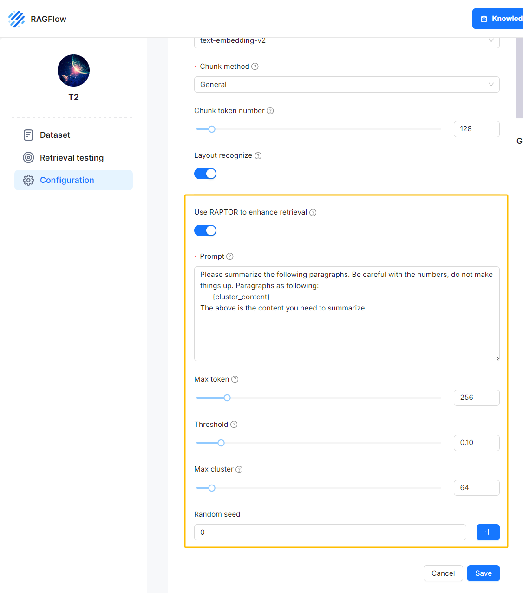

[RAGFlow v0.6.0](https://github.com/infiniflow/ragflow) was released this week, solving many ease-of-use and stability issues that emerged since it was open sourced earlier this April. Future releases of RAGFlow will focus on tackling the deep-seated problems of RAG capability. Hate to say it, existing RAG solutions in the market are still in POC (Proof of Concept) stage and can’t be applied directly to real production scenarios. <!--truncate-->This is primarily due to the numerous unresolved issues within RAG itself:

Data quality: RAGFlow offers open-source data cleansing models and chunking templates to improve data quality and will continue to iterate and evolve these built-in models and tools. Data retrieval: Scenarios with clear question intents require multiple recall to retrieve the relevant context, and the current RAGFlow integrates databases with multiple recall capabilities. Challenges in retrieving answers: In many cases, searching using the question content alone does not necessarily capture the context of the answer. There is clearly a gap to bridge between the semantics of the question and answer.

We can approach the final point above from many aspects, including: Implementing an external knowledge graph for query rewriting and understanding of user intentions; improving answer quality by introducing agents, enabling the LLM to better its answers through increased dialogue interactions; retrieving longer contexts for the LLM to find the answer.

RAGFlow’s roadmap includes features addressing these three aspects. Today, we’ll discuss an experimental RAGFlow feature that RAGFlow recently added to the main branch (or Docker dev tag) to address the last point above — implementing a long-context RAG based on RAPTOR.

The idea of [RAPTOR](https://arxiv.org/html/2401.18059v1) stems from a paper released earlier this year titled “Recursive Abstractive Processing for Tree Organized Retrieval”. As shown in the figure below, the paper presents an enhanced document processing approach: performing hierarchical clustering of document content:

After dividing the original document into chunks, RAPTOR clusters these chunks in a recursive and hierarchical manner: the clustering process starts from the leaf nodes (the blue chunks in the graph), and sumarizes the leaves into higher-level information through embedding. The process is recursively executed, forming a “tree” structure starting from the leaves. The outcomes of the clustering process are summaries, which can be generated using LLM. The utilization of clustering and summary generation is essential because it captures finer details necessary for handling complex topic queries and multi-step reasoning in Q&A tasks. The RAPTOR paper discusses two processes for retrieval of the clustered content, as shown in the following figure:

The first process maintains the tree structure: Retrieval begins from the root nodes and progresses hierarchically throughout the tree structure. This kind of retrieval is a bit more complicated to implement and “unfriendly” to multiple recalls.

The second process flattens the tree structure for retrievals. It is easy to implement and integrates naturally with multiple recalls.

RAGFlow implements the flattened tree structure for retrieval as proposed in the paper: After file parsing with Deepdoc, you are given the option to activate the RAPTOR switch for clustering and summary generation. The original chunks and these generated summaries are then sent to the database to establish full-text and vector indexes. Subsequent operations are similar to the traditional RAG solutions.

Please note that, by default, the RAPTOR switch is off, because enabling this feature would consume more token quotas.

When you need better understanding of the long-context window, you can activate this RAPTOR switch to generate summaries from clustering outcomes.

As shown in the following figure: the left half are the summaries generated by LLM from the clustering results. RAGFlow visualizes these summaries, which, together with the raw data, will be used in RAG’s retrieval process.

RAPTOR helps LLM better understand the context. This is because the upper-level nodes in the clustered tree structure possess a more “macroscopic” understanding of the text, making it advantageous for scenarios requiring cross-chunk summarization or multi-hop Q&A where answers can not be retrieved directly from the corresponding context.

The RAPTOR approach is one of [RAGFlow](https://github.com/infiniflow/ragflow)’s attempts to tackle the pain points in RAG’s retrieval. In upcoming releases, we’ll bring further enhancements. Stay tuned!