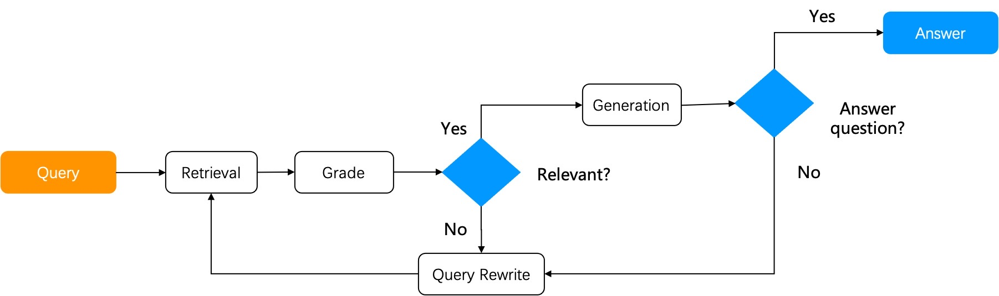

The workflow of a naive RAG system can be summarized as follows: the RAG system does retrieval from a specified data source using the user query, reranks the retrieval results, appends prompts, and sends them to the LLM for final answer generation.

A naive RAG suffices in scenarios where the user's intent is evident, as the answer is included in the retrieved results and can be sent directly to the LLM. Yet, in most circumstances ambiguous user intents are the norm and demand iterative queries to generate the final answer. For instance, questions involving summarizing multiple documents require multi-step reasoning. These scenarios necessitate Agentic RAG, which involves task orchestration mechanisms during the question-answering process.

Agent and RAG complement each other. Agentic RAG, as the name suggests, is an agent-based RAG. The major distinction between an agentic RAG and a naive RAG is that agentic RAG introduces a dynamic agent orchestration mechanism, which criticizes retrievals, rewrites query according to the intent of each user query, and employs "multi-hop" reasoning to handle complex question-answering tasks.<!--truncate-->

Next, let's explore how agentic RAG works through two advanced RAG examples. The first is Self-RAG (reference [1]), with its workflow shown below:

Self-RAG is a type of reflective RAG. After retrieving results from the knowledge base, it assesses if the retrieved results are relevant to the user query. If deemed irrelevant, the query is rewritten, and the RAG cycle is repeated until the relevance score meets a set threshold. A complete Self-RAG requires the implementation of the following two major components:

1. A graph-based task orchestration system.
2. Necessary operators: A scoring operator is crucial to a Self-RAG. While, theoretically, training a scoring model for assessing the retrieved results is desired, in practice, using LLM for scoring can reduce reliance on other system components and simplify system design.

Self-RAG is a relatively preliminary form of agentic RAG, and RAGFlow has incorporated a Self-RAG implementation in its system design. Implementing Self-RAG has shown to notably improve the performance of complex multi-hop question-answering and multi-step reasoning.

Now let's explore another form of agentic RAG — Adaptive RAG (reference [2]). It can accommodate its strategies to various user query intents:

1. Open-domain question-answering: Generates answers directly through LLM without relying on retrieval through RAG.
2. Multi-hop question-answering: Breaks multi-hop queries down to multiple single-hop queries, iteratively uses these more basic queries to access LLM and the RAG retriever, and combines the retrieved results to generate the final answer.
3. Adaptive retrieval: Applicable to complex queries requiring multi-step reasoning. Complex question-answering often involves synthesizing information from multiple data sources and performing multi-step reasoning. Adaptive retrieval iteratively accesses LLM and the RAG retriever to progressively build the information chain necessary for answering the complex questions.

As shown in the diagram below, Adaptive-RAG follows a similar workflow to Self-RAG. By implementing an extra query analysis at the beginning of its workflow, Adaptive-RAG offers a wider range of question-answering strategies.

As can be seen from the above two agentic RAG examples, these advanced RAG systems require task orchestration mechanisms to provide the following functionalities: 

1. Reuse of existing pipelines or subgraphs.
2. Collaboration with third-party tools, including web search.
3. Query task planning, such as query intent classification and feedbacks.

Frameworks for developing agents include the recently launched Mosaic AI Agent Framework by Databricks and AgentKit; task orchestration frameworks involve LangGraph in Langchain and llamaIndex. A task orchestration system has to be implemented using graph, with its nodes and edges defining the application's workflow and logic. A node in the Graph can be any callable operator or an executable "component" (e.g., chained operators or agents), each performing a specific task. An edge links nodes together and establishes the data flow between them. A graph must maintain node state management to adapt to the flow of its nodes.

It is notable that this graph-based task orchestration implementation requires loops and differs from a DAG (Directed Acyclic Graph). Loops are fundamental for reflection and hence are crucial for the task orchestration in agentic RAG. An agentic RAG lacking reflection would be unable to think or solve problems like a human. It could only offer task orchestration similar to workflows without achieving more advanced tasks like multi-hop and multi-step reasoning. Andrew Ng's definition of four agent design patterns (reference [3]) separates reflection from the other other three workflow-related patterns - tool use, planning, and multi-agent. This separation underlines the critical role of reflection as the foundation for thinking and reasoning. Agentic RAG embodies this design pattern. 

Agentic RAG represents a transformation in information processing, bringing more intelligence to the agents per se. When combined with workflows, agentic RAG will have a broader range of applications. For example, in document summarization scenarios, agentic RAG would first determine whether the user's intent is to request a summary or to compare details. If it is the former, it would use agents to retrieve summary of each document chunk and then combine them to generate the overall summary; if it is the latter, more relevant data need to be retrieved through further routing before being sent to the LLM. In customer support scenarios, agentic RAG can understand more complex customer queries and provide personalized and accurate responses. In literature chatbot scenarios, agentic RAG can synthesize more documents, data, and research results, providing users with a more comprehensive understanding. In legal and medical chatbot scenarios, agentic RAG can help understand and explain complex domain knowledge, offering more precise insights. In content generation applications, agentic RAG can generate higher-quality, contextually relevant, enterprise-level long-form documents.

From v0.8.0 onwards, RAGFlow will support graph-based task orchestration and enable no-code editing on top of that. RAGFlow is also consistently improving various retrieval-specific operators to simplify the development of agentic RAG and agent applications based on agentic RAG, addressing pain points seen in enterprise-level RAG applications comprehensively. RAGFlow is iterating rapidly, and you are welcome to follow, star, and actively participate in RAGFlow. Our GitHub repo is at https://github.com/infiniflow/ragflow.

## Bibliography

1. Self-RAG: Learning to retrieve, generate, and critique through self-reflection, arXiv preprint arXiv:2310.11511
2. Adaptive-RAG: Learning to adapt retrieval-augmented large language models through question complexity, arXiv preprint arXiv:2403.14403
3. https://www.deeplearning.ai/the-batch/issue-242/