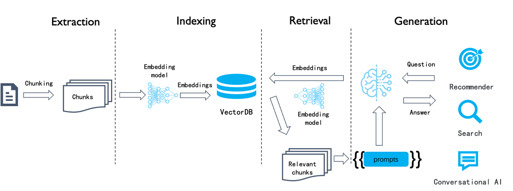
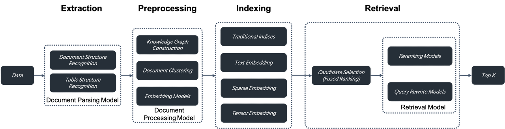
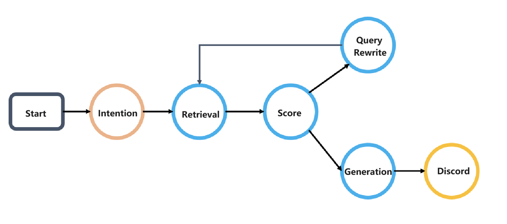
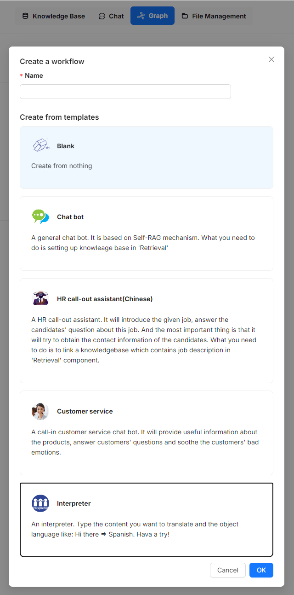
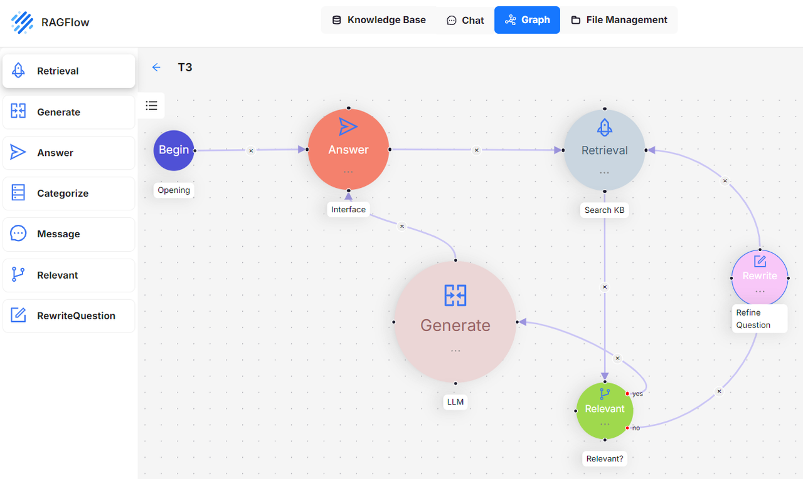
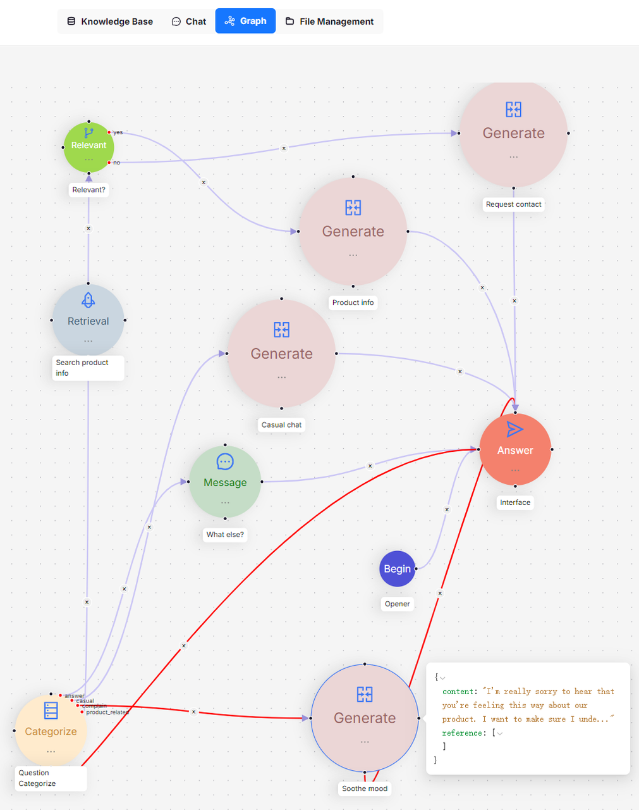
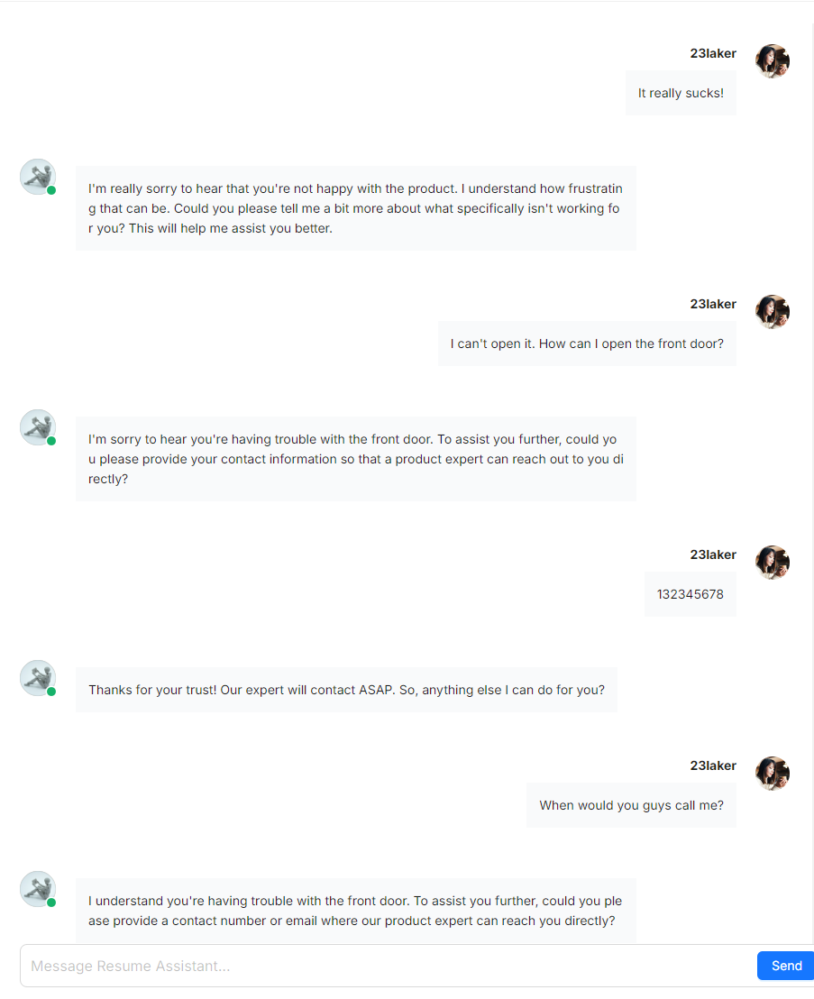
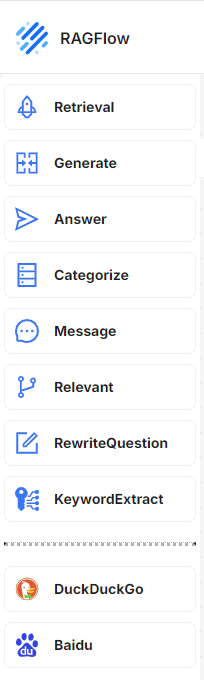
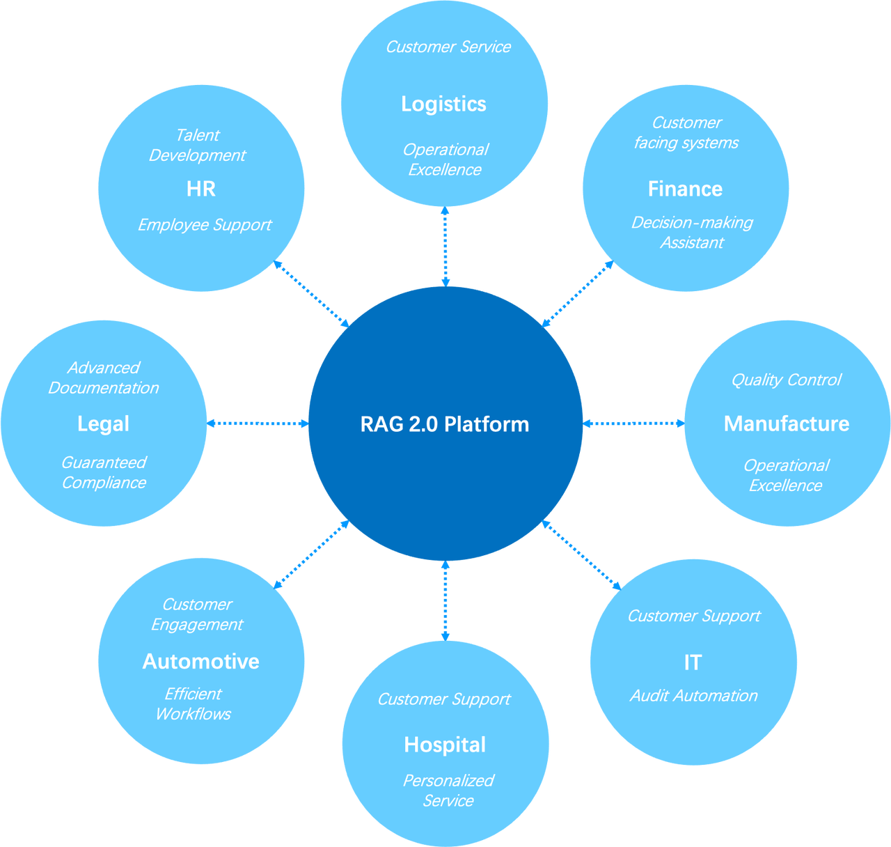

As of v0.8, RAGFlow is officially entering the Agentic era, offering a comprehensive graph-based task orchestration framework on the back-end and a no-code workflow editor on the front-end. Why agentic? How does this feature differ from existing workflow orchestration systems?<!--truncate-->

To address these questions, we must first examine the relationship between RAG and Agent. Without RAG, LLMs only have limited access to private data via long context, making it difficult to use agents to serve enterprise scenarios. Customer service, marketing recommendation, compliance checks, and inventory optimization require more than long-context LLM and workflow assembly. A naive RAG system, exemplified by single-round dialogue, is a crucial operator to support agent orchestration in the workflow. Conversely, RAG is an architecture pattern enabling LLMs to access private enterprise data. Therefore, an advanced RAG system should offer far more. When a user query has a clear intent, it should be able to handle multi-hop question-answering, which requires cross-document reasoning and query decomposition; for ambiguous query intents, it should be able to work alongside agents, employing dynamic agent orchestration to 'criticize'/evaluate retrievals, rewrite query accordingly, and conduct 'multi-hop' reasoning for these complex question-answering tasks. In essence, agents and RAG are complementary techniques, each enhancing the other's capabilities in enterprise applications. 

RAGFlow garnered 10,000 GitHub stars in less than three months since its open-source release. It is time for us to reflect on RAGFlow's successes and look into its future revolution. 

The above illustration shows a typical workflow for RAG. This semantic similarity-based approach has remained consistent for several years and can be divided into four stages: document chunking, indexing, retrieval, and generation. This process is pretty straightforward to implement, but the search results are often unsatisfactory because this naive semantic similarity-based search system has several limitations:

- As a chunk-level operation, the embedding process makes it hard to differentiate tokens requiring increased weight, such as entities, relationships, or events. This results in low-density of effective information in the generated embeddings and poor recall.
- Embeddings are inadequate for precise retrieval. For example, a user inquiring about the portfolios in their company's March 2024 financial plan might receive portfolios from a different time period, marketing or operational plans for the same period of time, or even other types of data.
- Its retrieval results depend highly on the chosen embedding model; general-purpose models may underperform in specific domains.
- Its retrieval results are sensitive to data chunking methods. However, this LLMOps-based system is innately simple and crude in document chunking, leading to loss of data semantics and structure. 
- Lack of user intent recognition, and improving the similarity search method alone would not effectively enhance answers for ambiguous user queries.
- Unable to handle complex queries, such as multi-hop question-answering, which requires multi-step reasoning from heterogeneous information sources.

Thus, this LLMOps-centric system can be viewed as RAG 1.0. It features orchestration and ecosystem but falls short in effectiveness. Although developers can quickly build up a prototype system with RAG 1.0, they often find themselves stuck in limbo when tackling issues in real enterprise settings. Therefore, RAG must continue to evolve with LLMs to facilitate search in various specialized domains. Based on these considerations, we propose the following key features and components for RAG 2.0:

1. RAG 2.0 is an end-to-end search system divided into these stages: information extraction, document preprocessing, indexing, and retrieval.
2. RAG 2.0 cannot be orchestrated by reusing LLMOps tools designed for RAG 1.0 because these stages are coupled, lack unified APIs and data formats, and have circular dependencies. For example, query rewriting, which is essential for multi-hop question-answering and user intent recognition, involves iterative retrieval and rewriting.
3. A more comprehensive and powerful database supporting hybrid searches is needed to address the low recall in RAG 1.0. Beyond vector search, it should include full-text search and sparse vector search. It should even implement Tensor search, which supports late interaction mechanisms like ColBERT.
4. Databases only cover query and retrieval in RAG 2.0. From a global perspective, it's essential to optimize every stage of the RAG pipeline. This includes:
   1. A separate data extraction and cleansing module is needed to chunk user data. Relying on a collection of recognition models, it recognizes various complex document structures, including tables and texts mixed with illustrations, and iteratively adjusts its chunking size according to the retrieved search results.
   2. Before being sent to the database for indexing, the extracted data might undergo several preprocessing procedures, including knowledge graph construction, document clustering, and domain-specific embedding. These procedures ensure that the retrieval results hold the necessary answer by preprocessing the extracted data in multiple ways. This is crucial for addressing complex query issues like multi-hop question-answering, ambiguous user intents, and domain-specific inquiries. 
   3. The retrieval stage involves coarse ranking and refined ranking. Refined ranking typically occurs outside the database, as it requires different reranking models. Additionally, user queries would go through the continuous cycle of rewriting according to the user intent recognized by AI models. This process continues until the retrieved answers are to the user's satisfaction. 

In general, each stage in RAG 2.0 is essentially built around AI models. They work in conjunction with the database to ensure the effectiveness of the final answers.

The current open-source version of RAGFlow primarily addresses the first stage of the pipeline, using deep document understanding models to ensure 'quality in, quality out' for data. Additionally, it employs 2-way retrieval (dual-retrieval) during indexing, the third stage, combining keyword full-text search with vector search. These features distinguish it from other RAG products, suggesting that RAGFlow has set foot on the road towards RAG 2.0.

RAGFlow v0.8 implements agents to better support the subsequent stages in the RAG 2.0 pipeline. For example, to improve the handling of ambiguous queries in a dialogue, RAGFlow introduces a Self-RAG-like mechanism for scoring retrieval results and rewriting user queries. This mechanism requires the use of agents to implement a reflective Agentic RAG system, which operates as a cyclic graph rather than a traditional workflow (DAG: Directed Acyclic Graph). See the illustration below:

This cyclic graph orchestration system introduces a reflection mechanism for agents. Reflection enables agents to explore user intents, adapt to context dynamically, guide conversation, and ultimately deliver high-quality responses. The ability to reflect lays the foundation for agent intelligence.

The introduction of Agentic RAG and workflow naturally facilitates the integration of RAG 2.0 into enterprise retrieval scenarios. To support this, RAGFlow offers a no-code workflow editing approach, applicable to both Agentic RAG and workflow business systems. The screenshot below showcases several built-in templates currently available in RAGFlow's no-code workflow orchestration system for users to start with, including customer service and HR call-out assistant templates. This template list is continuously expanding to cover more scenarios.

The screenshot below illustrates a Self-RAG workflow example. A 'Relevant' operator assesses whether retrieved results are relevant to the user query. If deemed irrelevant, the query is rewritten. This process repeats until the 'Relevant' operator determines the results are satisfactory.

The diagram below shows an HR candidate management system, exemplifying a multi-round dialogue scenario. A corresponding sample conversation is provided immediately following this no-code orchestration template.

Below are the workflow operators that can be orchestrated in no-code. Above the dividing line are functional operators closely related to RAG and dialogue, which set RAGFlow apart from other RAG systems. Below the line are a couple of tools. A lot of existing workflow agent systems have incorporated many such tools. RAGFlow is still in its early stage, and more such tools will be added.

Now, let's address the initial question how RAGFlow's no-code orchestration differs from similar RAG projects in the market. Firstly, RAGFlow is RAG-centric rather than LLM-centric, thus emphasising how RAG can support domain-specific businesses in enterprise-level scenarios. Secondly, it addresses the core requirements of RAG 2.0, as well as orchestrating search-related technologies such as query intent recognition, query rewriting, and data preprocessing to provide more precise dialogues, whilst also accommodating business systems characterized by workflow orchestration.

The envisioned future for RAGFlow is an Agentic RAG 2.0 platform, and our ultimate vision is to let RAG 'flow' in enterprise scenarios. If you share the same vision, please follow and star our project on [GitHub](https://github.com/infiniflow/ragflow).