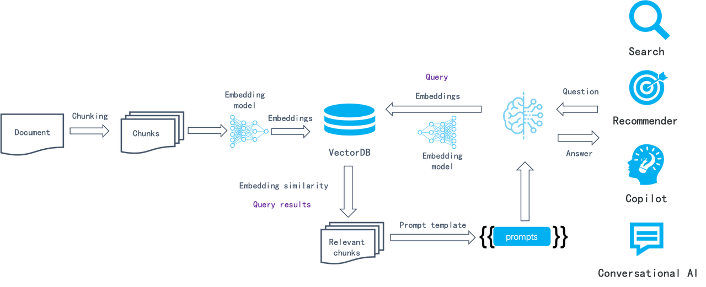
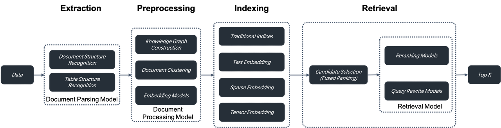

Search technology remains one of the major challenges in computer science, with few commercial products capable of searching effectively. Before the rise of Large Language Models (LLMs), powerful search capabilities weren't considered essential, as they didn't contribute directly to user experience. However, as the LLMs began to gain popularity, a powerful built-in retrieval system became required to apply LLMs to enterprise settings. This is also known as Retrieval-Augmented Generation (RAG)—searching internal knowledge bases for content most relevant to user queries before feeding it to the LLM for final answer generation.<!--truncate-->

Imagine a scenario where an LLM answers user queries. Without RAG, it relies solely on its training data; with RAG, the LLM can search in a textbook for paragraphs potentially having the answer, just like doing an open-book exam. Modern LLMs have evolved to handle much longer user queries, with context windows of up to millions of tokens. This raises the question: if the context window of an LLM can hold an entire textbook, why is a separate search inside the textbook necessary? In fact, a separate search remains crucial for LLMs with large context windows for several reasons:

- Enterprise documentations usually have multiple versions, and feeding them all to an LLM for answer generation could lead to conflicting answers.
- Most enterprise scenarios require strict access control for content fed to the context window.
- LLMs tend to be distracted by semantically related but irrelevant content.
- Processing millions of irrelevant tokens is costly and time-consuming, even with powerful LLMs. 

RAG's rapid rise in popularity can be attributed to various LLMOps tools, which quickly integrate the following components to create a functional system. 

This semantic similarity-based approach has remained consistent for several years: Documents are chunked (e.g., by paragraph), converted into embeddings via embedding models, and stored in a vector database. During retrieval, the query is also converted into an embedding, and the database finds the most relevant chunks, which theoretically contain the most semantically relevant information. In this process, LLMOps tools typically handle tasks such as:

- Parsing documents and splitting them into fixed-size chunks.
- Orchestration tasks: sending the chunks to an embedding model (on-premise or SaaS); forwarding the generated embeddings along with corresponding chunks to the vector database; assembling query results from the vector database using a prompt template.
- Integrating business logic, including generating and returning user dialogue contents, connecting dialogues with business systems like customer service platforms, and more.

This process is straightforward to implement, but the search results are often unsatisfactory because this naive semantic similarity-based search system has several limitations:

- As a chunk-level operation, the embedding process makes it hard to differentiate Tokens requiring increased weight, such as entities, relationships, or events. This results in low-density of effective information in the generated embeddings and poor recall.
- Embeddings are inadequate for precise retrieval. For example, a user inquiring about the portfolios in their company's March 2024 financial plan might receive portfolios from a different time period, marketing or operational plans for the same period of time, or even other types of data.
- Its retrieval results depend highly on the chosen embedding model; general-purpose models may underperform in specific domains.
- Its retrieval results are sensitive to data chunking methods. However, this LLMOps-based system is innately simple and crude in document chunking, leading to loss of data semantics and structure. 
- Lack of user intent recognition, and improving the similarity search method alone would not effectively enhance answers for ambiguous user queries.
- Unable to handle complex queries, such as multi-hop question-answering, which requires multi-step reasoning from heterogeneous information sources.

Thus, this LLMOps-centric system can be viewed as RAG 1.0. It features orchestration and ecosystem but falls short in effectiveness. Although developers can quickly build up a prototype system with RAG 1.0, they often find themselves stuck in limbo when tackling issues in real enterprise settings. Therefore, RAG must continue to evolve with LLMs to facilitate search in various specialized domains. Ultimately, the goal of a search system is to find answers, not just retrieving the most similar results. Based on these considerations, we propose the following key features and components for RAG 2.0:

1. RAG 2.0 is an end-to-end search system divided into these stages: information extraction, document preprocessing, indexing, and retrieval. It cannot be orchestrated by reusing LLMOps tools designed for RAG 1.0 because these stages are coupled, lack unified APIs and data formats, and have circular dependencies. For example, query rewriting, which is essential for multi-hop question-answering and user intent recognition, involves iterative retrieval and rewriting. Introducing orchestration here is not only unnecessary but may interfere with search and ranking optimization. This partly explains the recent criticism of AI orchestration framework LangChain.

2. A more comprehensive and powerful database supporting hybrid searches is needed to address the low recall in RAG 1.0. Beyond vector search, it should include full-text search and sparse vector search. It should even implement Tensor search, which supports late interaction mechanisms like ColBERT.

   - Full-text search is indispensable to precise retrieval, as it can be rather frustrating to find that expected documents aren't returned in response to queries with clear intent. Further, by showing the matched keywords, full-text search facilitates understanding of the reason behind the retrieval, which also contributes to the explainability of the ranking results. Thus, in most circumstances, it is unadvisable to drop full-text search from the retrieval options for RAG. Full-text search, despite existing for many years, is still not easy to implement. Besides the need for handling massive data,  it must offer Top-K Union semantics-based search options, as RAG queries are usually complete sentences rather than a combination of several keywords. Unfortunately, databases in the market claiming to support BM25 and full-text search fall short in both capabilities. They neither support high-performance massive data search nor offer effective retrieval, and hence are not readily available for enterprise-level retrieval. 

   - Recent findings from IBM Research demonstrate that combining full-text search, sparse vector search, and dense vector search achieves state-of-the-art results on several question-answering datasets. This suggests a promising future for databases with native support for such three-way retrieval capabilities.

   - Tensor search is a novel retrieval method designed specifically for late interaction mechanisms like ColBERT. To summarize, a cross encoder is capable of capturing complex interactions between query and document, yielding more precise ranking results than normal vector search. However, as it needs to 'juggle' encoding tasks for both query and document passages, a cross encoder is usually very slow for ranking tasks and only suited for the reranking of the final results. A ranking model like ColBERT achieves higher retrieval accuracy than normal vector search with much less information loss. This is because it uses multiple embeddings or a Tensor to represent a document and calculates similarity for every Token in the document. It also outperforms a cross encoder as document encoding is performed offline during the indexing stage. This makes it a practical choice for ranking during the retrieval stage. Therefore, for a database designed for RAG 2.0, it would be beneficial to have hybrid-search capabilities that incorporate Tensor search with full-text search.

3. Databases only cover query and retrieval in RAG 2.0. From a global perspective, it's essential to optimize every stage of the RAG pipeline. This includes:

   - A separate data extraction and cleansing module is needed to chunk user data. Relying on a collection of recognition models, it recognizes various complex document structures, including tables and texts mixed with illustrations, and iteratively adjusts its chunking size according to the retrieval results. The data extraction and cleansing process can be likened to ETL in modern data stacks, but is way more complex. ETL is essentially a SQL-based deterministic system, whilst this process is a non-standard system built around document structure recognition models.
   - Before being sent to the database for indexing, the extracted data must undergo several preprocessing procedures, including knowledge graph construction, document clustering, and domain-specific embedding. These procedures ensure that the retrieval results hold the necessary answer by preprocessing the extracted data in multiple ways. This is crucial for addressing complex query issues like multi-hop question-answering, ambiguous user intents, and domain-specific inquiries. 
   - Before being sent to the database for indexing, the extracted data must undergo several preprocessing procedures, including knowledge graph construction, document clustering, and domain-specific embedding. These procedures ensure that the retrieval results hold the necessary answer by preprocessing the extracted data in multiple ways. This is crucial for addressing complex query issues like multi-hop question-answering, ambiguous user intents, and domain-specific inquiries. 

   

Each stage in RAG 2.0 is essentially centered around models. They work in conjunction with the database to ensure the effectiveness of the final answers.

RAG 2.0 is built around database and AI models and requires a platform for continuous iteration. This led us to develop and open-source RAGFlow. Instead of reusing existing RAG 1.0 components, RAGFlow addresses the fundamental challenges in LLM retrieval systems from a pipeline perspective. It garnered 10,000 GitHub stars in less than three months since its open-source release, marking a new beginning. However, RAGFlow is still in its early stage and every part of it needs further evolution. 

RAG 2.0 will significantly impact LLM applications in enterprise scenarios, and we're enthusiastic about its future as a driving force in AI. If you're also interested, we welcome you to follow our work at https://github.com/infiniflow/ragflow
