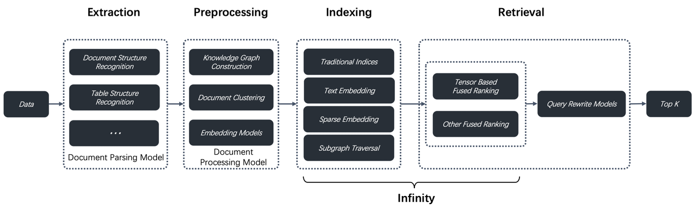
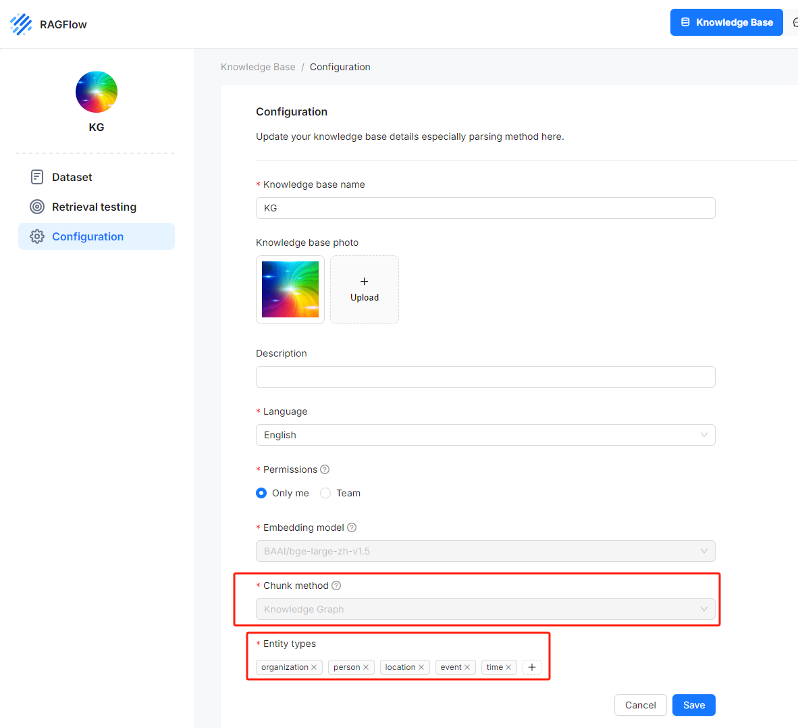
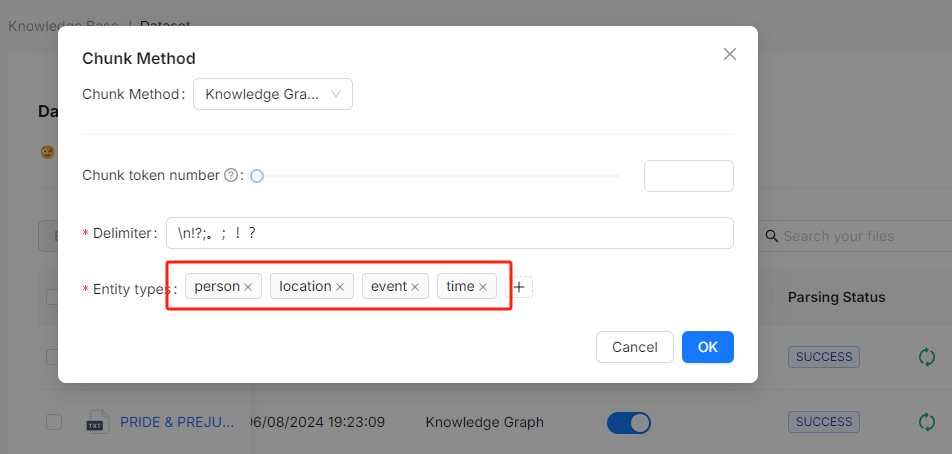
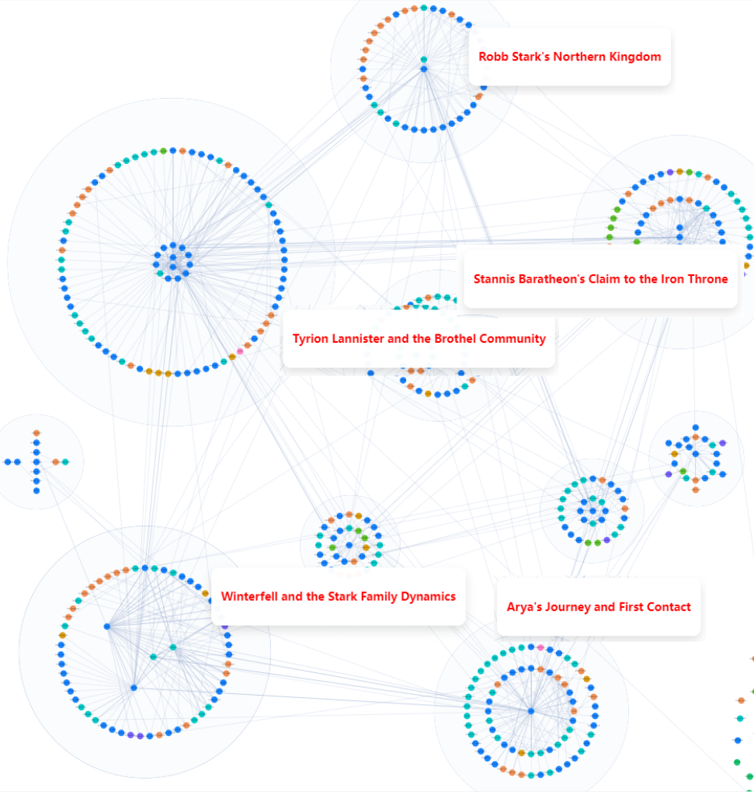
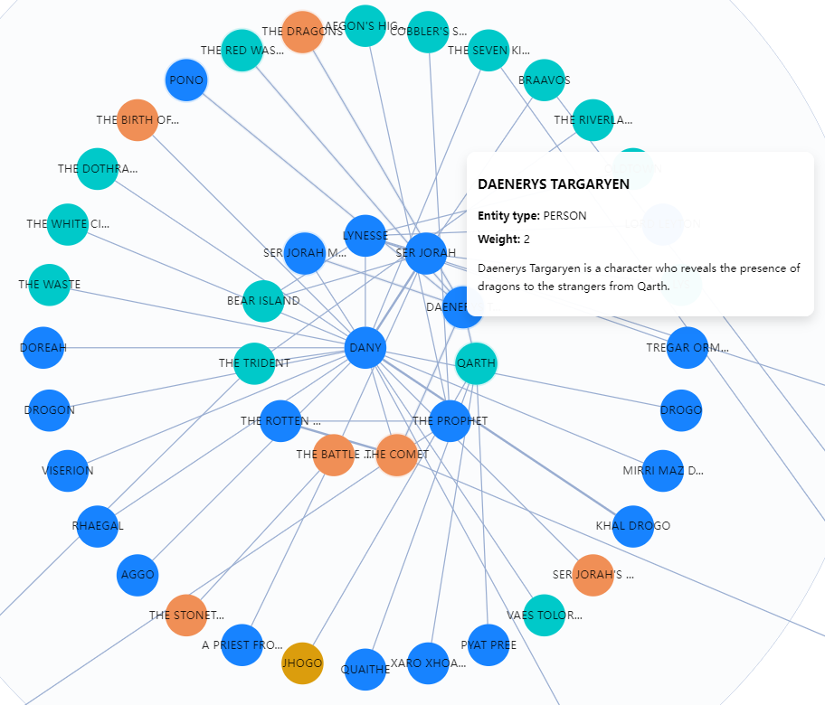
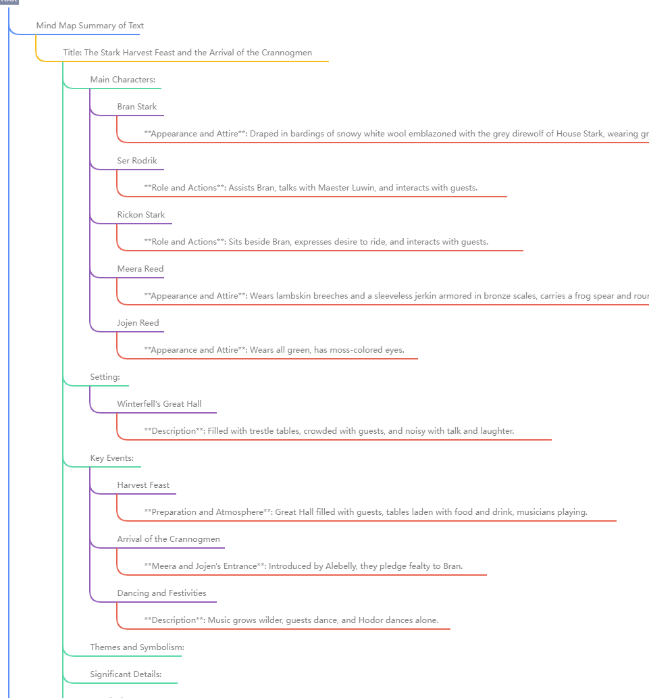
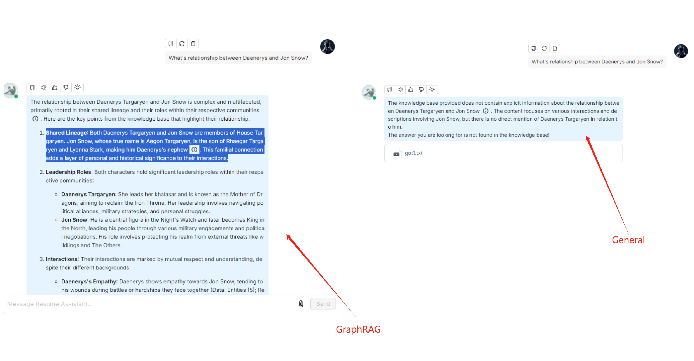

[RAGFlow](https://github.com/infiniflow/ragflow) v0.9 introduces support for GraphRAG, which has recently been open-sourced by Microsoft, allegedly the next generation of Retrieval-Augmented Generation (RAG). Within the RAGFlow framework, we have a more comprehensive definition of RAG 2.0. This proposed end-to-end system is search-centric and consists of four stages. The last two stages—indexing and retrieval—primarily require a dedicated database, while the first two stages are defined as follows:<!--truncate-->

- **Data Extraction**: Utilize various document models to ensure high-quality data for indexing, thereby avoiding the "Garbage In, Garbage Out" issue.
- **Document Preprocessing**: Before the extracted data is sent to the database, optional preprocessing steps can be implemented, such as document clustering and knowledge graph construction. These steps primarily enhance multi-hop question answering and cross-document queries. While GraphRAG is indeed advanced, it is just one part of the RAG 2.0 pipeline.

From version v0.9 onwards, this part is integrated into RAGFlow. Below, we will explore the reasons for this addition and how it compares to Microsoft's GraphRAG.

Knowledge graphs are essential for improving the effect of RAG. Naive RAG systems typically retrieve contents similar to the user queries, and hence may not always provide the correct answer. Tasks like summarizing questions are essentially Query-Focused Summarization (QFS), and can be handled by using knowledge graphs. Knowledge graphs can effectively aggregate contents based on textual relevance and generate summaries based on these aggregated contents during conversation, thereby improving accuracy in the final response. Many modern AI search solutions take this approach. As an aside, RAPTOR, which was introduced in an earlier version of RAGFlow also employs text clustering to improve retrieval effectiveness; knowledge graph-specific approaches can generate more 'hierarchical' results based on named entities, offering better accuracy and more comprehensive responses for QFS queries. Now, a number of studies have proved that knowledge graphs can improve the effectiveness of RAG outputs and enable LLMs to produce more interpretable answers in many circumstances by providing additional contextual information. This is why the launch of GraphRAG quickly generated significant interest in the community. Before the rise of RAG, there had been many efforts to employ knowledge graphs for question answering  (KGQA). However, one major obstacle to their widespread enterprise adoption had always been the automation and standization of knowledge graph construction. With the emergence of LLMs and RAG, it is now more feasible to automate this process, and GraphRAG is among the most notable examples. 

GraphRAG significantly simplifies the abstraction and construction of knowledge graphs, and greatly facilitates the launch of standard products. So we referenced this approach when implementing GraphRAG in RAGFlow. RAGFlow introduces knowledge graph construction as an optional feature during the document preprocessing stage to support more sophisticated question-answering scenarios. It also made the following improvements to the original GraphRAG:

- **A deduplication step is introduced**. In the original GraphRAG, extracted named entities were directly used without deduplication, which could lead to issues like treating synonyms such as "2024" and "Year 2024" or "IT" and "Information Technology" as distinct entities. This challenge, known academically as Entity Resolution, typically involves complex algorithms. However, RAGFlow leverages LLMs to perform deduplication, as LLMs can be broadly viewed as implicit knowledge graphs.
- **Reduced Token Consumption**: GraphRAG inherently consumes a large number of tokens because it requires all user-uploaded documents to be sent to the LLM multiple times in its original implementation. This results in significant token usage, particularly for RAG systems using SaaS services. RAGFlow optimizes this process by ensuring that all documents are submitted to the LLM only once, minimizing unnecessary token consumption. To fundamentally address this issue, smaller, standalone models can be used for knowledge graph construction. A successful example is Triplex, which is fine-tuned based on Phi-3 with 3 billion parameters, offering cost savings several times greater than using an LLM. In the future, RAGFlow will also provide similar solutions to further reduce the construction costs associated with GraphRAG.

Below is a demonstration of the RAGFlow version of GraphRAG:

During the document parsing stage, users can choose "Knowledge Graph" as the chunking method for a specific knowledge base. They must also define the types of named entities that they wish the LLM to extract, such as "organization," "person," and "location," as shown in the figure below:

After selecting the chunking method, you can trigger the LLM to extract entities and construct the knowledge graph. RAGFlow visually displays these knowledge graphs, including node names, node descriptions, and "communities":

The knowledge graph can also be displayed as a mind map:

The visualization of knowledge graphs is crucial for users to debug dialogues. Currently, RAGFlow supports use any connected LLM to generate knowledge graphs. However, LLMs have varying capabilities in data extraction, and failure to extract knowledge graphs can lead to incorrect dialogues. In such cases, visualisation tools can be used to view the generated knowledge graphs and analyze the dialogues. 

At present, RAGFlow's knowledge graph generation is at the document level, meaning that it does not support constructing knowledge graphs for all documents within a knowledge base. In other words, the current version of GraphRAG in RAGFlow cannot link knowledge graphs generated from multiple documents. This feature requires significantly more memory and computational resources. RAGFlow will reconsider this feature based on user feedback at a later point.

The following image juxtaposes dialogues generated from *Game of Thrones*. The dialogue on the left, generated using GraphRAG, demonstrates that GraphRAG provides more in-depth and comprehensive answers for multi-hop queries involving nested logic. The dialogue on the right, which is based on document parsed using the GENERAL parsing method, shows no result. 

To summarize, RAGFlow's implementation of GraphRAG aims to automate the construction of knowledge graphs for RAG. While GraphRAG removes many complexities associated with traditional knowledge graph algorithms, it is not the final solution for using knowledge graphs in RAG applications. In real enterprise scenarios, a significant portion of data is unsuitable for knowledge graph construction, or it may not be cost-effective to construct knowledge graphs for all data. Indeed, knowledge graphs have many more applications, such as using knowledge graphs to rewrite queries. RAGFlow plans to support these features in near future.

**Bibliography**

1. GraphRAG, https://github.com/microsoft/graphrag
2. From Local to Global: A Graph RAG Approach to Query-Focused Summarization, https://arxiv.org/abs/2404.16130
3. HippoRAG: Neurobiologically Inspired Long-Term Memory for Large Language Models , https://arxiv.org/abs/2405.14831