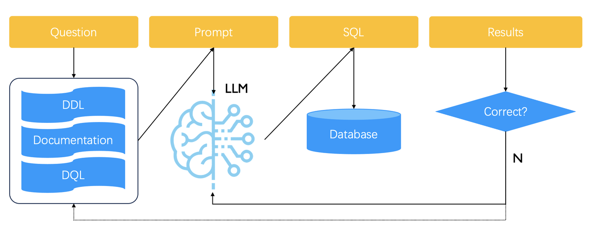
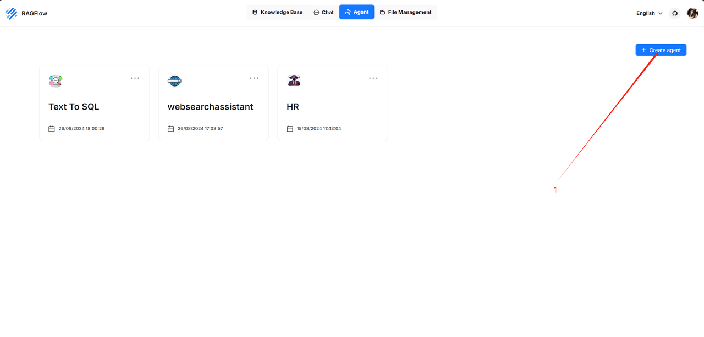
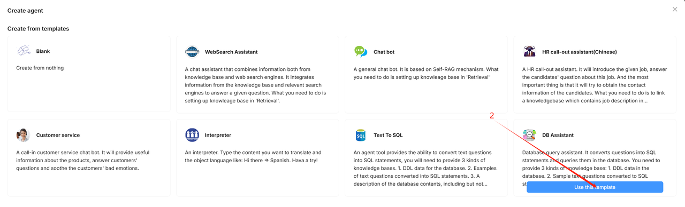
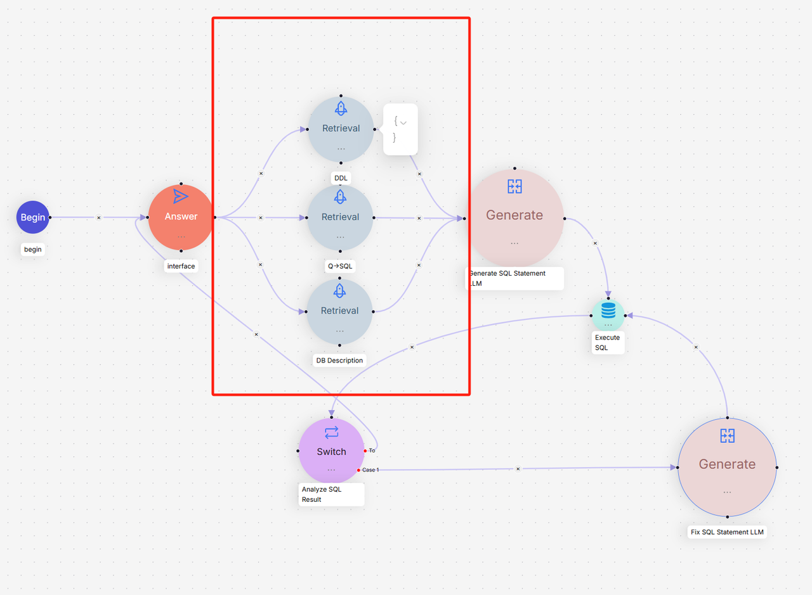
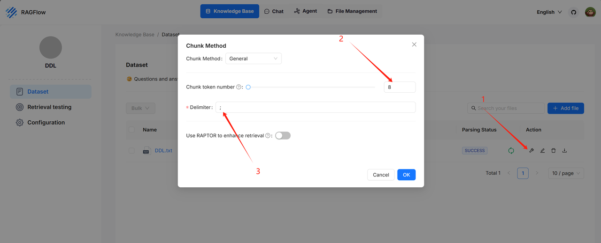
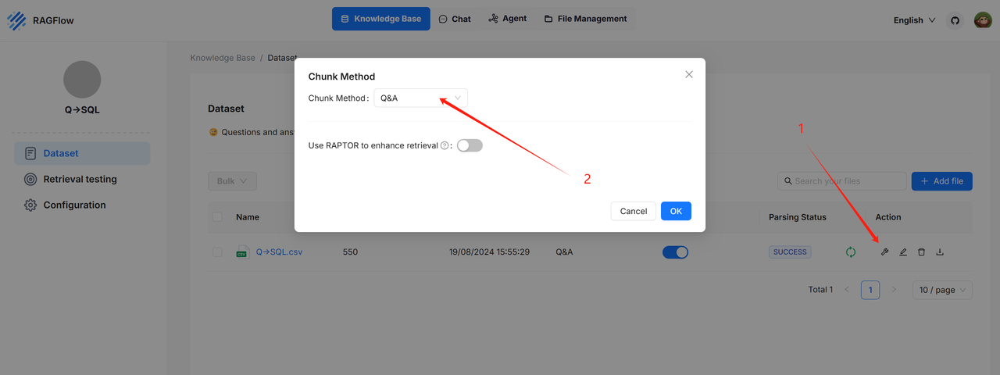
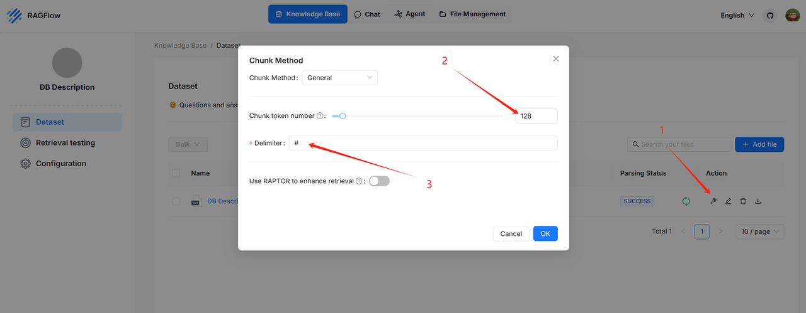
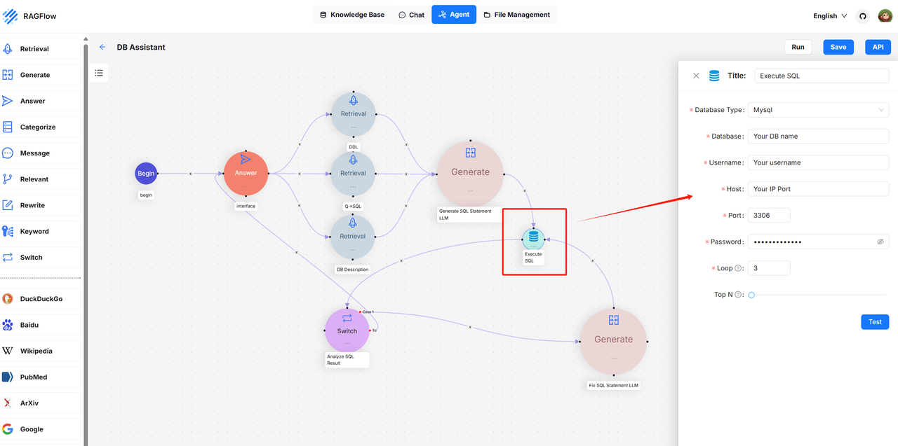

[RAGFlow](https://github.com/infiniflow/ragflow) introduces the Text2SQL feature in response to community demand. Traditional Text2SQL requires model fine-tuning, which can significantly increase deployment and maintenance costs when used in enterprise settings alongside RAG or Agent components. RAGFlow’s RAG-based Text2SQL leverages the existing (connected) large language model (LLM), enabling seamless integration with other RAG/Agent components without the need for additional fine-tuned models.`<!--truncate-->`

The following pipeline explains how to implement Text2SQL capabilities based on RAG:

General speaking, you need to prepare a knowledge base for generating Text2SQL prompts, which contains various examples of natural language being converted to SQL statements. A user query is first sent to this knowledge base to retrieve similar examples. The retrieved examples are then concatenated into prompts for the LLM to generate the final SQL statement. The generated SQL is used directly to query the database. If the returned result is incorrect or if, even worse, nothing is retrieved, the generated SQL will be considered incorrect, and the LLM will be called again to regenerate a SQL statement until the predefined upper limit is reached.

Therefore, Text2SQL relies on multiple rounds of orchestration. RAGFlow encapsulates this Text2SQL feature into a convenient, built-in Agent component. In upcoming releases, we plan to adjust this workflow. The goal is to enable users to manually add or update text2SQL examples in the knowledge base, as indicated by the dashed arrow above.

## A Text2SQL demonstration

## Using Text2SQL in RAGFlow

Following is a guide on how to use Text2SQL in RAGFlow:

### 1. Create an agent from template

### 2. Configure knowledge bases

In the provided **DB Assistant** template, RAGFlow uses three types of knowledge bases to ensure the performance of Text2SQL:

- The **DDL** knowledge base
- The **Q->SQL** knowledge base
- The **Database description** knowledge base

The **DDL** knowledge base: An LLM requires accurate DDL (Data Definition Language) data to generate SQL statements, such as table structures and field information. The DDL knowledge base holds the correct DDL data for effective database querying. The recommended configurations for parsing the DDL knowledge base are as follows:

Example: https://huggingface.co/datasets/InfiniFlow/text2sql/tree/main

The **Q->SQL** knowledge base: During the Text2SQL process, providing the LLM with samples of natural languages and their corresponding SQL statement pairs can enhance the quality of generated SQL statements. The Q->SQL knowledge base stores such pairs. The recommended configurations for parsing the Q->SQL knowledge base are as follows:

Example: https://huggingface.co/datasets/InfiniFlow/text2sql/tree/main

The **DB Description** knowledge base: This knowledge base contains accurate information about the queried database, including but not limited to the meanings of database tables and the significance of different fields within those tables. With detailed descriptions from the database, the large language model can more accurately convert user questions into SQL statements. It is recommended to configure the DB Description knowledge base parsing settings as follows:

Example: https://huggingface.co/datasets/InfiniFlow/text2sql/tree/main

### 3. Configure the database

1. Configure the required parameters for the database in the **Execute SQL** component, including:
   - Database type (currently supports MySQL, PostgresDB, and MariaDB)
   - Database name
   - Database username
   - Database IP address
   - Database port number
   - Database password

2. After completing the configuration, click the **Test** button to check if the connection is successful.
3. Configure the **Loop** parameter:

Text2SQL in RAGFlow features automatic reflection capabilities. If the generated SQL is deemed capable of querying correctly, the results will be returned directly. However, if the query fails, RAGFlow’s Text2SQL will automatically correct the SQL statement based on the error information returned from the database and retry the query. This process — query failure, correction of the SQL statement, and retry — will continue iterating until it reaches the maximum limit set by the Loop parameter. If this maximum is reached, the Text2SQL process will terminate, prompting the user to optimize their question or knowledge base data before attempting again.

4. Configure **TopN**:
   *This parameter limits the number of records returned in a query, as queries often involve records.*

### 4. Try out Text2SQL

Click **Run** to execute the operation.

## Troubleshooting

### `Database Connection Failed`

Failed to connect to the database. To solve this issue:

1. Click the **Execute SQL** component to ensure all parameters are correctly set.
2. Double check if the machine deploying RAGFlow can connect to the database using the provided information.
3. Click **Test** to check if the database connection is successfully established.

### `SQL statement not found!`

The user query cannot be converted into a SQL statement, primarily due to insufficient or incomplete knowledge bases. It’s recommended to expand the three mentioned knowledge bases.

### `No record in the database!`

The SQL query failed to retrieve any records from the table, either because the filtering condition is excessively restrictive or because the table itself contains no data.

### `Maximum loop time exceeds. Can’t query the correct data via SQL statement.`

The generated SQL statement cannot accurately query the database. Please check the following:

- Ensure the database contains the relevant data.
- Verify that the user question is appropriate.
- Confirm that the SQL statements generated by the **Generate SQL Statement LLM** and **Fix SQL Statement LLM** components are correct.
