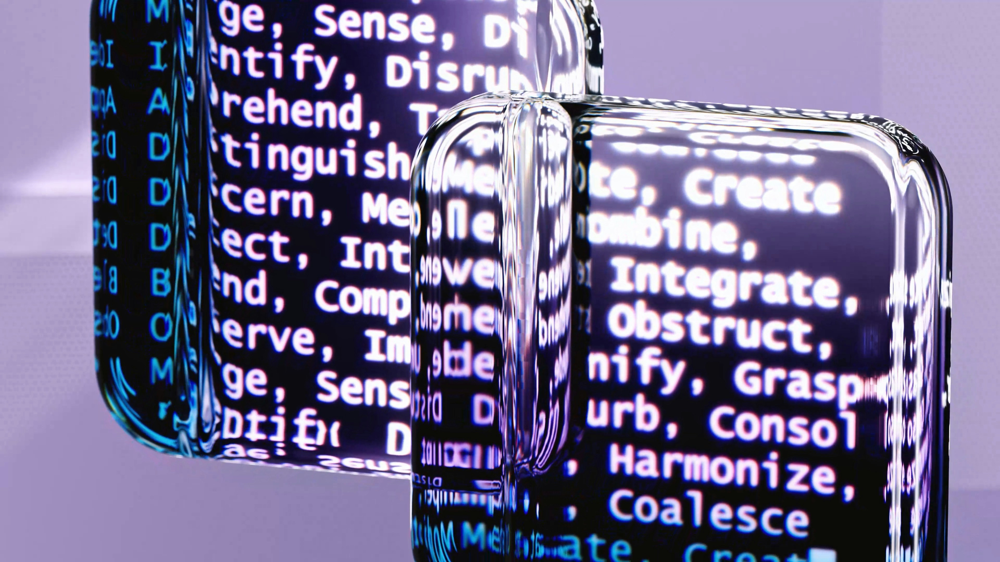
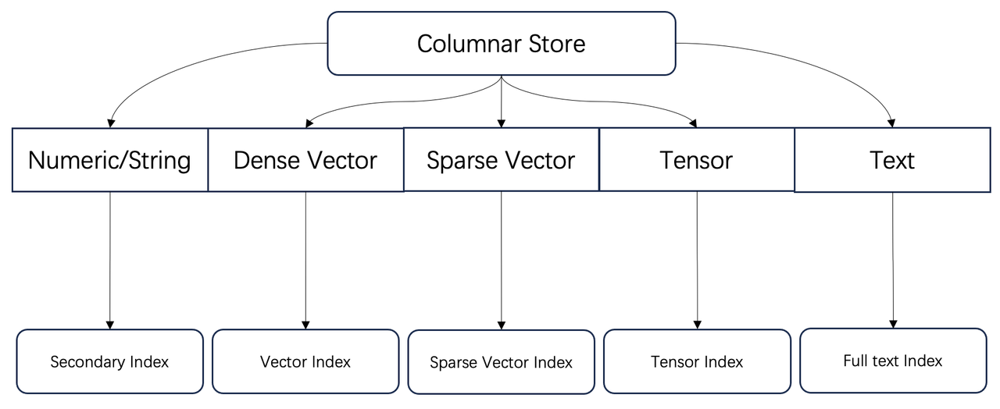
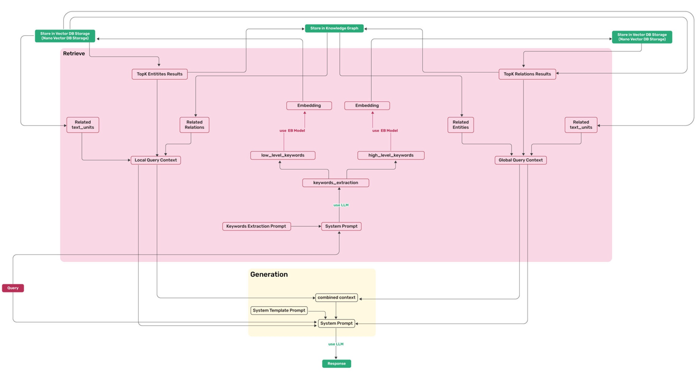
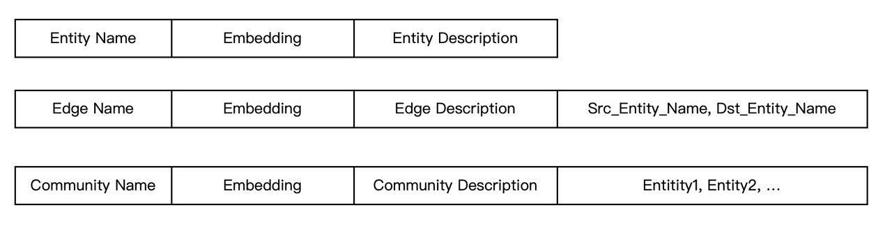
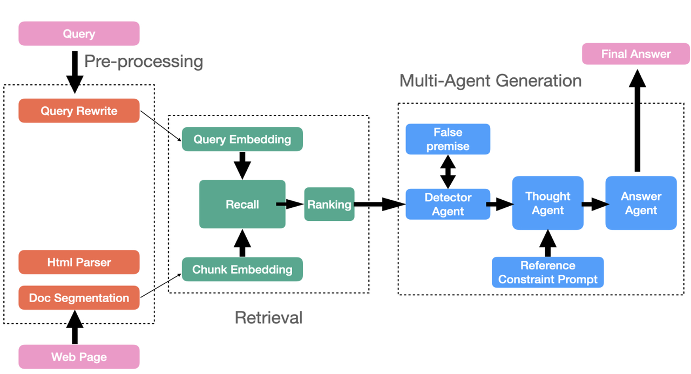

Infinity is a database specifically designed for Retrieval-Augmented Generation (RAG), excelling in both functionality and performance. It provides high-performance capabilities for dense and sparse vector searches, as well as full-text searches, along with efficient range filtering for these data types. Additionally, it features tensor-based reranking, enabling the implementation of powerful multi-modal RAG and integrating ranking capabilities comparable to Cross Encoders. `<!--truncate-->`



As illustrated in the diagram below, Infinity fundamentally serves as a comprehensive indexing database for diverse data types.



These capabilities have been acknowledged by both engineering and academia as essential for Retrieval-Augmented Generation (RAG). What additional capabilities are required for current and future RAG systems?

## GraphRAG

Firstly, let's look at GraphRAG. Here, GraphRAG refers not only to Microsoft's open-source project but also to a methodology that leverages automatically constructed knowledge graphs to assist RAG retrieval. This approach addresses the "semantic gap" issue in question answering, where answers cannot be found based on the questions posed.

Since knowledge graphs are involved, it is inevitable to discuss the category of graph databases. Graph databases are designed to handle complex graph-structure queries. For example, consider the following query: return all source and target accounts for all two-hop transfers completed by user Alice. This can be expressed in SQL as follows:

```sql
SELECT a.owner, c.owner
FROM Accounts a, b, c, Transactions t1, t2
WHERE b.owner = Alice AND a.owner=t1.From AND t1.To=b.owner AND t1.To=t2.From AND t2.to=c.owner 
```

This requires two tables: an accounts table and a transactions table. The operations are as follows:

1. Find all accounts belonging to Alice in the accounts table (b.owner = 'Alice').
2. Locate all accounts that initiated transactions to Alice in the transactions table (a.owner = t1.From and t1.To = b.owner).
3. Identify accounts where Alice is the initiator (t1.To = t2.From).
4. Finally, find the ultimate target accounts for these transactions (t2.To = c.owner).

Thus, we can observe three characteristics of this type of queries:

1. Although this query involves only two tables, it requires numerous multi-table joins.
2. Modelling with a relational database is quite cumbersome.
3. Query efficiency with a relational database is very low due to the need for non-sequential scans of multiple tables. Each operation typically returns only a few records, making it challenging to create an effective query plan. Traditional relational databases can easily lead to excessive intermediate result sizes, resulting in out-of-memory (OOM) errors.

Therefore, the characteristics of graph databases include:

1. To avoid non-sequential scans of tables, they introduce indexes, particularly inverted indexes. An inverted index stores nodes and edges separately by column and constructs index based on edges, with the index content being node IDs.
2. They optimize multi-table joins; some state-of-the-art systems implement multi-way joins for worst-case optimal joins [reference 1].

Returning to knowledge graphs, do we require such complex graph queries? GraphRAG aside, a typical knowledge graph necessitates queries to retrieve neighbouring entities based on a given entity. More complex queries may involve subgraph traversals to obtain neighbours and multi-hop neighbours for multiple entities. These requirements can be conveniently implemented using indexes. Therefore, support for knowledge graphs is a relatively simplified requirement for graph databases.

Returning to GraphRAG, let’s examine the queries involved using LightRAG [reference 2] as an example. LightRAG is chosen because it provides a more comprehensive and systematic summary of GraphRAG queries, as illustrated in the following diagram.



The required queries are as follows:

1. Find the top entities closest to the keyword vector.
2. Identify the relationships connecting these entities in the knowledge graph.
3. Find the top relationships (edges) closest to the keyword vector.
4. Identify the entities connected by these relationships in the knowledge graph.

It is evident that the requirements for knowledge graph queries in GraphRAG are quite straightforward. In GraphRAG, the abstraction and definition of knowledge graphs are simplified, with relationships between entities reduced to a single type. This simplification arises because large language models (LLMs) often lack precise definitions for entities and relationships, leading to knowledge graphs typically serving as supplementary tools for retrieval-augmented generation (RAG). Recently, Ant Group has also unveiled its approach to GraphRAG with KAG [reference 3], which offers a more comprehensive definition of knowledge graphs, expanding relationships between entities to six types and introducing a reasoning framework. However, there have been no significant changes in data retrieval itself. Thus, a simple idea arises: could transplanting a trimmed-down graph database serve the current and future needs of GraphRAG?

Recently, Charles L. A. Clarke, a senior search engine researcher from the University of Waterloo, proposed a novel indexing method called Annotative Indexing [reference 4]. The aim is to unify columnar storage, full-text search, and graph databases. The term "annotative" refers to adjustments made to the structure of inverted indexes; by introducing annotations, inverted indexes can be created in a more flexible way. Based on these observations, we will explore whether Infinity, as a fully indexed database, can meet the current and future requirements of GraphRAG.

As shown in the diagram, we can easily model the entities and edges of a knowledge graph. In GraphRAG, the entities and edges of the knowledge graph are represented as textual descriptions, along with communities derived from clustering these entities and their summaries. Consequently, all this text can be associated using full-text indexing. Infinity's full-text index offers a comprehensive and powerful syntax, enabling not only similarity scoring but also **filtering based on keywords**. Therefore, establishing a full-text index on the \<source entity name, target entity name\> fields allows for convenient keyword filtering, facilitating subgraph retrieval based on edges and entities. Additionally, within Infinity, full-text indexing and vector indexing are seamlessly integrated, allowing for efficient hybrid searches tailored to GraphRAG. All edges, entities, and even communities are included in the scope of full-text search alongside vectors, enabling two-way hybrid recall based on GraphRAG. Moreover, as illustrated in the following schema, these data can be stored in a single table by simply adding a type field alongside the original text chunks, effectively combining GraphRAG and RAG into HybridRAG. Clearly, employing a database with rich indexing capabilities can significantly reduce the engineering challenges associated with implementing these complex logics.



Consequently, it can be concluded that Infinity currently meets the storage requirements for GraphRAG, both now and in the future. Looking ahead, Infinity will add more execution logic around the computation layer, allowing some application-level code to be integrated into the database, thereby enhancing performance and usability. For example:

1. One type of GraphRAG directly treats text chunks as nodes in a graph, with the similarity between chunks (based on various options) determining the edges. This can also be modelled using inverted indexes. The task of creating such indexes could be implemented as a background job within Infinity.
2. GraphRAG requires close interaction with models, and it will inevitably introduce some graph computation capabilities in the future. For instance, generating graph embeddings based on a subgraph traversal structure could also be executed as a background task in Infinity.

Such tasks can be accomplished through background jobs or functions, all of which can be executed using Infinity's current engine architecture without significant adjustments. This clearly aligns with Infinity's ongoing evolution alongside the development of RAG.

## Long-term Memory

Next, let's examine memory management, which is closely related to agents and can be considered an essential component. In RAGFlow, an agent framework has already been provided. Currently, most agents are tightly linked to workflows, facilitating interactions between RAG and external systems or enabling agentic RAG through workflows. However, the future of agents lies in more intelligent systems represented by multi-agent architectures that will assist large language models (LLMs) in providing reasoning capabilities. The interaction between multi-agents and RAG will become more frequent, as illustrated in the diagram below.



In these architectures, agents need to manage their own memory, such as user conversation sessions and personalized information. Many agent frameworks use short-term memory modules to handle this data, distinguishing it from long-term memory. The former relies on temporary memory data; however, as agent usage increases and all user information needs to be retained, a more reliable approach is to use a long-term memory component, specifically a database, to store all the aforementioned user information in both text and vector formats. For memory management, the required interfaces essentially fall into two categories:

- Filtering: Retrieve specific memory information for a particular agent and user based on user ID, agent ID, and time range.
- Searching: Query relevant information in the user memory module based on contextual information (including text and vectors).

Since agents require real-time access to memory, the database for long-term memory management must not only support the aforementioned two types of requirements but also ensure real-time performance: data must be immediately visible upon insertion. This essentially necessitates a streaming search capability—within Infinity, all indexes meet this requirement.

For vectors, index construction is a time-consuming process; therefore, Infinity employs a brute-force scan for newly inserted data to facilitate real-time querying. As a result, Infinity is well-prepared to support the forthcoming multi-agent systems.

Infinity, a database specifically designed for Retrieval-Augmented Generation (RAG), has evolved to possess comprehensive service capabilities. In the latest release of RAGFlow version 0.14, Infinity has been integrated as an alternative to Elasticsearch. After thorough testing and validation, Infinity will become the preferred option for RAGFlow, unlocking many advanced features over time. Please stay tuned for updates on Infinity and RAGFlow!

https://github.com/infiniflow/infinity

https://github.com/infiniflow/ragflow

## Bibliography

1. https://github.com/kuzudb/kuzu
2. https://github.com/HKUDS/LightRAG
3. https://github.com/OpenSPG/KAG
4. Annotative Indexing, arXiv preprint arXiv:2411.06256
5. HybridRAG: Integrating Knowledge Graphs and Vector Retrieval Augmented Generation for Efficient Information Extraction, Proceedings of the 5th ACM International Conference on AI in Finance, 2024
6. TCAF: a Multi-Agent Approach of Thought Chain for Retrieval Augmented Generation, 2024 KDD Cup Workshop for Retrieval Augmented Generation
