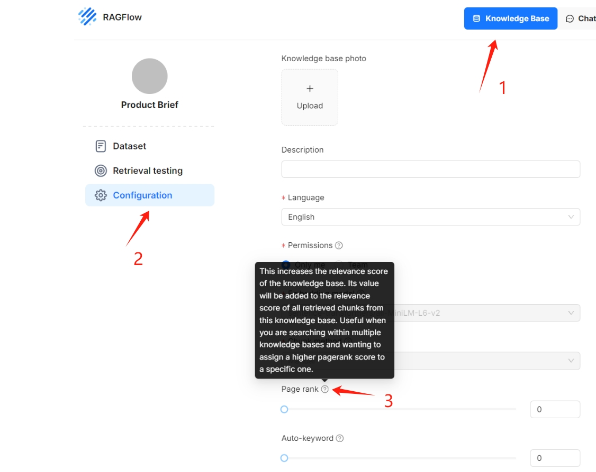

The final release of RAGFlow for the year of 2024, v0.15.0, has just been released, bringing the following key updates:

## Agent Improvements

This version introduces several enhancements to the Agent, including additional APIs, step-run debugging, and import/export capabilities. Since v0.13.0, RAGFlow's Agent has been restructured to improve usability. The step-run debugging feature finalizes this process, enabling operators in the Agent workflow to be executed individually, thereby assisting users in debugging based on output information.<!--truncate-->

Agent import and export functionalities lay the groundwork for Agent reuse. Currently, within the LLM ecosystem, there are numerous frameworks available for Agents and workflows. These frameworks function as IDEs for non-programmers, making it quite challenging to orchestrate specific Agents and workflows for business scenarios. We can liken these orchestrated Agents to apps, while the framework for deploying and executing them resembles an app store. Consequently, in the long term, Agent development is likely to progress towards interface compatibility and interoperability.

On another note, current mainstream Agent products primarily focus on workflows, but this year has seen significant progress in integrating reasoning capabilities into Agent frameworks. Further developments in this area are anticipated next year, particularly concerning multi-Agent scenarios. LangGraph has already released an interoperability protocol for LLM Agents, which RAGFlow will support in future versions. Since Agents closely interact with RAG, RAGFlow aims to enhance user convenience by offering this feature. However, RAGFlow remains focused on RAG itself, and we encourage users to build their own Agents on RAGFlow or use Agents developed within other workflow frameworks to leverage RAGFlow's capabilities.

## Upgrades to DeepDoc

The document layout analysis model serves as the entry point for DeepDoc. Since its launch on April 1, DeepDoc has not received any upgrades. There have been numerous requests from the community for a unified interface that allows DeepDoc to consistently output in Markdown format, facilitating loose coupling between the model and subsequent processing. This demand has intensified with the emergence of excellent open-source projects like MinerU. We have yet to pursue this direction mainly because Markdown cannot fully represent the results of multimodal document conversions; for instance, it cannot handle complex nested tables. Similarly, for future data types like flowcharts and pie charts, directly outputting in JSON would be more convenient.

On the other hand, there is a clear need to upgrade DeepDoc's open-source model. This upgrade focuses on enhancing the document layout model, which continues to utilise YOLO training, maintaining efficiency while significantly improving accuracy in document layout recognition.

## Retrieval-augmented generation

Even if DeepDoc works perfectly, it still cannot resolve the issue of recall accuracy alone. Hybrid search aside, recall from text data is influenced by two factors: the semantic gap and the volume of data.

### Semantic Gap

We know that GraphRAG and RAPTOR can address the semantic gap, but these solutions are heavyweight and consume many tokens. A relatively lightweight approach is Contextual Retrieval, launched by Claude in September this year. This method leverages LLMs to generate supplementary information for each text chunk, enhancing recall accuracy. For instance, if a text contains a medical treatment solution without a disease description, it may not be effectively retrieved. LLMs can conveniently add relevant supplementary information to facilitate recall.

This Contextual Retrieval capability has been available in RAGFlow since v0.13.0. By selecting automatic keyword extraction on the knowledge base configuration page, you can enable this feature.

### Volume of Data

The increase in data volume can significantly impact recall accuracy. Version v0.15.0 introduced a tiered knowledge base feature that prioritises higher-quality data. To enable tiered knowledge base sorting, simply drag the "Page Rank" slider as shown below. This function allows users to customise scoring weights for their knowledge bases.

## Task Executor Improvements

The Task Executor has long been a source of criticism for RAGFlow since its open-source launch. With the release of version v0.14.0, a series of robustness improvements were introduced, and version v0.15.0 specifically enhanced support for demanding tasks such as GraphRAG and RAPTOR. These tasks require considerable token consumption, and if an exception occurs during document parsing, the task may be interrupted, resulting in the loss of previously parsed results and a poor user experience. In v0.15.0, document parsing and preprocessing tasks can now reuse results from earlier parsing results, even if an exception interrupts the task, thus minimizing waste and improving efficiency.

## Infinity Improvements

[The Infinity database](https://github.com/infiniflow/infinity) was integrated into RAGFlow v0.14.0 as an alternative to Elasticsearch and received significant bug fixes in v0.15.0, addressing various issues related to Infinity itself and its integration with RAGFlow. We also optimized the process and performance for querying from RAGFlow: when a user query is received, RAGFlow does not simply forward it to the backend document search engine; instead, it incorporates a series of operations to enhance the overall query process:

1. Remove stopwords and other meaningless tokens after tokenization.
2. Generate term weights for each token.
3. Generate phrase queries according to bigram results after step 2. These phrase queries are also sent to the search engine together with results after step 2.

For example, for the question "What results did Tom deliver?", we might get the following query:

(results^0.0667) (tom^0.0667) (deliver^0.0667) "results tom"^0.1335 "tom deliver"^0.1335

RAGFlow generates a substantial number of phrase queries for any questions posed. In its earlier full-text search implementations, Infinity only applied dynamic pruning optimizations to standard queries, without addressing phrase queries or combinations. In the latest version 0.5.0 of Infinity, optimisations for these combined queries have been implemented, resulting in a 3-5 times improvement in overall query performance.

## Final Thoughts

RAGFlow v0.15.0 marks the final release for 2024. Since its open-source launch, RAGFlow has undergone rapid iteration, resulting in the accumulation of "technical debt" in its codebase. In recent versions, we have devoted significant time to code refactoring and bug fixing, representing a crucial step towards establishing RAGFlow as an enterprise-level production solution. We invite everyone to continue following [RAGFlow on GitHub](https://github.com/infiniflow/ragflow) and to give us a star!
