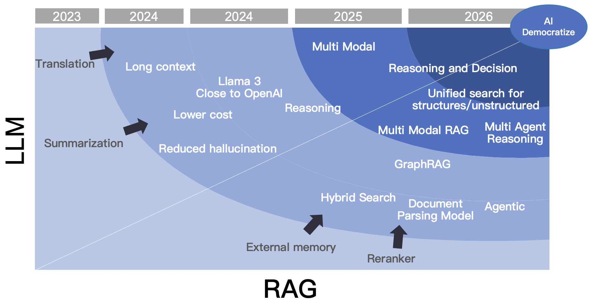

As 2024 comes to a close, the development of Retrieval-Augmented Generation (RAG) has been nothing short of turbulent. Let's take a comprehensive look back at the year's progress from various perspectives. <!--truncate-->

## Key events in RAG's evolution

### The Debate: "RAG is Dead, Long Live RAG!"

At the beginning of 2024, the year was dubbed "The Year of RAG" by some, though this wasn't a universally accepted label. However, the progress made throughout the year certainly justified this title. In scenarios involving Large Language Models (LLMs), RAG has consistently proven to be an indispensable role. Yet, since its inception, debates about RAG have never ceased. As seen in the graph above, the term "RAG" was not widely used in 2023; instead, temporary terms such as "external memory" or "external knowledge base" were more prevalent. The main debate at that time centered around whether to use temporary external solutions or permanent fine-tuning. By early 2024, this debate had mostly settled: RAG offered a clear advantage in terms of cost and real-time performance, with only minor differences in effectiveness compared to fine-tuning. Even in scenarios requiring fine-tuning, RAG often remained essential. 

### The Impact of Open Source LLMs on Industry

In the first half of 2024, one of the most significant impacts on industry was the gradual convergence of open-source LLMs with commercial LLMs led by OpenAI. This meant that capabilities such as summarization and instruction following had significantly improved compared to 2023. This progress enabled widespread adoption of basic RAG applications such as question answering, customer service, and knowledge bases. Another notable advancement in LLMs during this period was long context windows—a feature that sparked controversy throughout the first half of the year but gradually subsided by mid-year. Similar to previous debates, it was concluded that both long context windows and traditional methods had their strengths and were best used together. 

| Long-context                                                 | RAG                                                          |
| ------------------------------------------------------------ | ------------------------------------------------------------ |
| 👎Accuracy decreases as the context length increases.          |                                                              |
| 👎The longer the context window, the more likely it is to miss distant "needles". |                                                              |
|👎Introduces noises if the retrieved content is semantically similar but irrelevant to the answer. |                                                              |
| 👎LLM is "indefinite" by nature.                               |                                                              |
| 👎Difficult to consolidate the enterprise data with long context alone. |                                                              |
| 👎Long context significantly increases both the cost of reasoning and delay. |                                                              |
|                                                              | 👎Not smart enough: capable only of searching, unable to reason or make decisions. |

Additionally, the maturation of architectures like LLMOps enabled businesses and individuals to quickly set up their own custom systems using components such as vector databases, embedding/reranking models, LLM itself, chunking tools, and prompt management techniques connected via arrows indicating data flow ensuring system usability. 

However, applying it in broader scenarios and enterprises, and aligning its development with advancements in LLMs, still faces significant technical challenges. References [29] and [30] outline traditional academic approaches to these challenges. While some principles and practices are widely accepted, a practical analysis reveals that RAG primarily faces three main issues:

1. Ineffective question answering for unstructured multimodal documents: Existing LLMOps solutions are confined to text-only scenarios. Documents such as PDFs, PowerPoint presentations (PPTs), or those integrating text with images cannot unlock their full commercial potential. These types of documents often constitute the majority within enterprise data.

2. Low recall and hit rates due to pure vector databases: Relying solely on vector databases leads to low recall and hit rates, hindering effective real-world question answering. This is due to vector representations' inability to precisely represent exact information and the semantic loss during retrieval.

3. The fundamental challenge of search: At its core, RAG relies on search capabilities. It works only if it can "search" for the answer based on a user's query. However, this prerequisite often fails with vague or ambiguous queries lacking clear intent or 'multi-hop' questions requiring synthesis from multiple sub-questions. In such scenarios, there is a significant semantic gap between the question posed and the answer retrieved, making traditional search methods ineffective.

Therefore, the following landmark events revolve around the technical challenges of RAG:

- The rise of multimodal document parsing tools.
- The emergence of BM25 and hybrid search, rendering pure vector databases unnecessary as a separate category.

On April 1, 2024, we open-sourced the complete RAG engine, RAGFlow, which has since garnered over 26,000 stars on GitHub by the end of the year. The initial two design highlights of RAGFlow have become universal design principles for RAG architecture:

First, while naive RAG systems only provided text-based chunking tools, RAGFlow introduced a semantic chunking step for unstructured data to ensure the input data quality. This involves using specially trained models to parse document layouts, avoiding the interference caused by simple text chunking tools on different data layouts. As the open-source community increasingly uses these models to parse various documents, this approach has gained widespread acceptance.

Second, from the outset, we firmly adopted enterprise-level search engines to provide hybrid search as the sole back-end database. By leveraging full-text search with BM25 capabilities, we ensured precise query performance. Although BM25 is nearly thirty years old, RAG has revitalized this classic technology. This year, many vector databases began offering BM25; notably, the well-known vector database Qdrant even proposed an improved version called BM42, which later turned out to be a mistake. Despite many databases claiming to support BM25, very few truly meet RAG's basic requirements. However, the rise of BM25 is undeniable; pure vector databases no longer need to exist as a separate category, as the concept of hybrid search has gained widespread acceptance.

RAGFlow can be considered one of the key drivers behind these two events.

### The Rise of GraphRAG

Microsoft's mid-year open-sourcing of GraphRAG was a groundbreaking event. As a library rather than an end-to-end solution, GraphRAG's rapid rise in popularity underscores its ability to tackle key issues with Retrieval-Augmented Generation (RAG), particularly the semantic gap. This issue has long been a challenge for search system developers, as queries and answers often fail to align perfectly. When search systems evolved into RAG models, this problem was amplified: while traditional search queries are defined by a few keywords, RAG queries are user questions. The shift from keywords to questions makes user intent even harder to discern, thereby exacerbating this semantic gap. GraphRAG is one design aimed at bridging this gap.

### The Emergence of Latency Interaction Models Like Col-xxx 

### Multimodal RAG built on VLM and late Interaction Models

Both of these major events involve upgrades to ranking models and require native tensor support at the database level. For the first event, adopting a late interaction model effectively provides capabilities similar to reranking models at the database level. For the second event, this approach unlocks greater commercial value for more complex documents (such as magazines and pie charts) within enterprises. Based on this observation, we fully implemented these capabilities in [Infinity](https://github.com/infiniflow/infinity), our database designed specifically for RAG open-sourced earlier this year. Although these features have not yet been applied to RAGFlow, their impact is already beginning to spread from the forefront to the wider industry.

The following is a summary of the technological developments in RAG throughout 2024 from both industrial and academic perspectives. RAG has been a hot topic in this year's research. Since the beginning of the year, the frequency of preprints on the topic of RAG has reached over ten papers per week, with some weeks seeing as many as several dozen. These papers primarily focus on experiments related to the applications, tuning, and evaluation of RAG, leading to various conclusions. This article is not intended as a comprehensive academic survey of RAG; there are already many such works [Reference 27] [Reference 28], including the recent summary of RAG 72 by Ant Group [Reference 38]. This article takes a perspective that combines industry and academia, summarizing the year’s representative work based on practical applications. Many of these contributions are not strictly covered by papers focused on RAG. We believe that RAG is not merely a simple application; rather, it is a complex system centered around search, integrating various data types, foundational components, and a range of large and small models working in synergy. Each subproblem has corresponding work, so it is essential to review not only RAG itself but also to maintain a broader perspective.

## Data Cleaning

Ensuring data quality (Quality In) is essential for achieving quality results (Quality Out), and this is a natural concept. For multimodal unstructured documents, employing visual models to parse document layouts ensures high-quality data input. This issue has long been recognized in academia and is widely referred to as Document Intelligence. However, previous approaches to Document Intelligence have not been closely linked to RAG and often involve multiple sub-tasks that lack cohesive integration. For instance, table processing has a dedicated task known as Table Structure Recognition (TSR), and similar specialized models exist for other types of images, such as formulas, flowcharts, and pie charts. By unifying these models into a document layout recognition framework, we establish the first step in using models for data cleaning to support RAG.

The task of document structure recognition models is to identify the coordinates of different semantic areas within unstructured documents. Such models are already implemented in some OCR systems; for example, the well-known PaddleOCR [Reference 1] includes capabilities for document structure recognition. Consequently, the various tasks mentioned earlier, including table processing, are often referred to as broad OCR and can be seen as an entry point for RAG.

RAGFlow's DeepDoc module is one of the earliest systems to fully implement these capabilities, which contributed significantly to its rapid growth upon open sourcing. Currently, there are several similar systems, such as MinerU [Reference 2] and Docling [Reference 3]. Applying document intelligence to RAG represents a vast area of development, leading to accelerated iterations in this field.

Methodologically, document intelligence models can be divided into two generations:

First Generation: This includes past similar works and current mainstream open-source projects, such as the RAGFlow DeepDoc module. These efforts are built on traditional visual models. While they can run on CPUs, their generalization ability across different scenarios is limited. Because they require separate training for different contexts and data, this technology has been colloquially termed "emboidering".

Second Generation: Current OCR technologies are evolving towards generative AI architectures. Early examples include Meta's Nougat [Reference 4], along with the latest OCR 2.0 [Reference 5], employ a unified Transformer-based Encoder-Decoder architecture to generate text results from image recognition. These developments share many similarities with the multi-modal VLMs mentioned later. For instance, StructEqTable [Reference 6] directly applies similar network structures to table reconstruction. The enterprise version of RAGFlow also uses this architecture for document processing. Although generative AI model inference cannot run on CPUs, their generalization ability across various scenarios has significantly improved compared to traditional visual models. Another advantage of using multimodal models for document intelligence is the ability to incorporate textual information into document layouts. A representative work this year, M2Doc [Reference 23], integrates BERT into a vision-based Encoder-Decoder architecture, enhancing the identification of semantic boundaries for text and paragraphs.

In the upcoming year of 2025, research based on Encoder-Decoder architectures is expected to advance further. We can anticipate the potential development of a unified multi-modal document parsing model capable of accurately converting various unstructured documents into text content.

The above content can be seen as data cleaning for multimodal unstructured document data. But for pure text documents, is it sufficient to rely solely on naive text chunking? The answer is no. If text chunk only contains textual information, the main issue during retrieval shifts from content confusion to a semantic gap. We will discuss this in detail in a later section. Here, we introduce some patch work at the chunking level:

This year, Jina launched "Late Chunking" [Reference 24], which targets text data by placing the text chunking step after embedding. In other words, it first uses an embedding model to encode the entire document and then outputs the chunk boundaries just before the final mean pooling step of the embedding model—hence the term "late." Compared to traditional text chunking methods, Late Chunking better preserves contextual information. However, it requires that the final output of the embedding model be mean pooling, while most embedding models use CLS pooling, making direct compatibility challenging.

In 2024, the industry also introduced dsRAG [Reference 25] for text data. Its main contribution is providing automatic context by using large models to add contextual information to each text chunk, addressing the issue of difficult retrieval from raw text. For example, if a text includes a treatment plan without a description of the disease, retrieval may fail to locate relevant content. Another feature of dsRAG is clustering text chunks into longer passages; although evaluation scores are good, this may not be effective in practice.

LLM provider Anthropic Claude also launched "Contextual Retrieval" [Reference 26] in September, which includes an important component called Contextual Chunking. As the name suggests, this involves introducing specific contextual explanations for each text chunk, generated by LLMs. Thus, Contextual Retrieval has similar effects to dsRAG.

In October, Renmin University and the Shanghai Institute of Algorithm Innovation introduced "Meta-Chunking," [Reference 45] aiming to identify boundaries of sentence collections within paragraphs that have logical connections. This approach uses LLMs for classification to determine whether sentences belong to the same chunk. However, unlike previous methods, it does not address the semantic gap issue despite also employing LLMs.

Around the same time, the Shanghai Artificial Intelligence Laboratory and Beihang University jointly launched "Multi-granular Hybrid Chunking." [Reference 46] This method splits each document into smaller chunks, typically consisting of one or two sentences. These chunks are treated as nodes in a graph; during retrieval, the model predicts the required chunk granularity based on queries and determines how deeply to traverse the graph according to this granularity—deeper traversal results in larger final chunks. While complex to implement, this method does not alleviate semantic gap issues; it merely dynamically decides the context length returned by large models to avoid redundancy, making its practical value less significant than that of previous approaches.

It is evident that there is limited work that can be done based on text chunking. This year's valuable contributions focus on providing more contextual information for chunks, which proves more practical; such context provided by LLM is more reliable. By using LLMs to interpret chunk content and adding supplementary information like labels, we can partially address issues related to semantic gaps that prevent chunks from being recalled. In this year's version of RAGFlow, we have also added a step for LLMs to extract information from text chunks to improve recall performance.

Whether for multimodal or textual data, the results of chunking significantly impact final outcomes. In 2025, we can expect more high-quality work in this area that will ultimately resolve issues related to data entry quality.

## Hybrid Search

In April 2024, a technical report titled "BlendedRAG" from IBM Research [Reference 7] demonstrated through experiments that employing multiple recall methods can yield better results for RAG. Specifically, combining vector search, sparse vector search, and full-text search achieves optimal recall. This is easy to understand, as vectors can represent semantics; a sentence or even an entire article can be encapsulated in a single vector. Essentially, the vector conveys the "meaning" of the text, representing the compressed probability of its co-occurrence with other texts within a contextual window. Consequently, vectors cannot precisely represent queries. For instance, if a user asks, "What combinations are included in our company's financial plan for March 2024?" the results might return data from other time periods or unrelated topics such as operational plans or marketing management. In contrast, full-text search and sparse vectors primarily express precise semantics. Thus, combining these two approaches meets our everyday need for both semantic understanding and precision.

In the RAG framework, hybrid search is typically handled by dedicated databases. While there are many databases offering various hybrid search capabilities, truly suitable options are rare because implementing a robust full-text search is challenging:

Sparse vectors struggle to replicate full-text search: Sparse vectors aim to replace full-text search by using standard pre-trained models to eliminate redundant words and add expansion terms, resulting in fixed-dimensional sparse vector outputs (e.g., 30,000 or 100,000 dimensions). This approach performs well on general query tasks; however, many user query keywords may not be present in the pre-trained models used to generate sparse vectors—such as specific machine models, manuals, and specialised terminology. Therefore, while both sparse vectors and full-text search serve precise recall purposes, they each have their strengths and cannot replace one another.

Full-text search involves more than just BM25 calculations: It also needs to consider phrase queries and associated performance issues. RAGFlow was one of the first RAG solutions to offer hybrid search, initially employing Elasticsearch as its sole backend document search engine. In RAGFlow, user queries are not simply sent directly to Elasticsearch; they first undergo query analysis, which includes:

1. Remove stopwords and other meaningless tokens after tokenization.
2. Generate term weights for each token.
3. Generate phrase queries according to bigram results after step 2. These phrase queries are also sent to the search engine together with results after step 2.

For example, for the question "What results did Tom deliver?", we might get the following query:

(results^0.0667) (tom^0.0667) (deliver^0.0667) "results tom"^0.1335 "tom deliver"^0.1335

This query is quite complex, but it demonstrates how a question-and-answer format can be transformed into a query containing numerous phrases. Without stored positional information in the inverted index, such query capabilities cannot be provided.

On the other hand, to ensure recall, full-text search defaults to using an "OR" relationship between keywords rather than "AND," which poses significant challenges to query performance. Therefore, a competent full-text search must also offer dynamic pruning techniques compatible with various queries, including phrase queries. As a result, few full-text search options meet these requirements. In addition to the widely used Elasticsearch, our open-source RAG database, Infinity, fully supports these capabilities.

The following figure shows the results of evaluations using Infinity on a public benchmark dataset, comparing single-recall methods (vector, sparse vector, full-text search), two-way recall, and three-way recall. The vertical axis represents sorting quality, and it is evident that three-way recall achieves the best results, fully validating the findings of BlendedRAG. The far-right part of the graph displays results from combining three-way recall with tensor-based re-ranking, which we will discuss further in the following sections.

In June 2024, OpenAI acquired the database startup Rockset. Following the release of GPT-4 Turbo at the end of 2023, the well-known vector database Qdrant also came into focus, but just a few months later, Rockset was acquired. One important consideration behind this acquisition is that Rockset is one of the few viable alternatives to Elasticsearch, which is closely related to its cloud-native architecture. Therefore, as a data infrastructure component, Rockset's integration with OpenAI can conveniently provide various users with RAG-based SaaS services.

### Ranking models

Ranking is the core of any search system. In the context of RAG, ranking involves two components: one is the part used for coarse filtering, which is the embedding model for vector search; the other is the reranker model used in the fine-tuning stage. The training of reranker models often shares much of the work with embedding models. The embedding model typically employs an encoder architecture, with the training objective of bringing semantically similar texts closer together in vector space. In contrast, the reranker uses a cross-encoder architecture, aiming to predict the score between a query and a document.

As shown in the diagram, the left side illustrates how the embedding model works: it encodes both the query and the document separately, then outputs a vector after pooling, requiring only vector similarity calculations during the ranking phase. However, because it loses interaction information between tokens in the query and document, much semantic information is lost, which is why vector search is commonly used for coarse filtering. The cross-encoder as a reranker can have an encoder network identical to that of the embedding model, but by inputting both the query and document together, it outputs a single score. This allows it to capture relationships between tokens, significantly improving ranking quality.

However, cross-encoders also have their drawbacks: for encoders, document embeddings can be completed during the offline indexing phase, allowing for quick retrieval by encoding only the query during online queries. In contrast, cross-encoders require cross-encoding and model output for each query-document pair, which incurs high computational costs. Therefore, they are suitable only for re-ranking, and there cannot be too many coarse filtering results; otherwise, it will significantly increase query latency.

When evaluating embedding models and reranker models, the MTEB leaderboard is often referenced. In the first half of 2024, the reranking leaderboard was primarily dominated by various cross-encoders, while in the second half, it was increasingly occupied by reranking models based on large language models (LLMs). For instance, the current top-ranking model, gte-Qwen2-7B [Reference 31], is fine-tuned from the Qwen2 7B base model. This approach no longer uses a traditional encoder architecture but instead employs a standard LLM decoder architecture, resulting in a larger parameter count and higher reasoning costs.

Considering both ranking effectiveness and cost, a reranking solution known as the late interaction model has gained attention; this involves tensor-based reranking, as illustrated in the diagram below.

The specific approach is as follows: during the indexing phase, embeddings generated by the encoder for each token are stored. Thus, a document can be represented by a tensor (or multiple vectors). During querying, embeddings for each token in the query are generated, and the pairwise similarity between all tokens in the query and the text chunks is calculated. The final document score is obtained by summing these similarities. This reranking method also captures the interaction information between tokens, allowing it to theoretically achieve performance comparable to that of a cross-encoder.

On the other hand, because complex model reference is not involved during querying, the cost is significantly lower than that of cross-encoders or LLM-based rerankers. This can even enable ranking to be performed within the database itself. The benefits include the ability to rerank more results, which increases the likelihood of compensating for previous recall shortcomings, even if the initial filtering results are not ideal. The following figure compares the evaluation results of applying tensor reranking based on single-recall, dual-recall, and triple-recall using the Infinity database.

Tensor-based reranking originated from early works such as ColBERT [Reference 32] and its improved version, ColBERT v2 [Reference 33], in 2020. However, it only gained significant attention in the industry in early 2024. At that time, due to a lack of necessary database support, it relied on Python algorithm wrappers like RAGatouille [Reference 34] to provide services. Vespa was one of the first database systems to engineer tensor capabilities, and we integrated tensor-based reranking into the Infinity database by mid-year.

Currently, tensor-based reranking systems are not widely used in the industry; this is partly due to insufficient infrastructure components and a lack of supporting models. However, since the summer of 2024, there has been a noticeable acceleration in this area. For instance, JaColBERT [Reference 36] for Japanese and Jina's Jina-colbert-v2 [Reference 37] multilingual model both offer capabilities for generating tensors from text data. We will also mention later that these models significantly promote multimodal RAG. It is anticipated that with more models becoming available, tensor-based reranking will see widespread application in 2025.

### Semantic Gap

In the first half of 2024, Microsoft published a paper on GraphRAG [Reference 8] and officially open-sourced it mid-year, quickly garnering over ten thousand stars on GitHub. What accounts for GraphRAG's popularity? This relates closely to the third pain point of RAG that we previously mentioned: the semantic gap.

There are many approaches to addressing the semantic gap. In addition to improvements at the chunking stage, more can be done during the preprocessing phase. A well-known and practical solution is RAPTOR [Reference 9]. RAPTOR first pre-clusters the text content and then uses a large language model (LLM) to generate summaries of the clustered texts. These summaries, along with the original text, are sent to the search system. Since these summaries provide a more macro-level understanding of the text, they can yield appropriate answers for vague inquiries and multi-hop questions that require crossing chunks. RAPTOR was integrated into RAGFlow mid-year to assist in answering complex questions.

By the end of 2024, SiReRAG [Reference 17] emerged based on RAPTOR, offering a finer-grained definition of text recall: it measures different dimensions of needs using similarity and relevance. Similarity calculates the semantic distance between text chunks using vectors or full-text search methods, which is what RAPTOR itself does (shown on the left side of the diagram). Relevance indicates a relationship between text chunks; it first extracts named entities from each chunk using an LLM and then builds a hierarchical tree structure based on the relationships between these entities and their corresponding chunks (shown on the right side of the diagram). Thus, during recall, multiple text granularities can provide mixed recall, including entities, entity groups, and original texts, further enhancing macro-level understanding of the data and improving recall for vague intents and multi-hop query scenarios.

SiReRAG is quite similar to GraphRAG, with the main difference lying in how the extracted entities are further processed and organised. Let's take a closer look at GraphRAG itself: it uses large models to automatically extract named entities from documents and builds knowledge graphs based on these entities. Within the graph, it also uses clustering to create "communities" of entities and employs LLMs to generate summaries for these communities. During recall, the entities, edges, and community summaries from the knowledge graph are combined with the original documents for mixed recall. This data forms cross-chunk associations within the document, leading to better results for macro-level inquiries and multi-hop questions. GraphRAG can be seen as an effective strategy and architecture for addressing the semantic gap.

The term "architecture" is used here because it represents a paradigm for extracting knowledge graphs using LLMs to assist in complex question answering. In addition to Microsoft, many other companies have proposed their own GraphRAG solutions, such as Ant Group's KAG [Reference 10] and Nebula's GraphRAG [Reference 11], each with its own focus. For instance, KAG emphasises the completeness and interpretability of knowledge graphs, requiring a blend of manual maintenance and expert knowledge elements to achieve domain-specific expertise. Meanwhile, Nebula GraphRAG highlights deep integration with well-known LLM frameworks like LangChain and Llama Index, incorporating them into the Nebula Graph database.

A significant pain point in the GraphRAG architecture is the substantial token consumption. Consequently, several variants have emerged since GraphRAG, including Fast GraphRAG [Reference 12], LightRAG [Reference 13], and Microsoft's upcoming LazyGraphRAG [Reference 14]. Fast GraphRAG also uses LLMs to extract entities and relationships, similar to Microsoft's approach but omitting the generation of "communities" and their summaries, thereby reducing the frequency of LLM requests. During retrieval, Fast GraphRAG finds the nearest entity in the knowledge graph based on the query and then employs personalised PageRank to randomly walk through the graph to obtain subgraphs, which are then used to generate final answers.

PageRank is an effective strategy worth mentioning alongside another influential 2024 paper on knowledge graphs—HippoRAG [Reference 15]. This paper discusses hippocampal indexing theory and a personalised PageRank-based random walk strategy that closely resembles how the human brain thinks based on memory. Thus, after constructing a knowledge graph, querying it using personalised PageRank can simulate human recall and thought processes related to long text information. Both Fast GraphRAG and HippoRAG can be illustrated using the diagram below. Additionally, we have incorporated elements of graph neural networks (GNNs) because there has been a growing number of works in 2024 aimed at improving knowledge graph question answering using GNNs [Reference 18] [Reference 19]. Interested readers can refer to relevant literature for further information. Since GNN work often requires additional training with user data—such as leveraging existing Q&A data to enhance graph embedding representations of named entities—these efforts involve high customisation costs and fall outside the primary scope of this discussion.

LightRAG is a simplified version of GraphRAG, removing the community structure to make it more lightweight. Microsoft's LazyGraphRAG, proposed towards the end of 2024, takes this simplification further by eliminating the reliance on LLMs for extracting knowledge graphs. Instead, it uses smaller local models to extract nouns and builds community structures based on co-occurrence. Community summaries are only processed dynamically during queries.
Another approach to reducing the costs associated with GraphRAG comes from the models themselves. Since LLM extraction is expensive, fine-tuning a smaller, specialised model can significantly lower costs. Triplex [Reference 16] is an example of this, utilising the 3B Phi-3 model for knowledge graph extraction.
From the above, it is clear that the GraphRAG architecture effectively uses LLMs to supplement original documents with sufficient information, organised in an easily connectable graph format. During searches, this adds auxiliary recall capabilities based on various entities alongside text similarity. Therefore, the value of the knowledge graph in GraphRAG lies not in direct human viewing but in providing additional context and evidence for complex and ambiguous questions.
Although knowledge graphs have been around for a long time, their applications have primarily involved a significant amount of explainable work, such as data navigation, requiring human and domain expert intervention. This is not the comfort zone for GraphRAG's application. Even named entities and relationships extracted by LLMs still contain considerable noise. Given the limitations of LLMs in knowledge graph extraction, subsequent work surrounding GraphRAG focuses not only on cost reduction but also on how to organise entities into more effective structures. By the end of the year, two notable works emerged: KG-Retriever [Reference 20] and Mixture-of-PageRanks [Reference 21]. The former combines knowledge graphs with original data to create a multi-level graph index structure for retrieval at varying granularities; the latter introduces time-based relevance information based on personalised PageRank. We can expect further developments in this area in 2025, though they will not change the fundamental nature of GraphRAG-type work.

Finally, let's consider the engineering implementation of GraphRAG. Using a graph database for GraphRAG is a natural choice; both KAG and Nebula Graph have adopted this technical route, as graph databases can better represent knowledge graphs. RAGFlow also integrated GraphRAG into its system end-to-end mid-year but did so without using a graph database, relying instead on a search engine. In terms of data modelling within GraphRAG, entities and edges in the knowledge graph are described textually, along with communities derived from clustering entities and their generated summaries. A typical data model for GraphRAG can be illustrated as shown below:

A fully functional full-text index should not only provide similarity score calculations but also keyword filtering capabilities. Therefore, by establishing a full-text index on the <source entity name, target entity name> fields in the aforementioned schema, it becomes easy to perform subgraph retrieval based on edges and entities. Furthermore, if the database can seamlessly integrate full-text indexing with vector indexing, it will enable very convenient hybrid searches for GraphRAG. All edges, entities, and community descriptions can be included in the full-text search scope, combined with vector indexing to provide dual mixed recall based on GraphRAG.

From the data schema, it is evident that by simply adding a type field, the original text chunks can be stored in the same table as other information, effectively combining GraphRAG with RAG into a HybridRAG [Reference 22]. Clearly, using a database with rich indexing capabilities can significantly reduce the engineering challenges of implementing GraphRAG. Even works that modify graph structures, such as KG-Retriever and Mixture-of-PageRanks, can be easily supported by adjusting index formats and enhancing specific search methods. This is one of our primary motivations for building a database specifically designed to serve RAG from the ground up.

### Agentic and Memory

Agentic is a popular term in the RAG industry for 2024, with many media outlets declaring it the year of the agent. Regardless of this designation, agents significantly influence the LLM ecosystem. This article is not a retrospective on agents, but it is clear that there is an inseparable relationship between agents and RAG: RAG itself is a crucial component for agents, enabling them to access internal data; conversely, agents can enhance RAG capabilities, leading to what is termed Agentic RAG, such as Self RAG [Reference 39] and Adaptive RAG.

This advanced form of RAG allows for adaptive changes in more complex scenarios in a controlled manner. To achieve Agentic RAG, the agent framework must possess "closed-loop" capabilities. In Andrew Ng's four design patterns for agents, this "closed-loop" ability is referred to as reflective capability. LangGraph [Reference 40] was one of the early frameworks to implement this feature, and RAGFlow introduced similar functionality mid-year.

In 2024, a key feature of agents is the widespread use of workflows. Regardless of how agents evolve, workflows remain essential for integrating with various systems and ensuring agents execute tasks in a controlled manner. However, the concept of agents extends beyond workflows; it also encompasses reasoning-related thinking and decision-making. In the second half of 2024, research in this area began to accelerate.

Integrating RAG with agents can unlock more application scenarios. For example, in the configuration shown in the diagram [Reference 41], the system includes multiple autonomous agents that can decompose complex question-and-answer tasks into sub-tasks, with each agent responsible for a specific function. This division of labour enhances the overall efficiency and accuracy of the system. In the diagram, the Detector Agent aims to identify queries that may contain erroneous assumptions and premises, which could affect the accuracy of LLM responses; the Thought Agent processes and analyses all retrieved information, synthesising data to draw conclusions and generate detailed reasoning results; and the Answer Agent uses outputs from the Thought Agent to produce final answers, ensuring that responses in multi-turn dialogues are influenced by the latest logic.

For example, RARE [Reference 42] enhances RAG by incorporating a Monte Carlo Tree Search (MCTS) framework, which strengthens reasoning capabilities through two steps: generating queries based on the initial question and querying the generated sub-questions. By implementing these steps, RARE can facilitate complex and common-sense reasoning in medical scenarios.

As this reasoning capability develops, the relationship between RAG and agents becomes increasingly intertwined, with more frequent interactions. Consequently, RAG needs to provide memory management functionalities beyond the document search previously mentioned. This memory information includes user dialogue sessions and personalised user data. Agents not only require RAG to perform internal data searches but also need real-time access to contextual information. The phenomenon of the open-source project Mem0 in 2024, which defined some memory management APIs, quickly garnered numerous GitHub stars. However, it is important to note that the current definition of memory management is relatively straightforward (primarily involving real-time filtering and searching), while the underlying infrastructure components are already quite mature. Therefore, the real challenge lies in integrating memory management with reasoning and unlocking more complex enterprise-level scenarios alongside the growth of LLM capabilities. Implementing these features on a standardised RAG engine is a logical choice that minimises costs and maximises usability, making it a significant trend for 2025.

At this point, many may wonder whether the future evolution will see RAG transforming into an agent platform or various agent platforms enhancing their RAG capabilities. This trend is difficult to predict. Just as in the digital age, one might question whether to focus on data warehousing while also addressing mid-platform business needs or to deepen business capabilities to improve data warehousing—both approaches have their precedents. In this era of LLM intelligence, there is an opportunity for a transformative reshaping of the software ecosystem; thus, RAG can effectively parallel the role of traditional databases, while agents have the potential to become standard products at the application layer due to reduced customisation requirements. Future developments will dynamically evolve under the dual support of technical depth and rapid product iteration, with tighter integration across various software ecosystems. For instance, towards the end of the year, LangGraph released an LLM-based agent interoperability protocol, enabling greater potential for ecological upstream and downstream relationships among different agents.

### Multimodal RAG

Multimodal RAG is another area we believe will experience rapid growth in 2025, as key related technologies emerge and start to be applied in 2024.

Firstly, the rise of Vision-Language Models (VLMs) has been notable. As shown in the diagram, VLMs, which previously focused primarily on simple image searches, have evolved rapidly by mid-2024.

This means that VLMs have achieved a deeper understanding of images, moving beyond merely recognising everyday objects to comprehensively analysing enterprise-level multimodal documents. For instance, the open-source 3B model PaliGemma [Reference 43] exemplifies this capability.

Returning to RAG itself, if we can use RAG to find images and text containing answers within a large number of PDFs based on user queries, we can then generate the final answer using VLMs. This is the significance of multimodal RAG; it goes beyond simple image searches for everyday items.

To achieve this, one approach, as previously mentioned, involves using models to convert multimodal documents into text before indexing for retrieval. Another approach, leveraging advancements in VLMs, directly generates vectors, bypassing the complex OCR process. A pioneering example of this is ColPali [Reference 44], which emerged in the summer of 2024. ColPali treats an image as 1024 image patches and generates embeddings for each patch, effectively representing a single image as a tensor.

The final reranking is conducted using tensors.

The entire retrieval process is illustrated in the diagram below. It requires a database that not only supports tensor-based re-ranking but also accommodates multi-vector indexing during the vector retrieval phase. These structures are already prepared in our Infinity database.

The diagram below shows a leaderboard for multimodal RAG retrieval, highlighting that tensor-based series of late interaction models have secured many leading positions.

Therefore, tensors are not only significant for text ranking but also have a wide range of applications in multimodal RAG. The question arises: should multimodal RAG directly generate embeddings, or should it use general OCR models to convert documents into text first? In the original ColPali paper, the authors recommend completely abandoning OCR, but they compare it to CNN-based OCR, which is the first-generation model mentioned earlier. Currently, the success of both approaches relies on advancements in multimodal models themselves. Thus, we believe these two routes will coexist for a long time. If we consider embeddings as a "general" solution, then OCR based on an encoder-decoder architecture can be viewed as a "specialised" solution, as specific types of data still require training particular Transformers for effective resolution. RAG always prioritises practical implementation, so in specific tasks during certain periods, specialised solutions may outperform general ones, but ultimately they will converge.

In 2025, we can expect rapid growth and evolution of multimodal RAG, and we will integrate these capabilities into RAGFlow at the appropriate time.

The above content summarizes the main development trends and future outlook for RAG in 2024. The title of this article mentions the "RAG industry," and from the summary provided, it is clear that RAG is a highly complex system. Although it hasn't attracted massive funding like LLMs, it is indispensable and intricate in real-world applications. We believe the term RAG is well-defined; it represents an architectural model rather than a single product or application scenario. In some respects, RAG resembles past databases—simple in external interfaces but complex internally. It encompasses not only the database itself but also various small models and the tools that connect them. Essentially, it represents the evolution of enterprise search engines in the era of large models while extending far beyond the scope of traditional search engines. In 2025, we will continue to evolve RAGFlow, and we invite everyone to stay tuned as we strive to become the best RAG product! https://github.com/infiniflow/ragflow

## Bibliography

1. PaddleOCR https://github.com/PaddlePaddle/PaddleOCR/
2. MinerU https://github.com/opendatalab/MinerU
3. Docling https://github.com/DS4SD/docling
4. Nougat https://github.com/facebookresearch/nougat
5. GOT-OCR https://github.com/Ucas-HaoranWei/GOT-OCR2.0
6. StructEqTable https://github.com/UniModal4Reasoning/StructEqTable-Deploy
7. Blended RAG: Improving RAG (Retriever-Augmented Generation) Accuracy with Semantic Search and Hybrid Query-Based Retrievers, https://arxiv.org/abs/2404.07220 , 2024
8. From local to global: A graph rag approach to query-focused summarization, https://arxiv.org/abs/2404.16130 2024
9. Recursive Abstractive Processing for Tree Organized Retrieval, https://arxiv.org/abs/2401.18059 2024
10. KAG https://github.com/OpenSPG/KAG
11. Nebula GraphRAG https://www.nebula-graph.io/posts/graph-RAG
12. Fast GraphRAG https://github.com/circlemind-ai/fast-graphrag
13. LightRAG https://github.com/HKUDS/LightRAG
14. LazyGraphRAG https://www.microsoft.com/en-us/research/blog/lazygraphrag-setting-a-new-standard-for-quality-and-cost/
15. HippoRAG https://arxiv.org/abs/2405.14831
16. Triplex https://huggingface.co/SciPhi/Triplex
17. SiReRAG: Indexing Similar and Related Information for Multihop Reasoning https://arxiv.org/abs/2412.06206
18. Graph Neural Network Enhanced Retrieval for Question Answering of LLMs https://arxiv.org/abs/2406.06572
19. A Survey of Large Language Models for Graphs  SIGKDD 2024
20. KG-Retriever: Efficient Knowledge Indexing for Retrieval-Augmented Large Language Models https://arxiv.org/abs/2412.05547
21. Mixture-of-PageRanks: Replacing Long-Context with Real-Time, Sparse GraphRAG https://arxiv.org/abs/2412.06078
22. HybridRAG: Integrating Knowledge Graphs and Vector Retrieval Augmented Generation for Efficient Information Extraction, Proceedings of the 5th ACM International Conference on AI in Finance, 2024
23. M2Doc-A Multi-Modal Fusion Approach for Document Layout Analysis, AAAI 2024
24. Late Chunking: Contextual Chunk Embeddings Using Long-Context Embedding Models https://arxiv.org/abs/2409.04701
25. dsRAG https://github.com/D-Star-AI/dsRAG/
26. Contextual Retrieval https://www.anthropic.com/news/contextual-retrieval
27. A Comprehensive Survey of Retrieval-Augmented Generation (RAG: Evolution, Current Landscape and Future Directions https://arxiv.org/abs/2410.12837
28. Retrieval-Augmented Generation for Natural Language Processing: A Survey https://arxiv.org/abs/2407.13193
29. 12 RAG Pain Points and Proposed Solutions https://towardsdatascience.com/12-rag-pain-points-and-proposed-solutions-43709939a28c
30. Searching for Best Practices in Retrieval-Augmented Generation https://arxiv.org/abs/2407.01219
31. https://huggingface.co/Alibaba-NLP/gte-Qwen2-7B-instruct
32. Colbert: Efficient and effective passage search via contextualized late interaction over bert, SIGIR 2020
33. Colbertv2: Effective and efficient retrieval via lightweight late interaction, arXiv:2112.01488, 2021.
34. RAGatouille https://github.com/AnswerDotAI/RAGatouille
35. Vespa https://github.com/vespa-engine/vespa
36. JaColBERT https://huggingface.co/answerdotai/JaColBERTv2.5
37. Jina ColBERT v2 https://huggingface.co/jinaai/jina-colbert-v2
38. Awesome-RAG 2024:  https://github.com/awesome-rag/awesome-rag 
39. Self RAG https://arxiv.org/abs/2310.11511
40. LangGraph https://github.com/langchain-ai/langgraph/
41. TCAF: a Multi-Agent Approach of Thought Chain for Retrieval Augmented Generation, SIGKDD 2024
42. RARE-Retrieval-Augmented Reasoning Enhancement for Large Language Models https://arxiv.org/abs/2412.02830
43. PaliGemma https://huggingface.co/spaces/big-vision/paligemma-hf
44. ColPali: Efficient Document Retrieval with Vision Language Models, https://arxiv.org/abs/2407.01449
45. Meta-Chunking: Learning Efficient Text Segmentation via Logical Perception https://arxiv.org/abs/2410.12788
46. Mix-of-Granularity-Optimize the Chunking Granularity for Retrieval-Augmented Generation https://arxiv.org/abs/2406.00456
