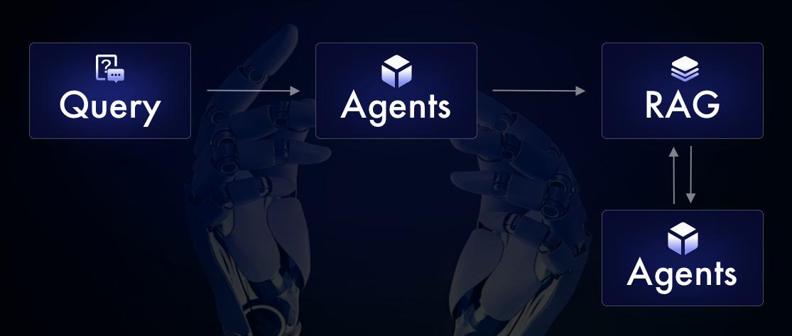
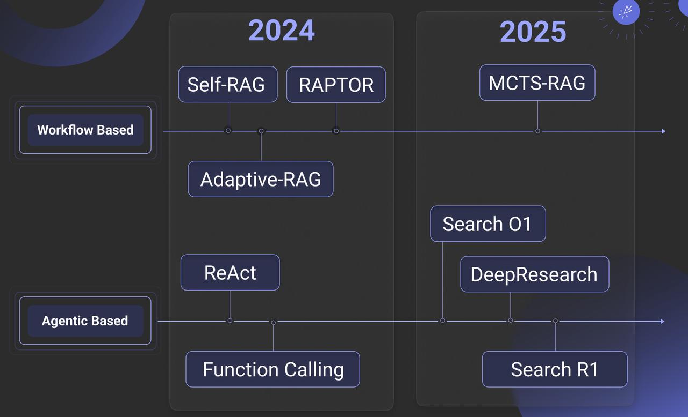
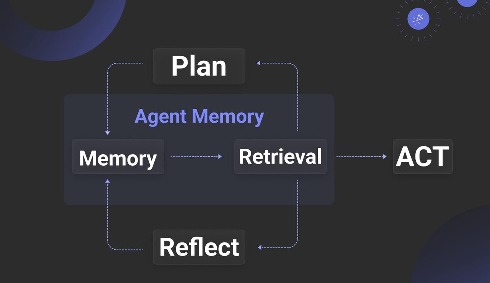
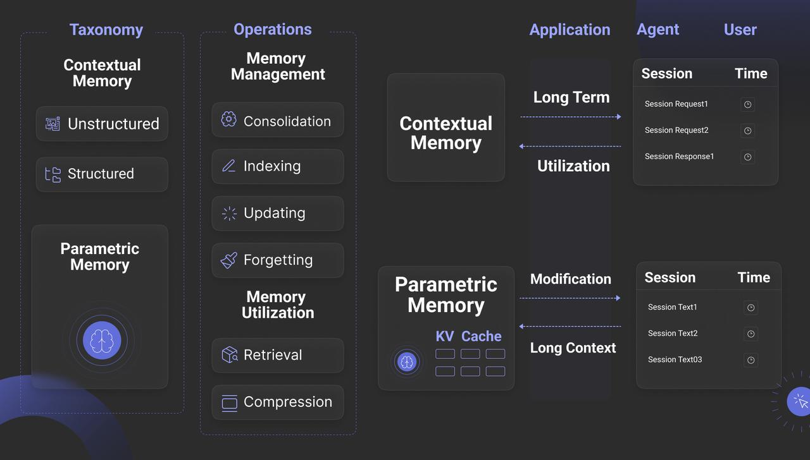
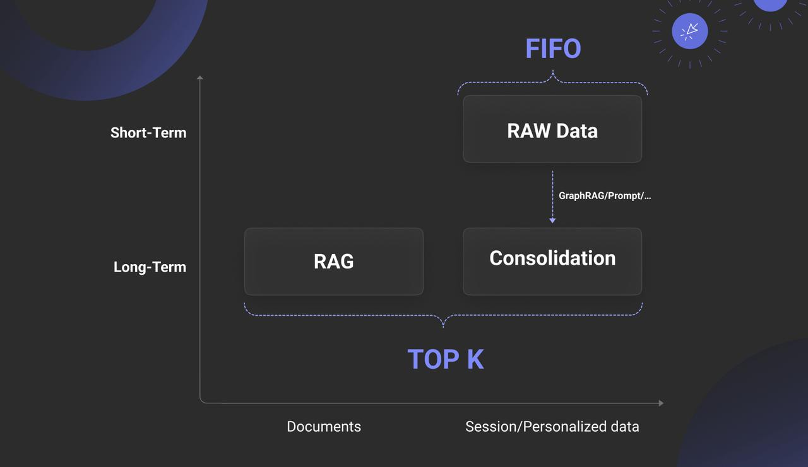
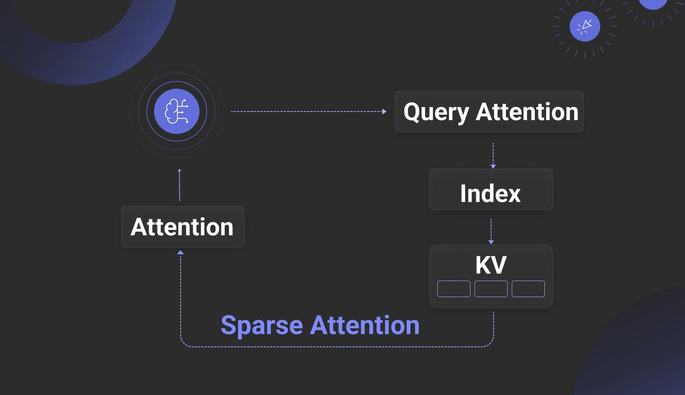
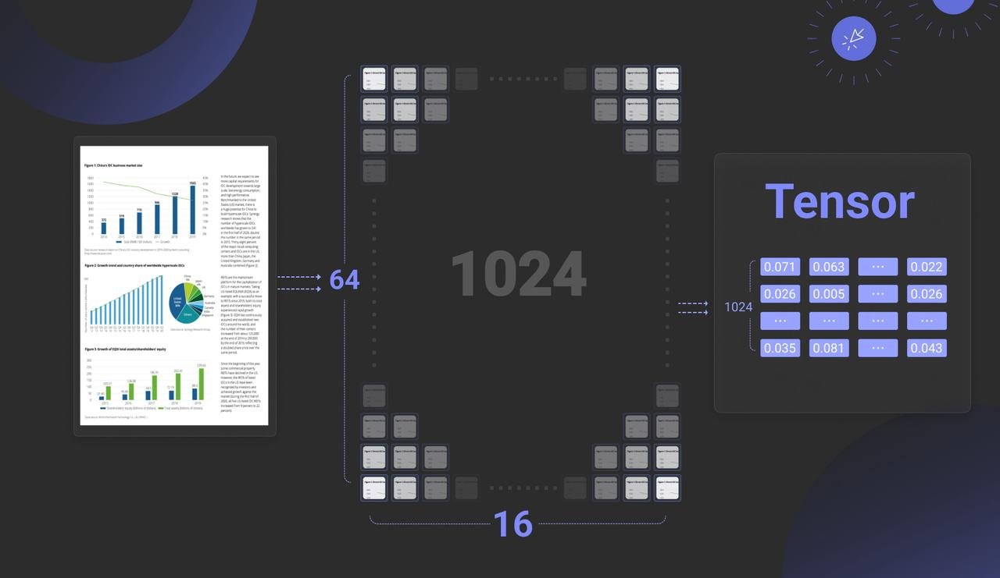

Six months have passed since our last year-end review. As the initial wave of excitement sparked by DeepSeek earlier this year begins to wane, AI seems to have entered a phase of stagnation. This pattern is evident in Retrieval-Augmented Generation (RAG) as well: although academic papers on RAG continue to be plentiful, significant breakthroughs have been few and far between in recent months. Likewise, recent iterations of RAGFlow have focused on incremental improvements rather than major feature releases. Is this the start of future leaps forward, or the beginning of a period of steady, incremental growth? A mid-year assessment is therefore both timely and necessary.<!--truncate-->

Since it began, RAG has been the focus of ongoing debate — from the 2023 “fine-tuning debates” to the 2024 “long-context disputes.” However, since 2025, discourse around RAG has diminished as attention has shifted towards Agent systems. This shift has given rise to claims that “Agents eliminate the need for RAG.” As practitioners in the field, we recognize such assertions as a market-driven stunt, though we also acknowledge their potential to mislead non-specialists. Some have even begun rebranding RAG as “Agentic RAG,” accompanied by exaggerated market forecasts predicting its dominance over conventional RAG [Ref 1]. It is this growing confusion that prompts our review.

Notably, the earliest references to “Agentic RAG” appeared around the time RAGFlow launched its “Agent” feature a year ago. As a result, RAGFlow is frequently cited in academic literature as a benchmark for comparisons involving Agentic RAG. Our analysis therefore begins with an examination of both RAG and Agents.

Definitional Clarification: We define “Agent” as encompassing both Workflows and intelligent agents. In RAGFlow’s current version (v0.19), the year-old “Agent” label remains limited to Workflow functionality and does not yet possess full agentic capabilities. Unlike Anthropic’s proposal to separate these concepts [Ref 2], RAGFlow adheres to an integrated design philosophy, wherein Workflows and Agents are intrinsically unified.

## Reflection-Driven: The Key to Agents Empowering RAG Reasoning

*Through manual or model-driven reflective loops, Agents tackle RAG reasoning challenges and enable intelligent breakthroughs; the two are inseparable.*

Throughout our events from late 2024 to early 2025, we consistently highlighted three key features for RAG in 2025: reasoning, memory, and multimodality. The first two are inherently linked to Agents. In our initial blog this year, we offered a comprehensive overview of implementation of reasoning. A recent survey [Ref 3] further synthesizes reasoning and RAG, and we have adapted and condensed its framework as shown below:

It is evident that the author has incorporated last year’s work into their reasoning framework. Implementations such as Self-RAG, RAPTOR, and Adaptive-RAG in RAGFlow from a year ago are classified as “predefined reasoning” in the source material. We propose instead defining these as Workflow-Based Approaches. Accordingly, the “Agentic RAG” described in our earlier publications employs workflows—manually defined interactions between RAG and Agents—to implement reflection (a core Agent capability) via components like Iteration and Switch. This approach addresses reasoning challenges such as ambiguous intents and long-context comprehension.

By contrast, Agentic-Based Approaches use models to autonomously drive reflection. Examples include Search O1, various open-source DeepResearch implementations, and Search R1. These divide further into two categories:

- Prompt-Driven Reflection (above the arrow): relying on LLM prompting.
- Training-Dependent Reflection (typically reinforcement learning): learning domain-specific chains-of-thought (CoT) and reflection termination conditions.

A crucial clarification: Search R1-style methods are not inherently superior. Their primary role is to optimize CoTs and termination conditions for domain-specific data within general-purpose LLMs, yet they remain fundamentally reliant on prompt-based Agent frameworks.

## The Foundation of Memory: How RAG Supports the Agent’s Memory System

*RAG builds the agent’s long-term memory, enabling task state tracking and context acceleration through indexing, forgetting, and consolidation, while working with short-term memory to form a complete architecture.*

Agents, regardless of their implementation, do little beyond RAG itself. So how do they make the seemingly routine RAG more intelligent and less reliant on reasoning models? Their transformative power lies in turning LLMs from single-step “intuitive guesswork” into systems capable of iterative observation and reflection—much like human cognition. This fundamental synergy explains why RAG frameworks such as RAGFlow naturally progress towards full Agent integration (beyond workflows), a key feature of RAGFlow's upcoming release.

Often dubbed the "Year of the Agent," 2025 saw a dazzling range of Agent applications emerge. However, core Agent frameworks showed little advancement compared to 2024. The rise in Agent adoption is chiefly due to improved In-Context Learning (ICL) in Large Language Models (LLMs), followed by the maturing Tools ecosystem and buzzwords like multi-agent systems enabling new use cases. Thus, beyond inherent LLM improvements, the core Agent paradigm exhibits limited technological innovation. One notable area of progress is the development of so-called "Memory" mechanisms.

If OpenAI’s 2024 acquisition of Rockset aimed to enhance Retrieval-Augmented Generation (RAG), its 2025 investment in Supabase seeks to equip Agents with more accessible Tools and partly to offer memory management. From the Agent’s perspective, RAG and various Data Infrastructure solutions are functionally equivalent—simply Tools invoked within the Agent’s context. However, the intrinsic link between RAG and Memory distinguishes RAG from other Data Infrastructure components.

Memory gains significance only within the context of an Agent, prompting the question: what distinguishes Memory from RAG? [Ref. 4] offers a detailed summary, broadly dividing Memory into Contextual Memory and Parametric Memory—the latter typically relating to KV Cache and models, which we will address later. Generally, “Agent Memory” refers to Contextual Memory, which benefits the Agent in two key ways:

1. Storing Task Management Metadata: For example, in Agentic Reasoning, introducing determinism into Planning (such as incorporating human feedback) means the Plan is not solely dictated by the LLM. Instead, a mechanism is needed to store the plan’s state, transforming the Agent from stateless to stateful. Additionally, tracking task decomposition during reasoning requires a repository for task-related metadata.
2. Context Management: Beyond retaining context, Memory caches and accelerates LLM outputs and provides personalised data necessary for tailored responses.

From an interface perspective, the diagram shows that Memory must provide four key functions. While Updating is straightforward, the other three are explained below:

1. Indexing: Memory must offer advanced search capabilities beyond simple queries. For Context Management—the second key value of Agent Memory—real-time search is often essential. For example, session data stored in short-term memory may need to be searched by topic to enrich subsequent interactions.
2. Forgetting: This refers to intentional forgetting, mimicking human cognition. Forgetting helps maintain focus and, technically, smaller datasets often improve search precision.
3. Consolidation: Meaning “strengthening,” this simulates cognitive processes by summarising and annotating stored data. Technically, it aligns closely with GraphRAG in the RAG paradigm, where an LLM organizes Memory content into a knowledge graph to enhance recall by providing richer context.

The diagram below captures the true relationship between Memory and RAG, revealing that RAG is essentially part of long-term memory. Memory also includes short-term memory, which typically holds an Agent’s session-based interactions and personalized data, often in raw or unprocessed form. High-value data is then transferred via Consolidation as another part of long-term memory.

Therefore, Memory without strong RAG support is fundamentally unsustainable. Beyond this reliance, other aspects of Memory remain limited. Regarding Parametric Memory, though it may seem closer to the essence of “memory,” its core principle offers no inherent technical advantage: it is a computationally intensive method based on KV Cache and Attention operations, tightly integrated with the LLM’s inference engine, essentially a dense attention mechanism. In contrast, long-term memory built on RAG provides filtered, supplementary material for reasoning within an effectively infinite context—also an attention mechanism, but a sparse one. What would be the implications of implementing KV Cache with sparse attention? We will explore this question later.

## RAG 2025: Overcoming the Plateau of Technological Challenges

*Long-context reasoning depends on hierarchical indexing; multimodal data struggles with storage inflation; and slow infrastructure limits innovation.*

Having examined the relationship between RAG and Agents, let us now refocus on RAG itself. Although RAG-related papers continued to be published steadily in 2025, genuine innovation in concepts and systems was notably scarce. Has RAG technology reached a critical plateau? At its core, RAG relies on information retrieval (IR), a well-established field. Yet RAG presents new challenges beyond traditional IR, including query diversity and multimodal data.

Query diversity remains a perennial challenge in information retrieval (IR), bridging the semantic gap between queries and answers. Numerous methods address this, including notable 2024 works such as GraphRAG, Contextual Retrieval, RAPTOR, and RAGFlow’s approach using automated tag libraries informed by domain experts. These methods essentially employ forms of sparse attention: complex queries require longer contexts and the identification of relevant attention within them. For simple queries, effective solutions exist, relying on good chunking and efficient multi-path recall. However, truly effective implementations for complex queries remain elusive.

Consequently, some argue that if bridging the semantic gap depends largely on LLMs generating auxiliary data, why not inject knowledge directly into the LLM’s working memory, bypassing such workarounds? This idea originated with CAG [Ref. 5], which proposed using KV Cache to store all data converted into KV format by the LLM. Later efforts sought to reduce the heavy bandwidth and computational costs of dense attention by combining KV data with database techniques to achieve sparse attention. Examples include RetrievalAttention [Ref. 6], RetroInfer [Ref. 7], and AlayaDB [Ref. 8].
These solutions split KV Cache data between two regions: a portion remains in the traditional KV Cache, while the bulk is stored in vector indexes or databases. During generation—specifically the Decoder phase of LLM inference—the current query vector (Q) retrieves relevant value vectors (V) from the index or database. These V vectors are then loaded into the KV Cache to complete the final attention computation, as illustrated below.

While this technology shows promise in addressing current RAG challenges, it still faces significant hurdles. The main aim of such schemes is often to reduce LLM inference costs. Traditional inference, using Prefill/Decoder separation, relies on dense attention mechanisms that deliver high accuracy but at considerable cost and heavy GPU memory demands. In contrast, sparse attention schemes utilize CPU memory, disk storage, and Approximate Nearest Neighbour (ANN) vector search to lower costs.

These solutions require deep integration with the LLM inference engine, necessitating modifications to handle both text and vector data, which effectively limits their use to open-source models. Moreover, frequent vector retrievals during the Decoder phase demand co-located deployment of the retrieval system and inference engine to reduce network latency, restricting applicability mainly to private or on-premises setups.

Paradoxically, this integrated “Attention Engine” approach may not fully resolve core RAG issues, especially with lengthy documents. In long-context LLMs, overly verbose input can impair performance, causing key details to be overlooked or misinterpreted. For precise detail retrieval, traditional RAG methods still hold the edge.

Therefore, while we must keep a close eye on the “Attention Engine” approach, the practical focus remains on RAG outside the LLM, improving support for reasoning over long texts. Whether it’s an Attention Engine or a Search Engine, their strengths do not fully overlap—the former excels at rapid inference over smaller datasets, the latter at fast retrieval across vast data. They remain largely complementary, even as the scope of RAG continues to evolve and expand.

Currently, aside from methods like GraphRAG and RAPTOR that support cross-chunk reasoning, few solutions for retrieval and reasoning over very long texts demonstrate strong engineering viability. The main approaches can be summarized as follows:

1. No Chunking, Whole Document Retrieval: Skip chunking and recall entire documents based on brief queries, feeding them directly into the context. This works for a small number of documents but struggles at scale due to poor understanding of global document context, resulting in low recall relevance.
2. Hierarchical Indexing & In-Document Agentic RAG: Construct a tree-like index during ingestion reflecting document structure (e.g., sections, subsections). Recall happens at the document level, followed by structured traversal within the document using the hierarchical index to locate relevant chunks, enabling “Agentic RAG” within documents.
3. Overlapped Chunking & Multi-Granular Retrieval: Use chunking with significant overlap and build a multi-layered index (e.g., document, section, paragraph levels). This employs a combined retrieval strategy leveraging both coarse and fine granularities.
Though conceptually straightforward, each approach poses unique challenges. As a tool provider, RAGFlow plans to offer similar functionalities in due course.

Turning to the second aspect: multimodal data. In our year-end review, we highlighted Multimodal RAG (MM-RAG) as a key trend for 2025. Yet, by mid-year, this trend has failed to gain momentum. The primary obstacle remains the immaturity of the supporting infrastructure. As noted, late interaction models continue to dominate MM-RAG pipelines, meaning embedding models produce Tensors, or multi-vectors. For instance, a single image may be represented by 1,024 vectors, each comprising 128-dimensional floats, as illustrated below.

Several vector databases now claim to offer native Tensor support; however, comprehensive solutions for practical Tensor utilization remain scarce. This scarcity stems from the dramatic data expansion caused by Tensors, which can increase storage demands by up to two orders of magnitude. Consequently, beyond native Tensor support, holistic approaches are required to mitigate storage bloat. These include:

- Binary quantization at the database level: representing each vector dimension with a single bit, thereby reducing storage to approximately one thirty-second of the original size.
- Index support for quantised multi-vectors or Tensor indexes: ensuring vector indexes can efficiently manage these binary-quantised multi-vectors.
- Reranker compensation: to minimise precision loss from quantisation, binary vectors are de-quantised back into floats during the reranking phase to recalculate similarity scores, thus preserving accuracy.

At the model level, efforts are needed to reduce overhead from Tensor storage growth. This includes:

- Using Multi-Representation Learning (MRL) to lower the dimensionality of each vector, for example, cutting dimensions to 64 could halve storage but slightly reduce recall accuracy.
- Applying Token or Patch merging to reduce the number of vectors, such as shrinking from 1,024 patches to 128.

While some progress has been made in optimizing models for text ranking, much more work is needed to meet the demands of Multimodal RAG. As a result, widespread adoption of MM-RAG depends on the development of its supporting infrastructure.

## End

In summary, our analysis shows that core RAG technology saw little significant progress in 2025. Meanwhile, the interdependence between RAG and Agents has deepened considerably—whether as the foundation of Agent Memory or enabling DeepResearch capabilities. From an Agent’s perspective, RAG may be just one Tool among many, but by managing unstructured data and Memory, it stands as one of the most fundamental and critical Tools. It is fair to say that without robust RAG, practical enterprise deployment of Agents would be unfeasible. Consequently, RAG’s value as a distinct architectural layer is now more pronounced than ever. These insights will directly inform the flagship features of the next RAGFlow release.

As for the complex challenges in RAG’s evolution, let's leave it to time for solution. After all, RAG is fundamentally an architectural framework; its true potential will be realized through the co-evolution of Infrastructure and models.
Stay tuned and welcome to star RAGFlow: https://github.com/infiniflow/ragflow

## Bibligraphy

1. https://market.us/report/agentic-retrieval-augmented-generation-market/
2. https://www.anthropic.com/engineering/building-effective-agents
3. Reasoning RAG via System 1 or System 2: A Survey on Reasoning Agentic Retrieval-Augmented Generation for Industry Challenges https://arxiv.org/abs/2506.10408
4. Rethinking Memory in AI: Taxonomy, Operations, Topics and Future Directions https://arxiv.org/abs/2505.00675
5. Don't Do RAG: When Cache-Augmented Generation is All You Need for Knowledge Tasks https://arxiv.org/abs/2412.15605
6. RetrievalAttention: Accelerating Long-Context LLM Inference via Vector Retrieval https://arxiv.org/abs/2409.10516 
7. RetroInfer: A Vector-Storage Approach for Scalable Long-Context LLM Inference https://arxiv.org/abs/2505.02922
8. AlayaDB: The Data Foundation for Efficient and Effective Long-context LLM Inference https://arxiv.org/abs/2504.10326
