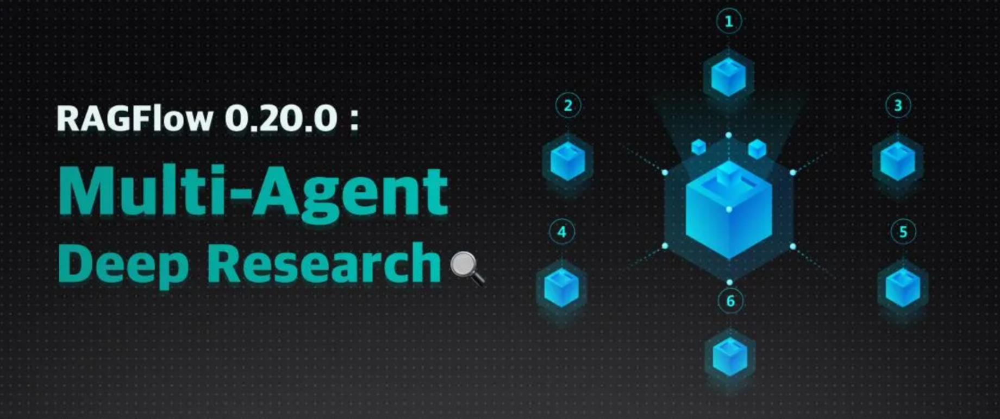
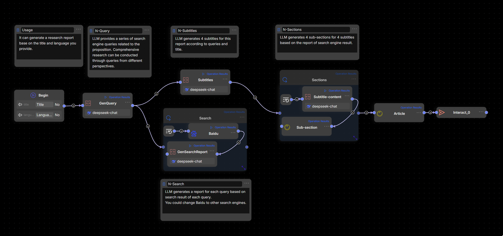
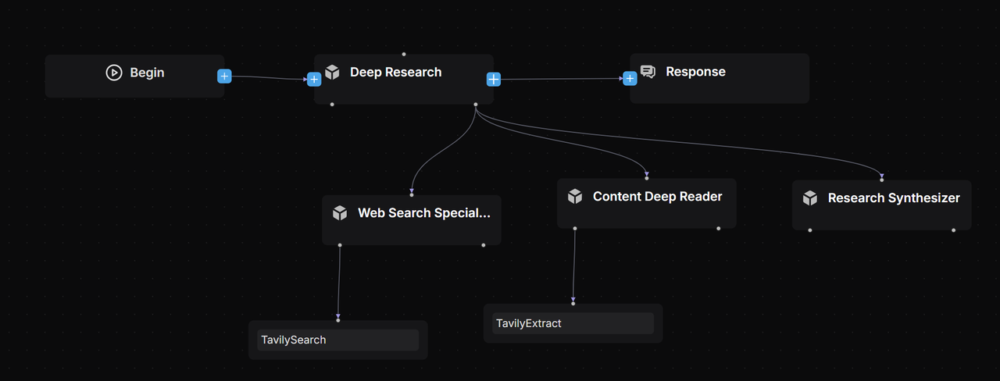
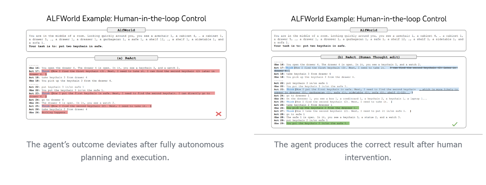

## Deep Research: The defining capability of the Agent era

The year 2025 is hailed as the dawn of Agent adoption. Among the many unlocked possibilities, Deep Research—and the applications built upon it—stands out as especially significant. Why is this?
Using Agentic RAG and its reflection mechanism, Deep Research enables large language models to reason deeply with users’ proprietary data. This is key for Agents to tackle more advanced tasks. For example, whether helping with creative writing or aiding decision-making in different industries, these rely on Deep Research.
Deep Research represents a natural step forward from RAG, improved by Agents. Unlike basic RAG, it explores data at a deeper level. Like RAG, it can work on its own or serve as the base for other industry-specific Agents.
A Deep Research workflow typically follows this sequence:

1. Decomposition & Planning: The large language model breaks down the user’s query and devises a plan.
2. Multi-Source Retrieval: The query is sent to multiple data sources, including internal RAG and external web searches.
3. Reflection & Refinement: The model reviews the retrieved information, reflects on it, summarizes key points, and adjusts the plan as needed.
4. Iteration & Output: After several iterations, a data-specific chain of thought is formed to generate the final answer or report.


Built-in Deep Research was already implemented in RAGFlow v0.18.0. Although at that stage it primarily served as a demo to validate and explore deep reasoning’s potential in enterprise settings. Across the industry, Deep Research implementations generally fall into two categories:

- No-Code Workflow Orchestration: Using a visual workflow interface with predefined workflows to implement Deep Research.
- Dedicated Agent Libraries or Frameworks: Many current solutions follow this approach (see [Reference 1] for details).

RAGFlow 0.20.0, a unified RAG and Agent engine supporting both Workflow and Agentic modes with seamless orchestration on a single canvas, can implement Deep Research through either approach. However, employing Workflow for Deep Research is only functional, as its interface appears like this:



This gives rise to two main problems:

1. Overly Complex and Unintuitive Orchestration: If the basic Deep Research template is already this complicated, a full application would become a tangled web of workflows that are hard to maintain and expand.
2. Better Suited to Agentic Methods: Deep Research naturally relies on dynamic problem breakdown and decision-making, with control steps driven by algorithms. Workflow drag-and-drop interfaces only handle simple loops, lacking the flexibility needed for advanced control.

RAGFlow 0.20.0 offers a comprehensive Agent engine designed to help enterprises build production-ready Agents using no-code tools. As the key Agent template, Deep Research strikes a careful balance between simplicity and flexibility. Compared to other solutions, RAGFlow highlights these strengths:

- Agentic Execution, No-Code Driven: A fully customisable application template—not just an SDK or runtime—that uses Agentic mechanisms while remaining easy to access through a no-code platform.
- Human Intervention (Coming Soon): Although Deep Research depends on LLM-generated plans, which can feel like a black box, RAGFlow’s template will support manual oversight to introduce certainty—a vital feature for enterprise-grade Agents.
- Business-Focused and Outcome-Oriented:

Developers can customise the Deep Research Agent’s structure and tools, such as configuring internal knowledge bases for enterprise data retrieval, to meet specific business needs.
Full transparency in the Agent’s workflow—including its plans and execution results—allows timely optimisation based on clear, actionable insights.

## Practical Guide to Setting Up Deep Research



We use a Multi-Agent architecture [Reference 2], carefully defining each Agent’s role and responsibilities through thorough Prompt Engineering [Reference 4] and task decomposition principles [Reference 6]:

- Lead Agent: Coordinates the Deep Research Agent, handling task planning, reflection, and delegating to Subagents, while keeping track of all workflow progress.
- Web Search Specialist Subagent: Acts as the information retrieval expert, querying search engines, assessing results, and returning URLs of the best-quality sources.
- Deep Content Reader Subagent: Extracts and organises web content from the URLs provided by the Search Specialist, preparing refined material for report drafting.
- Research Synthesizer Subagent: Generates professional, consultancy-grade deep-dive reports according to the Lead Agent’s instructions.

#### Model selection

- Lead Agent: Prioritizes models with strong reasoning capabilities, such as DeepSeek-R1, Qwen-3, Kimi-2, ChatGPT-o3, Claude-4, or Gemini-2.5 Pro.
- Subagents: Optimized for execution efficiency and quality, balancing reasoning speed with output reliability. Context window length is also a key criterion based on their specific roles.

#### Temperature setting

Given the fact-driven nature of this application, we set the temperature parameter to 0.1 across all models to ensure deterministic, grounded outputs.

### Deep research lead agent

#### Model Selection: Qwen-Max

#### Excerpts from Core System Prompt:

1. The prompt directs the Deep Research Agent's workflow and task delegation to Subagents, greatly enhancing efficiency and flexibility compared to traditional workflow orchestration.

```
<execution_framework>
**Stage 1: URL Discovery**
- Deploy Web Search Specialist to identify 5 premium sources
- Ensure comprehensive coverage across authoritative domains
- Validate search strategy matches research scope

**Stage 2: Content Extraction**
- Deploy Content Deep Reader to process 5 premium URLs
- Focus on structured extraction with quality assessment
- Ensure 80%+ extraction success rate

**Stage 3: Strategic Report Generation**
- Deploy Research Synthesizer with detailed strategic analysis instructions
- Provide specific analysis framework and business focus requirements
- Generate comprehensive McKinsey-style strategic report (~2000 words)
- Ensure multi-source validation and C-suite ready insights
</execution_framework>
```

2. Dynamically create task execution plans and carry out BFS or DFS searches [Reference 3]. While traditional workflows struggle to orchestrate BFS/DFS logic, RAGFlow’s Agent achieves this effortlessly through prompt engineering.

```
<research_process>
...
**Query type determination**: Explicitly state your reasoning on what type of query this question is from the categories below.
...
**Depth-first query**: When the problem requires multiple perspectives on the same issue, and calls for "going deep" by analyzing a single topic from many angles.
...
**Breadth-first query**: When the problem can be broken into distinct, independent sub-questions, and calls for "going wide" by gathering information about each sub-question.
...
**Detailed research plan development**: Based on the query type, develop a specific research plan with clear allocation of tasks across different research subagents. Ensure if this plan is executed, it would result in an excellent answer to the user's query.
</research_process>
```

### Web search specialist subagent

Model Selection: Qwen-Plus
Excerpts from Core System Prompt Design:
1. Role Definition:

```
You are a Web Search Specialist working as part of a research team. Your expertise is in using web search tools and Model Context Protocol (MCP) to discover high-quality sources.

**CRITICAL: YOU MUST USE WEB SEARCH TOOLS TO EXECUTE YOUR MISSION**

<core_mission>
Use web search tools (including MCP connections) to discover and evaluate premium sources for research. Your success depends entirely on your ability to execute web searches effectively using available search tools.

**CRITICAL OUTPUT CONSTRAINT**: You MUST provide exactly 5 premium URLs - no more, no less. This prevents attention fragmentation in downstream analysis.
</core_mission>
```

2. Design the search strategy:

```
<process>
1. **Plan**: Analyze the research task and design search strategy
2. **Search**: Execute web searches using search tools and MCP connections 
3. **Evaluate**: Assess source quality, credibility, and relevance
4. **Prioritize**: Rank URLs by research value (High/Medium/Low) - **SELECT TOP 5 ONLY**
5. **Deliver**: Provide structured URL list with exactly 5 premium URLs for Content Deep Reader

**MANDATORY**: Use web search tools for every search operation. Do NOT attempt to search without using the available search tools.
**MANDATORY**: Output exactly 5 URLs to prevent attention dilution in Lead Agent processing.
</process>
```

3. Search Strategies and How to Use Tools Like Tavily

```
<search_strategy>
**MANDATORY TOOL USAGE**: All searches must be executed using web search tools and MCP connections. Never attempt to search without tools.
**MANDATORY URL LIMIT**: Your final output must contain exactly 5 premium URLs to prevent Lead Agent attention fragmentation.

- Use web search tools with 3-5 word queries for optimal results
- Execute multiple search tool calls with different keyword combinations
- Leverage MCP connections for specialized search capabilities
- Balance broad vs specific searches based on search tool results
- Diversify sources: academic (30%), official (25%), industry (25%), news (20%)
- Execute parallel searches when possible using available search tools
- Stop when diminishing returns occur (typically 8-12 tool calls)
- **CRITICAL**: After searching, ruthlessly prioritize to select only the TOP 5 most valuable URLs

**Search Tool Strategy Examples:**
* **Broad exploration**: Use search tools → "AI finance regulation" → "financial AI compliance" → "automated trading rules"
* **Specific targeting**: Use search tools → "SEC AI guidelines 2024" → "Basel III algorithmic trading" → "CFTC machine learning"
* **Geographic variation**: Use search tools → "EU AI Act finance" → "UK AI financial services" → "Singapore fintech AI"
* **Temporal focus**: Use search tools → "recent AI banking regulations" → "2024 financial AI updates" → "emerging AI compliance"
</search_strategy>
```

### Deep content reader subagent

Model Selection: Moonshot-v1-128k
Core System Prompt Design Excerpts:
1. Role Definition Framework

```
You are a Content Deep Reader working as part of a research team. Your expertise is in using web extracting tools and Model Context Protocol (MCP) to extract structured information from web content.

**CRITICAL: YOU MUST USE WEB EXTRACTING TOOLS TO EXECUTE YOUR MISSION**

<core_mission>
Use web extracting tools (including MCP connections) to extract comprehensive, structured content from URLs for research synthesis. Your success depends entirely on your ability to execute web extractions effectively using available tools.
</core_mission>
```

2. Agent Planning and Web Extraction Tool Utilization

```
<process>
1. **Receive**: Process `RESEARCH_URLS` (5 premium URLs with extraction guidance)
2. **Extract**: Use web extracting tools and MCP connections to get complete webpage content and full text
3. **Structure**: Parse key information using defined schema while preserving full context
4. **Validate**: Cross-check facts and assess credibility across sources
5. **Organize**: Compile comprehensive `EXTRACTED_CONTENT` with full text for Research Synthesizer

**MANDATORY**: Use web extracting tools for every extraction operation. Do NOT attempt to extract content without using the available extraction tools.

**TIMEOUT OPTIMIZATION**: Always check extraction tools for timeout parameters and set generous values:
- **Single URL**: Set timeout=45-60 seconds
- **Multiple URLs (batch)**: Set timeout=90-180 seconds
- **Example**: `extract_tool(url="https://example.com", timeout=60)` for single URL
- **Example**: `extract_tool(urls=["url1", "url2", "url3"], timeout=180)` for multiple URLs
</process>

<processing_strategy>
**MANDATORY TOOL USAGE**: All content extraction must be executed using web extracting tools and MCP connections. Never attempt to extract content without tools.

- **Priority Order**: Process all 5 URLs based on extraction focus provided
- **Target Volume**: 5 premium URLs (quality over quantity)
- **Processing Method**: Extract complete webpage content using web extracting tools and MCP
- **Content Priority**: Full text extraction first using extraction tools, then structured parsing
- **Tool Budget**: 5-8 tool calls maximum for efficient processing using web extracting tools
- **Quality Gates**: 80% extraction success rate for all sources using available tools
</processing_strategy>
```

### Research synthesizer subagent

Model Selection: Moonshot-v1-128k
Special Note: The Subagent handling final report generation must use models with very long context windows. This is essential for processing extensive context and producing thorough reports. Models with limited context risk truncating information, resulting in shorter reports.
Other potential model options include but are not limited to:
- Qwen-Long (10M tokens)
- Claude 4 Sonnet (200K tokens)
- Gemini 2.5 Flash (1M tokens)
Excerpts from Core Prompt Design:
1. Role Definition Design

```
You are a Research Synthesizer working as part of a research team. Your expertise is in creating McKinsey-style strategic reports based on detailed instructions from the Lead Agent.

**YOUR ROLE IS THE FINAL STAGE**: You receive extracted content from websites AND detailed analysis instructions from Lead Agent to create executive-grade strategic reports.

**CRITICAL: FOLLOW LEAD AGENT'S ANALYSIS FRAMEWORK**: Your report must strictly adhere to the `ANALYSIS_INSTRUCTIONS` provided by the Lead Agent, including analysis type, target audience, business focus, and deliverable style.

**ABSOLUTELY FORBIDDEN**: 
- Never output raw URL lists or extraction summaries
- Never output intermediate processing steps or data collection methods
- Always output a complete strategic report in the specified format

<core_mission>
**FINAL STAGE**: Transform structured research outputs into strategic reports following Lead Agent's detailed instructions.

**IMPORTANT**: You receive raw extraction data and intermediate content - your job is to TRANSFORM this into executive-grade strategic reports. Never output intermediate data formats, processing logs, or raw content summaries in any language.
</core_mission>
```

2. Autonomous Task Execution

```
<process>
1. **Receive Instructions**: Process `ANALYSIS_INSTRUCTIONS` from Lead Agent for strategic framework
2. **Integrate Content**: Access `EXTRACTED_CONTENT` with FULL_TEXT from 5 premium sources
   - **TRANSFORM**: Convert raw extraction data into strategic insights (never output processing details)
   - **SYNTHESIZE**: Create executive-grade analysis from intermediate data
3. **Strategic Analysis**: Apply Lead Agent's analysis framework to extracted content
4. **Business Synthesis**: Generate strategic insights aligned with target audience and business focus
5. **Report Generation**: Create executive-grade report following specified deliverable style

**IMPORTANT**: Follow Lead Agent's detailed analysis instructions. The report style, depth, and focus should match the provided framework.
</process>
```

3. Structure of the generated report

```
<report_structure>
**Executive Summary** (400 words)
- 5-6 core findings with strategic implications
- Key data highlights and their meaning
- Primary conclusions and recommended actions

**Analysis** (1200 words)
- Context & Drivers (300w): Market scale, growth factors, trends
- Key Findings (300w): Primary discoveries and insights
- Stakeholder Landscape (300w): Players, dynamics, relationships
- Opportunities & Challenges (300w): Prospects, barriers, risks

**Recommendations** (400 words)
- 3-4 concrete, actionable recommendations
- Implementation roadmap with priorities
- Success factors and risk mitigation
- Resource allocation guidance

**Examples:**

**Executive Summary Format:**
```
**Key Finding 1**: [FACT] 73% of major banks now use AI for fraud detection, representing 40% growth from 2023
- *Strategic Implication*: AI adoption has reached critical mass in security applications
- *Recommendation*: Financial institutions should prioritize AI compliance frameworks now

...
```
</report_structure>
```

## Upcoming versions

The current RAGFlow 0.20.0 release does not yet support human intervention in Deep Research execution, but this feature is planned for future updates. It is crucial for making Deep Research production-ready, as it adds certainty and improves accuracy [Reference 5] to what would otherwise be uncertain automated processes. Manual oversight will be vital for enterprise-grade Deep Research applications.



We warmly invite everyone to stay tuned and star RAGFlow at https://github.com/infiniflow/ragflow

## Bibliography

1. Awesome Deep Research https://github.com/DavidZWZ/Awesome-Deep-Research
2. How we built our multi-agent research system https://www.anthropic.com/engineering/built-multi-agent-research-system
3. Anthropic Cookbook https://github.com/anthropics/anthropic-cookbook
4. State-Of-The-Art Prompting For AI Agents https://youtu.be/DL82mGde6wo?si=KQtOEiOkmKTpC_1E
5. From Language Models to Language Agents https://ysymyth.github.io/papers/from_language_models_to_language_agents.pdf
6. Agentic Design Patterns Part 5, Multi-Agent Collaboration https://www.deeplearning.ai/the-batch/agentic-design-patterns-part-5-multi-agent-collaboration/
