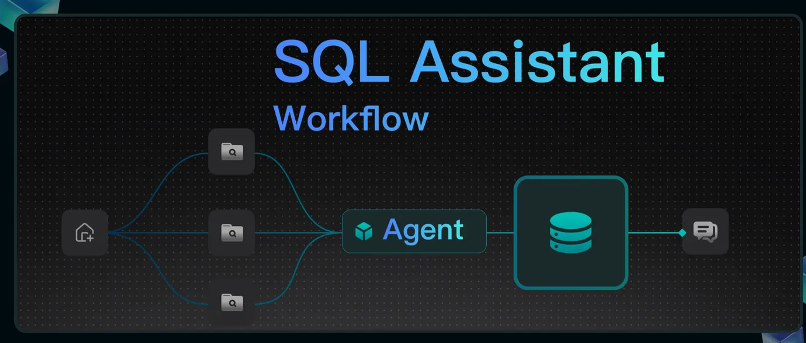

## Workflow overview

This tutorial shows how to create a SQL Assistant workflow that enables natural language queries for SQL databases. Non-technical users like marketers and product managers can use this tool to query business data independently, reducing the need for data analysts. It can also serve as a teaching aid for SQL in schools and coding courses. The finished workflow operates as follows:

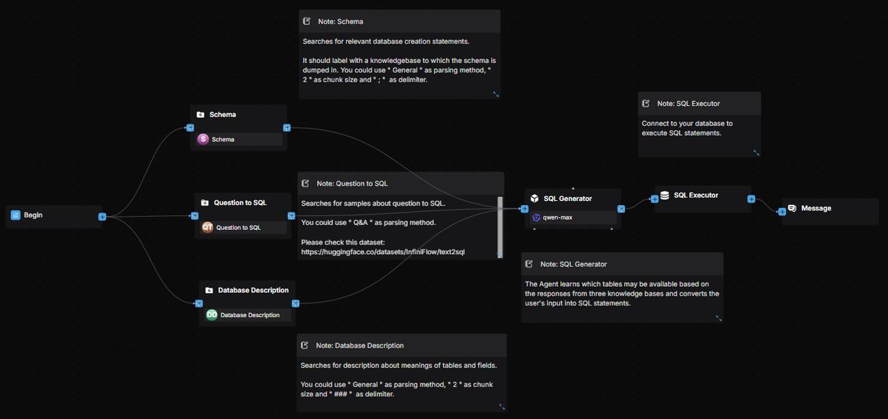

The database schema, field descriptions, and SQL examples are stored as knowledge bases in RAGFlow. Upon user queries, the system retrieves relevant information from these sources and passes it to an Agent, which generates SQL statements. These statements are then executed by a SQL Executor component to return the query results.

## Procedure

### 1. Create three knowledge bases

#### 1.1 Prepare dataset files

You can download the sample datasets from [Hugging Face Datasets](https://huggingface.co/datasets/InfiniFlow/text2sql).

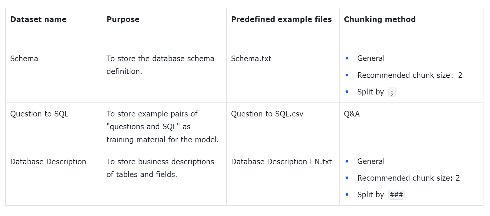

The following are the predefined example files:
1. Schema.txt

```
CREATE TABLE `users` (
  `id` INT NOT NULL AUTO_INCREMENT,
  `username` VARCHAR(50) NOT NULL,
  `password` VARCHAR(50) NOT NULL,
  `email` VARCHAR(100),
  `mobile` VARCHAR(20),
  `create_time` TIMESTAMP NOT NULL DEFAULT CURRENT_TIMESTAMP,
  `update_time` TIMESTAMP NOT NULL DEFAULT CURRENT_TIMESTAMP ON UPDATE CURRENT_TIMESTAMP,
  PRIMARY KEY (`id`),
  UNIQUE KEY `uk_username` (`username`),
  UNIQUE KEY `uk_email` (`email`),
  UNIQUE KEY `uk_mobile` (`mobile`)
);

...
```

Note: When defining schema fields, avoid special characters such as underscores, as they can cause errors in SQL statements generated by the LLM.
2. Question to SQL.csv

```
What are the names of all the Cities in Canada
SELECT geo_name, id FROM data_commons_public_data.cybersyn.geo_index WHERE iso_name ilike '%can%

What is average Fertility Rate measure of Canada in 2002 ?
SELECT variable_name, avg(value) as average_fertility_rate FROM   data_commons_public_data.cybersyn.timeseries WHERE variable_name = 'Fertility Rate' and geo_id = 'country/CAN' and date >= '2002-01-01' and date < '2003-01-01' GROUP BY 1;

What 5 countries have the highest life expectancy ?
SELECT geo_name, value FROM data_commons_public_data.cybersyn.timeseries join data_commons_public_data.cybersyn.geo_index ON timeseries.geo_id = geo_index.id WHERE  variable_name = 'Life Expectancy' and date = '2020-01-01' ORDER BY value desc limit 5;


...
```

3. Database Description EN.txt


```
### Users Table (users)
The users table stores user information for the website or application. Below are the definitions of each column in this table:
- `id`: INTEGER, an auto-incrementing field that uniquely identifies each user (primary key). It automatically increases with every new user added, guaranteeing a distinct ID for every user.
- `username`: VARCHAR, stores the user’s login name; this value is typically the unique identifier used during authentication.
- `password`: VARCHAR, holds the user’s password; for security, the value must be encrypted (hashed) before persistence.
- `email`: VARCHAR, stores the user’s e-mail address; it can serve as an alternate login credential and is used for notifications or password-reset flows.
- `mobile`: VARCHAR, stores the user’s mobile phone number; it can be used for login, receiving SMS notifications, or identity verification.
- `create_time`: TIMESTAMP, records the timestamp when the user account was created; defaults to the current timestamp.
- `update_time`: TIMESTAMP, records the timestamp of the last update to the user’s information; automatically refreshed to the current timestamp on every update.

...
```

#### 1.2 Create knowledge bases in RAGFlow

**Schema knowledge base**

Create a knowledge base titled "Schema" and upload the file Schema.txt.

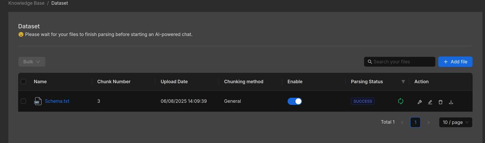

Tables in the database vary in length, each ending with a semicolon (;).

```
CREATE TABLE `users` (
  `id` INT NOT NULL AUTO_INCREMENT,
  `username` VARCHAR(50) NOT NULL,
  `password` VARCHAR(50) NOT NULL,
  ...
  UNIQUE KEY `uk_mobile` (`mobile`)
);

CREATE TABLE `products` (
  `id` INT NOT NULL AUTO_INCREMENT,
  `name` VARCHAR(100) NOT NULL,
  `description` TEXT,
  `price` DECIMAL(10, 2) NOT NULL,
  `stock` INT NOT NULL,
  ...
  FOREIGN KEY (`merchant_id`) REFERENCES `merchants` (`id`)
);

CREATE TABLE `merchants` (
  `id` INT NOT NULL AUTO_INCREMENT,
  `name` VARCHAR(100) NOT NULL,
  `description` TEXT,
  `email` VARCHAR(100),
  ...
  UNIQUE KEY `uk_mobile` (`mobile`)
);
```

To isolate each table as a standalone chunk without overlapping content, configure the knowledge base parameters as follows: 
- Chunking Method: General
- Chunk Size: 2 tokens (minimum size for isolation) 
- Delimiter: Semicolon (;) 
RAGFlow will then parse and generate chunks according to this workflow:

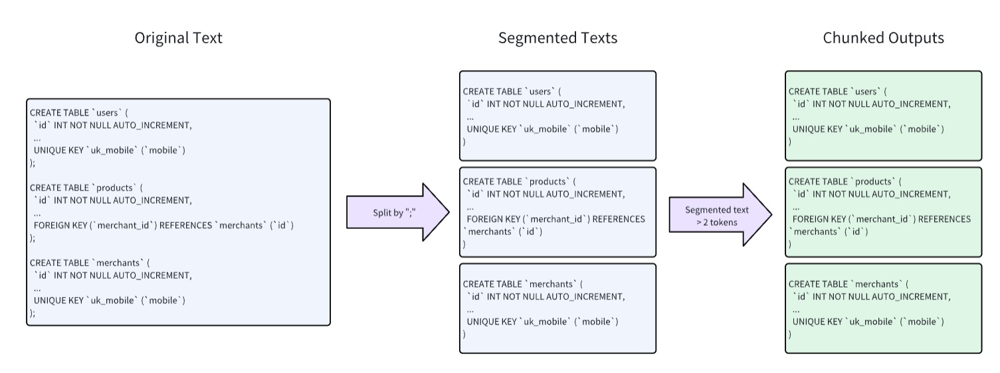

Below is a preview of the parsed results from Schema.txt:

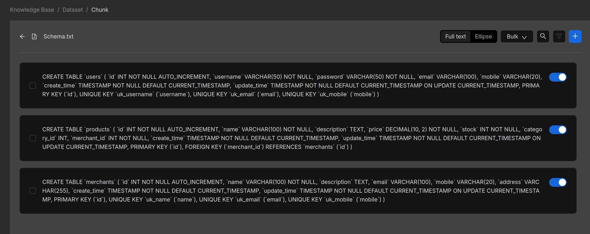

We now validate the retrieved results through retrieval testing:

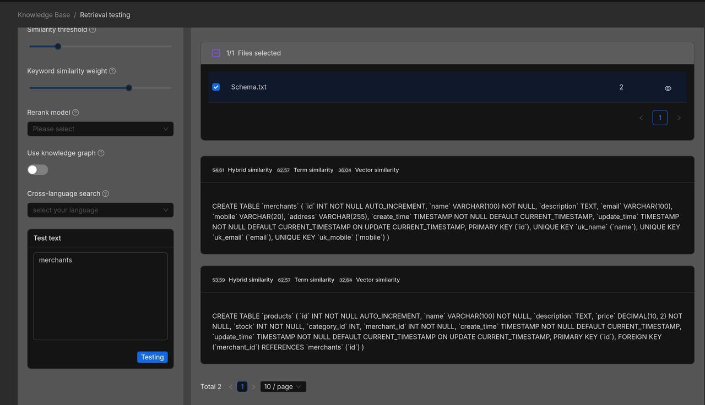

**Question to SQL knowledge base**

Create a new knowledge base titled "Question to SQL" and upload the file "Question to SQL.csv".

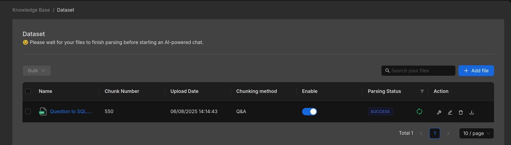

Set the chunking method to Q&A, then parse Question_to_SQL.csv to preview the results.

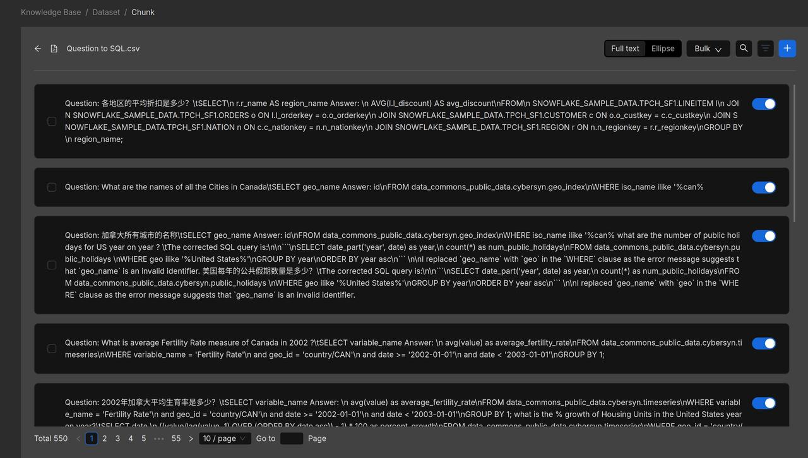

We now validate the retrieved results through retrieval testing:

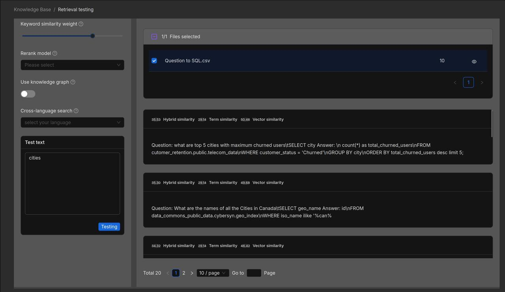

**Database Description knowledge base**
Create a new knowledge base titled "Database Description" and upload the file "Database_Description_EN.txt".

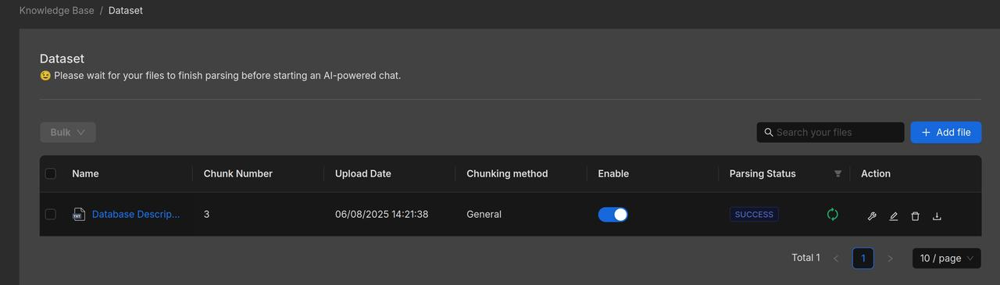

Configuration (Same as Schema Knowledge Base):
- Chunking Method: General
- Chunk Size: 2 tokens (minimum size for isolation) 
- Delimiter: Semicolon `###`
Below is a preview of the parsed Database_Description_EN.txt following configuration.

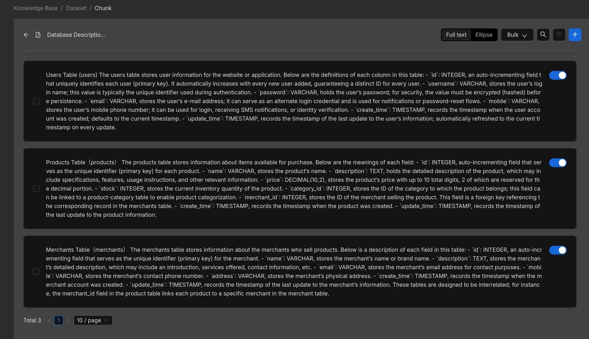

We now validate the retrieved results through retrieval testing:

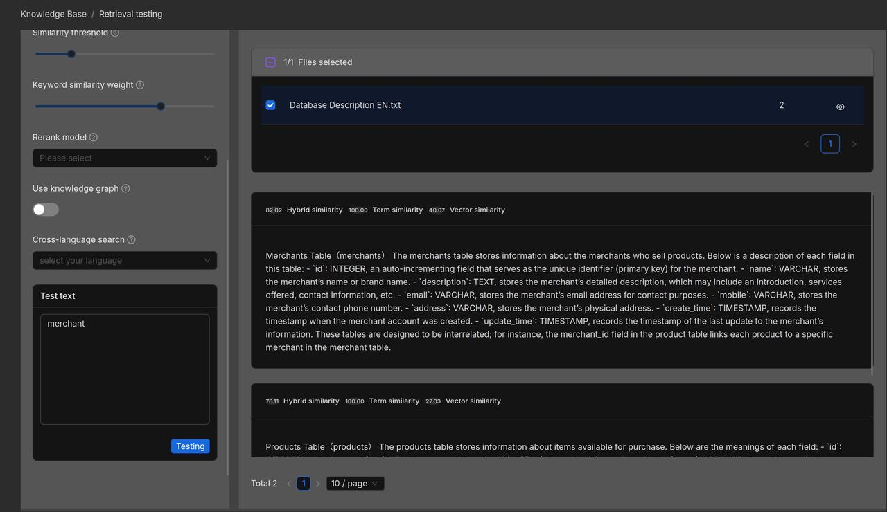


Note: The three knowledge bases are maintained and queried separately. The Agent component consolidates results from all sources before producing outputs."

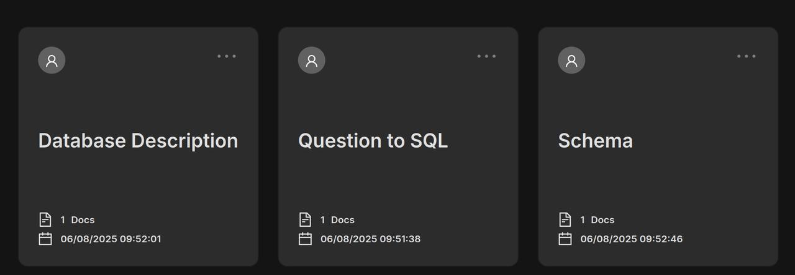

## 2. Orchestrate the workflow

### 2.1 Create a workflow application

Once created successfully, the Begin component automatically appears on the canvas.

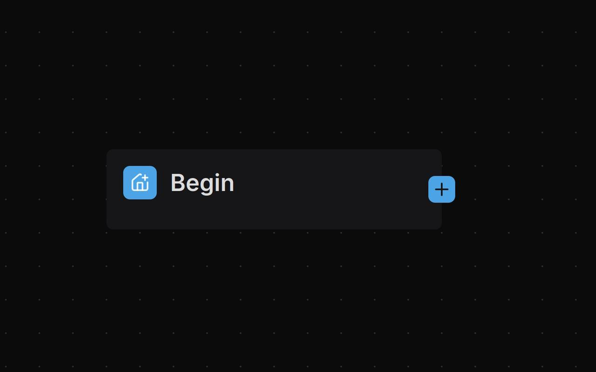

You can configure a welcome message in the Begin component. For example:

```
Hi! I'm your SQL assistant, what can I do for you?
```

### 2.2 Configure three Retrieval components

Add three parallel Retrieval components after the Begin component, named as follows:
- Schema
- Question to SQL
- Database Description
Configure each Retrieval component:
1. Query variable: sys.query
2. Knowledge base selection: Select the knowledge base whose name matches the current component's name.

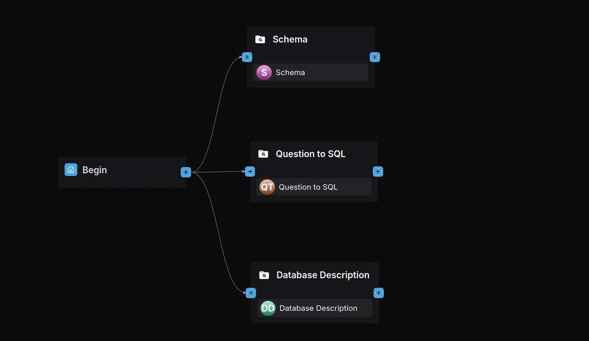


### 2.3 Configure the Agent component

Add an Agent component named 'SQL Generator' after the Retrieval components, connecting all three to it.


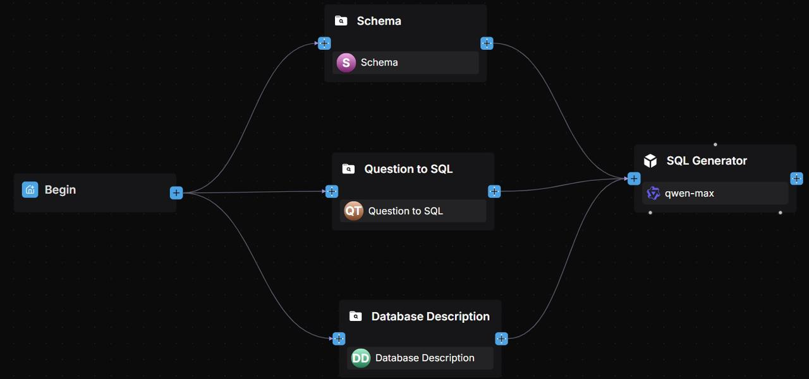

Write System Prompt:

```
### ROLE
You are a Text-to-SQL assistant.  
Given a relational database schema and a natural-language request, you must produce a **single, syntactically-correct MySQL query** that answers the request.  
Return **nothing except the SQL statement itself**—no code fences, no commentary, no explanations, no comments, no trailing semicolon if not required.

### EXAMPLES  
-- Example 1  
User: List every product name and its unit price.  
SQL:
SELECT name, unit_price FROM Products;

-- Example 2  
User: Show the names and emails of customers who placed orders in January 2025.  
SQL:
SELECT DISTINCT c.name, c.email
FROM Customers c
JOIN Orders o ON o.customer_id = c.id
WHERE o.order_date BETWEEN '2025-01-01' AND '2025-01-31';

-- Example 3  
User: How many orders have a status of "Completed" for each month in 2024?  
SQL:
SELECT DATE_FORMAT(order_date, '%Y-%m') AS month,
       COUNT(*) AS completed_orders
FROM Orders
WHERE status = 'Completed'
  AND YEAR(order_date) = 2024
GROUP BY month
ORDER BY month;

-- Example 4  
User: Which products generated at least \$10 000 in total revenue?  
SQL:
SELECT p.id, p.name, SUM(oi.quantity * oi.unit_price) AS revenue
FROM Products p
JOIN OrderItems oi ON oi.product_id = p.id
GROUP BY p.id, p.name
HAVING revenue >= 10000
ORDER BY revenue DESC;

### OUTPUT GUIDELINES
1. Think through the schema and the request.  
2. Write **only** the final MySQL query.  
3. Do **not** wrap the query in back-ticks or markdown fences.  
4. Do **not** add explanations, comments, or additional text—just the SQL.

```

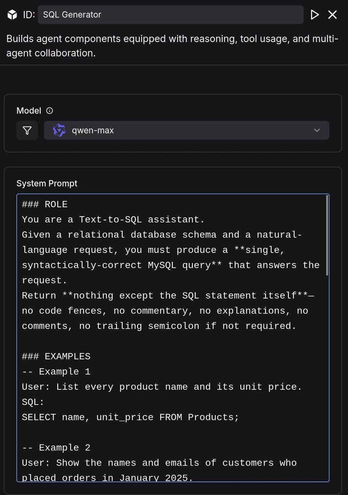

Write User Prompt:

```
User's query: /(Begin Input) sys.query  
Schema: /(Schema) formalized_content  
Samples about question to SQL: /(Question to SQL) formalized_content  
Description about meanings of tables and files: /(Database Description) formalized_content
```

After inserting variables, the populated result appears as follows:

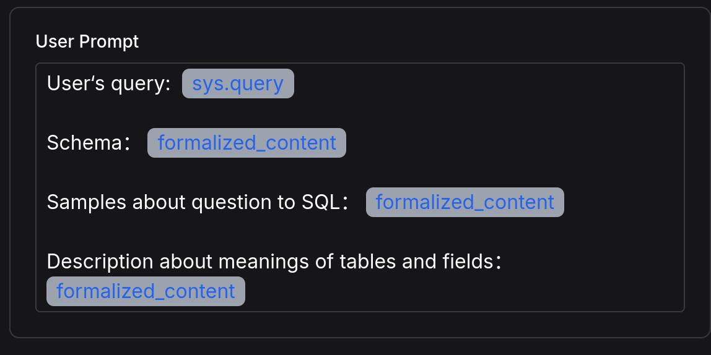

### 2.4 Configure the ExeSQL component

Append an ExeSQL component named "SQL Executor" after the SQL Generator.


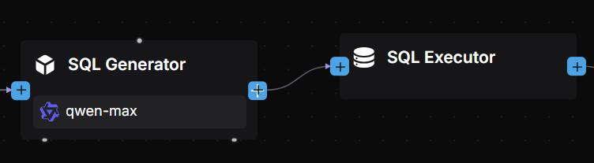

Configure the database for the SQL Executor component, specifying that its Query input comes from the output of the SQL Generator.

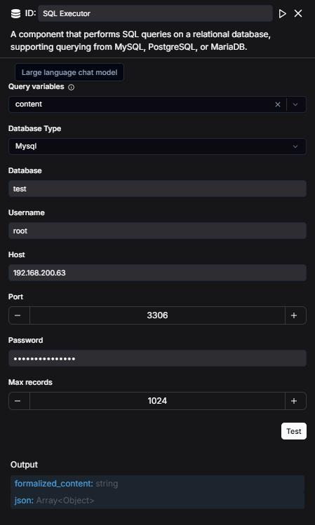

### 2.5 Configure the Message component

Append a Message component to the SQL Executor.

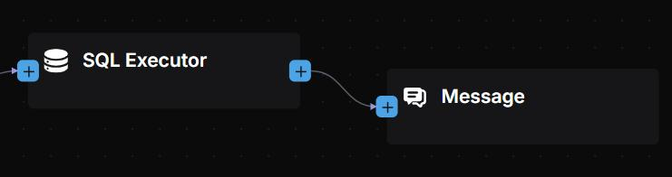

Insert variables into the Messages field to enable the message component to display the output of the SQL Executor (formalized_content):

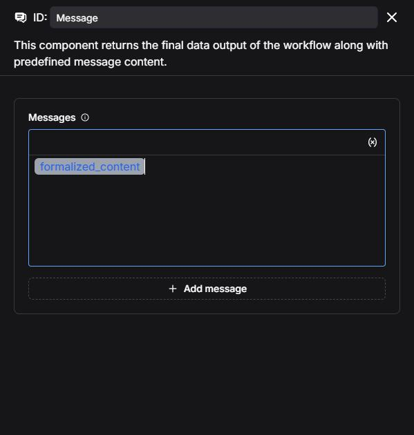

### 2.6 Save and test

Click Save → Run → Enter a natural language question → View execution results.

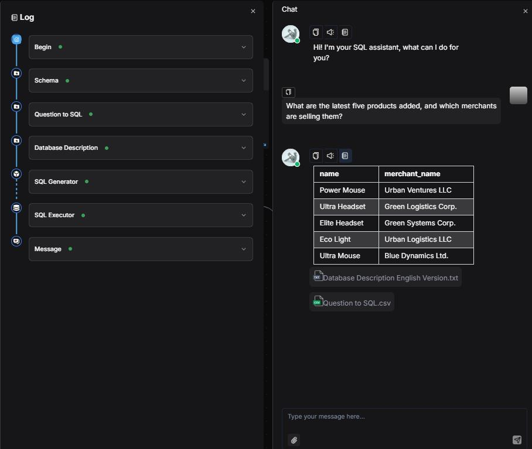

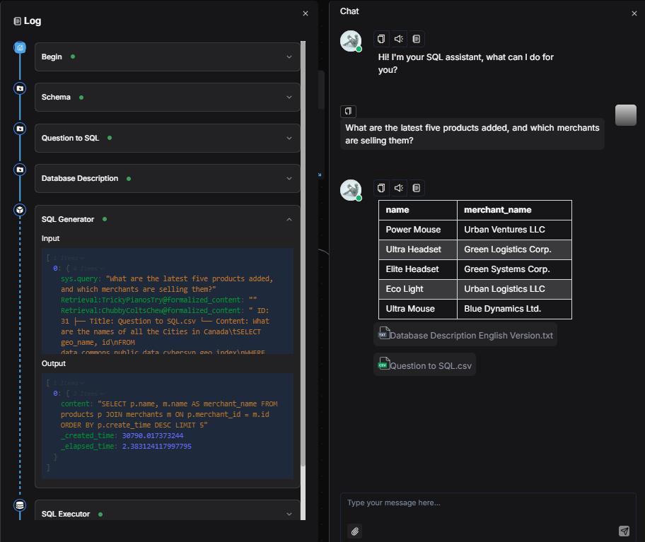

## Finale 

Finally, like current Copilot technologies, NL2SQL cannot achieve complete accuracy. For standardized processing of structured data, we recommend consolidating its operations to specific APIs, then encapsulating these APIs as MCPs (Managed Content Packages) for RAGFlow. We will demonstrate this approach in a forthcoming blog.