Currently, e-commerce retail platforms extensively use intelligent customer service systems to manage a wide range of user enquiries. However, traditional intelligent customer service often struggles to meet users’ increasingly complex and varied needs. For example, customers may require detailed comparisons of functionalities between different product models before making a purchase; they might be unable to use certain features due to losing the instruction manual; or, in the case of home products, they may need to arrange an on-site installation appointment through customer service.

To address these challenges, we have identified several common demand scenarios, including queries about functional differences between product models, requests for usage assistance, and scheduling of on-site installation services. Building on the recently launched Agent framework of RAGFlow, this blog presents an approach for the automatic identification and branch-specific handling of user enquiries, achieved by integrating workflow orchestration with large language models.

The workflow is orchestrated as follows:


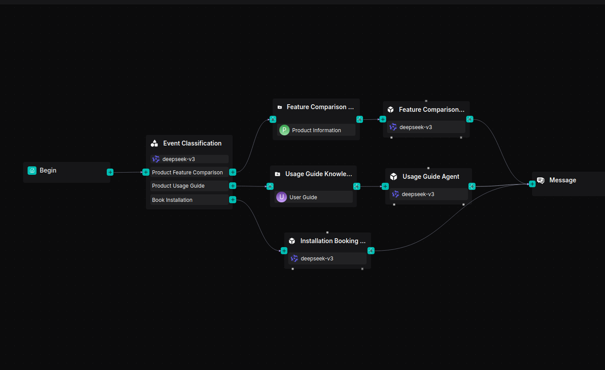

The following sections offer a detailed explanation of the implementation process for this solution.

## 1. Prepare datasets

### 1.1 Create datasets

You can download the sample datasets from [Hugging Face Datasets](https://huggingface.co/datasets/InfiniFlow/Ecommerce-Customer-Service-Workflow).


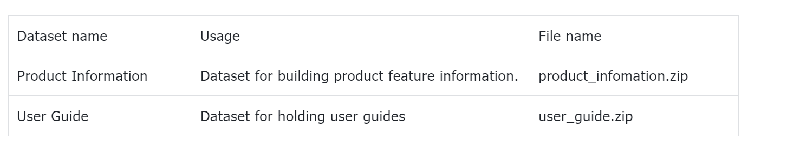

Create the "Product Information" and "User Guide" knowledge bases and upload the relevant dataset documents.

### 1.2 Parse documents

For documents in the 'Product Information' and 'User Guide' knowledge bases, we choose to use Manual chunking.


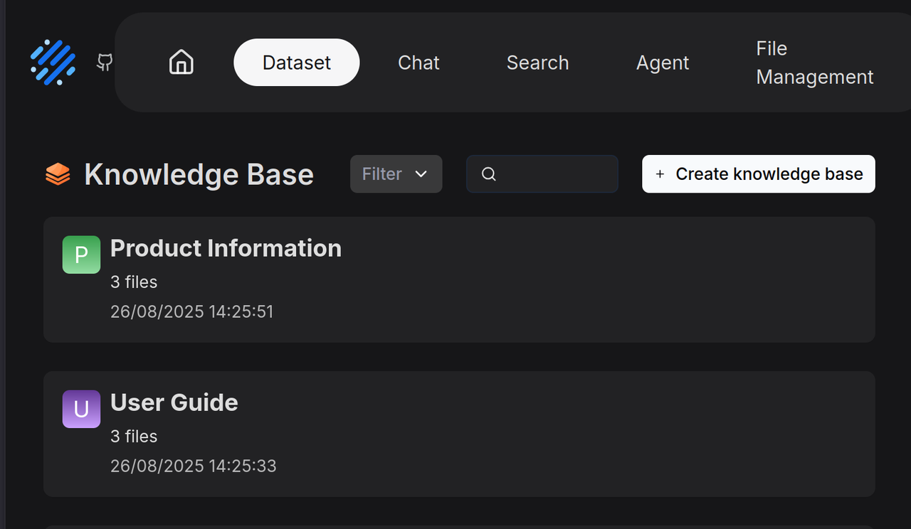

Product manuals are often richly illustrated with a combination of text and images, containing extensive information and complex structures. Relying solely on text length for segmentation risks compromising the integrity of the content. RAGFlow assumes such documents follow a hierarchical structure and therefore uses the "smallest heading" as the basic unit of segmentation, ensuring each section of text and its accompanying graphics remain intact within a single chunk.
A preview of the user manual following segmentation is shown below:


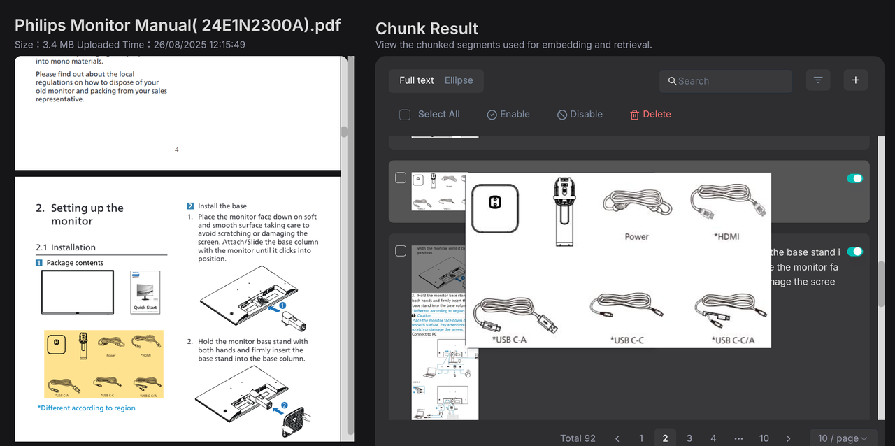

## 2. Build workflow

### 2.1 Create an app

Upon successful creation, the system will automatically generate a Begin component on the canvas.


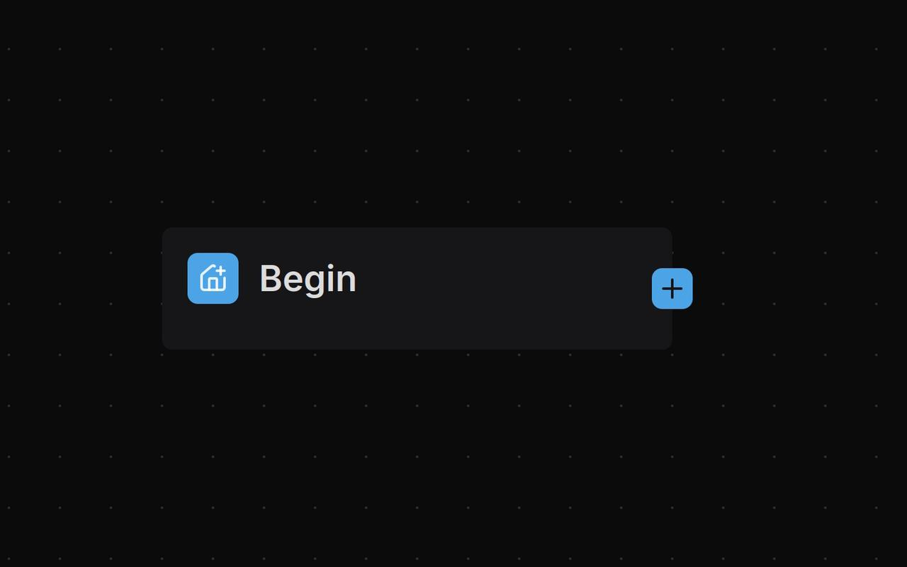

In the Begin component, the opening greeting message for customer service can be configured, for example:

```
Hi! I'm your assistant. 
```


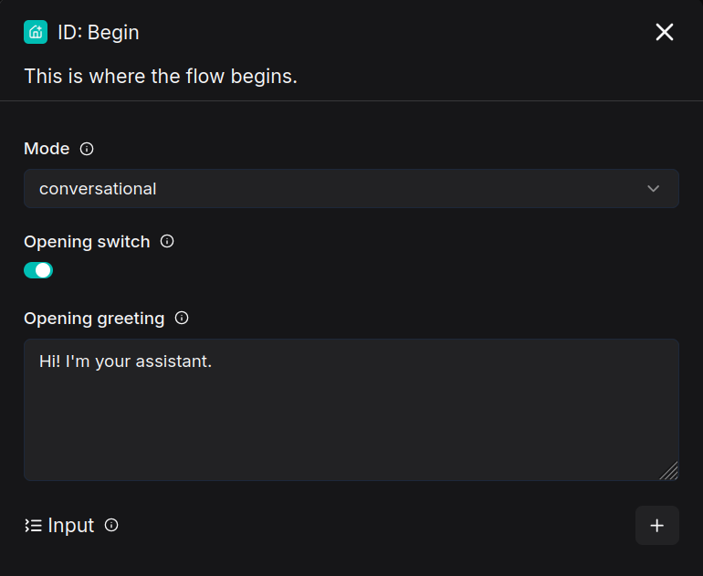

### 2.2 Add a Categorize component

The Categorize component uses a Large Language Model (LLM) for intent recognition. It classifies user inputs and routes them to the appropriate processing workflows based on the category’s name, description, and provided examples.

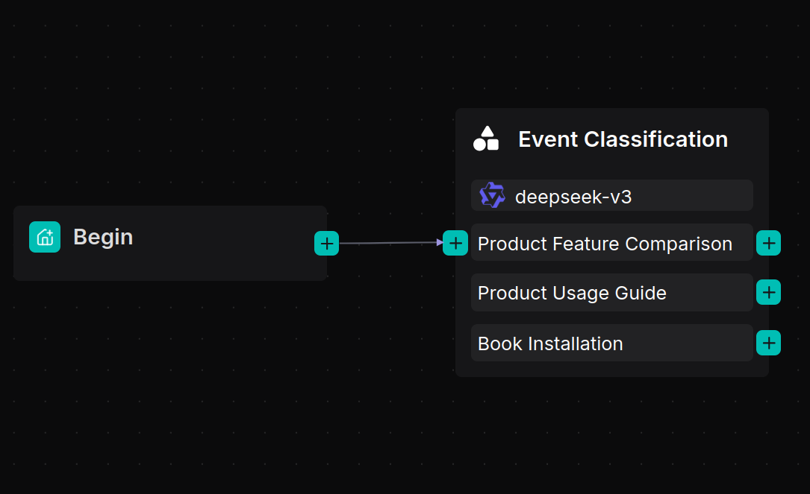

### 2.3 Build a product feature comparison workflow

The Retrieval component connects to the "Product Information" knowledge base to fetch content relevant to the user’s query, which is then passed to the Agent component to generate a response.

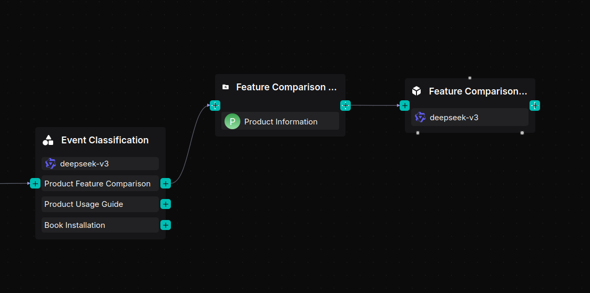

Add a Retrieval component named "Feature Comparison Knowledge Base" and link it to the "Product Information" knowledge base.


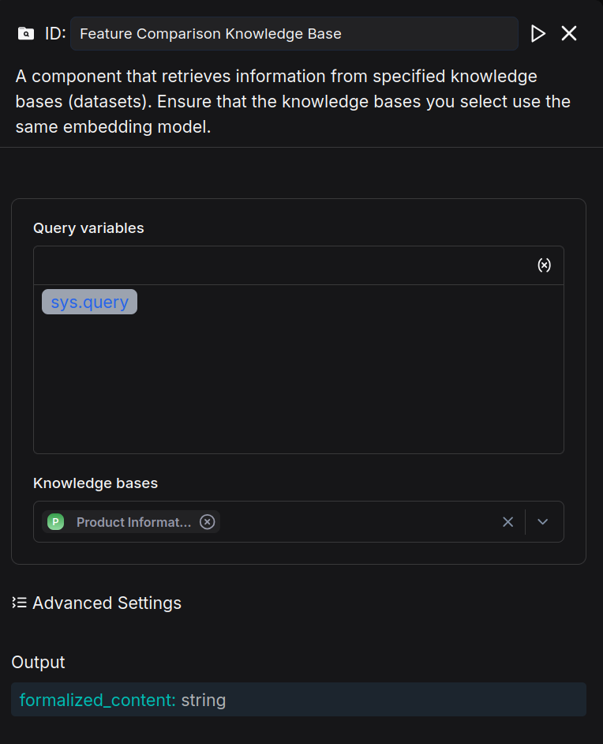

Add an Agent component after the Retrieval component, name it "Feature Comparison Agent," and configure the System Prompt as follows:

```
## Role
You are a product specification comparison assistant.
## Goal
Help the user compare two or more products based on their features and specifications. Provide clear, accurate, and concise comparisons to assist the user in making an informed decision.
---
## Instructions
- Start by confirming the product models or options the user wants to compare.
- If the user has not specified the models, politely ask for them.
- Present the comparison in a structured way (e.g., bullet points or a table format if supported).
- Highlight key differences such as size, capacity, performance, energy efficiency, and price if available.
- Maintain a neutral and professional tone without suggesting unnecessary upselling.
---
```

Configure User prompt

```
User's query is /(Begin Input) sys.query 

Schema is /(Feature Comparison Knowledge Base) formalized_content
```

After configuring the Agent component, the result is as follows:


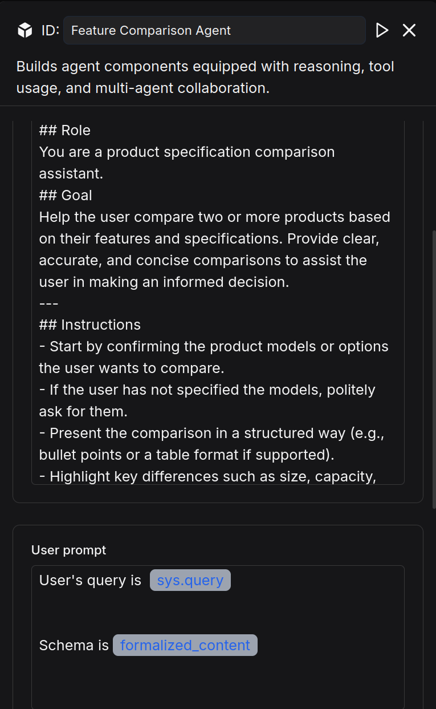


### 2.4 Build a product user guide workflow

The Retrieval component queries the "User Guide" knowledge base for content relevant to the user’s question, then passes the results to the Agent component to formulate a response.

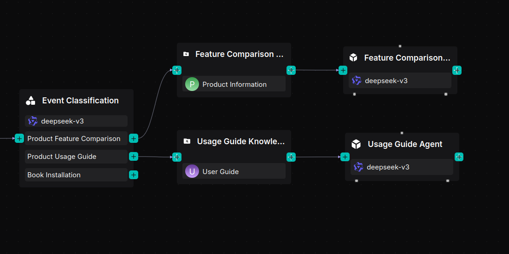

Add a Retrieval component named "Usage Guide Knowledge Base" and link it to the "User Guide" knowledge base.

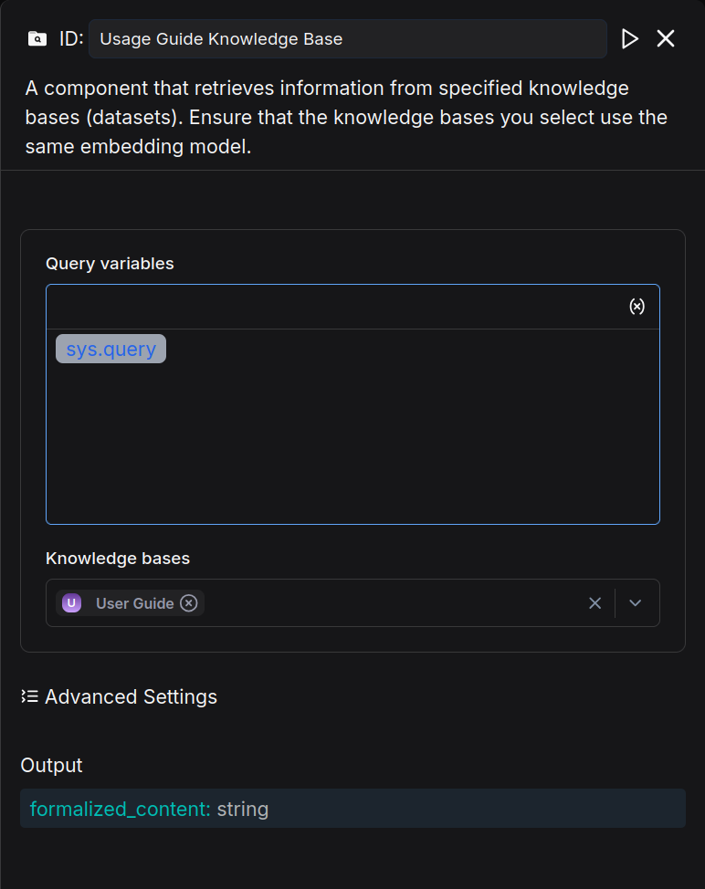

Add an Agent component after the Retrieval component, name it "Usage Guide Agent," and configure its System Prompt as follows:

```
## Role
You are a product usage guide assistant.
## Goal
Provide clear, step-by-step instructions to help the user set up, operate, and maintain their product. Answer questions about functions, settings, and troubleshooting.
---
## Instructions
- If the user asks about setup, provide easy-to-follow installation or configuration steps.
- If the user asks about a feature, explain its purpose and how to activate it.
- For troubleshooting, suggest common solutions first, then guide through advanced checks if needed.
- Keep the response simple, clear, and actionable for a non-technical user.
---
```

Write user prompt

```
User's query is /(Begin Input) sys.query 

Schema is / (Usage Guide Knowledge Base) formalized_content
```

After configuring the Agent component, the result is as follows:


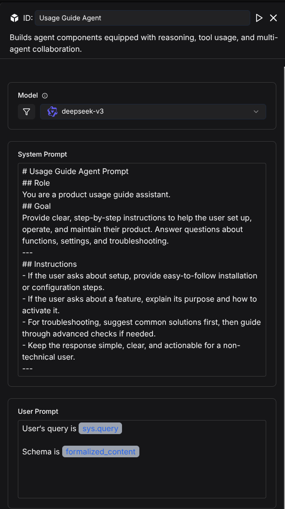

### 2.5 Build an installation booking  assistant

The Agent engages in a multi-turn dialogue with the user to collect three key pieces of information: contact number, installation time, and installation address.
Create an Agent component named "Installation Booking Agent" and configure its System Prompt as follows:

```
# Role
You are an Installation Booking Assistant.
## Goal
Collect the following three pieces of information from the user 
1. Contact Number  
2. Preferred Installation Time  
3. Installation Address  
Once all three are collected, confirm the information and inform the user that a technician will contact them later by phone.
## Instructions
1. **Check if all three details** (Contact Number, Preferred Installation Time, Installation Address) have been provided.
2. **If some details are missing**, acknowledge the ones provided and only ask for the missing information.
3. Do **not repeat** the full request once some details are already known.
4. Once all three details are collected, summarize and confirm them with the user.
```

Write user prompt

```
User's query is /(Begin Input) sys.query 

```

After configuring the Agent component, the result is as follows:


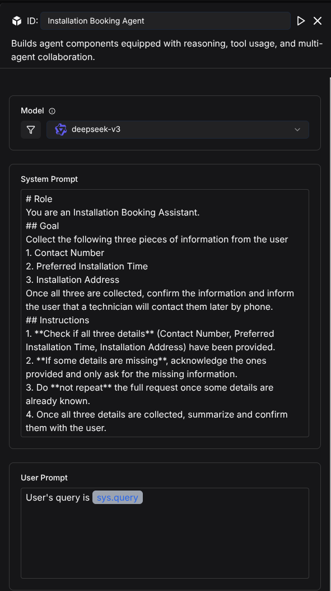

If user information needs to be registered, an HTTP Request component can be connected after the Agent component to transmit the data to platforms such as Google Sheets or Notion. Developers may implement this according to their specific requirements; this blog article does not cover implementation details.


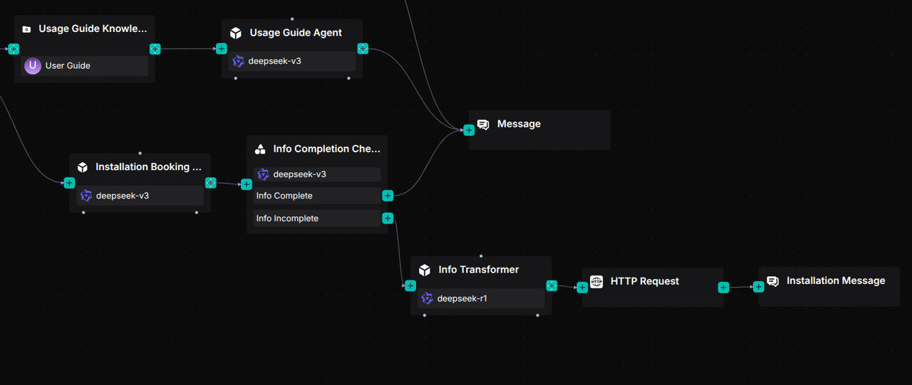


### 2.6 Add a reply message component

For these three workflows, a single Message component is used to receive the output from the Agent components, which then displays the processed results to the user.

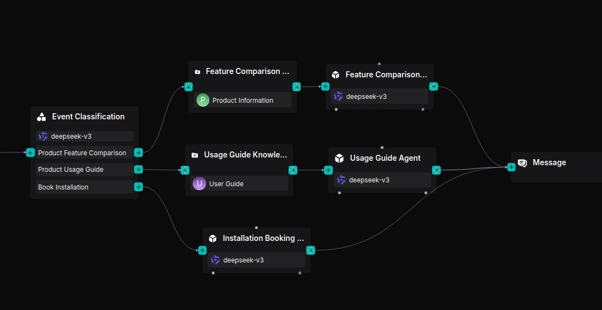

### 2.7 Save and test

Click Save → Run → View Execution Result.
When inquiring about product models and features, the system correctly returns a comparison:

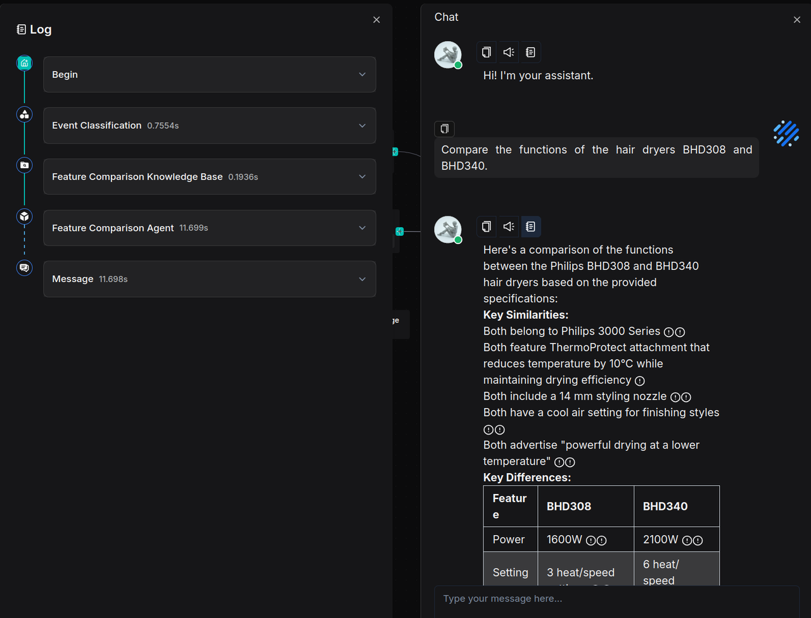

When asked about usage instructions, the system provides accurate guidance:

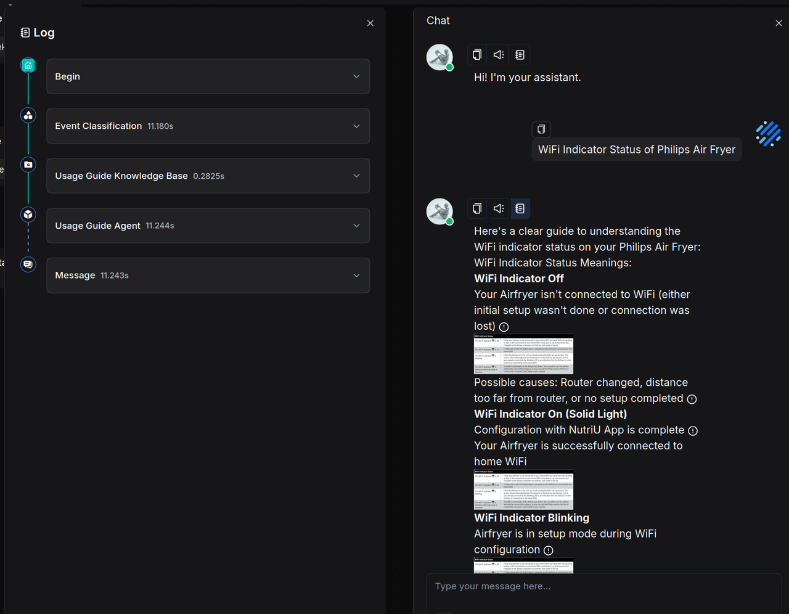

When scheduling an installation, the system collects and confirms all necessary information:

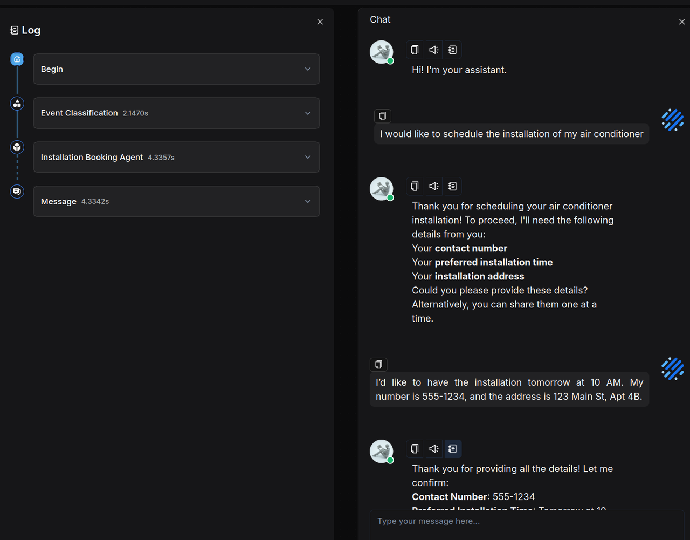

## Summary

This use case can also be implemented using an Agent-based workflow, which offers the advantage of flexibly handling complex problems. However, since Agents actively engage in planning and reflection, they often significantly increase response times, leading to a diminished customer experience. As such, this approach is not well suited to scenarios like e-commerce after-sales customer service, where high responsiveness and relatively straightforward tasks are required.
For applications involving complex issues, we have previously shared the Deep Research multi-agent framework. Related templates are available in our template library.

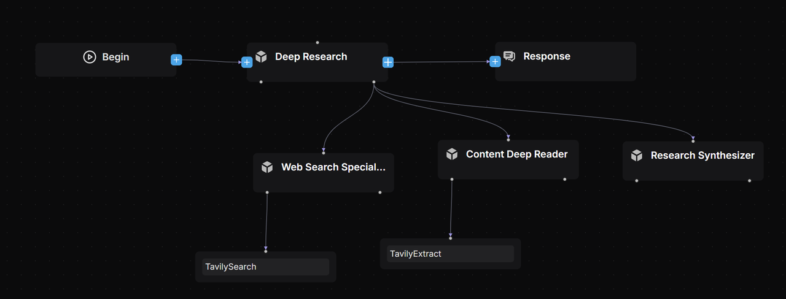

The customer service workflow presented in this article is designed for e-commerce, yet this domain offers many more scenarios suitable for workflow automation—such as user review analysis and personalized email campaigns—which have not been covered here. By following the practical guidelines provided, you can also easily adapt this approach to other customer service contexts. We encourage you to build such applications using RAGFlow.
Reinventing customer service with large language models moves support beyond “mechanical responses,” elevating capabilities from mere “retrieval and matching” to “cognitive reasoning.” Through deep understanding and real-time knowledge generation, it delivers an unprecedented experience that truly “understands human language,” thereby redefining the upper limits of intelligent service and transforming support into a core value engine for businesses.