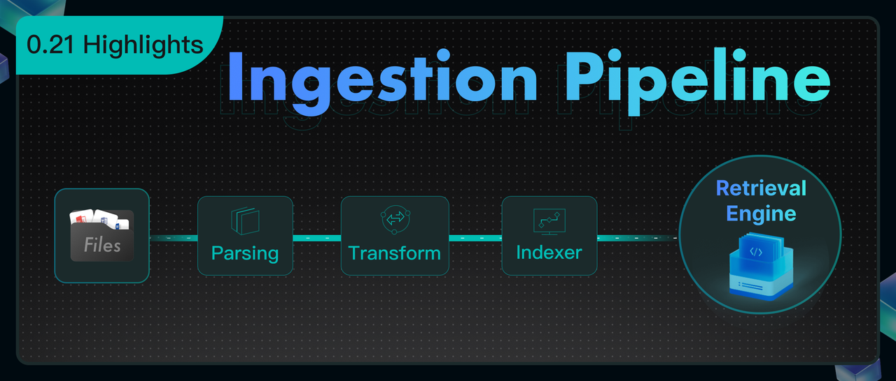
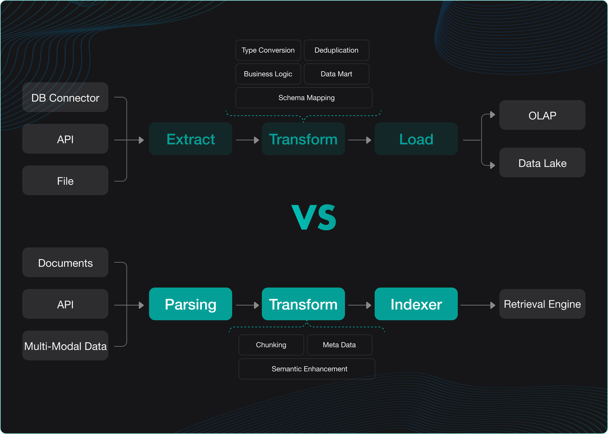
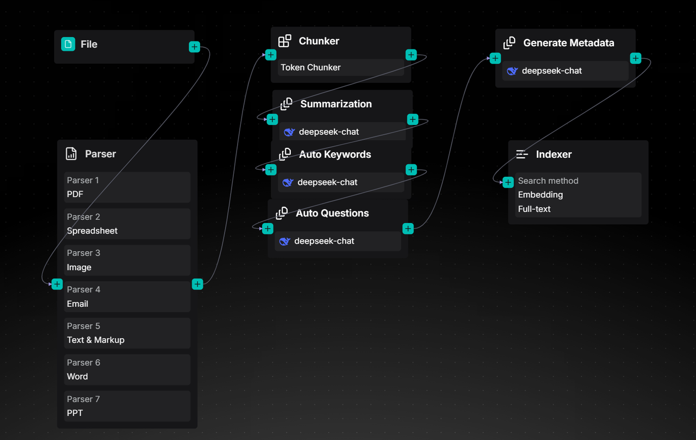
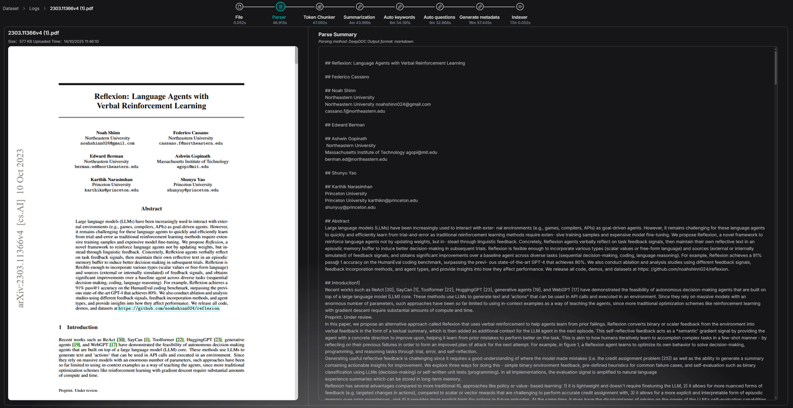

## RAGFlow 0.21.0 officially released

This release shifts focus from enhancing online Agent capabilities to strengthening the data foundation, prioritising usability and dialogue quality from the ground up. Directly addressing common RAG pain points—from data preparation to long-document understanding—version 0.21.0 brings crucial upgrades: a flexible, orchestratable Ingestion Pipeline, long-context RAG to close semantic gaps in complex files, and a new admin CLI for smoother operations. Taken together, these elements establish RAGFlow’s refreshed data-pipeline core, providing a more solid foundation for building robust and effective RAG applications.

## Orchestratable Ingestion Pipeline

If earlier Agents primarily tackled the orchestration of online data—as seen in Workflow and Agentic Workflow—the Ingestion Pipeline mirrors this capability by applying the same technical architecture to orchestrate offline data ingestion. Its introduction enables users to construct highly customized RAG data pipelines within a unified framework. This not only streamlines bespoke development but also more fully embodies the "Flow" in RAGFlow.

A typical RAG ingestion process involves key stages such as document parsing, text chunking, vectorization, and index building. When RAGFlow first launched in April 2024, it already incorporated an advanced toolchain, including the DeepDoc-based parsing engine and a templated chunking mechanism. These state-of-the-art solutions were foundational to its early adoption.

However, with rapid industry evolution and deeper practical application, we have observed new trends and demands:

- The rise of Vision Language Models (VLMs): Increasingly mature VLMs have driven a wave of fine-tuned document parsing models. These offer significantly improved accuracy for unstructured documents with complex layouts or mixed text and images.
- Demand for flexible chunking: Users now seek more customized chunking strategies. Faced with diverse knowledge-base scenarios, RAGFlow's original built-in chunking templates have proved insufficient for covering all niche cases, which can impact the accuracy of final Q&A outcomes.

To this end, RAGFlow 0.21.0 formally introduces the Ingestion Pipeline, featuring core capabilities including:

- Orchestratable Data Ingestion: Building on the underlying Agent framework, users can create varied data ingestion pipelines. Each pipeline may apply different strategies to connect a data source to the final index, turning the previous built-in data-writing process into a user-customizable workflow. This provides more flexible ingestion aligned with specific business logic.
- Decoupling of Upload and Cleansing: The architecture separates data upload from cleansing, establishing standard interfaces for future batch data sources and a solid foundation for expanding data preprocessing workflows.
- Refactored Parser: The Parser component has been redesigned for extensibility, laying groundwork for integrating advanced document-parsing models beyond DeepDoc.
- Customizable Chunking Interface: By decoupling the chunking step, users can plug in custom chunkers to better suit the segmentation needs of different knowledge structures.
- Optimized Efficiency for Complex RAG: The execution of IO/compute-intensive tasks, such as GraphRAG and RAPTOR, has been overhauled. In the pre-pipeline architecture, processing each new document triggered a full compute cycle, resulting in slow performance. The new pipeline enables batch execution, significantly improving data throughput and overall efficiency.

If ETL/ELT represents the standard pipeline for processing structured data in the modern data stack—with tools like dbt and Fivetran providing unified and flexible data integration solutions for data warehouses and data lakes—then RAGFlow's Ingestion Pipeline is positioned to become the equivalent infrastructure for unstructured data.
The following diagram illustrates this architectural analogy:

Specifically, while the Extract phase in ETL/ELT is responsible for pulling data from diverse sources, the RAGFlow Ingestion Pipeline augments this with a dedicated Parsing stage to extract information from unstructured data. This stage integrates multiple parsing models, led by DeepDoc, to convert multimodal documents (for example, text and images) into a unimodal representation suitable for processing.
In the Transform phase, where traditional ETL/ELT focuses on data cleansing and business logic, RAGFlow instead constructs a series of LLM-centric Agent components. These are optimized to address semantic gaps in retrieval, with a core mission that can be summarized as: to enhance recall and ranking accuracy.
For data loading, ETL/ELT writes results to a data warehouse or data lake, while RAGFlow uses an Indexer component to build the processed content into a retrieval-optimised index format. This reflects the RAG engine’s hybrid retrieval architecture, which must support full-text, vector, and future tensor-based retrieval to ensure optimal recall.
Thus, the modern data stack serves business analytics for structured data, whereas a RAG engine with an Ingestion Pipeline specializes in the intelligent retrieval of unstructured data—providing high-quality context for LLMs. Each occupies an equivalent ecological niche in its domain.
Regarding processing structured data, this is not the RAG engine’s core duty. It is handled by a Context Layer built atop the engine. This layer leverages the MCP (Model Context Protocol)—described as “TCP/IP for the AI era” —and accompanying Context Engineering to automate the population of all context types. This is a key focus area for RAGFlow’s next development phase.
Below is a preliminary look at the Ingestion Pipeline in v0.21.0; a more detailed guide will follow. We have introduced components for parsing, chunking, and other unstructured data processing tasks into the Agent Canvas, enabling users to freely orchestrate their parsing workflows.

Orchestrating an Ingestion Pipeline automates the process of parsing files and chunking them by length. It then leverages a large language model to generate summaries, keywords, questions, and even metadata. Previously, this metadata had to be entered manually. Now, a single configuration dramatically reduces maintenance overhead.
Furthermore, the pipeline process is fully observable, recording and displaying complete processing logs for each file.

The implementation of the Ingestion Pipeline in version 0.21.0 is a foundational step. In the next release, we plan to significantly enhance it by:
- Adding support for more data sources.
- Providing a wider selection of Parsers.
- Introducing more flexible Transformer components to facilitate orchestration of a richer set of semantic-enhancement templates.

## Long-context RAG

As we enter 2025, Retrieval-Augmented Generation (RAG) faces notable challenges driven by two main factors.
Fundamental limitations of traditional RAG
Traditional RAG architectures often fail to guarantee strong dialogue performance because they rely on a retrieval mechanism built around text chunks as the primary unit. This makes them highly sensitive to chunk quality and can yield degraded results due to insufficient context. For example:

- If a coherent semantic unit is split across chunks, retrieval can be incomplete.
- If a chunk lacks global context, the information presented to the LLM is weakened.

While strategies such as automatically detecting section headers and attaching them to chunks can help with global semantics, they are constrained by header-identification accuracy and the header’s own completeness.
Cost-efficiency concerns with advanced pre-processing techniques
Modern pre-processing methods—GraphRAG, RAPTOR, and Context Retrieval—aim to inject additional semantic information into raw data to boost search hit rates and accuracy for complex queries. They, however, share issues of high cost and unpredictable effectiveness.

GraphRAG: This approach often consumes many times more tokens than the original text, and the automatically generated knowledge graphs are frequently unsatisfactory. Its effectiveness in complex multi-hop reasoning is limited by uncontrollable reasoning paths. As a supplementary retrieval outside the original chunks, the knowledge graph also loses some granular context from the source.
RAPTOR: This technique produces clustered summaries that are recalled as independent chunks but naturally lack the detail of the source text, reintroducing the problem of insufficient context.

Context Retrieval: This method enriches original chunks with extra semantics such as keywords or potential questions. It presents a clear trade-off:

- The more effective option queries the LLM multiple times per chunk, using both full text and the current chunk for context, improving performance but driving token costs several times higher than the original text.
- The cheaper option generates semantic information based only on the current chunk, saving costs but providing limited global context and modest performance gains.
The last few years have seen the emergence of new RAG schemes.
- Complete abandonment of retrieval: some approaches have the LLM read documents directly, splitting them into chunks according to the context window and performing multi-stage searches. First, the LLM decides which global document is relevant, then which chunks, and finally loads those chunks to answer. While this avoids recall inaccuracies, it harms response latency, concurrency, and large-scale data handling, making practical deployment difficult.
- Abandoning embedding or indexing in favour of tools like grep: this evolves RAG into Agentic RAG. As applications grow more complex and user queries diversify, combining RAG with agents is increasingly inevitable, since only LLMs can translate raw inquiries into structured retrieval commands. In RAGFlow, this capability has long been realized. Abandoning indexing to use grep is a compromise for simplifying agent development in personal or small-scale contexts; in enterprise settings, a powerful retrieval engine remains essential.
- Long-Context RAG: introduced in version 0.21.0 as part of the same family as GraphRAG, RAPTOR and Context Retrieval, this approach uses LLMs to enrich raw text semantics to boost recall while retaining indexing and search. Retrieval remains central. Long-context RAG mirrors how people consult information: identify relevant chapters via the table of contents, then locate exact pages for detail. During indexing, the LLM extracts and attaches chapter information to each chunk to provide global context; during retrieval, it finds matching chunks and uses the table-of-contents structure to fill in gaps from chunk fragmentation.
- Current experience and future direction: users can try Long-Context RAG via the “TOC extraction” (Table of Contents) feature, though it is in beta. The next release will add an Ingestion Pipeline. A key path to improving RAG lies in using LLMs to enrich content semantics without discarding retrieval altogether. Consequently, a flexible pipeline that lets users assemble LLM-based content-transformation components is an important direction for enhancing RAG retrieval quality.

## Backend management CLI

RAGFlow’s progression has shifted from core module development to strengthening administrative and operational capabilities.

- In earlier versions, while parsing and retrieval-augmented generation improved, system administration lagged. Administrators could not modify passwords or delete accounts, complicating deployment and maintenance.
- With RAGFlow 0.21.0, fundamental system management is markedly improved. A new command-line administration tool provides a central, convenient interface for administrators. Core capabilities include:
  - Service lifecycle management: monitoring built-in RAGFlow services for greater operational flexibility.
  - Comprehensive user management:
    - Create new registered users.
    - Directly modify login passwords.
    - Delete user accounts.
    - Enable or disable accounts.
    - View details of all registered users.
  - Resource overview: listing knowledge bases and Agents created under registered users for system-wide monitoring.

This upgrade underlines RAGFlow’s commitment to robust functionality and foundational administrative strength essential for enterprise use. Looking ahead, the team plans an enterprise-grade web administration panel and accompanying user interface to streamline management, boost efficiency, and enhance the end-user experience, supporting greater maturity and stability.

## Finale

RAGFlow 0.21.0 marks a significant milestone, building on prior progress and outlining future developments. It introduces the first integration of Retrieval (RAG) with orchestration (Flow), forming an intelligent engine to support the LLM context layer, underpinned by unstructured data ELT and a robust RAG capability set.
From the user-empowered Ingestion Pipeline to long-context RAG that mitigates semantic fragmentation, and the management backend that ensures reliable operation, every new feature is designed to make the RAG system smarter, more flexible, and enterprise-ready. This is not merely a feature tally but an architectural evolution, establishing a solid foundation for future growth.
Our ongoing focus remains the LLM context layer: building a powerful, reliable data foundation for LLMs and effectively serving all Agents. This remains RAGFlow’s core aim.
We invite you to continue following and starring our project as we grow together.

GitHub: https://github.com/infiniflow/ragflow