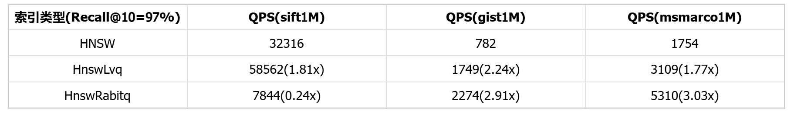
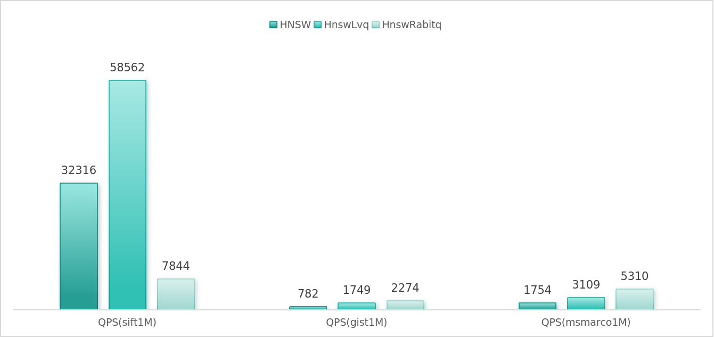
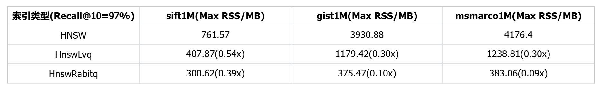
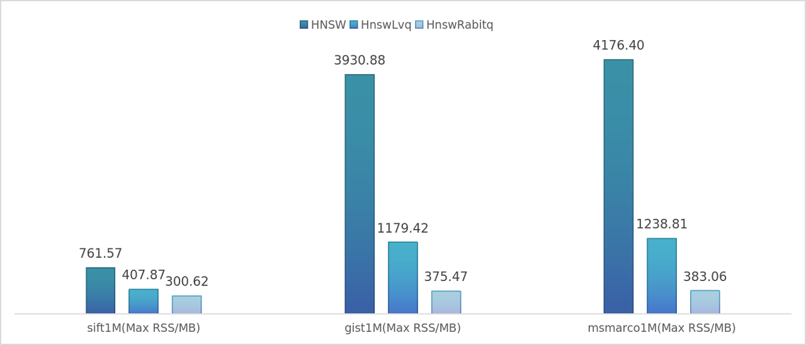
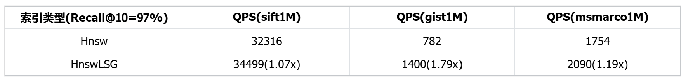
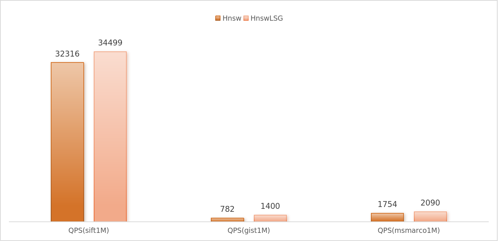
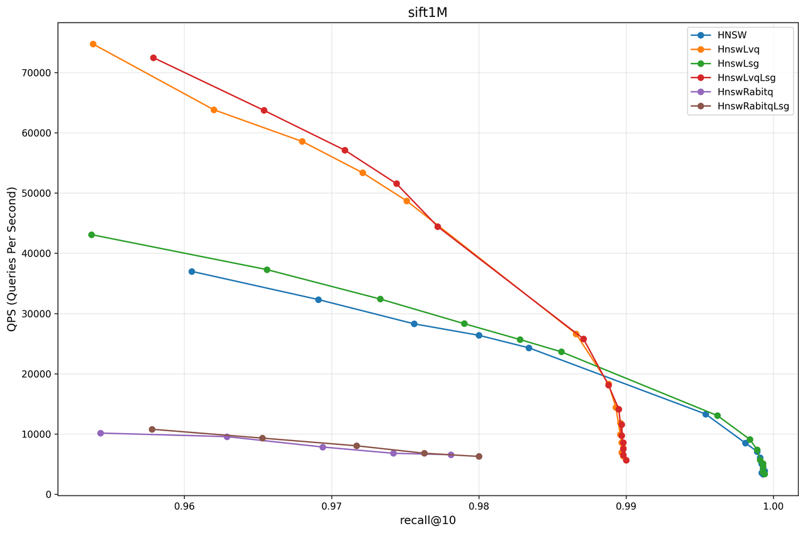
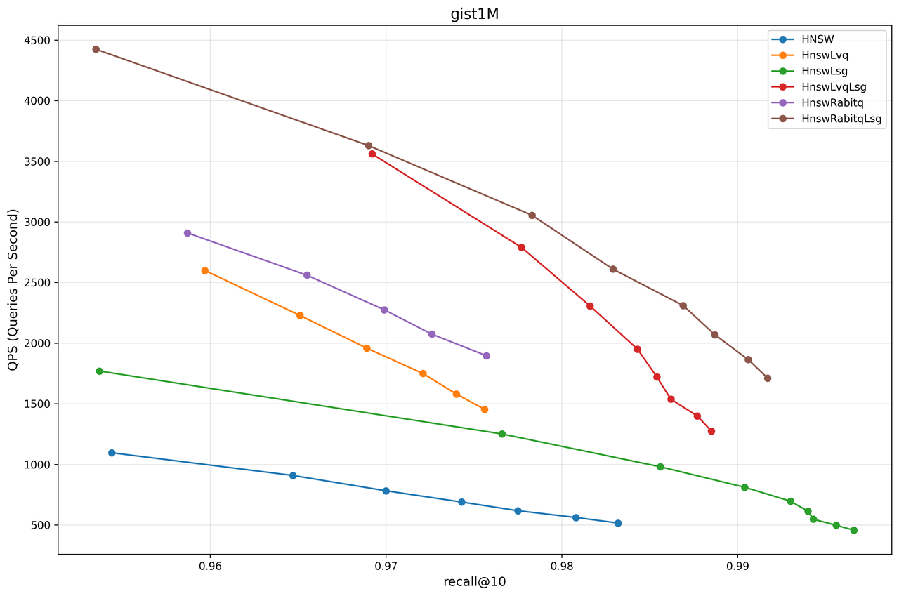
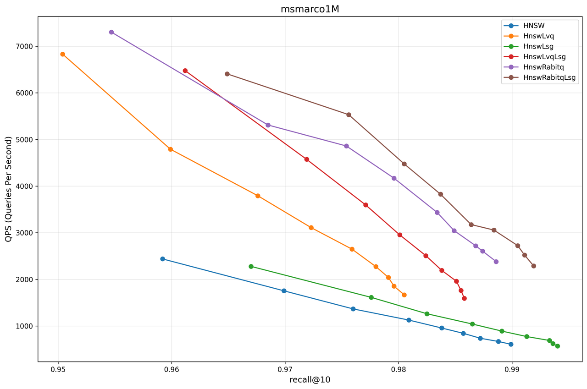

## Introduction

In RAG (Retrieval-Augmented Generation) and LLM (Large Language Model) Memory, vector retrieval is widely employed. Among various options, graph-based indexing has become the most common choice due to its high accuracy and performance, with the HNSW (Hierarchical Navigable Small World) index being the most representative one[1] [2].

However, during our practical application of HNSW in RAGFlow, we encountered the following two major bottlenecks:

1. As the data scale continues to grow, the memory consumption of vector data becomes highly significant. For instance, one billion 1024-dimensional floating-point vectors would require approximately 4TB of memory space.

2. When constructing an HNSW index on complex datasets, there is a bottleneck in retrieval accuracy. After reaching a certain threshold, it becomes difficult to further improve accuracy solely by adjusting parameters.

To address this, Infinity has implemented a variety of improved algorithms based on HNSW. Users can select different indexing schemes by adjusting the index parameters of HNSW. Each HNSW index variant possesses distinct characteristics and is suitable for different scenarios, allowing users to construct corresponding index structures based on their actual needs.

## Introduction to Indexing Schemes

The original HNSW, as a commonly used graph-based index, exhibits excellent performance.

Its structure consists of two parts:

A set of original vector data, along with a graph structure jointly constructed by a skip list and an adjacency list. Taking the Python interface as an example, the index can be constructed and utilized in the following manner:

```
## Create index
table_obj.create_index(
    "hnsw_index",
    index.IndexInfo(
        "embedding",
        index.IndexType.Hnsw, {
            "m": 16,
            "ef_construction": 200,
            "metric": "l2"
        },
    )
)
## Vector retrieval
query_builder.match_dense('embedding', [1.0, 2.0, 3.0], 'float', 'l2', 10, {'ef': 200})
```

To address the issues of high memory consumption and accuracy bottlenecks, Infinity provides the following solutions:

1. Introduce LVQ and RaBitQ quantization methods to reduce the memory overhead of original vectors during graph search processes.
2. Introduce the LSG strategy to optimize the graph index structure of HNSW, enhancing its accuracy threshold and query efficiency.

To facilitate users in testing the performance of different indexes locally, Infinity provides a benchmark script. You can follow the tutorial provided by Infinity on GitHub to set up the environment and prepare the dataset, and then test different indexing schemes using the benchmark.

```
######################   compile benchmark  ######################
cmake --build cmake-build-release --target hnsw_benchmark

###################### build index & execute query ######################
#           mode : build, query
# benchmark_type : sift, gist, msmarco
#     build_type : plain, lvq, crabitq, lsg, lvq_lsg, crabitq_lsg
##############################################################
benchmark_type=sift
build_type=plain
./cmake-build-release/benchmark/local_infinity/hnsw_benchmark --mode=build --benchmark_type=$benchmark_type --build_type=$build_type --thread_n=8
./cmake-build-release/benchmark/local_infinity/hnsw_benchmark --mode=query --benchmark_type=$benchmark_type --build_type=$build_type --thread_n=8 --topk=10
```

Among them, the original HNSW corresponds to the parameter `build_type=plain`. This paper conducts a unified test on the query performance of all variant indexes, with the experimental environment configuration adopted as follows:

1. OS: Ubuntu 24.04 LTS (Noble Numbat)
2. CPU: 13th Gen Intel(R) Core(TM) i5-13400
3. RAM: 64G

The CPU has a 16-core specification. To align with the actual device environments of most users, the parallel computing parameter in the benchmark is uniformly set to 8 threads.

### Solution 1: Original HNSW + LVQ Quantizer (HnswLvq)

LVQ is a scalar quantization method that compresses each 32-bit floating-point number in the original vectors into an 8-bit integer[3], thereby reducing memory usage to one-fourth of that of the original vectors. 

Compared to simple scalar quantization methods (such as mean scalar quantization), LVQ reduces errors by statistically analyzing the residuals of each vector, effectively minimizing information loss in distance calculations for quantized vectors. Consequently, LVQ can accurately estimate the distances between original vectors with only approximately 30% of the original memory footprint.

In the HNSW algorithm, original vectors are utilized for distance calculations, which enables LVQ to be directly integrated with HNSW. We refer to this combined approach as HnswLvq. In Infinity, users can enable LVQ encoding by setting the parameter `"encode"`: `"lvq"`:

```
## Create index
table_obj.create_index(
    "hnsw_index",
    index.IndexInfo(
        "embedding",
        index.IndexType.Hnsw, {
            "m": 16,
            "ef_construction": 200,
            "metric": "l2",
            "encode": "lvq"
        },
    )
)
## Vector retrieval
query_builder.match_dense('embedding', [1.0, 2.0, 3.0], 'float', 'l2', 10, {'ef': 200})
```

The graph structure of HnswLvq remains consistent with that of the original HNSW, with the key difference being that it uses quantized vectors to perform all distance calculations within the graph. Through this improvement, HnswLvq outperforms the original HNSW index in terms of both index construction and query efficiency.

The improvement in construction efficiency stems from the shorter length of quantized vectors, which results in reduced time for distance calculations using SIMD instructions. The enhancement in query efficiency is attributed to the computational acceleration achieved through quantization, which outweighs the negative impact caused by the loss of precision.

In summary, HnswLvq significantly reduces memory usage while maintaining excellent query performance. We recommend that users adopt it as the primary index in most scenarios. To replicate this experiment, users can set the parameter `build_type=lvq` in the benchmark. The specific experimental results are compared alongside the RaBitQ quantizer scheme in Solution two.

### Solution 2: Original HNSW + RaBitQ Quantizer (HnswRabitq)

RaBitQ is a binary scalar quantization method that shares a similar core idea with LVQ, both aiming to replace the 32-bit floating-point numbers in original vectors with fewer encoded bits. The difference lies in that RaBitQ employs binary scalar quantization, representing each floating-point number with just 1 bit, thereby achieving an extremely high compression ratio.

However, this extreme compression also leads to more significant information loss in the vectors, resulting in a decline in the accuracy of distance estimation. To mitigate this issue, RaBitQ introduces a rotation matrix to preprocess the dataset during the preprocessing stage and retains more residual information, thereby reducing errors in distance calculations to a certain extent[4].

Nevertheless, binary quantization has obvious limitations in terms of precision, showing a substantial gap compared to LVQ. Indexes built directly using RaBitQ encoding exhibit poor query performance. 

Therefore, the HnswRabitq scheme implemented in Infinity involves first constructing an original HNSW index for the dataset and then converting it into an HnswRabitq index through the `compress_to_rabitq` parameter in the optimize method. 

During the query process, the system initially uses quantized vectors for preliminary retrieval and then re-ranks the ef candidate results specified by the user using the original vectors.

```
## Create index
table_obj.create_index(
    "hnsw_index",
    index.IndexInfo(
        "embedding",
        index.IndexType.Hnsw, {
            "m": 16,
            "ef_construction": 200,
            "metric": "l2"
        },
    )
)
## Construct RaBitQ coding
table_obj.optimize("hnsw_index", {"compress_to_rabitq": "true"})
## Vector retrieval
query_builder.match_dense('embedding', [1.0, 2.0, 3.0], 'float', 'l2', 10, {'ef': 200})
```

Compared to LVQ, RaBitQ can further reduce the memory footprint of encoded vectors by nearly 70%. On some datasets, the query efficiency of HnswRabitq even surpasses that of HnswLvq due to the higher efficiency of distance calculations after binary quantization. 

However, it should be noted that on certain datasets (such as sift1M), the quantization process may lead to significant precision loss, making such datasets unsuitable for using HnswRabitq.









In summary, if a user's dataset is not sensitive to quantization errors, adopting the HnswRabitq index can significantly reduce memory overhead while still maintaining relatively good query performance. 

In such scenarios, it is recommended to prioritize the use of the HnswRabitq index. Users can replicate the aforementioned experiments by setting the benchmark parameter `build_type=crabitq`.

### Solution 3: LSG Graph Construction Strategy

LSG (Local Scaling Graph) is an improved graph construction strategy based on graph indexing algorithms (such as HNSW, DiskANN, etc.) [5]. 

This strategy scales the distance (e.g., L2 distance, inner product distance, etc.) between any two vectors by statistically analyzing the local information—neighborhood radius—of each vector in the dataset. The scaled distance is referred to as the LS distance. 

During the graph indexing construction process, LSG uniformly replaces the original distance metric with the LS distance, effectively performing a "local scaling" of the original metric space. Through theoretical proofs and experiments, the paper demonstrates that constructing a graph index in this scaled space can achieve superior query performance in the original space.

LSG optimizes the HNSW index in multiple ways. When the accuracy requirement is relatively lenient (<99%), LSG exhibits higher QPS (Queries Per Second) compared to the original HNSW index. 

In high-precision scenarios (>99%), LSG enhances the quality of the graph index, enabling HNSW to surpass its original accuracy limit and achieve retrieval accuracy that is difficult for the original HNSW index to attain. These improvements translate into faster response times and more precise query results for users in real-world applications of RAGFlow.

In Infinity, LSG is provided as an optional parameter for HNSW. Users can enable this graph construction strategy by setting build_type=lsg, and we refer to the corresponding index as HnswLsg.

```
## Create index
table_obj.create_index(
    "hnsw_index",
    index.IndexInfo(
        "embedding",
        index.IndexType.Hnsw, {
            "m": 16,
            "ef_construction": 200,
            "metric": "l2",
            "build_type": "lsg"
        },
    )
)
## Vector retrieval
query_builder.match_dense('embedding', [1.0, 2.0, 3.0], 'float', 'l2', 10, {'ef': 200})
```

LSG essentially alters the metric space during the index construction process. Therefore, it can not only be applied to the original HNSW but also be combined with quantization methods (such as LVQ or RaBitQ) to form variant indexes like HnswLvqLsg or HnswRabitqLsg. The usage of the user interface remains consistent with that of HnswLvq and HnswRabitq.





LSG can enhance the performance of the vast majority of graph indexes and datasets, but at the cost of additional computation of local information—neighborhood radius—during the graph construction phase, which thus increases the construction time to a certain extent. For example, on the sift1M dataset, the construction time of HnswLsg is approximately 1.2 times that of the original HNSW.

In summary, if users are not sensitive to index construction time, they can confidently enable the LSG option, as it can steadily improve query performance. Users can replicate the aforementioned experiments by setting the benchmark parameter to `build_type=[lsg/lvq_lsg/crabitq_lsg]`.

## Index Performance Evaluation

To evaluate the performance of various indexes in Infinity, we selected three representative datasets as benchmarks, including the widely used sift and gist datasets in vector index evaluations.

Given that Infinity is frequently used in conjunction with RAGFlow in current scenarios, the retrieval effectiveness on RAG-type datasets is particularly crucial for users assessing index performance.

Therefore, we also incorporated the msmarco dataset. This dataset was generated by encoding the TREC-RAG 2024 corpus using the Cohere Embed English v3 model, comprising embedded vectors for 113.5 million text passages, as well as embedded vectors corresponding to 1,677 query instructions from TREC-Deep Learning 2021-2023.







From the test results of each dataset, it can be observed that in most cases, HnswRabitqLsg achieves the best overall performance. For instance, on the msmarco dataset in RAG scenarios, RaBitQ achieves a 90% reduction in memory usage while delivering query performance that is 5 times that of the original HNSW at a 99% recall rate.

Based on the above experimental results, we offer the following practical recommendations for Infinity users:

1. The original HNSW can attain a higher accuracy ceiling compared to HnswLvq and HnswRabitq. If users have extremely high accuracy requirements, this strategy should be prioritized.
2. Within the allowable accuracy range, HnswLvq can be confidently selected for most datasets. For datasets that are less susceptible to quantization effects, HnswRabitq is generally a better choice.
3. The LSG strategy enhances performance across all index variants. If users are not sensitive to index construction time, it is recommended to enable this option in all scenarios to improve query efficiency. Additionally, due to its algorithmic characteristics, LSG can significantly raise the accuracy ceiling. Therefore, if the usage scenario demands extremely high accuracy (>99.9%), enabling LSG is strongly recommended to optimize index performance.

Infinity continues to iterate and improve. We welcome ongoing attention and valuable feedback and suggestions from everyone.

[1]:https://github.com/nmslib/hnswlib
[2]:https://github.com/facebookresearch/faiss
[3]:https://arxiv.org/pdf/2304.04759
[4]:https://doi.org/10.1145/3654970
[5]:https://doi.ieeecomputersociety.org/10.1109/ICDE65448.2025.00032
