Since its open-source release, RAGFlow has consistently garnered widespread attention from the community. Its core module, DeepDoc, leverages built-in document parsing models to provide intelligent document-sharding capabilities tailored for multiple business scenarios, ensuring that RAGFlow can deliver accurate and high-quality answers during both the retrieval and generation phases. Currently, RAGFlow comes pre-integrated with over a dozen document-sharding templates, covering various business scenarios and file types.

However, as RAGFlow becomes increasingly widely adopted in production environments, the original dozen-plus fixed sharding methods have struggled to keep pace with the complex and diverse array of data sources, document structures, and file types encountered. Specific challenges include:

- The need to flexibly configure different parsing and sharding strategies based on specific business scenarios to accommodate varied document structures and content logic.
- Document parsing and ingestion involve not only segmenting unstructured data into text blocks but also encompass a series of critical preprocessing steps to bridge the "semantic gap" during RAG retrieval. This often requires leveraging models to enrich raw content with semantic information such as summaries, keywords, and hierarchical structures.
- In addition to locally uploaded files, a significant amount of data, files, and knowledge originate from various sources, including cloud drives and online services.
- With the maturation of multimodal vision-language models (VLMs), models like MinerU and Docling, which excel in parsing documents with complex layouts, tables, and mixed text-image arrangements, have emerged. These models demonstrate unique advantages across various application scenarios.

To address these challenges, RAGFlow 0.21.0 has introduced a groundbreaking Ingestion pipeline. This pipeline restructures the cleaning process for unstructured data, allowing users to construct customized data-processing pipelines tailored to specific business needs and enabling precise parsing of heterogeneous documents.

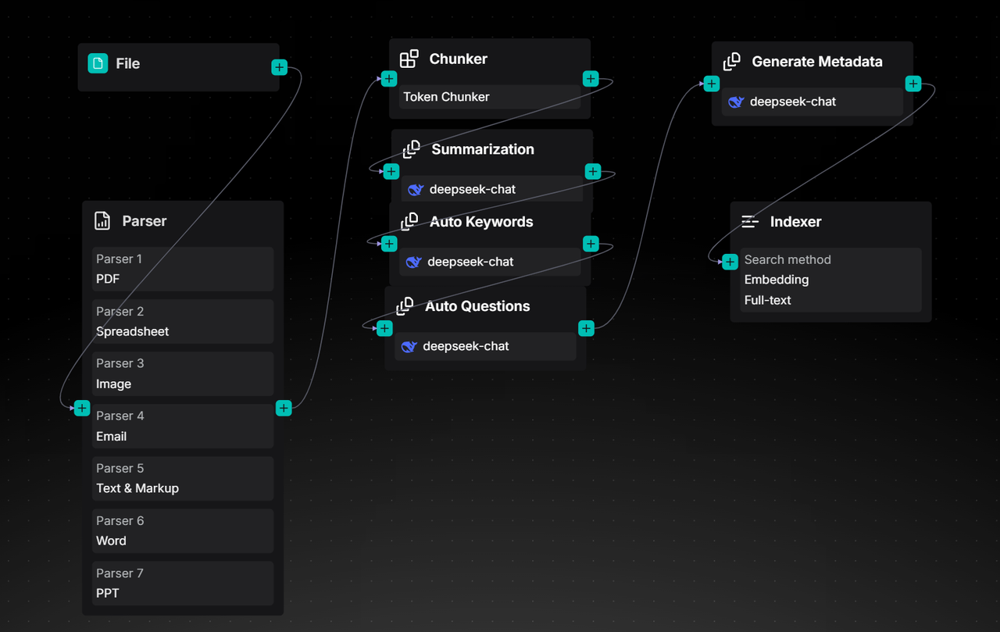

# Introduction to the Ingestion Pipeline

The Ingestion Pipeline is essentially a visual ETL process tailored for unstructured data. Built upon an Agent foundation, it restructures a typical RAG data ingestion workflow—which usually encompasses key stages such as document parsing, text chunking, vectorization, and index construction—into three distinct phases: Parser, Transformer, and Indexer. These phases correspond to document parsing, data transformation, and index construction, respectively.

- Document Parsing: As a critical step in data cleaning, this module integrates multiple parsing models, with DeepDoc being a representative example. It transforms raw unstructured data into semi-structured content, laying the groundwork for subsequent processing.
- Data Transformation: Currently offering two core types of operators, including Chunker and Transformer, this phase aims to further process the cleaned data into formats suitable for various index access methods, thereby ensuring high-quality recall performance.
- Index Construction: Responsible for the final data write-in. RAGFlow inherently adopts a multi-path recall architecture to guarantee retrieval effectiveness. Consequently, the Indexer incorporates multiple indexing methods, allowing users to configure them flexibly.

Below, we will demonstrate the construction and use of the Ingestion Pipeline through a specific example.

First, click on "Create agent" on the "Agent" page. You can choose "Create from blank" to create an Ingestion Pipeline from scratch:

Alternatively, you can select "Create from template" to utilize a pre-configured Ingestion pipeline template:

Next, we will begin to arrange various operators required for the Pipeline. When creating from scratch, only the Begin and Parser operators will be displayed on the initial canvas. Subsequently, you can drag and connect additional operators with different functions from the right side of the existing operators.

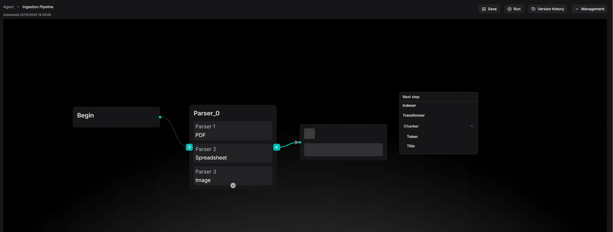

First, it is necessary to configure the Parser operator.

## Parser

The Parser operator is responsible for reading and parsing documents: identifying their layouts, extracting structural and textual information from them, and ultimately obtaining structured document data.

This represents a "high-fidelity, structured" extraction strategy. The Parser intelligently adapts to and preserves the original characteristics of different files, whether it's the hierarchical outline of a Word document, the row-and-column layout of a spreadsheet, or the complex layout of a scanned PDF. It not only extracts the main text but also fully retains auxiliary information such as titles, tables, headers, and footers, transforming them into appropriate data forms, which will be detailed below. This structured differentiation is crucial, providing the necessary foundation for subsequent refined processing.

Currently, the Parser operator supports input from 8 major categories encompassing 23 file types, summarized as follows:

When in use, simply click "Add Parser" within the Parser node and select the desired file category (such as PDF, Image, or PPT). When the Ingestion pipeline is running, the Parser node will automatically identify the input file and route it to the corresponding parser for parsing.

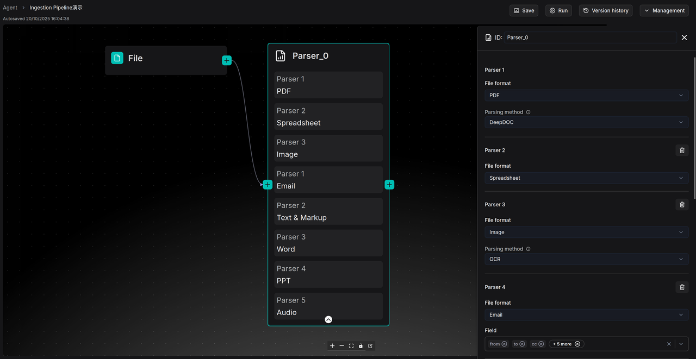

Here, we provide further explanations for the parsers of several common file categories:

- For PDF files, RAGFlow offers multiple parsing model options, with a unified output in JSON format:

  1. Default DeepDoc: This is RAGFlow's built-in document understanding model, capable of recognizing layout, columns, and tables. It is suitable for processing scanned documents or those with complex formatting.
  2. MinerU: Currently an outstanding document parsing model in the industry. Besides parsing complex document content and layouts, MinerU also provides excellent parsing for complex file elements such as mathematical formulas.
  3. Naive: A pure text extraction method without using any models. It is suitable for documents with no complex structure or non-textual elements.

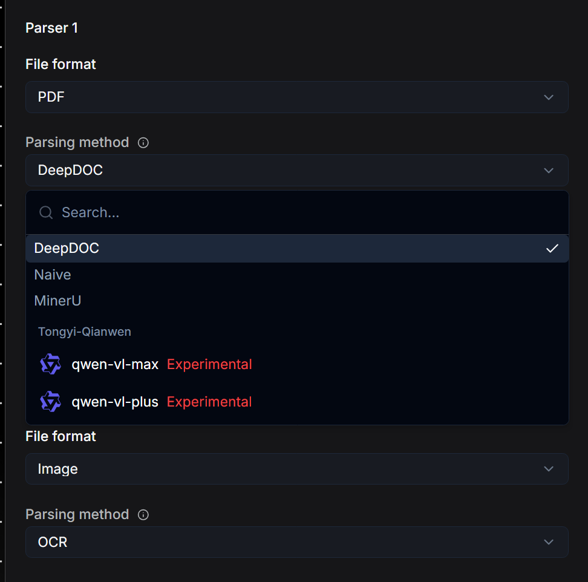
  
- For Image files, the system will by default invoke OCR to extract text from the image. Additionally, users can also configure VLMs (Vision Language Models) that support visual recognition to process them.

- For Audio files, it is necessary to configure a model that supports speech-to-text conversion. The Parser will then extract the textual content from the Audio. Users can configure the API keys of model providers that support this type of parsing on the "Model provider" page of the homepage. After that, they can return to the Parser node and select it from the dropdown menu. This "configure first, then select" logic also applies to PDF, Image, and Video files.

- For Video files, it is necessary to configure a large model that supports multimodal recognition. The Parser will invoke this model to conduct a comprehensive analysis of the video and output the results in text format.

- When parsing Email files, RAGFlow provides Field options, allowing users to select only the desired fields, such as "subject" and "body." The Parser will then precisely extract the textual content of these fields.

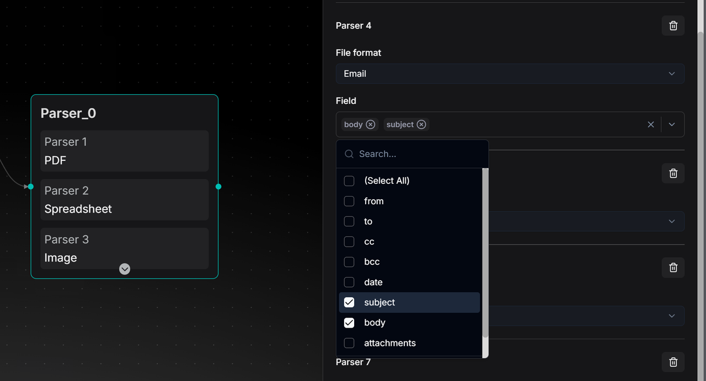

- The Spreadsheet parser will output the file in HTML format, preserving its row and column structure intact to ensure that the tabular data remains clear and readable after conversion.
- Files of Word and PPT types will be parsed and output in JSON format. For Word files, the original hierarchical structure of the document, such as titles, paragraphs, lists, headers, and footers, will be retained. For PPT files, the content will be extracted page by page, distinguishing between the title, main text, and notes of each slide.
- The Text & Markup category will automatically strip formatting tags from files such as HTML and MD (Markdown), outputting only the cleanest text content.

## Chunker

The Chunker node is responsible for dividing the documents output by upstream nodes into Chunk segments. Chunk is a concept introduced by RAG technology, representing the unit of recall. Users can choose whether to add a Chunker node based on their needs, but it is generally recommended to use it for two main reasons:

1. If the entire document is used as the unit for recall, the data passed to the large model during the final generation phase may exceed the context window limit.
2. In typical RAG systems, vector search serves as an important recall method. However, vectors inherently have issues with inaccurate semantic representation. For example, users can choose to convert a single sentence into a vector or the entire document into a vector. The former loses global semantic information, while the latter loses local information. Therefore, selecting an appropriate segment length to achieve a relatively good balance when represented by a single vector is an essential technical approach.

In practical engineering systems, how the Chunk segmentation results are determined often significantly impacts the recall quality of RAG. If content containing the answer is split across different Chunks, and the Retrieval phase cannot guarantee that all these Chunks are recalled, it can lead to inaccurate answer generation and hallucinations. Therefore, the Ingestion pipeline introduces the Chunker node, allowing users to slice text more flexibly.

The current system incorporates two built-in segmentation methods: segmentation based on text tokens and titles.

Segmentation by tokens is the most common approach. Users can customize the size of each segment, with a default setting of 512 tokens, which represents a balance optimized for retrieval effectiveness and model compatibility. When setting the segment size, trade-offs must be considered: if the segment token count remains too large, portions exceeding the model's limit will still be discarded; if set too small, it may result in excessive segmentation of coherent semantics in the original text, disrupting context and affecting retrieval effectiveness.

To address this, the Chunker operator provides a segment overlap feature, which allows the end portion of the previous segment to be duplicated as the beginning of the next segment, thereby enhancing semantic continuity. Users can increase the "Overlapped percent" to improve the correlation between segments.

Additionally, users can further optimize segmentation rules by defining "Separators." The system defaults to using \n (newline characters) as separators, meaning the segmenter will prioritize attempting to split along natural paragraphs rather than abruptly truncating sentences in the middle, as shown in the following figure.

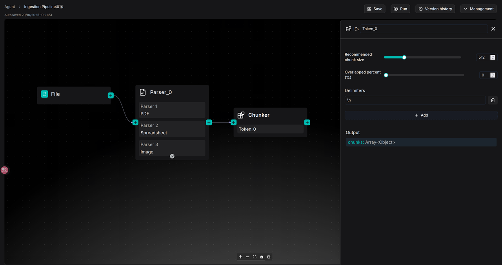

If the document itself has a clear chapter structure, segmenting the text by tokens may not be the optimal choice. In such cases, the Title option in the Chunker can be selected to slice the document according to its headings. This method is primarily suitable for documents with layouts such as technical manuals, academic papers, and legal clauses. We can customize expressions for headings at different levels in the Title node. For example, the expression for a first-level heading (H1) can be set as ^#[^#], and for a second-level heading (H2) as ^##[^#]. Based on these expressions, the system will strictly slice the document according to the predefined chapter structure, ensuring that each segment represents a structurally complete "chapter" or "subsection." Users can also freely add or reduce heading levels in the configuration to match the actual structure of the document, as shown in the following figure.

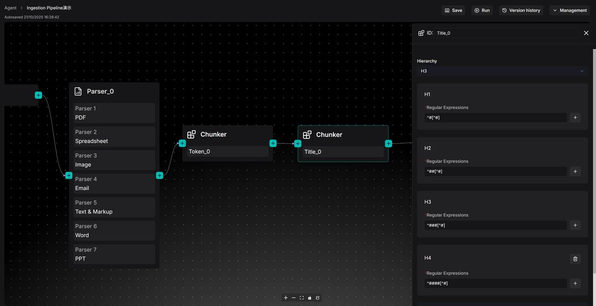

Note: In the current RAGFlow v0.21 version, if both the Token and Title options of the Chunker are configured simultaneously, please ensure that the Title node is connected after the Token node. Otherwise, if the Title node is directly connected to the Parser node, format errors may occur for files of types Email, Image, Spreadsheet, and Text&Markup. These limitations will be optimized in subsequent versions.

## Transformer

The Transformer operator is responsible for transforming textual content. Simply resolving the accuracy of text parsing and segmentation does not guarantee the final retrieval accuracy. This is because there is always a so-called "semantic gap" between a user's query and the documents containing the answers. By using the Transformer operator, users can leverage large models to extract information from the input document content, thereby bridging the "semantic gap."

The current Transformer operator supports functions such as summary generation, keyword generation, question generation, and metadata generation. Users can choose to incorporate this operator into their pipeline to supplement the original data with these contents, thereby enhancing the final retrieval accuracy. Similar to other scenarios involving large models, the Transformer node also offers three modes for the large model: Improvise, Precise, and Balance.

- Improvise (Improvisational Mode) encourages the model to exhibit greater creativity and associative thinking, making it well-suited for generating diverse Questions.
- Precise (Precise Mode) strictly constrains the model to ensure its output is highly faithful to the original text, making it suitable for generating Summaries or extracting Keywords.
- Balance (Balanced Mode) strikes a balance between the two, making it applicable to most scenarios.

Users can select one of these three styles or achieve finer control by adjusting parameters such as Temperature and Top P on their own.

The Transformer node can generate four types of content: Summary, Keywords, Questions, and Metadata. RAGFlow also makes the prompts for each type of content openly accessible, which means users can enrich and personalize text processing by modifying the system prompts.

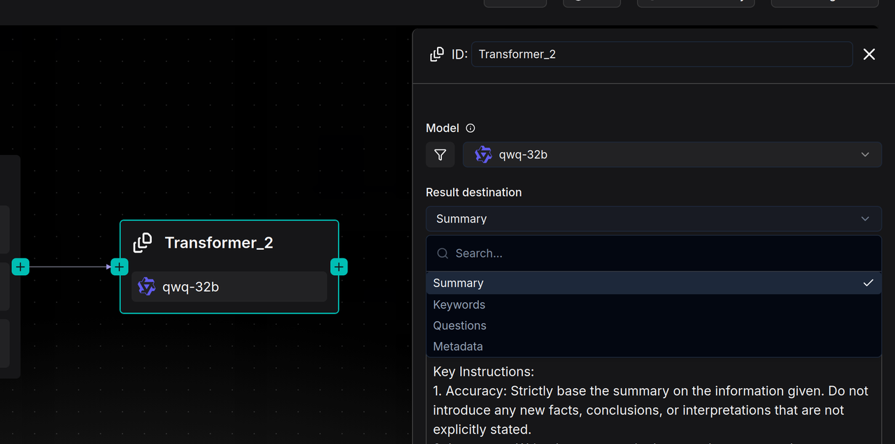

If multiple functions need to be implemented, such as summarizing content and extracting keywords simultaneously, users are required to configure a separate Transformer node for each function and connect them in series within the Pipeline. In other words, a Transformer node can be directly connected after the Parser to process the entire document (e.g., generating a full-text summary), or it can be connected after the Chunker to process each text segment (e.g., generating questions for each Chunk). Additionally, a Transformer node can be connected after another Transformer node to perform complex content extraction and generation in a cascaded manner.

Please note: The Transformer node does not automatically acquire content from its preceding nodes. The actual source of information it processes entirely depends on the variables referenced in the User prompt. In the User prompt, variables output by upstream nodes must be manually selected and referenced by entering the / symbol.

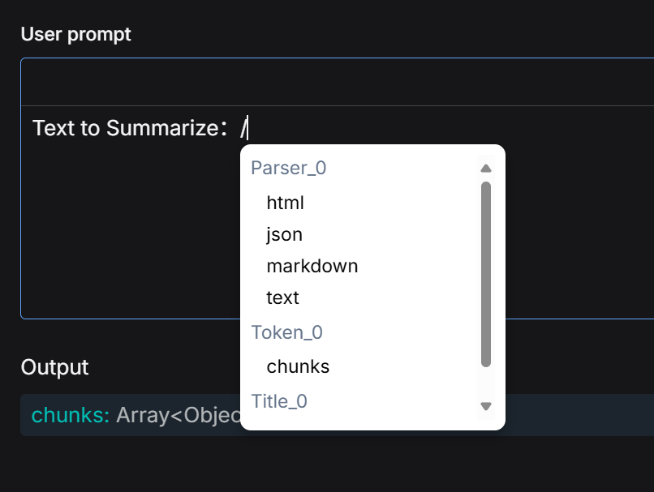

For example, in a Parser - Chunker - Transformer pipeline, even though the Transformer is visually connected after the Chunker, if the variable referenced in the User prompt is the output from the Parser node, then the Transformer will actually process the entire original document rather than the chunks generated by the Chunker.

Similarly, when users choose to connect multiple Transformer nodes in series (e.g., the first one generates a Summary, and the second one generates Keywords), if the second Transformer references the Summary variable generated by the first Transformer, it will process this Summary as the "new original text" for further processing, rather than handling the text chunks from the more upstream Chunker.

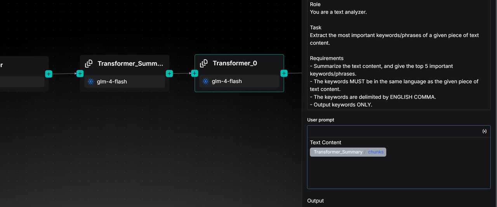

## Indexer

The preceding Parser, Chunker, and Transformer nodes handle data inflow, segmentation, and optimization. However, the final execution unit in the Pipeline is the Indexer node, which is responsible for writing the processed data into the Retrieval engine (RAGFlow currently supports Infinity, Elasticsearch, and OpenSearch).

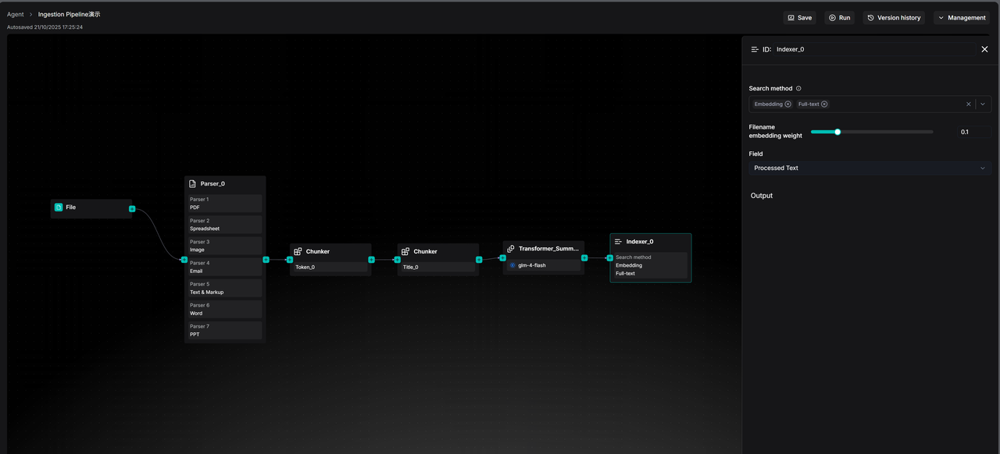

The core capability of the Retrieval engine is to establish various types of indexes for data, thereby providing search capabilities, including vector indexing, full-text indexing, and future tensor indexing capabilities, among others. In other words, it is the ultimate embodiment of "Retrieval" in the term RAG.

Due to the varying capabilities of different types of indexes, the Indexer simultaneously offers options for creating different indexes. Specifically, the Search method option within the Indexer node determines how user data can be "found."

Full-text refers to traditional "keyword search," which is an essential option for precise recall, such as searching for a specific product number, person's name, or code. Embedding, on the other hand, represents modern AI-driven "semantic search." Users can ask questions in natural language, and the system can "understand" the meaning of the question and retrieve the most relevant document chunks in terms of content. Enabling both simultaneously for hybrid search is the default option in RAGFlow. Effective multi-channel recall can balance precision and semantics, maximizing the discovery of text segments where answers reside.

Note: There is no need to select a specific Embedding model within the Indexer node, as it will automatically invoke the embedding model set when creating the knowledge base. Additionally, the Chat, Search, and Agent functionalities in RAGFlow support cross-knowledge base retrieval, meaning a single question can be searched across multiple knowledge bases simultaneously. However, to enable this feature, **a prerequisite must be met**: all simultaneously selected knowledge bases must utilize the same Embedding model. This is because different embedding models convert the same text into completely different and incompatible vectors, preventing cross-base retrieval.

Furthermore, finer retrieval settings can be achieved through the Filename embedding weight and Field options. The Filename embedding weight is a fine-tuning slider that allows users to consider the "filename" of a document as part of the semantic information and assign it a specific weight.

The Field option, on the other hand, determines the specific content to be indexed and the retrieval strategy. Currently, three distinct strategy options are provided:

- Processed Text: This is the default option and the most intuitive. It means that the Indexer will index the processed text chunks from preceding nodes.
- Questions: If a Transformer node is used before the Indexer to generate "potential questions that each text chunk can answer," these Questions can be indexed here. In many scenarios, matching "user questions" with "pre-generated questions" yields significantly higher similarity than matching "questions" with "answers" (i.e., the original text), effectively improving retrieval accuracy.
- Augmented Context: This involves using Summaries instead of the original text for retrieval. It is suitable for scenarios requiring quick broad topic matching without being distracted by the details of the original text.

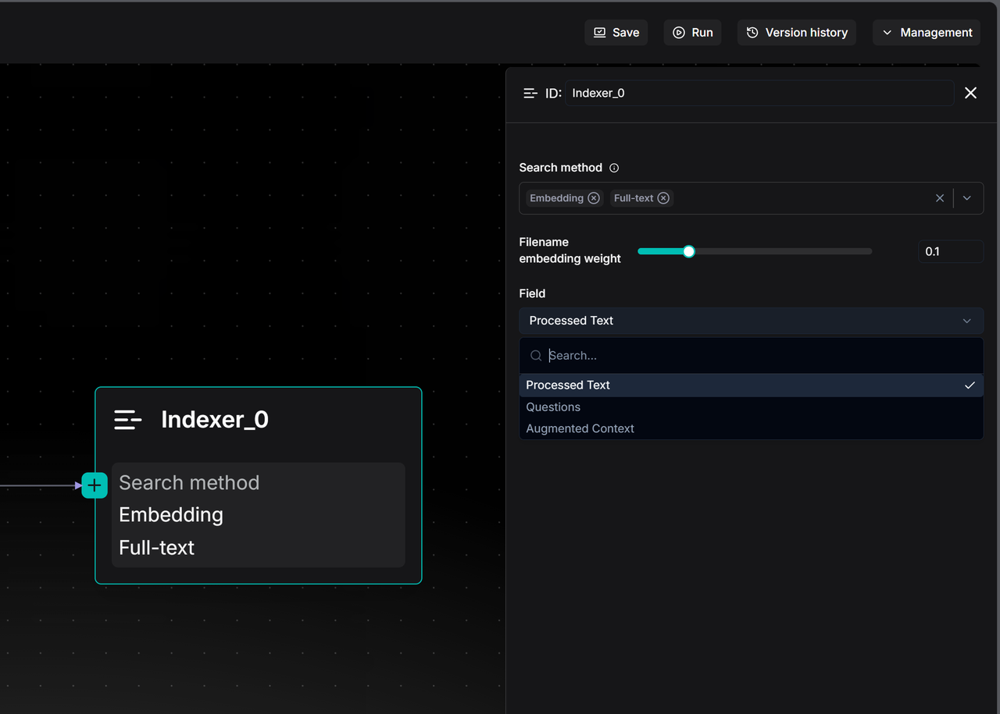

# Link the Ingestion Pipeline to the Knowledge Base

After constructing an Ingestion pipeline, the next step is to associate it with the corresponding knowledge base. On the page for creating a knowledge base, locate and click the "Choose pipeline" option under the "Ingestion pipeline" tab. Subsequently, select the already created Pipeline from the dropdown menu to establish the association. Once set, this Pipeline will become the default file parsing process for this knowledge base.

For an already created knowledge base, users can enter its "Ingestion pipeline" module at any time to readjust and reselect the associated parsing process.

If users wish to adjust the Ingestion pipeline for a single file, they can also do so by clicking on the Parse location to make adjustments.

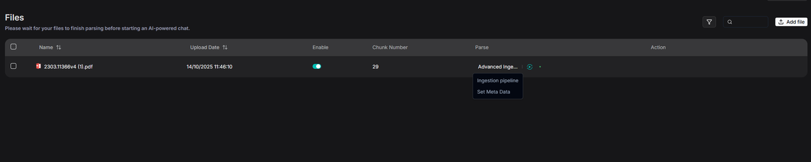

Finally, make adjustments and save the updates in the pop-up window.

## Logs

The execution of an Ingestion Pipeline may take a considerable amount of time, making observability an indispensable capability. To this end, RAGFlow provides a log panel for the Ingestion pipeline, which records the full-chain logs for each file parsing operation. For files parsed through the Ingestion Pipeline, users can delve into the operational details of each processing node. This offers comprehensive data support for subsequent issue auditing, process debugging, and performance insights.

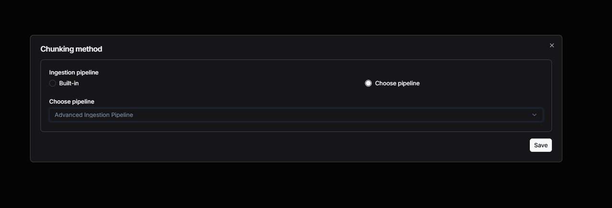

The following image is an example diagram of step logs.

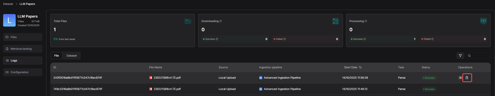

# Case Reference

When creating a Pipeline, you can select the "Chunk Summary" template as the foundation for construction, although you also have the option to choose other templates as starting points for subsequent building.

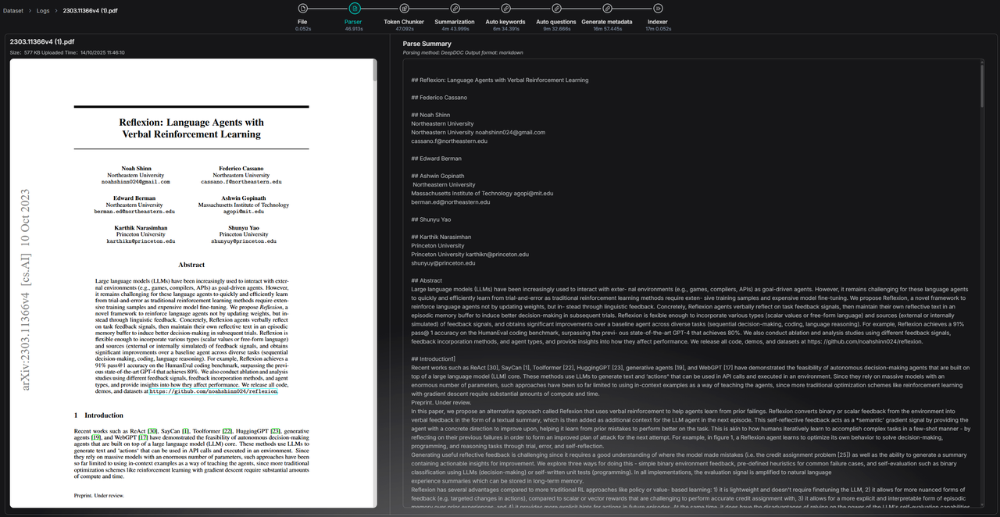

The orchestration design of the "Chunk Summary" template is as follows:

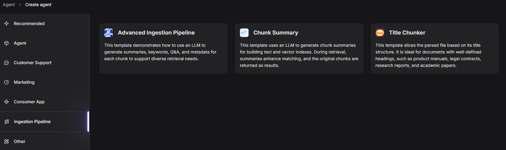

Next, switch the large model in the Transformer node to the desired model and set the "Result destination" field to "Metadata." This configuration means that the processing results (such as summaries) of the large model on text chunks will be directly stored in the file's metadata, providing capability support for subsequent precise retrieval and filtering.

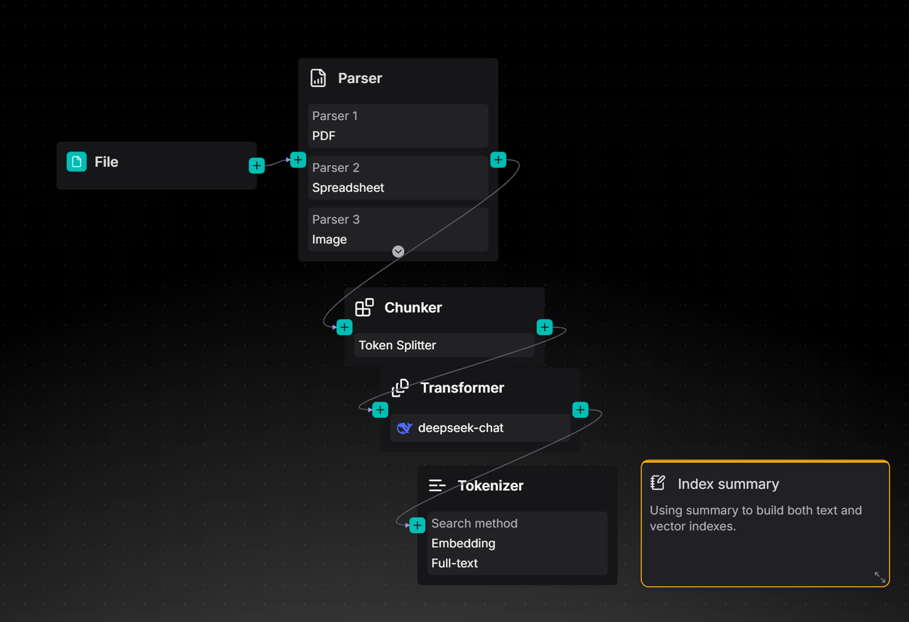

Click Run in the top right corner and upload a file to test the pipeline:

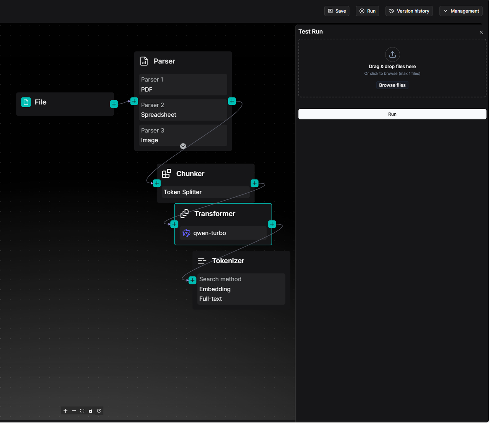

You can click View result to check the test run results:

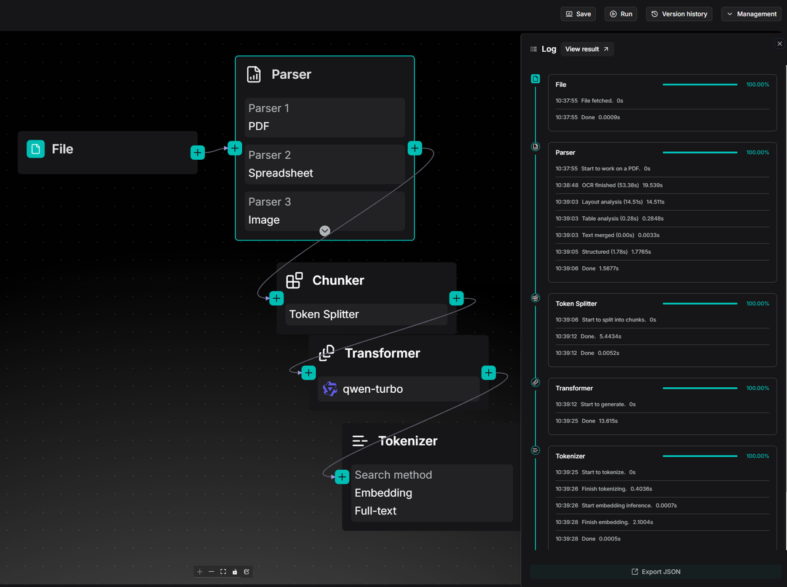

# Summary

The above content provides a comprehensive introduction to the usage methods and core capabilities of the current Ingestion pipeline. Looking ahead, RAGFlow will continue to evolve in terms of data import and parsing clarity, including the following specific enhancements:

1. Expanding Data Source Support: In addition to local file uploads, we will gradually integrate various data sources such as S3, cloud storage, email, online notes, and more. Through automatic and manual synchronization mechanisms, we will achieve seamless data import into knowledge bases, automatically applying the Ingestion pipeline to complete document parsing.
2. Enhancing Parsing Capabilities: We will integrate more document parsing models, such as Docling, into the Parser operator to cover parsing needs across different vertical domains, comprehensively improving the quality and accuracy of document information extraction.
3. Opening Up Custom Slicing Functionality: In addition to built-in Chunker types, we will gradually open up underlying slicing capabilities, allowing users to write custom slicing logic for more flexible and controllable text organization.
4. Strengthening the Extensibility of Semantic Enhancement: Building on existing capabilities for summarization, keyword extraction, and question generation, we will further support customizable semantic enhancement strategies in a programmable manner, providing users with more technical means to optimize retrieval and ranking.

Through these enhancements, RAGFlow will continuously improve retrieval accuracy, serving as a robust support for providing high-quality context to large models.

Finally, we appreciate your attention and support. We welcome you to star RAGFlow on GitHub and join us in witnessing the continuous evolution of large model technology!

GitHub:  https://github.com/infiniflow/ragflow
