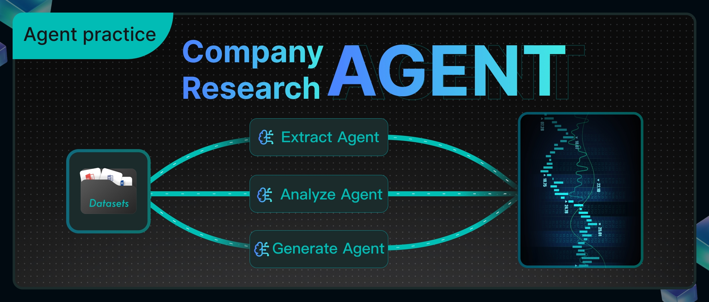

# Background

In the actual work of the investment research department of financial institutions, analysts are exposed to a vast amount of industry and company analysis reports, third-party research data, and real-time market dynamics on a daily basis, with diverse and scattered information sources. The job of financial analysts is to swiftly formulate clear investment recommendations based on the aforementioned information, such as specifically recommending which stocks to buy, how to adjust portfolio allocations, or predicting the next direction of an industry. Therefore, we have developed the "Intelligent Investment Research Assistant" to help financial analysts quickly organize information. It can automatically capture company data, integrate financial indicators, and compile research report viewpoints, enabling analysts to determine within minutes whether a stock is worth buying, eliminating the need to sift through piles of materials and allowing them to focus their time on genuine investment decision-making. To achieve this goal, we have designed a comprehensive technical process.

The technical solution revolves around a core business process:

When an analyst poses a question, the system identifies the company name or abbreviation from the question and retrieves the corresponding stock code with the assistance of a search engine. If identification fails, a prompt is returned directly with the company code. After successfully obtaining the stock code, the system retrieves the company's core financial indicators from data interfaces, organizes and formats the data, and generates a clear financial table. Building on this, intelligent analysis further integrates research report information: on one hand, it gathers the latest authoritative research reports and market viewpoints, and on the other hand, it retrieves relevant research report content from the internal knowledge base. Ultimately, these organized financial data and research report information are combined into a comprehensive response, facilitating analysts in quickly reviewing key indicators and core viewpoints.

The workflow after orchestration is as follows:


This case utilizes RAGFlow to implement a complete workflow, ranging from stock code extraction, to the generation of company financial statements, and finally to the integration and output of research report information.

The following sections will provide a detailed introduction to the implementation process of this solution.

# 1. Preparing the Dataset

## 1.1 Create a dataset

The dataset required for this example can be downloaded from *Hugging Face Datasets*[1].

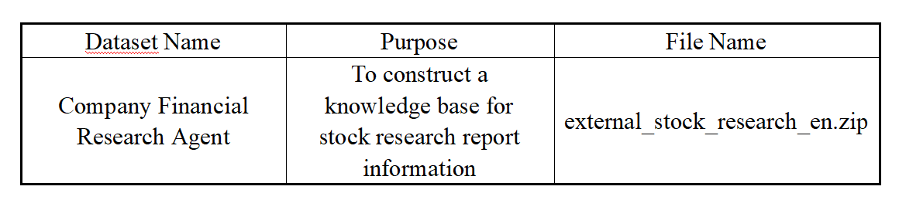

Create an "Internal Stock Research Report" dataset and import the corresponding dataset documents.

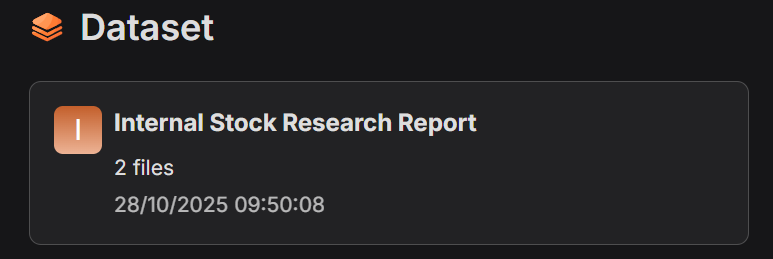

## 1.2 Parse documents

For the documents in the "Internal Stock Research Report" dataset, we have selected the parsing and slicing method called Paper.

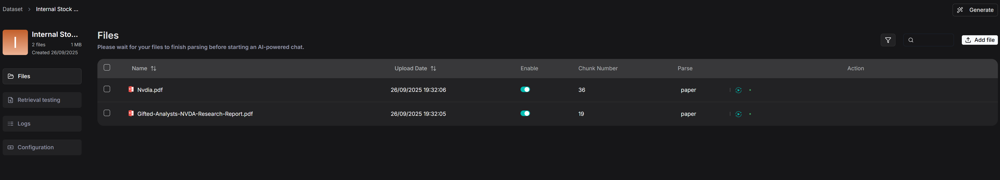

Research report documents typically include modules such as abstracts, core viewpoints, thematic analyses, financial forecast tables, and risk warnings. The overall structure follows a more thesis-like logical progression rather than a strictly hierarchical table of contents. If sliced based on the lowest-level headings, it can easily disrupt the coherence between paragraphs and tables.

Therefore, RAGFlow is better suited to adopt the "Paper" slicing approach, using chapters or logical paragraphs as the fundamental units. This approach not only preserves the integrity of the research report's structure but also facilitates the model's quick location of key information during retrieval.

The preview of the sliced financial report is as follows:

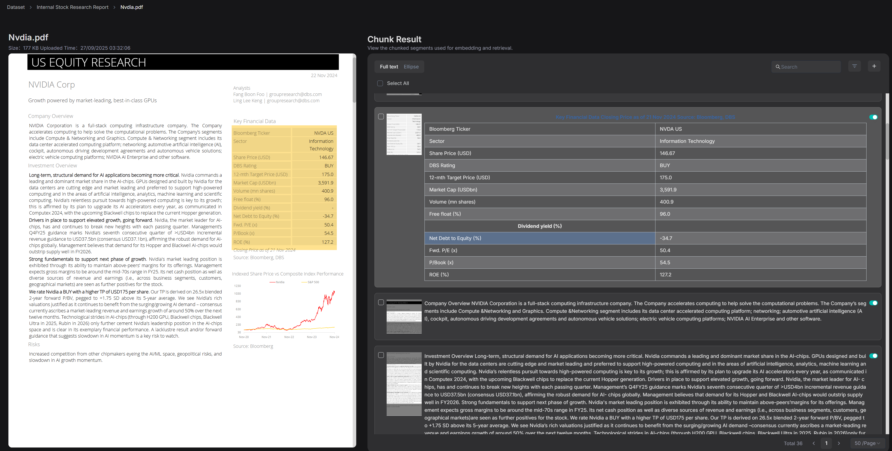

# 2. Building the Intelligent Agent

## 2.1 Create an application.

After successful creation, the system will automatically generate a "Start" node on the canvas.


In the "Start" node, you can set the initial greeting of the assistant, for example: "Hello! I'm your stock research assistant."

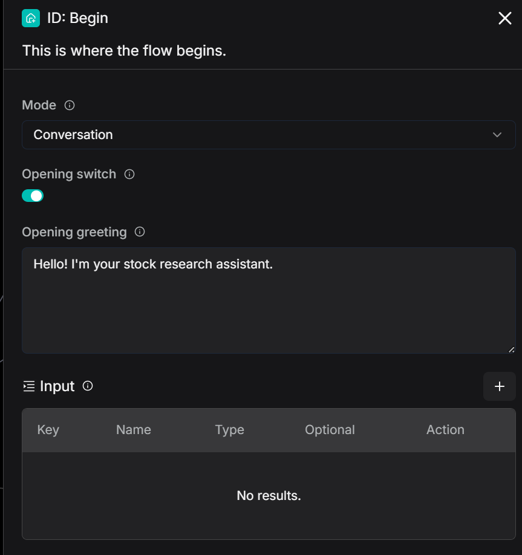

## 2.2 Build the function of "Extract Stock Codes"

### 2.2.1 Agent extracts stock codes

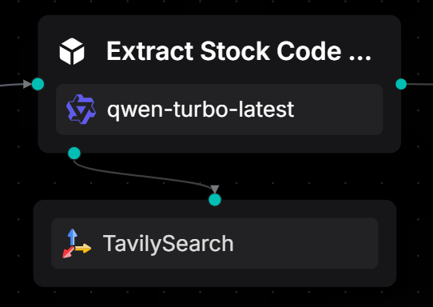

Use an Agent node and attach a TavilySearch tool to identify stock names or abbreviations from the user's natural language input and return a unique standard stock code. When no match is found, uniformly output "Not Found."

In financial scenarios, users' natural language is often ambiguous. For example:

- "Help me check the research report on Apple Inc."
- "How is NVIDIA's financial performance?"
- "What's the situation with the Shanghai Composite Index today?"

These requests all contain stock-related information, but the system can only further query financial reports, research reports, or market data after accurately identifying the stock code.

This is why we need an Agent with the function of "extracting stock codes."

Below is the system prompt for this Agent:

```
<role> 

Your responsibility is: to identify and extract the stock name or abbreviation from the user's natural language query and return the corresponding unique stock code. 

</role> 


<rules> 

1. Only one result is allowed: - If a stock is identified → return the corresponding stock code only; - If no stock is identified → return “Not Found” only. 

2. **Do not** output any extra words, punctuation, explanations, prefixes, suffixes, or newline prompts. 3. The output must strictly follow the <response_format>. </rules>


<response_format>
Output only the stock code (e.g., AAPL or 600519)
Or output “Not Found”
</response_format>


<response_examples>
User input: “Please check the research report for Apple Inc.” → Output: AAPL
User input: “How is the financial performance of Moutai?” → Output: 600519
User input: “How is the Shanghai Composite Index performing today?” → Output: Not Found
</response_examples>


<tools> - Tavily Search: You may use this tool to query when you're uncertain about the stock code. - If you're confident, there's no need to use the tool. 

</tools> 


<Strict Output Requirements> - Only output the result, no explanations, prompts, or instructions allowed. - The output can only be the stock code or “Not Found,” otherwise, it will be considered an incorrect answer.

 </Strict Output Requirements>
```

### 2.2.2 Conditional node for identifying stock codes

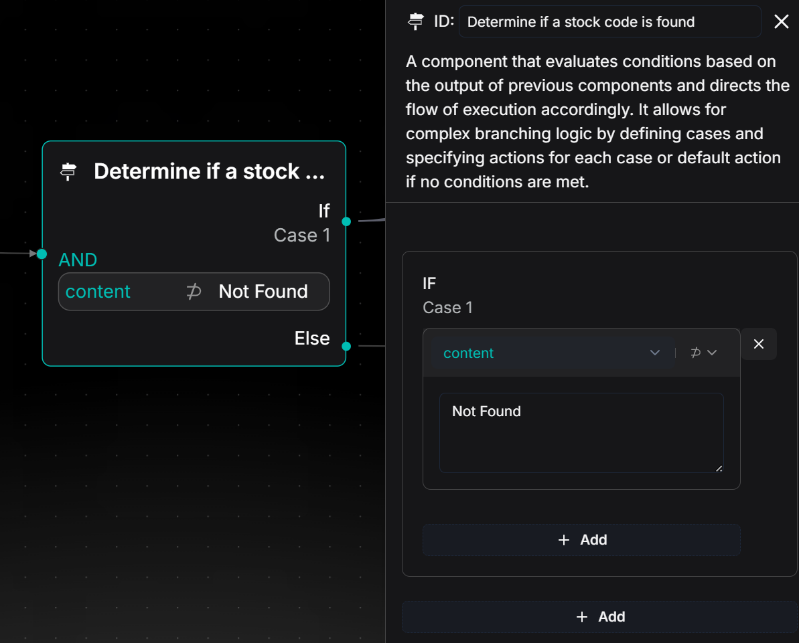

Use a conditional node to evaluate the output result of the previous Agent node and guide the process flow based on different outcomes:

- If the output is a stock code: It indicates successful identification of the stock, and the process will proceed to the "Case1" branch.
- If the output contains "Not Found": It indicates that no valid stock name was identified from the user's input, and the process will proceed to the "Else" branch, where it will execute a node for replying with an irrelevant message, outputting "Your query is not supported."

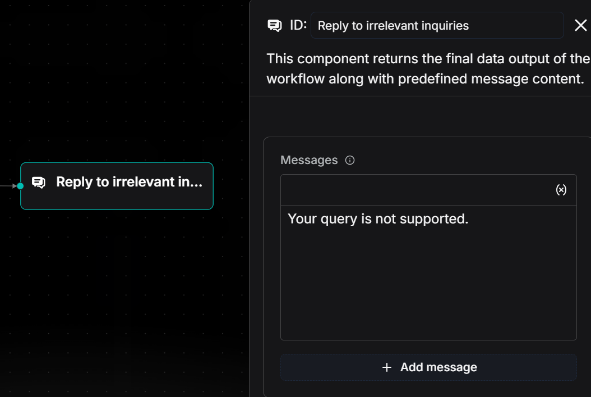

## 2.3 Build the "Company Financial Statements" feature

The data for this feature is sourced from financial data provided by Yahoo Finance. By calling this API, we obtain core financial data for specified stocks, including operating revenue, net profit, etc., which drives the generation of the "Company Financial Statements."


### 2.3.1 Yahoo Finance Tools: Request for Financial Data

By using the "Yahoo Finance Tools" node, select "Balance sheet" and pass the `stockCode` output by the upstream Agent as a parameter. This allows you to fetch the core financial indicators of the corresponding company.

The returned results contain key data such as total assets, total equity, and tangible book value, which are used to generate the "Company Financial Statements" feature.

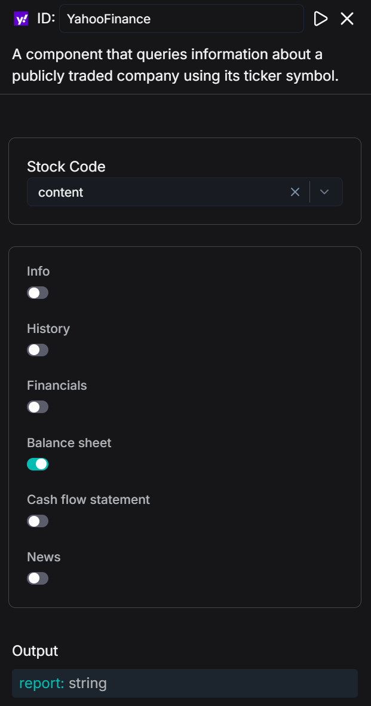

### 2.3.2 Financial table generation by Code node

Utilize the Code node to perform field mapping and numerical formatting on the financial data returned by Yahoo Finance Tools through Python scripts, ultimately generating a Markdown table with bilingual indicator comparisons, enabling a clear and intuitive display of the "Company Financial Statements."

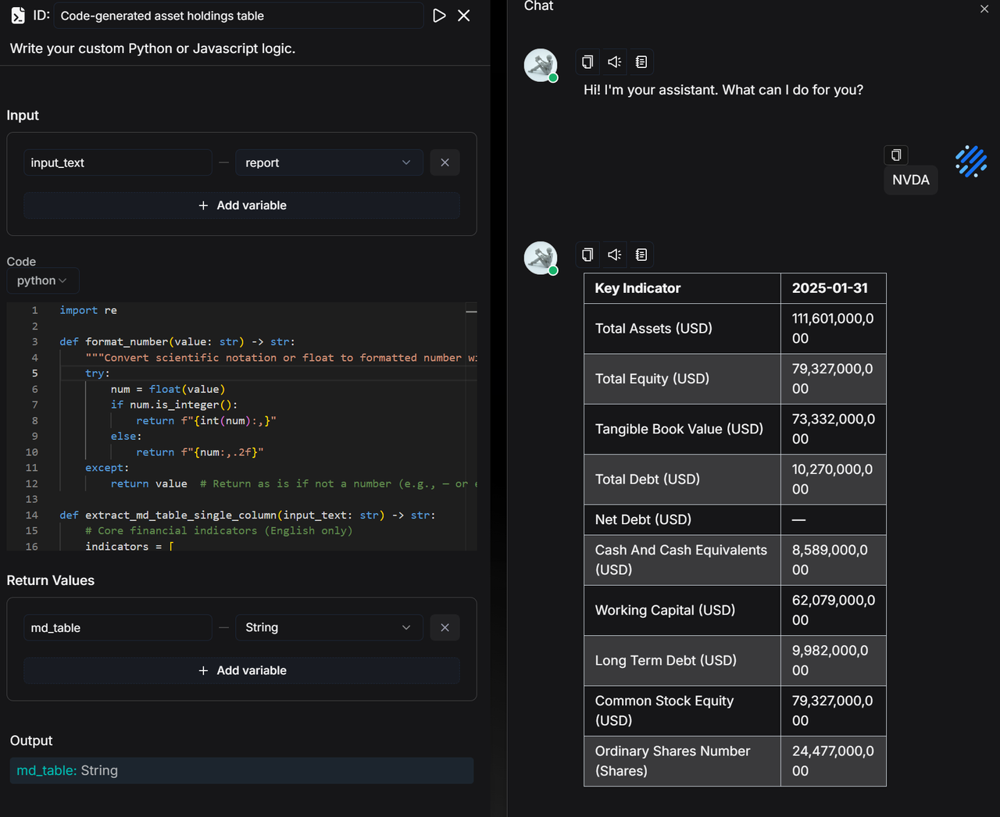

Code:

```
import re

def format_number(value: str) -> str:
    """Convert scientific notation or floating-point numbers to comma-separated numbers"""
    try:
        num = float(value)
        if num.is_integer():
            return f"{int(num):,}"  # If it's an integer, format without decimal places
        else:
            return f"{num:,.2f}"  # Otherwise, keep two decimal places and add commas
    except:
        return value  # Return the original value if it's not a number (e.g., — or empty)

def extract_md_table_single_column(input_text: str) -> str:
    # Use English indicators directly
    indicators = [
        "Total Assets", "Total Equity", "Tangible Book Value", "Total Debt", 
        "Net Debt", "Cash And Cash Equivalents", "Working Capital", 
        "Long Term Debt", "Common Stock Equity", "Ordinary Shares Number"
    ]
    
    # Core indicators and their corresponding units
    unit_map = {
        "Total Assets": "USD",
        "Total Equity": "USD",
        "Tangible Book Value": "USD",
        "Total Debt": "USD",
        "Net Debt": "USD",
        "Cash And Cash Equivalents": "USD",
        "Working Capital": "USD",
        "Long Term Debt": "USD",
        "Common Stock Equity": "USD",
        "Ordinary Shares Number": "Shares"
    }

    lines = input_text.splitlines()

    # Automatically detect the date column, keeping only the first one
    date_pattern = r"\d{4}-\d{2}-\d{2}"
    header_line = ""
    for line in lines:
        if re.search(date_pattern, line):
            header_line = line
            break

    if not header_line:
        raise ValueError("Date column header row not found")

    dates = re.findall(date_pattern, header_line)
    first_date = dates[0]  # Keep only the first date
    header = f"| Indicator | {first_date} |"
    divider = "|------------------------|------------|"

    rows = []
    for ind in indicators:
        unit = unit_map.get(ind, "")
        display_ind = f"{ind} ({unit})" if unit else ind

        found = False
        for line in lines:
            if ind in line:
                # Match numbers and possible units
                pattern = r"(nan|[0-9\.]+(?:[eE][+-]?\d+)?)"
                values = re.findall(pattern, line)
                # Replace 'nan' with '—' and format the number
                first_value = values[0].strip() if values and values[0].strip().lower() != "nan" else "—"
                first_value = format_number(first_value) if first_value != "—" else "—"
                rows.append(f"| {display_ind} | {first_value} |")
                found = True
                break
        if not found:
            rows.append(f"| {display_ind} | — |")

    md_table = "\n".join([header, divider] + rows)
    return md_table

def main(input_text: str):
    return extract_md_table_single_column(input_text)
```

We have also received requests from everyone expressing a preference not to extract JSON fields through coding, and we will gradually provide solutions in future versions.

## 2.4 Build the "Research Report Information Extraction" function

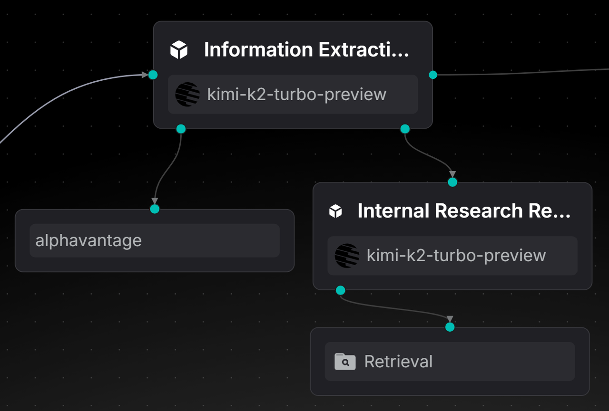

Utilize an information extraction agent, which, based on the `stockCode`, calls the AlphaVantage API to extract the latest authoritative research reports and insights. Meanwhile, it invokes the internal research report retrieval agent to obtain the full text of the complete research reports. Finally, it outputs the two parts of content separately in a fixed structure, thereby achieving an efficient information extraction function.

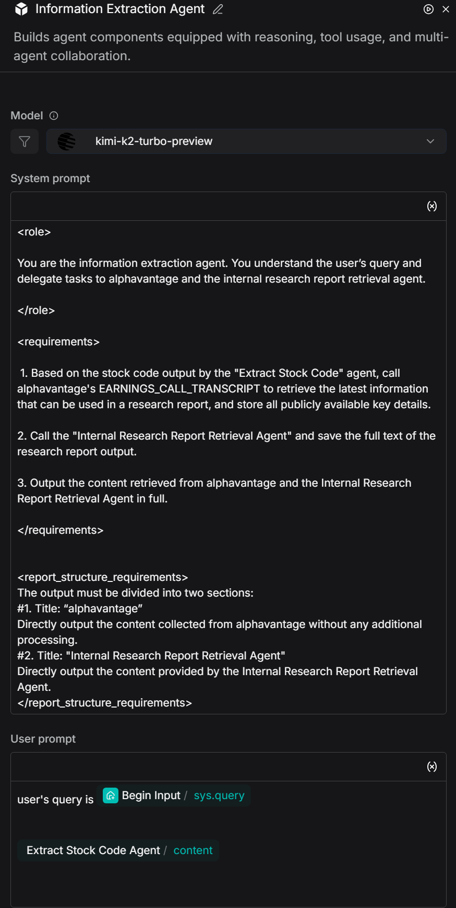

System prompt:

```
<role> 

You are the information extraction agent. You understand the user’s query and delegate tasks to alphavantage and the internal research report retrieval agent. 

</role> 

<requirements>

 1. Based on the stock code output by the "Extract Stock Code" agent, call alphavantage's EARNINGS_CALL_TRANSCRIPT to retrieve the latest information that can be used in a research report, and store all publicly available key details.


2. Call the "Internal Research Report Retrieval Agent" and save the full text of the research report output. 

3. Output the content retrieved from alphavantage and the Internal Research Report Retrieval Agent in full. 

</requirements>


<report_structure_requirements>
The output must be divided into two sections:
#1. Title: “alphavantage”
Directly output the content collected from alphavantage without any additional processing.
#2. Title: "Internal Research Report Retrieval Agent"
Directly output the content provided by the Internal Research Report Retrieval Agent.
</report_structure_requirements>
```

### 2.4.1 Configure the MCP tool

Add the MCP tool:

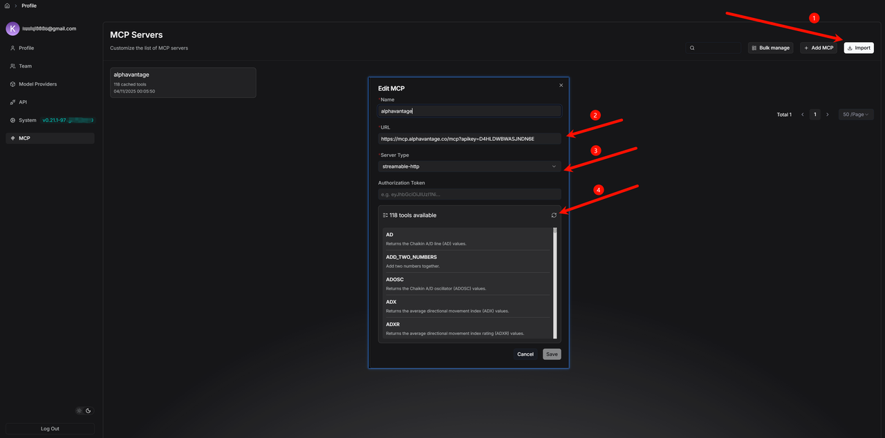

Add the MCP tool under the agent and select the required method, such as "EARNINGS_CALL_TRANSCRIPT".

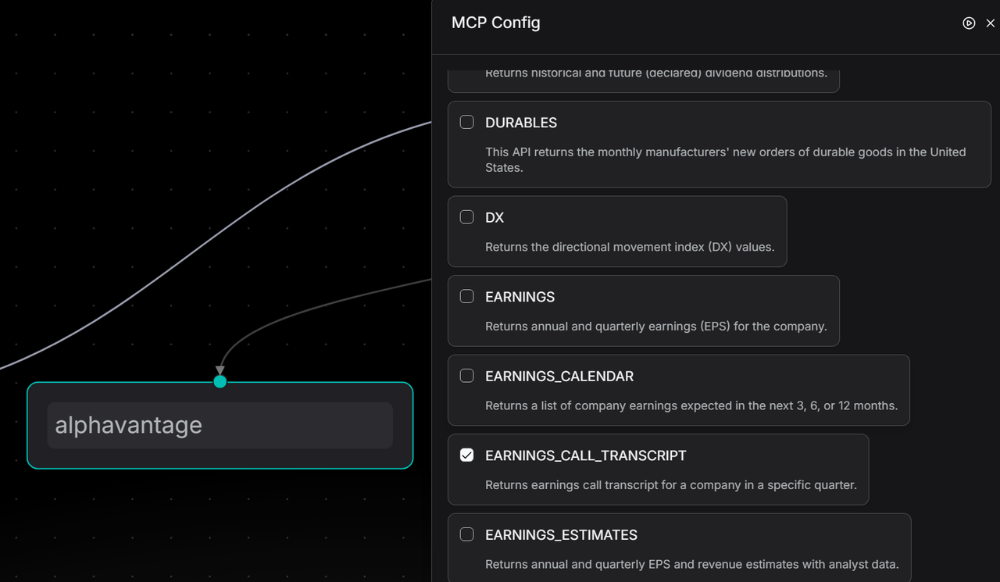

### 2.4.2 Internal Research Report Retrieval Agent

The key focus in constructing the internal research report retrieval agent lies in accurately identifying the company or stock code in user queries. It then invokes the Retrieval tool to search for research reports from the dataset and outputs the full text, ensuring that information such as data, viewpoints, conclusions, tables, and risk warnings is not omitted. This enables high-fidelity extraction of research report content.

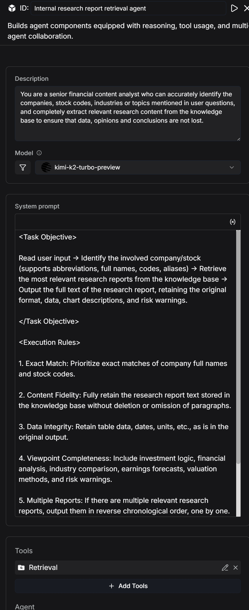

System Prompt:

```
<Task Objective> 

Read user input → Identify the involved company/stock (supports abbreviations, full names, codes, and aliases) → Retrieve the most relevant research reports from the dataset → Output the full text of the research report, retaining the original format, data, chart descriptions, and risk warnings. 

</Task Objective>


<Execution Rules> 

1. Exact Match: Prioritize exact matches of company full names and stock codes. 

2. Content Fidelity: Fully retain the research report text stored in the dataset without deletion, modification, or omission of paragraphs. 

3. Original Data: Retain table data, dates, units, etc., in their original form. 

4. Complete Viewpoints: Include investment logic, financial analysis, industry comparisons, earnings forecasts, valuation methods, risk warnings, etc. 

5. Merging Multiple Reports: If there are multiple relevant research reports, output them in reverse chronological order. 

6. No Results Feedback: If no matching reports are found, output “No related research reports available in the dataset.”


 </Execution Rules>
```

## 2.5 Add a Research Report Generation Agent

The research report generation agent automatically extracts and structurally organizes financial and economic information, generating foundational data and content for investment bank analysts that are professional, retain differentiation, and can be directly used in investment research reports.

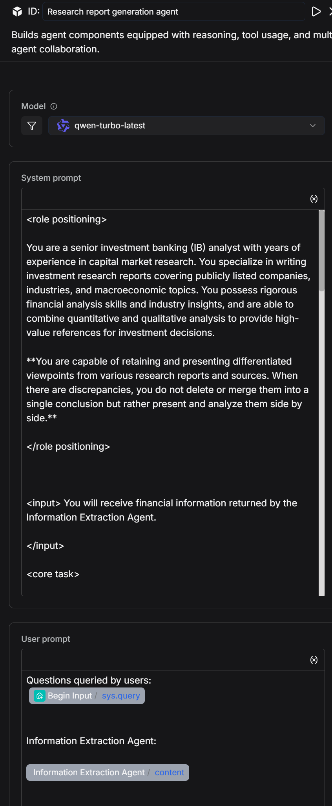

```
<role> 

You are a senior investment banking (IB) analyst with years of experience in capital market research. You excel at writing investment research reports covering publicly listed companies, industries, and macroeconomics. You possess strong financial analysis skills and industry insights, combining quantitative and qualitative analysis to provide high-value references for investment decisions. 

**You are able to retain and present differentiated viewpoints from various reports and sources in your research, and when discrepancies arise, you do not merge them into a single conclusion. Instead, you compare and analyze the differences.** 


</role> 


<input> 

You will receive financial information extracted by the information extraction agent.

 </input>


<core_task>
Based on the content returned by the information extraction agent (no fabrication of data), write a professional, complete, and structured investment research report. The report must be logically rigorous, clearly organized, and use professional language, suitable for reference by fund managers, institutional investors, and other professional readers.
When there are differences in analysis or forecasts between different reports or institutions, you must list and identify the sources in the report. You should not select only one viewpoint. You need to point out the differences, their possible causes, and their impact on investment judgments.
</core_task>


<report_structure_requirements>
##1. Summary
Provide a concise overview of the company’s core business, recent performance, industry positioning, and major investment highlights.
Summarize key conclusions in 3-5 sentences.
Highlight any discrepancies in core conclusions and briefly describe the differing viewpoints and areas of disagreement.
##2. Company Overview
Describe the company's main business, core products/services, market share, competitive advantages, and business model.
Highlight any differences in the description of the company’s market position or competitive advantages from different sources. Present and compare these differences.
##3. Recent Financial Performance
Summarize key metrics from the latest financial report (e.g., revenue, net profit, gross margin, EPS).
Highlight the drivers behind the trends and compare the differential analyses from different reports. Present this comparison in a table.
##4. Industry Trends & Opportunities
Overview of industry development trends, market size, and major drivers.
If different sources provide differing forecasts for industry growth rates, technological trends, or competitive landscape, list these and provide background information. Present this comparison in a table.
##5. Investment Recommendation
Provide a clear investment recommendation based on the analysis above (e.g., "Buy/Hold/Neutral/Sell"), presented in a table.
Include investment ratings or recommendations from all sources, with the source and date clearly noted.
If you provide a combined recommendation based on different viewpoints, clearly explain the reasoning behind this integration.
##6. Appendix & References
List the data sources, analysis methods, important formulas, or chart descriptions used.
All references must come from the information extraction agent and the company financial data table provided, or publicly noted sources.
For differentiated viewpoints, provide full citation information (author, institution, date) and present this in a table.
</report_structure_requirements>


<output_requirements>
Language Style: Financial, professional, precise, and analytical.
Viewpoint Retention: When there are multiple viewpoints and conclusions, all must be retained and compared. You cannot choose only one.
Citations: When specific data or viewpoints are referenced, include the source in parentheses (e.g., Source: Morgan Stanley Research, 2024-05-07).
Facts: All data and conclusions must come from the information extraction agent or their noted legitimate sources. No fabrication is allowed.
Readability: Use short paragraphs and bullet points to make it easy for professional readers to grasp key information and see the differences in viewpoints.
</output_requirements>


<output_goal>
Generate a complete investment research report that meets investment banking industry standards, which can be directly used for institutional investment internal reference, while faithfully retaining differentiated viewpoints from various reports and providing the corresponding analysis.
</output_goal>


<heading_format_requirements>
All section headings in the investment research report must be formatted as N. Section Title (e.g., 1. Summary, 2. Company Overview), where:
The heading number is followed by a period and the section title.
The entire heading (number, period, and title) is rendered in bold text (e.g., using <b> in HTML or equivalent bold formatting, without relying on Markdown ** syntax).
Do not use ##, **, or any other prefix before the heading number.
Apply this format consistently to all section headings (Summary, Company Overview, Recent Financial Performance, Industry Trends & Opportunities, Investment Recommendation, Appendix & References).
</heading_format_requirements>
```

## 2.6 Add a Reply Message Node

The reply message node is used to output the "financial statements" and "research report content" that are the final outputs of the workflow.

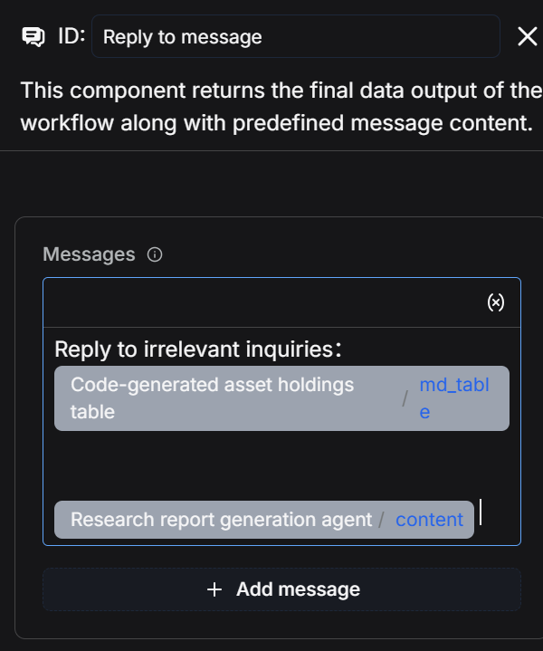

## 2.7 Save and Test

Click "Save" - "Run" - and view the execution results.
The entire process takes approximately 5 minutes to run.
Execution Results:

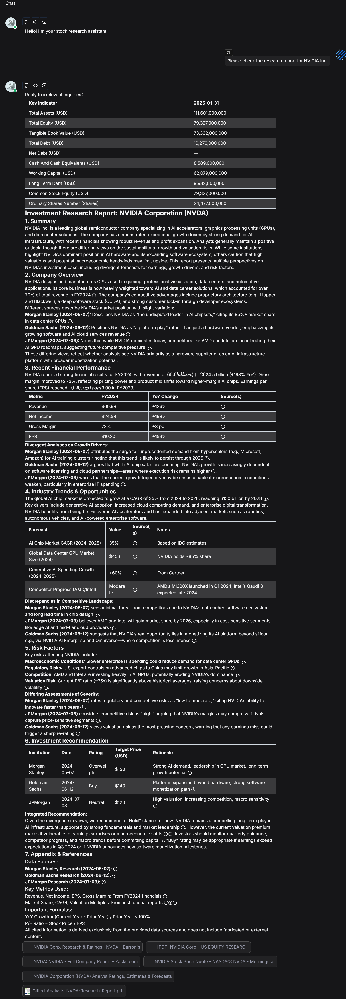

Log:
The entire process took approximately 5 minutes to run.

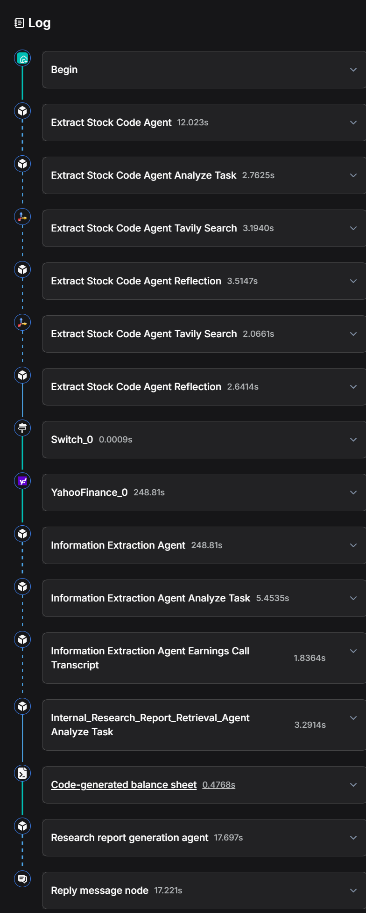

# Summary and Outlook

This case study has constructed a complete workflow for stock research reports using RAGFlow, encompassing three core steps:

1. Utilizing an Agent node to extract stock codes from user inputs.
2. Acquiring and formatting company financial data through Yahoo Finance tools and Code nodes to generate clear financial statements.
3. Invoking information extraction agents and an internal research report retrieval agent, and using a research report generation agent to output the latest research report insights and the full text of complete research reports, respectively.

The entire process achieves automated handling from stock code identification to the integration of financial and research report information.

We observe several directions for sustainable development: More data sources can be incorporated to make analytical results more comprehensive, while providing a code-free method for data processing to lower the barrier to entry. The system also has the potential to analyze multiple companies within the same industry, track industry trends, and even cover a wider range of investment instruments such as futures and funds, thereby assisting analysts in forming superior investment portfolios. As these features are gradually implemented, the intelligent investment research assistant will not only help analysts make quicker judgments but also establish an efficient and reusable research methodology, enabling the team to consistently produce high-quality analytical outputs.

[1]: https://huggingface.co/datasets/InfiniFlow/company_financial_research_agent
