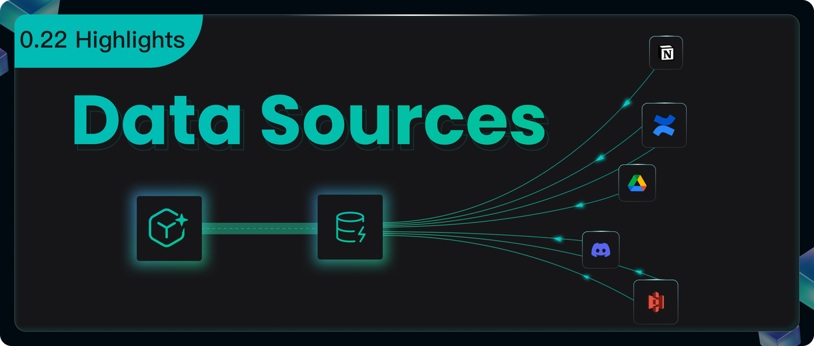

## 0.22 Highlights

Building a RAGFlow dataset involves three main steps: file upload, parsing, and chunking. Version 0.21.0 made the parsing and chunking stages more flexible with the Ingestion pipeline.

This 0.22.0 release focuses on the data upload step to help developers build datasets faster.

We also added these key improvements:

-   The Parser component in the Ingestion pipeline now offers more model choices for better file parsing.
-   We optimized the Agent's **Retrieval** and **Await response** components.
-   A new Admin UI gives you a clearer and easier way to manage the system.

## Support for Rich External Data Sources

The new Data Sources module lets you connect external data to a Dataset. You can now sync files from different places directly into RAGFlow.

Use the "Data Sources" menu in your personal center to add and set up sources like Confluence, AWS S3, Google Drive, Discord, and Notion. This lets you manage all your data in one place and sync it automatically.

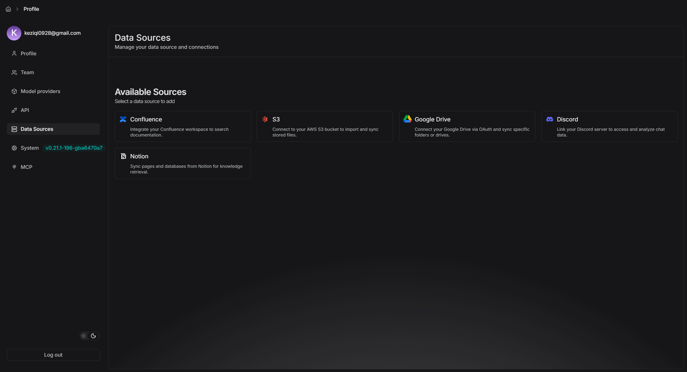

### Example: S3 Configuration

1.  Make sure you have an S3 storage bucket in your AWS account.

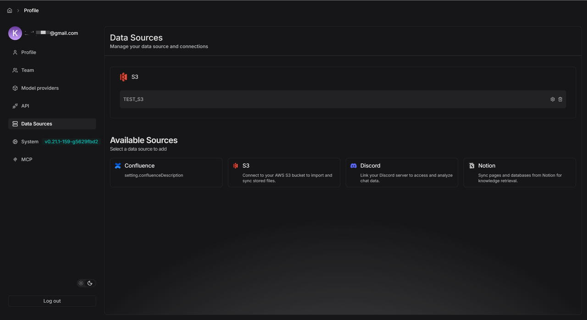

2.  Add your S3 details to the S3 data source form.

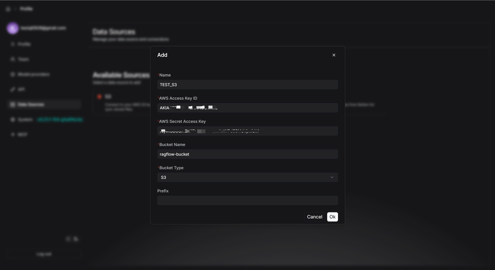

3.  After you add it, click the settings icon to see the data source details.

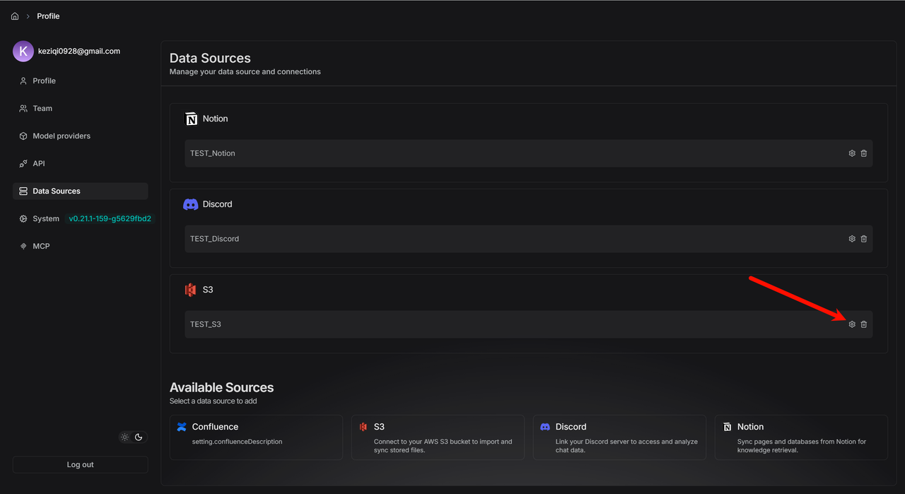

4.  If you set "Refresh Freq" to "1", the system will check for new files every minute.
5.  RAGFlow watches your specified S3 Bucket (like `ragflow-bucket`). If it finds new files, it immediately starts syncing them.
6.  After syncing, it waits one minute before checking again. Use the "Pause" button to turn this automatic refresh on or off anytime.

### Linking Data Sources to a dataset

1.  Create a new dataset (for example, `TEST_S3`).
2.  Click `Configuration` and go to the bottom of the page.
3.  Click `Link Data Source` and pick the data source you want (like S3).

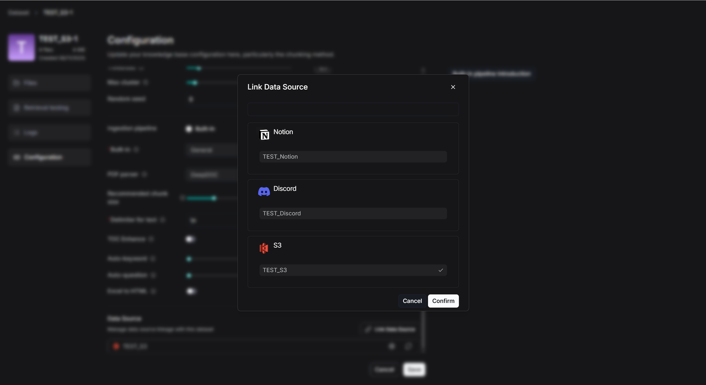

After you link successfully, you'll see three icons:

*   **Rebuild:** Click this to delete all files and logs in the dataset and import everything again.
*   **Settings:** Check the sync logs here.
*   **Unlink:** This disconnects the data source. It keeps all the files already in the dataset but stops new syncs.

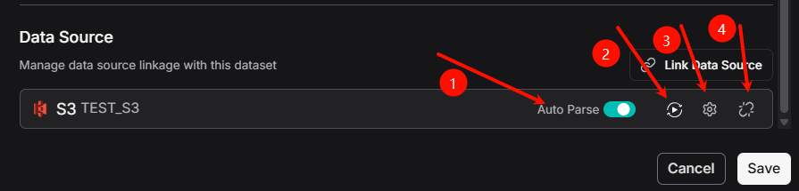

**Status Messages in Logs:**

*   **Scheduled:** The task is in line, waiting for its next turn to check for files.
*   **Running:** The system is moving files right now.
*   **Success:** It finished checking for new files.
*   **Failed:** The upload didn't work. Check the error message for details.
*   **Cancel:** You paused the transfer.

You can link multiple data sources to one dataset, and one data source can feed into many datasets.

## Enhanced Parser

### MinerU

RAGFlow now works with MinerU 2.6.3 as another option for parsing PDFs. It supports different backends like `pipeline`, `vlm-transformers`, `vlm-vlm-engine`, and `http-client`.

The idea is simple: RAGFlow asks MinerU to parse a file, reads the results, and adds them to your dataset.

**Key Environment Variables:**

| Variable | Explanation | Default | Example |
| :--- | :--- | :--- | :--- |
| `MINERU_EXECUTABLE` | Path to MinerU on your computer | `mineru` | `MINERU_EXECUTABLE=/home/ragflow/uv_tools/.venv/bin/mineru` |
| `MINERU_DELETE_OUTPUT` | Keep or delete MinerU's output files? | `1` (delete) | `MINERU_DELETE_OUTPUT=0` (keep) |
| `MINERU_OUTPUT_DIR` | Where to put MinerU's output | System temp folder | `MINERU_OUTPUT_DIR=/home/ragflow/mineru/output` |
| `MINERU_BACKEND` | Which MinerU backend to use | `pipeline` | `MINERU_BACKEND=vlm-transformers` |

**Starting Up:**
*   If you use the `vlm-http-client` backend, set the server address with `MINERU_SERVER_URL`.
*   To connect to a remote MinerU parser, use `MINERU_APISERVER` to give its address.

**How to Start:**
1.  **From Source:** Install MinerU by itself (its dependencies can conflict with RAGFlow's). Then set the environment variables and start the RAGFlow server.
2.  **Using Docker:** Set `USE_MINERU=true` in `docker/.env` and restart your containers.

### Docling

RAGFlow also supports Docling as another PDF parser. It works the same way as MinerU.

Docling finds the text, formulas, tables, and images in a document. RAGFlow then uses what Docling finds.

**What Docling Can Do:**
1.  Pull out text (paragraphs, headings, lists).
2.  Extract math formulas.
3.  Identify tables and images (and save them).
4.  Mark where everything is located.

**Starting Up:** Set `USE_DOCLING=true` in `docker/.env` and restart your containers.

## Agent Optimizations

### Retrieval Now Uses Metadata

You can now add tags (metadata) to files in your dataset. During retrieval, the Agent can use these tags to filter results, so it only looks at specific files instead of the whole library.

**Example:**
Imagine a dataset full of AI papers. Some are about AI agents, others are about evaluating AI. If you want a Q&A assistant that only answers evaluation questions, you can add a tag like `"Topic": "Evaluation"` to the right papers. When the Agent retrieves information, it will filter for just those tagged files.

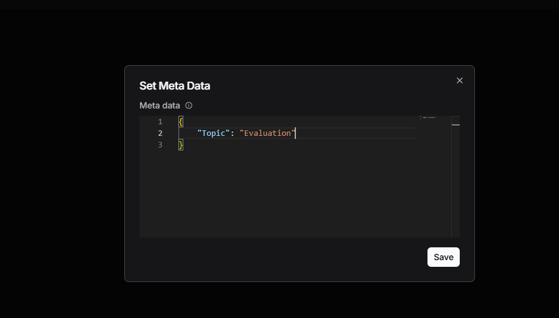

Before, this only worked in the Chat app. Now the Agent's Retrieval component can do it too.

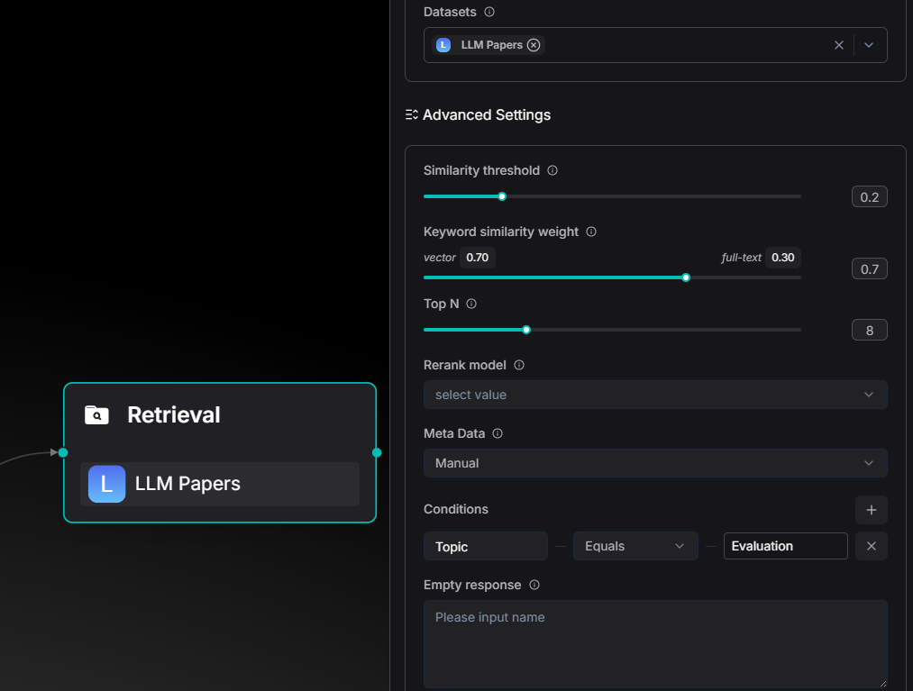
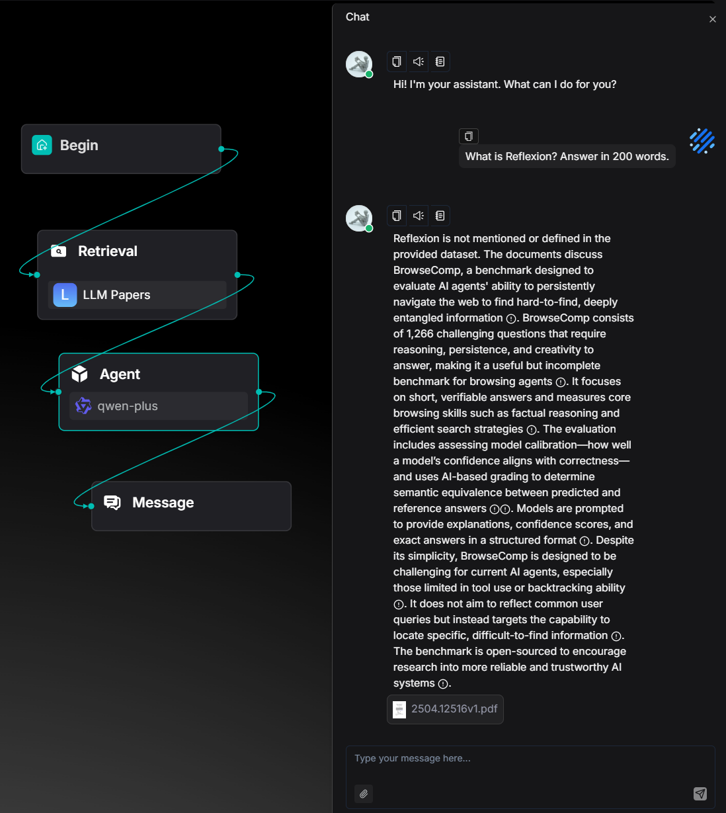

### Agent Teamwork Gets Better

You can now use an upstream Agent's output in the **Await Response** component's message.

**The Old Way:** The message in the Await Response component was always static text.

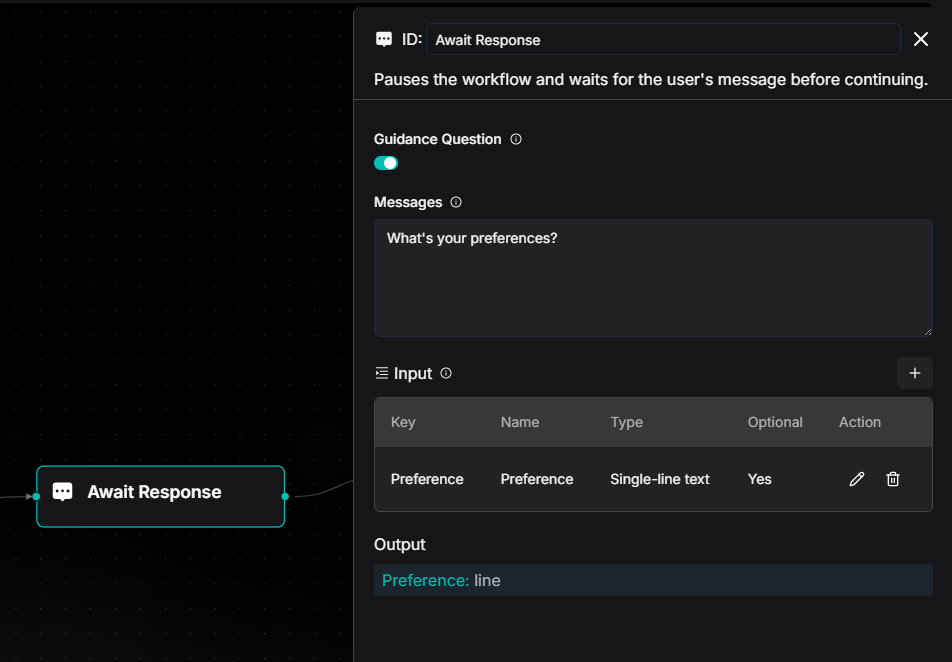

**The New Way:** You can insert dynamic content from earlier in the workflow, like a plan from a Planning Agent.

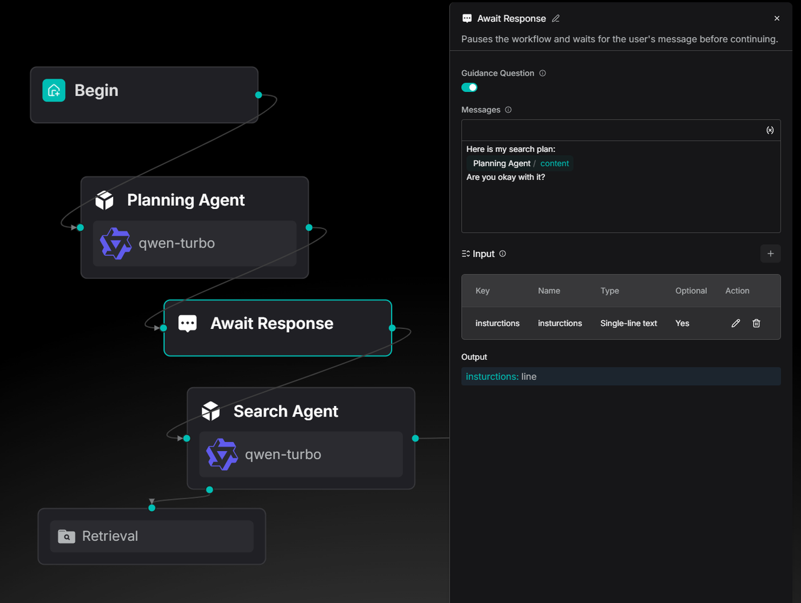

This is great for "Deep Research" agents or any time you need a human to check the work before continuing. It's also a key part of future improvements to the Ingestion Pipeline.

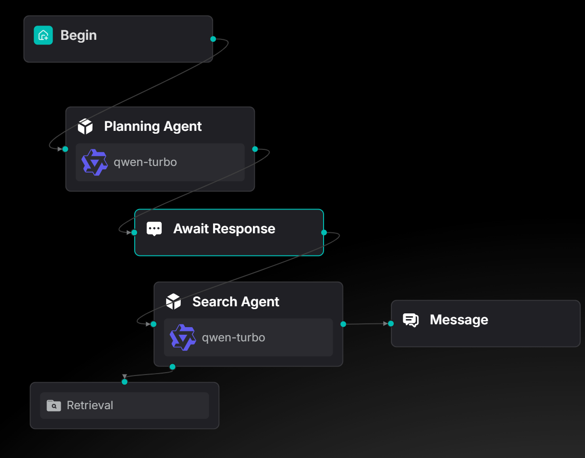

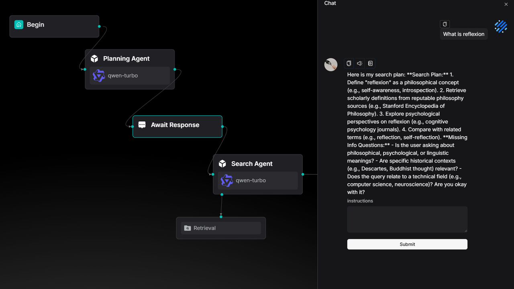

You can find this use case as a ready-to-use template in the agent template library.

## Admin UI

This version adds a new **Admin UI**, a visual dashboard made for system administrators.

It takes jobs you used to do with commands and puts them in a simple interface, making management much easier.

### See System Status Instantly

The **Service Status** dashboard shows the health of all core services. It lists their name, type, host, port, and status. If something goes wrong (like Elasticsearch times out), you can find the problem fast and copy the address to test it, without logging into different servers.

The UI also shows service details. You can see detailed logs and connection info (like database passwords) without ever touching a server command line. This makes fixing problems quicker and keeps the system more transparent and secure.

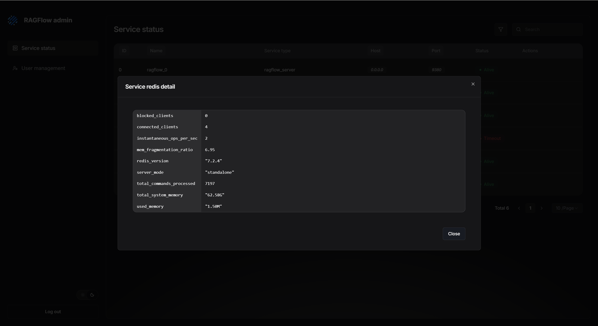
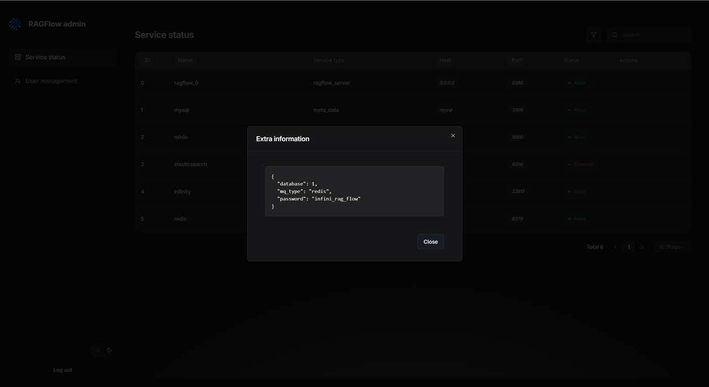

### Manage Users Easily

The **User Management** section lets you create, enable, disable, reset passwords for, and delete users. You can quickly find users by email or nickname and see what datasets and agents they own.

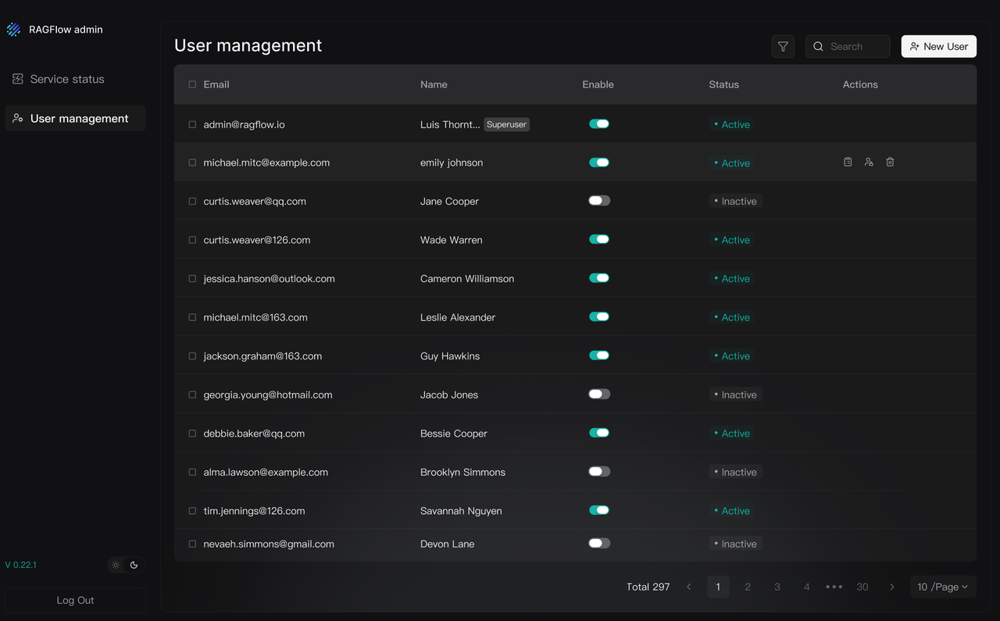

## Finale

RAGFlow 0.21.0 gave you a powerful Ingestion pipeline for your data. Now, RAGFlow 0.22.0 connects to all the places your data lives. Together, they help you break down "data silos" and gather everything in one spot to power your LLMs.

We also improved how Agents and people work together. Now you can step into the Agent's workflow and guide it, working as a team to get better, more accurate results than full automation alone.

We will keep adding more data sources, better parsers, and smarter pipelines to make RAGFlow the best data foundation for your LLM applications.

**GitHub:** https://github.com/infiniflow/ragflow

**Reference:**
1. https://ragflow.io/docs/dev/faq#how-to-use-mineru-to-parse-pdf-documents

