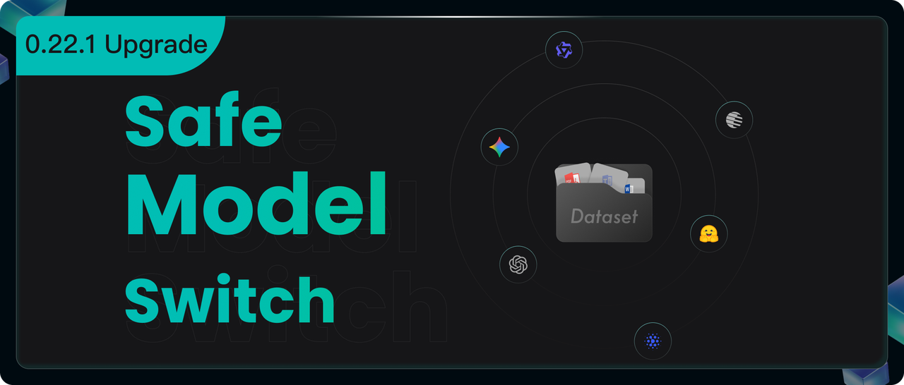
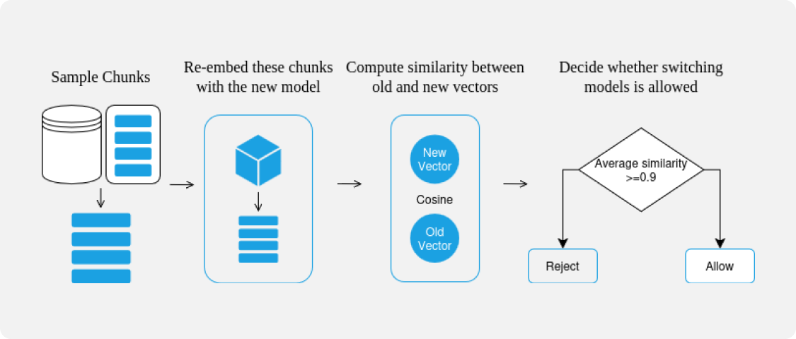
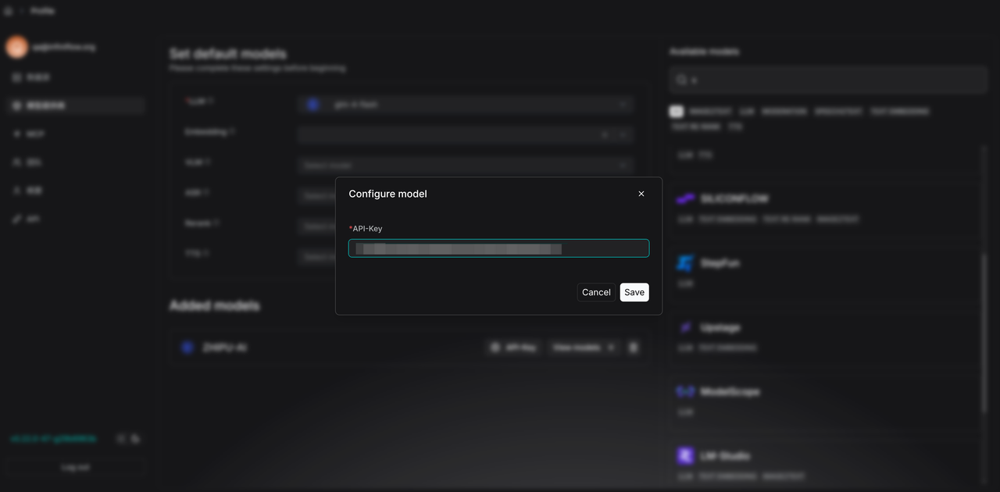
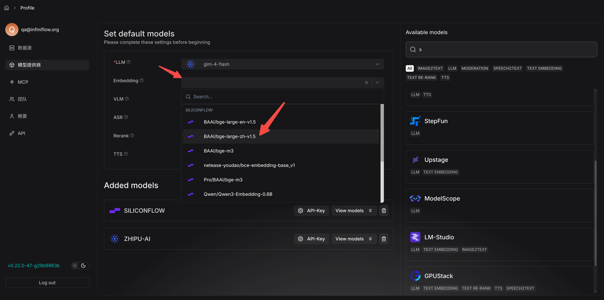
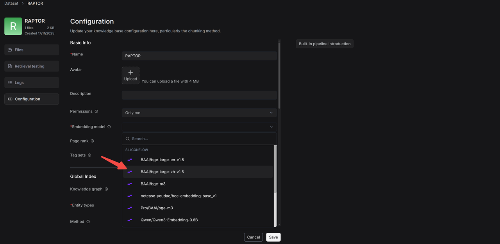
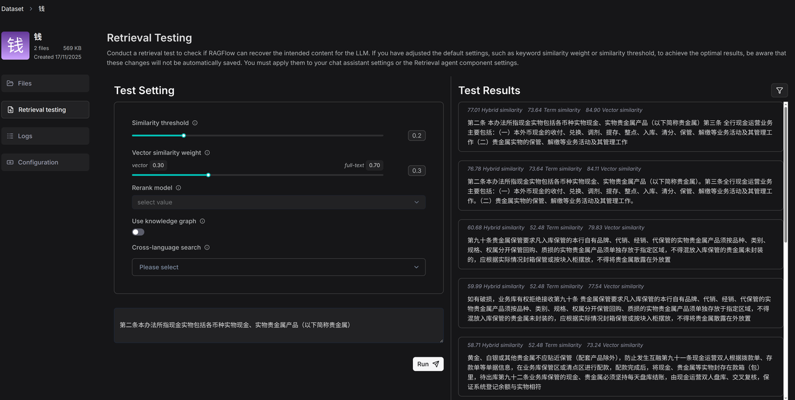
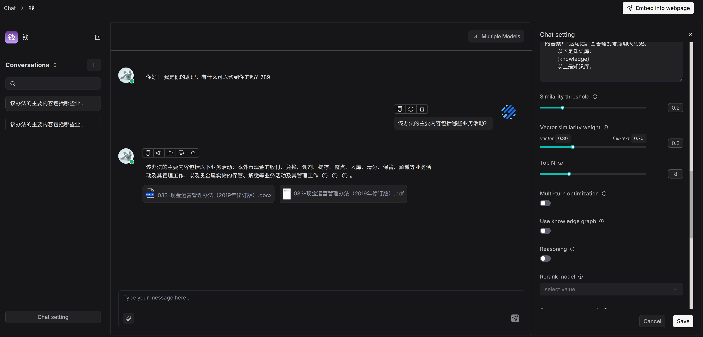

## Background

From version 0.22.0, RAGFlow no longer ships a full Docker image with built-in embedding models. Previously, some users relied on the bundled embedding models in that image to build their datasets.

After upgrading to 0.22.0, those models are no longer available, which leads to several issues: the embedding model originally used by the dataset is missing; you cannot add new documents; retrieval in the dataset stops working properly; and you cannot switch to a new embedding model because of the old logic constraints. To address these compatibility problems after upgrade, we introduced important improvements in version 0.22.1.

## 0.22.1 capabilities

### Datasets containing parsed data are allowed to switch embedding models

Starting from RAGFlow 0.22.1, a safer, automated embedding compatibility check is introduced, allowing users to switch embedding models on data-containing datasets. To ensure the new embedding model does not disrupt the original vector space structure, RAGFlow performs the following checks:

1. Sample extraction: Randomly selects a few chunks (e.g., 5–10) from the current dataset as representative samples.
2. Re-encoding: Generates new vectors for the sampled chunks using the new embedding model chosen by the user.
3. Similarity calculation: For each chunk, calculates the cosine similarity between new and old vectors.
4. Switch decision: If the average similarity is 0.9 or above, the new and old models are deemed sufficiently consistent in vector space, and the switch is allowed. If below 0.9, the model switch request is denied.

### Why use a 0.9 threshold?

The threshold is set to 0.9 because models with the same name from different model providers can have minor version differences, and RAGFlow’s embeddings also vary with strategies and parameters, so a new model cannot perfectly reproduce the old embedding environment. These “small differences” still usually give an average similarity above 0.9, so 0.9 works well as a cut-off for “safe to swap” models. In contrast, embeddings from completely different model families (for example, MiniLM to BGE‑M3) tend to sit around 0.3–0.6 in similarity, so they fall below this threshold and are correctly blocked, preventing a scrambled vector space.

## How to switch embedding model

1. Configure a new model in the model settings interface to replace the unusable default model.

2. Navigate to the dataset's **Configuration** page, select the same model name from the new provider, and wait for the model switch to complete.

   *If switching the embedding model fails, an error message will appear.*

3. Enter **Retrieval testing** to self-assess the new embedding model.

   *Functions involving dataset retrieval in chat apps for example are now working properly.*

Our future releases will feature more sophisticated upgrade tools and automation, simplifying migration from older versions and reducing the maintenance burden for users.