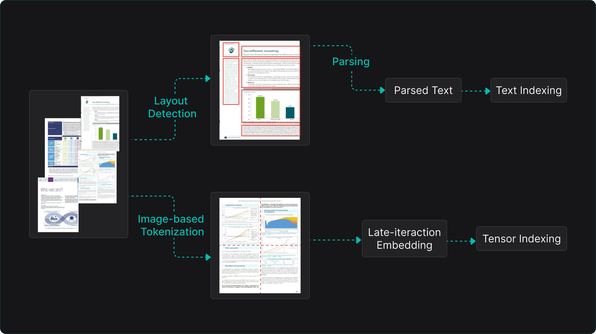
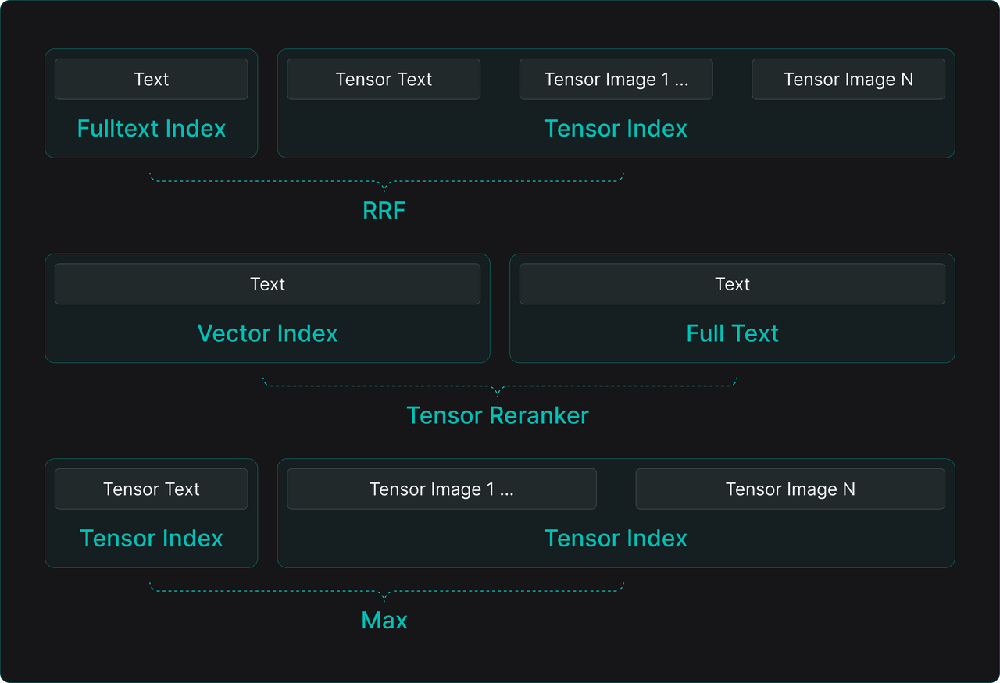

As 2025 draws to a close, the field of Retrieval-Augmented Generation (RAG) has undergone profound reflection, vigorous debate, and marked evolution. Far from fading into obsolescence as some bold predictions foresaw—amid lingering scepticism over its supposedly transient role—RAG has solidified its indispensability as a cornerstone of data infrastructure in the demanding arena of enterprise AI adoption.

Looking back, RAG's trajectory this year has been complex. On one hand, its practical effectiveness faced significant skepticism, partly due to the "easy to use, hard to master" tuning challenges inherent to RAG systems. On the other hand, its share of public attention seemed to be overshadowed by the undisputed focus of 2025's LLM applications: AI Agents.

However, an intriguing trend emerged. Despite the controversies and not being in the spotlight, enterprises genuinely committed to building core AI competencies—especially mid-to-large-sized organizations—deepened and systematized their investments in RAG. Rather than being marginalized, RAG has solidified its core role in enterprise AI architecture. Its position as critical infrastructure remains unshaken, forming the robust foundation for enterprise intelligence.

Therefore, we must first move beyond surface-level debates to examine the intrinsic vitality of RAG technology. Is it merely a transitional "band-aid" to patch LLM knowledge gaps, or is it an architecture capable of continuous evolution into a cornerstone for next-generation AI applications? To answer this, we must systematically review its technical improvements, architectural evolution, and new role in the age of Agents.

## Can RAG still be improved?

### The debate about long context and RAG

In 2025, the core of many RAG debates stems from a widely acknowledged contradiction: enterprises feel they "cannot live without RAG, yet remain unsatisfied." RAG lowers the barrier to accessing private knowledge, but achieving stable and accurate results—especially for complex queries—often requires extensive, fine-tuned optimization, complicating total cost of ownership assessments.

Consequently, the theoretical question heatedly discussed in 2024—"Can Long Context replace RAG?"—rapidly entered practical testing in 2025. Some scenarios less sensitive to latency and cost, with relatively fixed query patterns (e.g., certain contract reviews, fixed-format report analysis), began experimenting with directly using long-context windows. They feed entire or large batches of relevant documents into the model at once, hoping to bypass potential information loss or noise from RAG retrieval and directly address inconsistent conversational quality.

However, research since 2024 offers a clearer picture of the technical comparison. Mechanically stuffing lengthy text into an LLM's context window is essentially a "brute-force" strategy. It inevitably scatters the model's attention, significantly degrading answer quality through the "Lost in the Middle" or "information flooding" effect. More importantly, this approach incurs high costs—computational overhead for processing long context grows non-linearly.

Thus, for enterprises, the practical question is not engaging in simplistic debates like "RAG is dead," but returning to the core challenge: how to incorporate the most relevant and effective information into the model's context processing system with the best cost-performance ratio. This is precisely the original design goal of RAG technology.

Improved long-context capabilities have not signaled RAG's demise. Instead, they prompt deeper thinking about how the two can collaborate. For example, RAG systems can use long-context windows to hold more complete, semantically coherent retrieved chunks or to aggregate intermediate results for multi-step retrieval and reflection. This "retrieval-first, long-context containment" synergy is a key driver behind the emerging field of "Context Engineering." It marks a shift from optimizing single "retrieval algorithms" to the systematic design of the end-to-end "retrieval-context assembly-model reasoning" pipeline.

Currently, paradigms for providing external knowledge to LLMs mainly fall into four categories:

1. Relying solely on LLM's long-context capability.
2. Utilizing KV Cache.
3. Using simple search methods like Grep.
4. Employing a full RAG architecture.

Cost-wise, there is roughly a two-order-of-magnitude gap between option 1 and option 4. Option 2 involves processing all document data through an LLM's forward pass into tensors stored in a dedicated KV Cache system. Its cost remains at least an order of magnitude higher than RAG. Even upgrading KV Cache to an integrated database-and-inference engine (as advocated by AlayaDB [Ref 1]) still faces fundamental technical limitations:

1. **The data volume vs. retrieval performance dilemma**: If preprocessed tensor data exceeds GPU memory capacity, the system must introduce secondary storage and corresponding retrieval mechanisms for on-demand loading. This turns inference into a "generate-while-search" process, imposing extremely stringent I/O latency and retrieval speed requirements. To meet ultra-low latency, the entire dataset and LLM inference service often must be tightly co-located on the same physical machine or within a high-performance computing cluster's close network domain. This greatly sacrifices architectural flexibility and scalability, limiting deployment options.
2. **Scenario limitations**: This method primarily suits relatively static, fact-based text libraries. It struggles to flexibly and cost-effectively incorporate complex, evolving business rules, real-time knowledge updates, and diverse composite queries common in enterprises.
3. **Technology convergence trend**: This method does not conflict with RAG. Even if it becomes practical, it will likely be absorbed into the RAG architecture as an optimized component.

Option 3 (index-free RAG) gained some attention after Claude Code introduced it for its coding assistant Agent. A simple question arises: in specific domains, can basic string matching (Grep) replace complex retrieval-based RAG architecture? For well-organized, pure-format, fixed-terminology codebases or highly structured text data (e.g., log files), rule-based Grep or keyword search might deliver decent results at very low cost, saving index construction and maintenance overhead.

However, for the vast majority of enterprise multi-modal, unstructured, or semi-structured data (e.g., product manuals, meeting notes, design drawings, reports with tables and images), this method fails completely. In fact, even for seemingly regular code search, leading products like Augment Code avoid simple Grep. Instead, they fine-tune specialized Embedding models for code semantics. The reason is that providing effective context for a coding assistant requires not just exact string matching (finding function names) but also semantically similar code snippets (different implementations of similar functions), related API documentation, and code block dependencies.

Furthermore, diverse natural language queries, high concurrency, low-latency responses, and filtering/sorting with business metadata—all essential for enterprise applications—are far beyond Grep's scope. Therefore, RAG and its predecessor—enterprise search engines—remain comprehensive technical and architectural solutions for complex enterprise needs. Their value lies in providing systematic, scalable, and governable knowledge access and management capabilities.

### Optimizations for RAG conversational quality

Returning to RAG's core, a common source of inaccurate or unstable answers lies in a structural conflict within the traditional "chunk-embed-retrieve" pipeline: using a single-granularity, fixed-size text chunk to perform two inherently conflicting tasks:

- **Semantic matching (recall)**: For high-precision recall in semantic similarity search, smaller chunks (e.g., 100-256 tokens) are needed. This provides clear semantic focus and reduces irrelevant information.
- **Context understanding (utilization)**: To provide sufficiently complete and coherent context for the LLM to generate high-quality answers, larger chunks (e.g., 1024+ tokens) are needed to ensure logical completeness and sufficient background.

This forces system designers into a difficult trade-off between "precise but fragmented" and "complete but vague," often sacrificing one for the other. Small chunks may retrieve fragmented information, preventing the LLM from grasping the full picture. Large chunks may introduce noise, reduce retrieval precision, and lose internal detail differentiation because the vector representation summarizes the entire chunk.

A fundamental improvement is to decouple the RAG process into two logical stages—"Search" and "Retrieve"—allowing different text granularities for each:

- **Search: Analogous to "scanning" or "locating," its core goal is to quickly and precisely identify all potentially relevant "clues" from massive data. This stage should use smaller, semantically pure text units for high recall and precision.
- **Retrieve**: Analogous to "reading" or "understanding," its core goal is to assemble "reading material" for the LLM to generate answers. Based on clues from the Search stage, this stage should dynamically aggregate, stitch, or expand into larger, more complete, and coherent context fragments.

RAGFlow's TreeRAG technology embodies this idea. It uses an LLM in an offline phase to automatically analyze documents, constructing a hierarchical tree-like directory summary structure. This cleverly bridges the gap between "fine-grained search" and "coarse-grained reading." Its core workflow reflects the wisdom of "locate precisely first, then expand to read":

- **Offline processing (knowledge structuring)**: After document splitting, chunks are sent to an LLM for analysis, generating a multi-level tree directory summary (e.g., Chapter -> Section -> Subsection -> Key Paragraph Summary). Simultaneously, each node or original chunk can be enriched with semantic enhancements like summaries, keywords, entities, potential questions, metadata, and associated image context descriptions. Research [Ref 3] shows that during offline processing, fine-grained chunking requirements can be relaxed. Overly complex splitting can disrupt semantic units; simple, overlapping chunking is often more effective and robust in practice.
- **Online retrieval (dynamic context assembly)**: Upon receiving a user query, similarity search is first performed using the finest-grained "small fragments" (original chunks or their summaries) for fast, precise initial recall. Then, leveraging the offline-built "tree directory" as a navigation map, the system quickly locates parent, sibling, and neighboring nodes of the recalled chunk nodes. It automatically combines these semantically related fragments into a logically complete "large fragment" for the LLM. This effectively mitigates context fragmentation caused by fixed-size chunks, ensuring the material provided to the model contains both precisely matched core information and the surrounding context needed to understand it.

Similar work includes PageIndex [Ref 2], which focuses more on parsing and leveraging a document's inherent physical or logical table of contents (e.g., in PDFs). This method is efficient when document structure is clear and format is standard. Its limitation is heavy reliance on source document quality; its auto-location capability diminishes when documents lack clear or accurate TOCs.

TreeRAG and similar technologies effectively address the "Lost in the Middle" pain point caused by poor chunking. However, for more complex queries—where answers are scattered across dozens of non-adjacent chunks or require synthesizing information from multiple independent documents for reasoning—tree structures alone may not capture all relevant associations. The industry naturally turned to another technical path: GraphRAG.

GraphRAG extracts entities and relationships from documents to build a knowledge graph, using graph queries and reasoning to discover indirectly related information fragments. Yet, GraphRAG has also left many practitioners with mixed feelings since its inception, due to key challenges:

1. **Massive token consumption**: Entity extraction, deduplication, and community summarization can consume several to dozens of times more tokens than the original text.
2. **Gap between expected and actual entity extraction quality**: Traditional knowledge graphs, meticulously designed and validated by domain experts, offer high quality for direct visual analysis and interaction. In contrast, GraphRAG's automatically extracted entities and relations often contain significant noise, redundancy, or errors. Judging them by visual knowledge graph standards leads to disappointment—"visually appealing but impractical."
3. **Knowledge fragmentation**: Even after graph algorithms discover related communities and generate summaries, the output remains a collection of "knowledge fragments" around specific topics. Generating final answers from these discrete fragments places high demands on the LLM's integration and coherent narration abilities, often resulting in answers lacking a logical thread or missing crucial aspects.

Therefore, combining the strengths of TreeRAG and GraphRAG holds promise for further alleviating RAG's pain points. TreeRAG excels at resolving local semantic breaks caused by physical chunking, providing coherent context. GraphRAG, based on entity-relationship networks, can use graph traversal algorithms (e.g., Personalized PageRank) to help discover content fragments semantically highly related but physically distant in the original documents, even across documents.

Thus, whether TreeRAG, GraphRAG, or their hybrid architecture (collectively termed "Long-Context RAG"), the core paradigm introduces an additional semantic enhancement and structure-building layer atop the traditional RAG pipeline. During the data ingestion stage, beyond chunking, LLMs are leveraged for deep semantic understanding, summary generation, and structure extraction. During the retrieval stage, it moves beyond mere search, incorporating navigation, relational queries, and dynamic assembly based on predefined structures (tree, graph).

RAG technology is far from stagnant. Its improvement direction is increasingly clear: leverage LLMs' own capabilities to bridge the semantic gap between raw data and final Q&A early in the data lifecycle. During ingestion, use prompts with different instructions to request LLMs to analyze text from multiple angles and rounds, extracting rich, multi-layered semantic information (metadata). During retrieval, use this enhanced semantics as a "navigation map" to intelligently filter, aggregate, and fill context, going beyond simple vector similarity search. This is the more reliable path for tackling complex, open-domain Q&A challenges.

Products like RAGFlow are deeply exploring this direction, with future evolution centered on these core points. In short, modern RAG system design philosophy is to fully coordinate "powerful retrieval and reasoning capabilities" with the "limited yet precious LLM context window." Through intelligent preprocessing and dynamic assembly, it seeks the optimal balance between effectiveness, performance, and cost.

### From knowledge base to data foundation

We often emphasize that RAG is an architectural paradigm, not a specific application. Yet, knowledge bases are undoubtedly RAG's most intuitive and successful application form. With the rapid rise of AI Agent development, a clear trend is emerging: Agents' complex task execution increasingly relies on real-time access and understanding of massive, diverse enterprise data.

Consequently, enterprise-grade RAG products are evolving beyond the singular "Q&A knowledge base" role towards a more foundational, general-purpose Agent data foundation. They need to serve as the unified, efficient, and secure access service for unstructured data for all types of Agents.

To achieve this, a robust, scalable, and configurable Ingestion Pipeline has become an indispensable core component of modern RAG engines. It handles the entire process of "taking over" the complex, unstructured data within an enterprise (documents, images, audio/video, code, emails, etc.) and "digesting" it into a standard format indexable and retrievable by the RAG engine.

If ETL/ELT (represented by tools like dbt, Fivetran, Airbyte) is the industrialized standard pipeline for processing structured data in modern data stacks—providing unified, flexible, and reliable data integration for data warehouses and lakes—then the Ingestion Pipeline for unstructured data (or PTI: Parse-Transform-Index) is its equivalent, critical infrastructure for the AI era. They share similar architectural positioning and processing philosophy but differ in technical methods due to data characteristics.

Examining each stage's similarities and differences:

- **Extract vs. parsing**: Traditional ETL/ELT's "Extract" stage primarily pulls data from structured or semi-structured sources like relational databases, APIs, and log files. The Ingestion Pipeline, building on this, emphasizes the "Parsing" stage to tackle the challenge of information extraction from unstructured data. It employs various parsers: format parsers for PDF/Word, specialized document intelligence models like RAGFlow's DeepDoc, and OCR models fine-tuned on Vision-Language Models (VLM). The goal is to convert multi-modal, multi-format raw documents into clean, structured text representations, preserving original logical structure (headings, lists, tables) and metadata (author, date) as much as possible.
- **Transform**: This stage shows the greatest divergence. Traditional ETL/ELT "Transform" focuses on data cleaning, format standardization, and business logic computation (aggregation, joins) using SQL or code. The Ingestion Pipeline's "Transform" stage is a series of semantic understanding and enhancement components centered around the LLM. They convert the raw text stream from the Parser into the advanced "materials" needed for retrieval. Beyond basic text chunking, all processes aimed at improving retrieval effectiveness and precision—like tree structure generation, knowledge graph (entity-relation) extraction, summary generation, question generation, and keyword extraction—occur here. This stage is key to injecting "intelligence," determining the depth of data "understanding."
- **Load vs. indexing**: Traditional ETL/ELT loads (Load) processed clean data into target data warehouse/lake tables. The RAG engine, via its "Indexing" component, builds efficient indexes from the rich content produced in the Transform stage (original text chunks, summaries, vectors, metadata, graph relations). This supports various retrieval methods. The RAG engine is essentially a high-concurrency, low-latency serving layer. It must support hybrid retrieval (vector + keyword + metadata filtering) and may integrate advanced capabilities like tree-based or graph-based queries mentioned earlier.

Whether ETL for structured data or PTI for unstructured data, the intermediate "Transform" step is the core value-creation stage. For ETL, engineers design transformation logic (SQL) based on specific business analysis needs. For PTI, because the Ingestion Pipeline must be co-designed end-to-end with final retrieval requirements, decisions on chunk granularity, types of enhanced semantics to generate, and index structure complexity in the Transform stage depend on the precision, speed, and cost requirements of the upper application (e.g., Q&A, summarization, analysis).

Therefore, building an excellent RAG system is not merely about choosing the most advanced Parser model or the highest-performance vector database. It hinges on the collaborative design and continuous tuning of the entire "Data Ingestion -> Semantic Enhancement -> Index Building -> Retrieval Service" pipeline.

Equipped with such a powerful, flexible, and intelligent Ingestion Pipeline, a RAG system truly evolves from a "Q&A system" into a unified processing and access platform for enterprise unstructured data. It can standardize and automate the digestion of scattered internal knowledge assets, transforming them into readily available "fuel" for AI Agents.

This explains why, today, when enterprises commit to building a unified AI capability platform, its core and foundation must be such a RAG-engine-centric data foundation with robust data processing capabilities. It provides the single source of truth and real-time updated knowledge for all enterprise AI applications.

## From RAG to context

In 2025, the most dynamic and attention-grabbing aspect of LLM applications has undoubtedly been various AI Agents. From an Agent framework perspective, RAG can be seen as a tool providing external knowledge access—similar to tools for calling a calculator, querying a weather API, or operating a database.

This tool-centric view, coupled with the rise of "Agentic RAG" (using Agent planning, reflection, etc., to enhance the RAG process itself), fueled narratives in 2025 suggesting "RAG will be replaced by more general Agents" or "RAG is just another ordinary Agent tool."

However, this view oversimplifies and potentially misunderstands RAG's fundamental value and position within the Agent ecosystem. It overlooks the essence of RAG architecture—its core capability and value foundation lies in Retrieval, not merely "Augmented Generation."

It is precisely this core ability to "efficiently, accurately, and scalably retrieve relevant information from vast private data" that enables RAG to become, and is becoming, the most indispensable, foundational data foundation for Agents. Because no matter how intelligent an Agent is, the quality of its decisions and actions fundamentally depends on the quality and relevance of the Context it receives.

How to dynamically and intelligently assemble the most effective context for different tasks at different moments became the hottest technical exploration and guiding principle in the latter half of 2025, giving rise to Context Engineering.

Let's analyze the main data types and technologies involved in Context Engineering to understand why "retrieval" is at its absolute core:

Context Engineering has emerged as a distinct field because practice repeatedly proves: bluntly cramming all potentially relevant data into the LLM's context window is not only prohibitively costly but also severely impairs the LLM's understanding, reasoning, and tool-calling abilities due to information overload. Therefore, intelligent filtering, sorting, and stitching of context are essential.

A typical Agent context usually needs to carefully assemble three types of data:

1. Domain knowledge data: For the knowledge base serving as a core tool (i.e., the RAG system), retrieval result quality directly determines answer success. Returning too many irrelevant fragments introduces noise, disrupting answer generation. Missing key fragments inevitably leads to factual errors or incomplete answers. Thus, RAG itself can be seen as the earliest Context Engineering 1.0 practice for domain knowledge.
2. Tool Data: For other functional tools, especially the many tools packaged via standards like the Model Context Protocol (MCP), their description information (name, function, parameter specs) is itself part of the context. When only a few tools are available, their descriptions can be hardcoded in prompts. But in enterprise scenarios, internal services, APIs, and functions packaged via MCP can number in the hundreds or thousands. Manually or statically specifying which tools to call for each conversation is impractical. This "tool selection" problem was only deeply felt by some users by late 2025, even sparking clickbait articles like "MCP is Dead After Just One Year" [Ref 9]. In reality, the author misplaces the blame—the core issue is indiscriminately dumping all tool descriptions into the context, overwhelming the LLM with "choice paralysis," not the MCP protocol itself. MCP is an extremely important protocol aiming to standardize tool-calling interfaces, but it does not and cannot solve the decision problem of "which tool to choose in a specific situation." So, who should bear this decision responsibility? This is a missing key piece in most current Agent frameworks. The answer is again Retrieval. We need semantic search over all tool descriptions, combined with retrieval of "Skills," "Playbooks," or "Guidelines" formed from historical tool usage. This dynamically and precisely filters the most relevant, most likely-to-be-correctly-used tool subset and parameters for the current Agent's current task into the context. This far exceeds what current features like Anthropic Skills cover. How to close the loop on generating, retrieving, and using Skills/Playbooks/Guidelines and productize it is a core problem Context Engineering must solve. This is fundamentally a data infrastructure (Infra) problem, not merely a model capability issue.
3. Conversation and state data: Beyond static knowledge and tools, context needs to include dynamic data related to the current interaction: conversation history, user personalization/preferences, and some Agent internal state (e.g., human input in Human-in-the-loop). Managing and accessing this data is often termed "Memory," which became a standalone hot topic in early to mid-2025. But technically, the core capability of memory systems—storing, indexing, and retrieving historical interaction information—is not fundamentally different from RAG. It can be seen as a specialized retrieval system for a specific data source (conversation logs) and usage pattern (emphasizing temporal and conversational relevance).

Deconstructing context composition clearly shows that Context Engineering's core task is still retrieval based on the three major data sources Agents need:

1. Retrieval of enterprise-private, unstructured domain document data—i.e., RAG.
2. Retrieval of conversation history and state data generated during Agent interactions, especially LLM-generated content—i.e., Memory.
3. Retrieval of tool description and usage guide data from encapsulated enterprise services and APIs—termed Tool Retrieval. This data can also reside in a dedicated area like Memory.

Thus, in the AI Agent era, RAG technology will undeniably evolve. It is no longer just a step in "Retrieval-Augmented Generation." With "retrieval" as its core capability, expanding its data scope, it evolves into a Context Engine supporting all context assembly needs, becoming the unified Context Layer and data foundation serving LLM applications.

### How is retrieval for Agents different from the search era?

Understanding this evolution requires contrasting the fundamental differences between retrieval paradigms in the traditional search era and the Agent era.

In the traditional search era (e.g., using Google or enterprise search), the initiator, executor, and consumer of retrieval were humans. The user poses a question, the search engine returns a list of relevant document links, and the user must open multiple links, read, compare, and synthesize information to form an answer or decision. This is a "human-computer synergy, human-led" loop.

In the Agent era, the initiator and primary consumer of retrieval is the Agent (LLM-driven). A typical workflow: the LLM first comprehends and decomposes a user's complex question (hypothesizing/planning), then automatically initiates one or multiple retrieval requests on the user's behalf. Next, it comprehends, verifies, and refines the raw retrieval results (reflection), finally stitching the processed information into the context for generating the final answer. The content of retrieval expands from single web pages/documents to include tool usage, memory segments, etc. The entire closed loop of "question understanding -> retrieval -> result processing -> context assembly" is automated by the Agent.

Therefore, retrieval systems for Agents face unprecedented new demands: extremely high request frequency (potentially one to two orders of magnitude higher than human requests in the traditional search era), diverse query types (semantic queries on documents, keyword matching for tools, parameter matching for tool usage guides, associative queries on memory), stringent latency requirements (directly impacting Agent response speed), and the need for tight coupling with the Agent's reasoning flow.

A standalone search engine or vector database is far from sufficient. It requires building an intelligent intermediate service layer atop storage and indexing. This layer understands Agent intent, dynamically coordinates retrieval requests to different underlying data sources (document stores, memory stores, tool libraries) based on context assembly strategies, and performs necessary fusion, deduplication, ranking, and formatting of results, finally packaging them into LLM-ready context.

This usage pattern means the most intricate and specialized "Context Engineering" part of Agent development—currently highly manual and hardcoded in prompts—has the potential to move towards declarative configuration or even automation. This could significantly reduce Agent development and maintenance complexity while improving consistency and reusability.

### Tools also need searching

Tool diversity directly determines the breadth and depth of problems an Agent can solve. In simple demos or prototypes, a common approach is embedding descriptions of all available tools (usually natural language text) entirely into the Agent's prompt. However, when tool counts grow from a few to dozens or hundreds, the drawbacks become apparent.

First, it consumes massive precious context tokens that could otherwise hold more important task descriptions and intermediate results. Second, too many options burden the LLM's tool selection logic, increasing the probability of "hallucinated" calls or incorrect tool choices.

Especially in enterprise scenarios, tool numbers can reach stunning scale. In principle, nearly all existing internal services, databases, APIs, and workflows can be wrapped into standardized tool interfaces understandable and callable by Agents. This is what protocols like MCP aim to solve—becoming the "TCP/IP" for the Agent era, addressing connectivity.

But we must clearly realize the fact: MCP solves the protocol problem of "how to call," not the decision problem of "which one to call." Advanced models (like some SOTA models under development) might struggle to handle hundreds of tool descriptions in context, but this is hardly a cost-effective solution. Treating the context window as a scarce resource and minimizing the inclusion of ineffective or low-probability-use information is a crucial design principle for controlling costs and improving overall system effectiveness.

Consequently, Tool Retrieval began attracting attention from academia and industry by late 2025. The core idea is: establish a specialized index library (vector, keyword, or hybrid) for all tool descriptions. When an Agent needs to call a tool, it first generates a "query" targeting tool functionality based on the current conversation context and task objective. This query performs a quick search against the index library, recalling only the most relevant few (e.g., Top-3) tool descriptions. These are dynamically inserted into the current context for the LLM's final selection and calling.

Research [Ref 10] shows even simple BM25 keyword retrieval serves as a strong baseline for this task. Of course, using fine-tuned, dedicated embedding models yields more precise matches.

Beyond tool descriptions themselves, the Agent development, testing, and usage process naturally accumulate a series of meta-knowledge about "how to correctly use tools." For example: "When handling customer refund requests, sequentially call Tool A to verify the order, Tool B to check inventory, and Tool C to execute the refund, with parameter X from conversation history Y." Such "playbook" or "guide" text is richer and more instructive context material than tool descriptions.

These should also be categorized into the retrievable system: when an Agent faces a complex task, it can first retrieve relevant task guides, including them as part of the context. This allows the LLM to "take an open-book exam," planning actions following best practices.

The volume and data density of such tool usage guide data may far exceed tool descriptions themselves. Efficient utilization undoubtedly relies on retrieval technology. Early explorations like the GEPA optimizer in the Dspy framework [Ref 11] use genetic algorithms to evolve better prompts (possibly containing tool usage logic), but its focus is optimizing the prompt text itself.

More systematic work like the ACE (Agentic Context Engineering) framework [Ref 12] begins to study how to generate, manage, and leverage such instructive contexts in a structured way. While not this article's focus, we must recognize this represents an important direction for Context Engineering's deepening. The outcomes of such work will evitably need to be included into the system covered by Retrieval, providing context alongside tool descriptions.

### Does memory deserve to be a separate infra?

"Memory" received far more attention than RAG in 2025's technical discussions, often listed as a core Agent infrastructure component in articles and product pitches, with even boundary-blurring views like "Memory will replace RAG." So, what exactly is Memory? How do the myriad open-source memory projects differ from and relate to RAG systems at their core?

Simply put, memory systems emerged initially to meet the need for effectively managing and reusing historical Agent interaction information. Its basic usage pattern is identical to RAG: when a new conversation occurs, the system retrieves relevant past conversation fragments (e.g., same user's prior questions, LLM's previous answers, user feedback) from stored history based on the current query. These fragments are then submitted alongside the new question to the LLM, helping the model maintain conversation coherence, remember user preferences, or avoid repetition.

Therefore, from functional interface and core technology (retrieval), Memory and RAG share the same core.

Their core distinction lies in data source and management goals:

- RAG: Processes primarily pre-existing, relatively static enterprise private knowledge assets (documents, manuals, KB articles). Its goal is providing domain facts and background knowledge.
- Memory: Processes primarily dynamically generated interaction logs and derived data from Agent operation (user input, LLM output, possible interaction state, LLM-generated summaries/reflections). Its goal is maintaining会话 continuity, enabling personalization, and learning from historical experience.

As research deepens, finer division of data organization within memory systems has emerged, borrowing ideas and concepts from cognitive science: Working Memory, Episodic Memory, Semantic Memory, Meta Memory, etc. These different "memory regions" can be likened to different tables or collections in a database.

Memory system complexity lies not just in storage and retrieval but more in memory management logic: When and how are newly generated raw conversations written to memory? When to trigger an LLM to summarize a conversation segment and store it in semantic memory? How to establish associations between different memory fragments?

These functions of "memory flow, processing, and lifecycle management" are identical to the Ingestion Pipeline in RAG systems, except they handle dynamically generated streaming data.

If we broaden our view, dedicating a region within the memory system (or establishing a closely linked knowledge base) to store and retrieve the tool usage guides mentioned above, then a blueprint for a complete data foundation supporting AI Agents emerges:

This blueprint clearly shows: Memory (handling dynamic interaction data) and RAG (handling static domain knowledge) are technically having the same source (both retrieval-based) and functionally complementary. Together, they constitute the complete data foundation upon which AI Agents depend.

All Agent data access needs—whether existing unstructured documents (via RAG), real-time generated interaction logs (via Memory), or structured service interfaces (packaged via MCP, with their metadata, usage guides, and tutorials retrievable in a dedicated knowledge base)—can be unified, governed, and accessed within an integrated platform.

This platform is precisely the direction systems like RAGFlow are evolving towards: a Context Engine or Context Platform. It is no longer an isolated retrieval tool but an infrastructure providing comprehensive, intelligent context assembly services for AI applications.

The forward-looking term "Context Platform" was likely first systematically elaborated by investment firm Theory Ventures in their series of articles [Ref 13, 14]. In fact, this visionary firm explicitly highlighted the fundamental importance of retrieval for LLM applications as early as 2024 [Ref 15]. Today, how to upgrade the technically-focused Retrieval Engine into a Context Engine is becoming the key determinant for whether AI Agents can achieve scalable, cost-effective enterprise adoption.

As the comprehensive analysis above shows, many so-called "Agent intelligence" problems are still essentially about finding and presenting the right information to the LLM at the right time. If an Agent has a powerful "external brain" (Context Engine) helping it efficiently search, filter, verify, and organize all relevant data, the final user experience and results will far surpass a "bare" model relying solely on vast parameters and complex prompts.

The evolution from Context Engineering to Context Engine/Platform signifies that context creation, management, and delivery are shifting from a highly expert-dependent, manual craft towards a highly automated, productized, and operational platform science.

Currently, developing custom Agents often requires significant engineering and data science effort to manually craft complex prompt templates, meticulously design context stitching logic, and hardcode them into workflow orchestration. This approach is hard to maintain, doesn't scale, and leads to chaotic context ownership and update processes.

Future Context Platforms aim to change this:

- Context creation will be automated through deep integration with data sources, with continuous synchronization and updates.
- Context delivery will no longer be hardcoded. Instead, based on real-time intent from each conversation, a platform's unified retrieval and orchestration layer will dynamically retrieve and assemble context from various data sources.
- Context maintenance will shift from vendor-led manual services to automated, customer-managed, visually configurable processes. Context ownership and control will clearly belong to the customer.

This paradigm shift is massive. The core value of enterprise AI adoption is shifting from pursuing the "smartest model" and "most clever prompts" back to building the "richest, most accurate, most usable context."

Context quality, real-time nature, dynamic assembly capability, and productization level will directly determine the competitiveness of next-generation enterprise AI applications. Context product will be the final key to unlocking large-scale AI application. It marks the official transition of enterprise AI from the early "handcrafted customization" stage to the "platform, scalable, sustainably operable" industrial era.

## How far has multi-modal RAG progressed?

In our 2024 year-end review, we predicted multimodal RAG based on "late interaction" would be a 2025 technical keyword. However, this prediction didn't fully materialize. Does this mean multimodal RAG lacks practical significance? The answer is clearly no.

Taking test results from M3Retrieve [Ref 4], a benchmark dataset designed for medical literature, as an example, the value and positioning of multimodal RAG are clearly demonstrated:

- Excels in Text-Image Combined Tasks: In scenarios like visual context retrieval or image-based Q&A, multimodal RAG leveraging both text and visual information performs significantly better than text-only solutions.
- Less Advantage in Text-Dominant Tasks: For tasks like summarization or pure-text patient record retrieval, mature single-modal RAG, with its efficiency and precision, still holds advantage.

Thus, production-grade multimodal RAG isn't simply stitching image and text models. Its core demand is achieving truly efficient cross-modal retrieval and understanding. Technologically, multimodal RAG is undoubtedly the inevitable direction for RAG systems to deepen and cover broader data types.

Currently, two main technical paths exist for handling images and other multi-modal documents:

1. Modality Conversion Path: Using OCR or VLMs to convert images, tables, etc., into pure text descriptions. This reduces the multimodal problem to a single-modal text retrieval problem. It's compatible with existing text RAG architecture but risks losing crucial raw visual layout, color, and finer characterics.
2. Native Multimodal Path: Directly tokenizing images visually, inputting a unified multimodal encoder alongside text tokens to generate fused multi-vector representations. During retrieval ranking, late interaction models enable fine-grained similarity calculation.

A theoretical guidance article from Google DeepMind in September this year [Ref 5] indicates: retrieval based on a single global vector has inherent semantic loss, while using multi-vectors (high-dimensional tensors) preserves document fine-grained semantic information more completely.

Given such clear theoretical advantages, why haven't mature, productized multimodal RAG solutions emerged in 2025? The fundamental reason is that engineering challenges from prototype to stable product are not fully overcome yet.

A primary challenge for engineering cross-modal retrieval is determining recall units and strategies. Using the document "page" as the recall unit is common. Specific implementation schemes include:

- Hybrid Indexing Scheme: Build full-text and single-vector indices for text content, and separate tensor indices for images. During retrieval, perform hybrid search and fuse results from the three indices.
- Text-First, Tensor Reranking Scheme: Use only text parsed from PDFs to build full-text and single-vector indices for initial recall. Then, use tensor representations generated from the entire page as an image to perform finer reranking of initial results. This scheme can also be used for pure text retrieval to achieve better semantic recall.
- Pure Tensor Retrieval Scheme: Rely soly on tensor indices. For cross-modal pages, calculate similarity between the query and text tensors, and image tensors separately, taking the maximum as the page's final relevance score.

While technically feasible, these schemes share a tricky engineering bottleneck: exploding storage and computational costs from exploding tensor data due to massive token counts.

Assuming a model like ColPali outputs 1024 tokens per page image (each corresponding a feature vector), with vector dimension 128 and float32 precision, the tensor data for a single page occupies ~512KB. For a million-page document base, the index size expands to TB levels—a collossal challenge for storage cost, memory loading, and retrieval latency.

To advance multimodal RAG towards practical engineering, two main technical paths are currently available:

- Tensor Quantization Compression: Binarize or apply low-bit quantization (e.g., 1-bit) to each vector in the tensor, compressing storage to 1/32 or less of the original. The cost is some precision loss. Feasibility depends on training specialized embedding models robust to quantization.
- Token Pruning: Significantly reduce the number of tokens generated per page image, e.g., from 1024 to 128 or fewer. Specific methods include:
  - Random Projection: Project vectors from many tokens into a single high-dimensional vector (e.g., 10k dimensions), as in the MUVERA algorithm [Ref 6]. Computationally efficient but loses significant fine-grained information.
  - Token Clustering: Perform unsupervised clustering on vectors generated tokens, using cluster centers to represent the original set. This doesn't require model changes but also sacrifices precision.
  - Model-Side Token Pruning: Modify the Embedding model (especially its underlying VLM) to actively output fewer but more informative "refined" tokens based on its internal attention mechanism. This is the most fundamental method.

Therefore, the maturation of multimodal RAG requires not only that the underlying retrieval engine natively and efficiently supports Tensor Index and Tensor Reranker components, but also relies on the broader AI community producing more next-generation multimodal Embedding models that are quantization-friendly and support adaptive token pruning.

These developments are synergistic: lacking a mature, easy-to-use Retrieval Engine hinders validation and iteration of new models in real scenarios; without efficient models, the Retrieval Engine has nothing to leverage. Fortunately, this topic is gaining widespread attention, and a workshop dedicated to late interaction is scheduled for early 2026 [Ref 7].

Looking ahead to 2026, as AI infrastructure layers improve support for tensor computation and storage, we can expect more superior multimodal models tailored for engineering to emerge, truly unlocking the practical potential of cross-modal RAG.

Its engineering implementation will naturally give rise to widespread demand for multimodal contexts. For example, "multimodal memory" systems capable of simultaneously understanding and remembering text, images, and even video are no longer merely theoretical concepts but are already in the prototyping phase [Ref 16].

## Looking ahead to 2026

Entering 2026, the enterprise focus on LLM applications will inevitably shift from proof-of-concept and early experimentation toward pragmatic, large-scale adoption and ROI. In this process, RAG technology, as the foundational data layer for all AI applications, will experience a wave of more robust and systematic construction.

While the ultimate value and form of AI Agents in complex enterprise scenarios remain in broad exploration, the foundational supporting role of RAG for all Agents—and indeed for all LLM applications—has become a consensus among a growing number of technical decision-makers.

A clear trend is that many enterprises have already taken the lead in building capabilities centered around an "AI Middle Platform" or an "Intelligent Data Foundation," whose core is precisely an unstructured data processing and provisioning platform built upon RAG engines. In contrast, the concrete development and deployment of upper-layer Agents can proceed on this stable foundation with greater flexibility and a more incremental pace.

To summarize the evolution trajectory and future outlook of RAG technology from 2025 to 2026 in one sentence: RAG is undergoing its own profound metamorphosis, evolving from the specific pattern of "Retrieval-Augmented Generation" into a "Context Engine" with "intelligent retrieval" as its core capability.

This evolutionary trend is now irreversible. It will move from the technical backend to the strategic forefront, becoming an indispensable core component for enterprises constructing next-generation intelligent infrastructure.

And RAGFlow is built precisely for this grand yet definitive future vision. We are building not just an open-source, high-efficiency RAG system, but the key cornerstone and driving force toward the era of the "Context Engine."

From our deep cultivation in multimodal parsing and semantic enhancement with DeepDoc, to exploring cutting-edge architectures like TreeRAG to bridge semantic gaps, to building a Context Engine that serves Agents—every iteration of RAGFlow aims to transform the technical directions discussed here into stable, user-friendly, high-performance product capabilities, steadily advancing enterprise intelligence from concept to reality.

We firmly believe that a retrieval-centric Context Engine is key to unlocking the full potential of LLMs and Agents.

Stay tuned for RAGFlow's evolution, visit GitHub to give us a star, and join developers worldwide in witnessing and building the next generation of enterprise AI infrastructure.

## References

1. AlayaDB: The Data Foundation for Efficient and Effective Long-context LLM Inference https://arxiv.org/abs/2504.10326?
2. https://github.com/VectifyAI/PageIndex
3. A Systematic Framework for Enterprise Knowledge Retrieval: Leveraging LLM-Generated Metadata to Enhance RAG Systems https://arxiv.org/abs/2512.05411
4. M3Retrieve: Benchmarking Multimodal Retrieval for Medicine https://arxiv.org/abs/2510.06888
5. On the Theoretical Limitations of Embedding-Based Retrieval https://arxiv.org/abs/2508.21038
6. MUVERA: Multi-Vector Retrieval via Fixed Dimensional Encodings https://arxiv.org/abs/2405.19504
7. https://www.lateinteraction.com/
8. https://huggingface.co/blog/QuentinJG/introducing-vidore-v3
9. 诞生才一周年，MCP凉了 https://mp.weixin.qq.com/s/LskoLb8g6t_PCGNSvlLh6g
10. https://huggingface.co/datasets/bowang0911/ToolSearch
11. Dspy GEPA https://dspy.ai/api/optimizers/GEPA/overview/
12. Agentic Context Engineering: Evolving Contexts for Self-Improving Language Models https://arxiv.org/abs/2510.04618
13. Why the Business Context Layer Is the Key to Making AI Work in Enterprise https://theoryvc.com/blog-posts/business-context-layer
14. From Context Engineering to Context Platforms https://theoryvc.com/blog-posts/from-context-engineering-to-context-platforms
15. https://www.linkedin.com/pulse/every-llm-company-search-hard-future-retrieval-systems-7zigc/
16. MemVerse: Multimodal Memory for Lifelong Learning Agents https://arxiv.org/abs/2512.03627