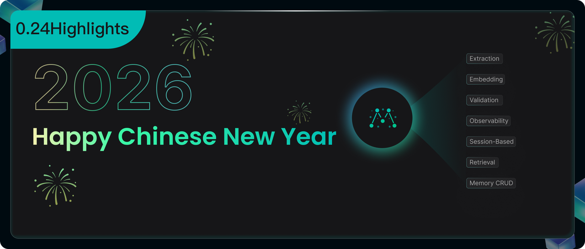
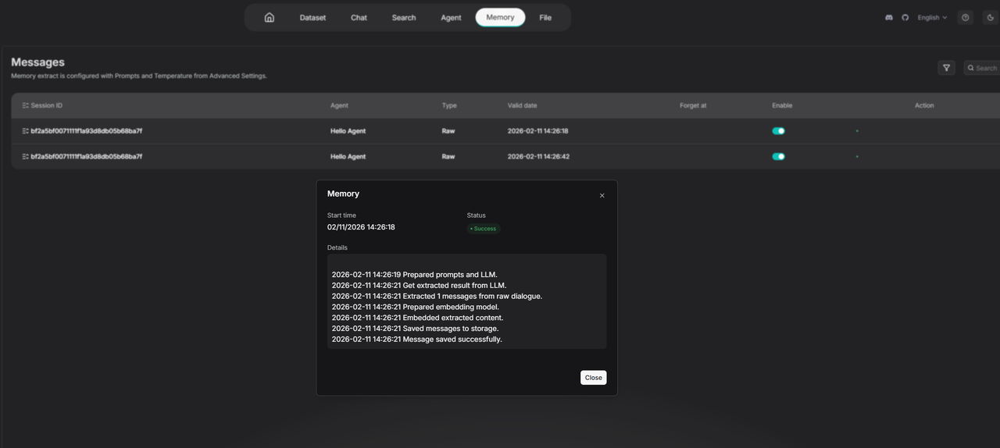
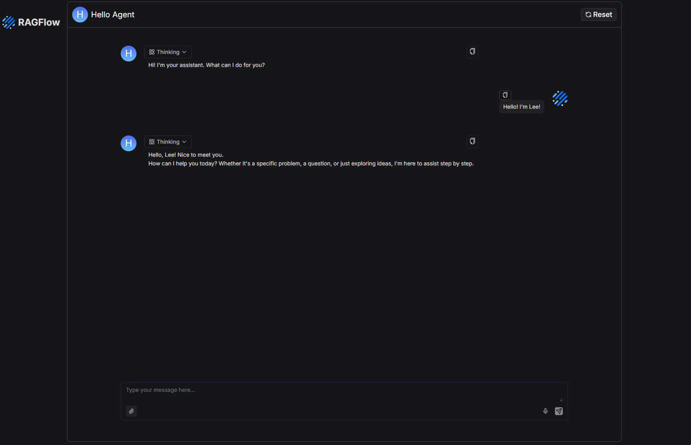
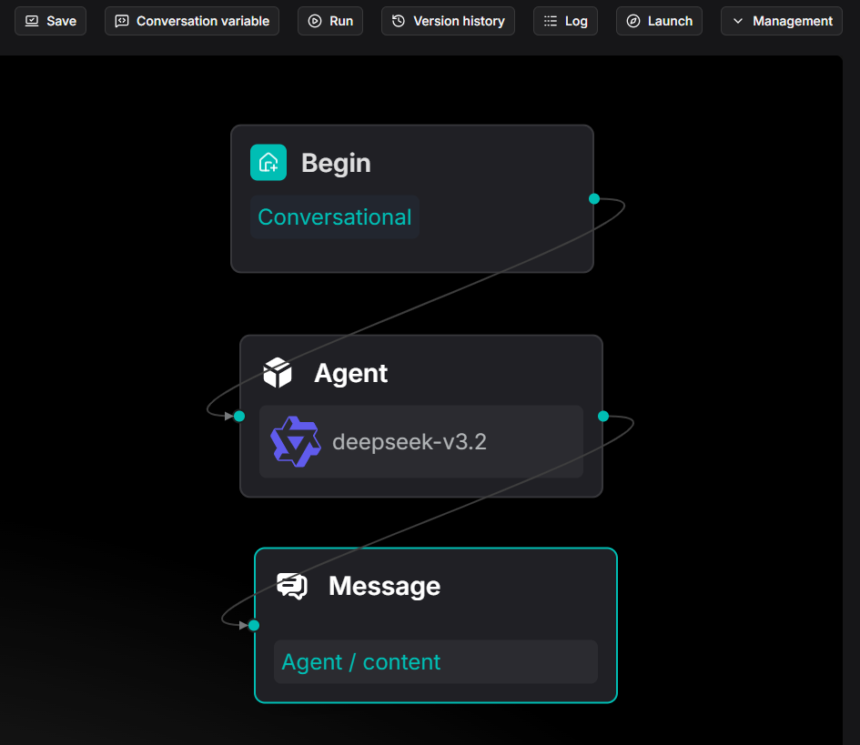
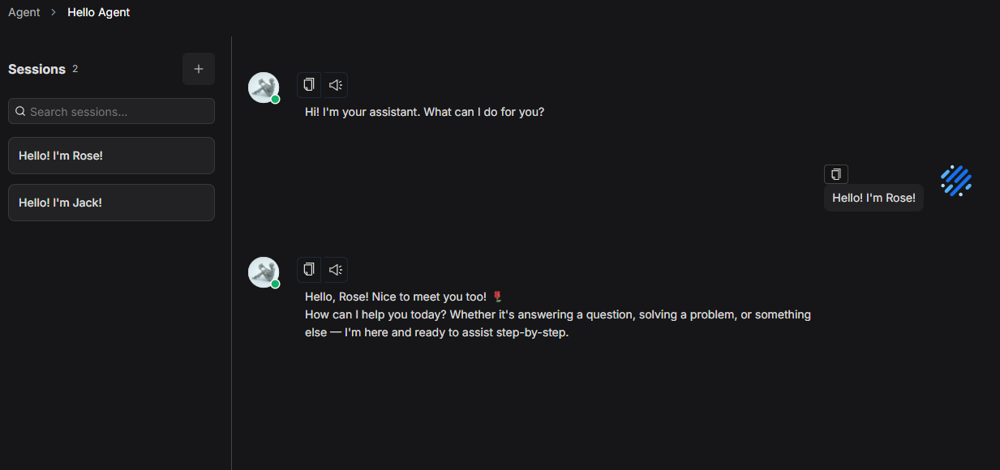
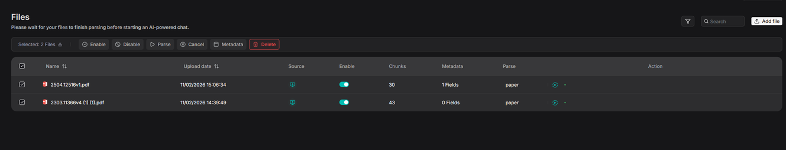
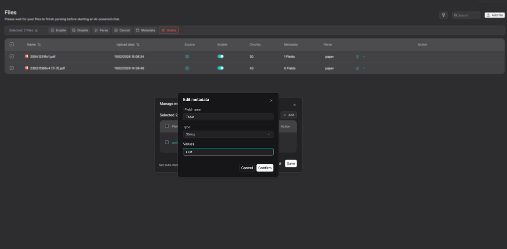
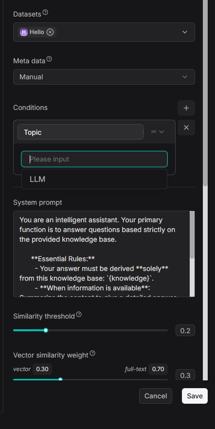
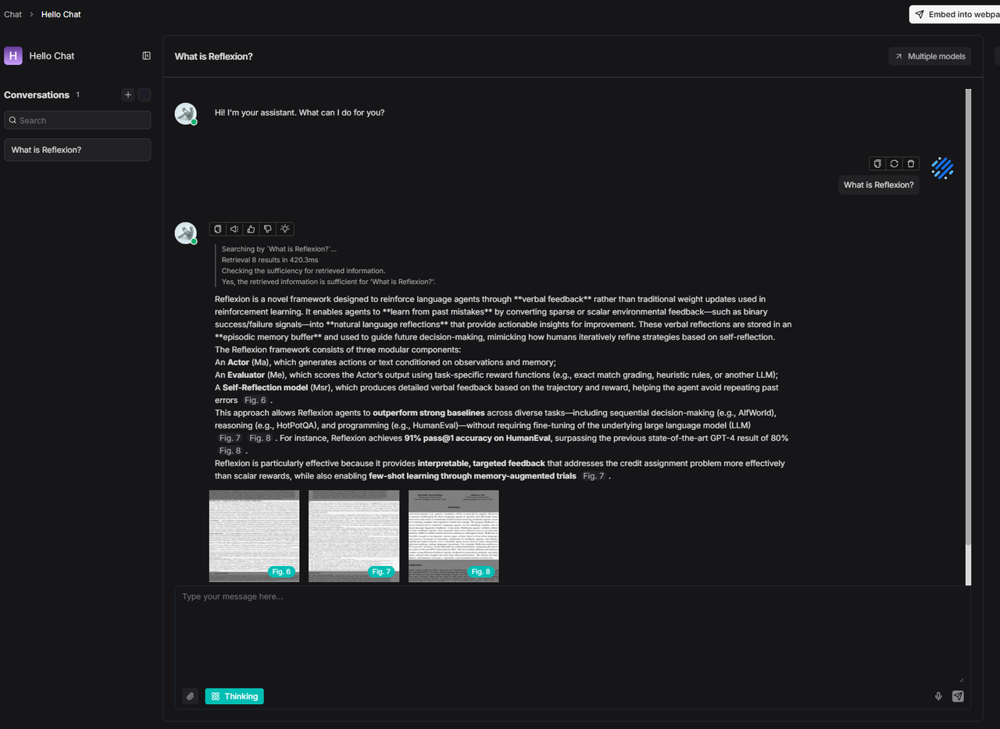
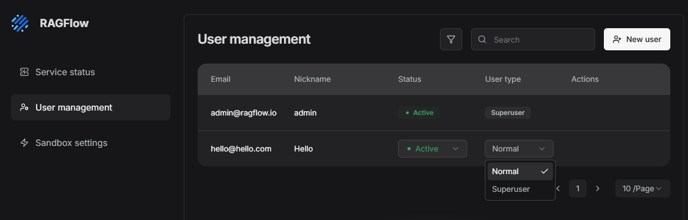

RAGFlow 0.24 introduces a series of features addressing core challenges developers face in real-world deployments: how to integrate and maintain Memory, how to ensure continuous Agent usability, and how to govern knowledge base data effectively.

- **Observable Memory**: The console now features Memory extraction status and logs, making every step of asynchronous tasks clear and traceable. Additionally, HTTP APIs and a Python API are provided, enabling engineered integration for CRUD operations and intelligent retrieval of Memories.
- **Agent Chat Management**: A new **Launch** button allows users to enter a chat interface consistent with the Chat design, where all conversation histories are preserved.
- **Manageable Knowledge Base Metadata**: Supports batch management of metadata for multiple files, enhancing the user experience when configuring application metadata.

We will now delve into each of these features and improvements.

## Memory management

### Output memory extraction log

We have added extraction status and comprehensive log display to the Memory console.

Each Memory extraction, embedding, and storage operation is no longer a black-box process. It is now transparently shown to developers: when it started, the processing steps involved, whether it succeeded, and when it was written to storage.

This feature significantly enhances the system's observability, allowing developers to clearly understand how Memories are generated.

### Manage management API

To facilitate developer integration, Memory now supports two invocation methods: RESTful API and Python SDK. These interfaces enable comprehensive management of Memories and their entries, including:

- **CRUD Operations**: Create, query, update, or delete Memories; add memory entries; modify the enabled/disabled status of entries within a Memory; or manage the forgetting of entries no longer needed.
- **Session Management**: Organise and retrieve relevant memories by session.
- **Intelligent Retrieval**: Quickly locate memories using keyword and semantic similarity searches.

Whether you are building a conversational chatbot or a complex application requiring state persistence, you can seamlessly integrate Memory through straightforward API calls. For detailed usage and parameter descriptions, please refer to the [HTTP API](https://ragflow.io/docs/http_api_reference#memory-management) and [Python API](https://ragflow.io/docs/python_api_reference#memory-management).

## New Agent chat management interface

Previously, developers primarily used RAGFlow's Agent in two ways:

- Building a custom frontend application to interface with the API
- Publishing it for external use via an embedded page

The first approach offers flexibility but requires frontend development effort. The second has a lower barrier to entry, yet it presents a drawback for users wishing to use the Agent continuously: it does not retain historical chat records, nor does it allow users to resume previous conversations.

This release addresses the issue. Clicking the **Launch** button at the top of the Agent page now opens a chat interface similar to that of a Chat assistant application.

Within this interface, multiple conversations and their chat histories are preserved.

## Batch metadata management

In previous versions of RAGFlow, maintaining metadata was a rather cumbersome process for developers. The platform now supports batch metadata management, allowing multiple files to be selected and their metadata managed simultaneously.

Additionally, batch deletion of metadata for a single file is now supported directly from the interface.

Previously, configuring metadata filtering logic within a chat application required manually entering filter values. With this update, RAGFlow has replaced this with a dropdown selection box, streamlining the configuration process for developers.

## Chat's Thinking mode

The chat application has introduced a thinking mode to replace the previous reasoning toggle in the configuration. The underlying algorithmic strategy has been optimised for deep research scenarios, further improving retrieval precision.

## Support for multiple admin users

In previous versions, superuser privileges were concentrated by default in the admin@ragflow.io account. While this is acceptable for personal use, in an enterprise environment a single superuser often creates a bottleneck and concentrates authority.

With this update, RAGFlow now supports assigning superuser privileges to multiple users, moving beyond the limitation of a single admin account.

## Finale

This update to RAGFlow 0.24 aims to further assist developers in utilising and consolidating data assets within the platform:

- Memory, as a long-term system for accumulating agent data assets, needs to provide developers with more convenient access and debugging capabilities.
- A knowledge base should be more than just storage for files; it should be a governable data asset, requiring low-cost metadata management capabilities.

At the ecosystem level, this release adds support for OceanBase as the primary database, which can replace MySQL in deployments. It also introduces support for PaddleOCR-VL, further enhancing document and visual text processing capabilities.

In upcoming versions, RAGFlow will begin integrating agent skills, helping developers build agent systems with higher execution accuracy and greater stability.

## Reference

1. https://www.ragflow.io/docs/v0.24.0/http_api_reference#memory-management
2. https://www.ragflow.io/docs/v0.24.0/python_api_reference#memory-management