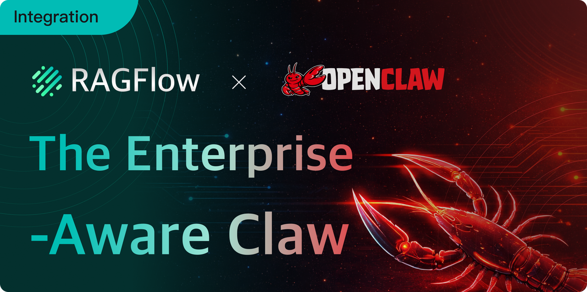
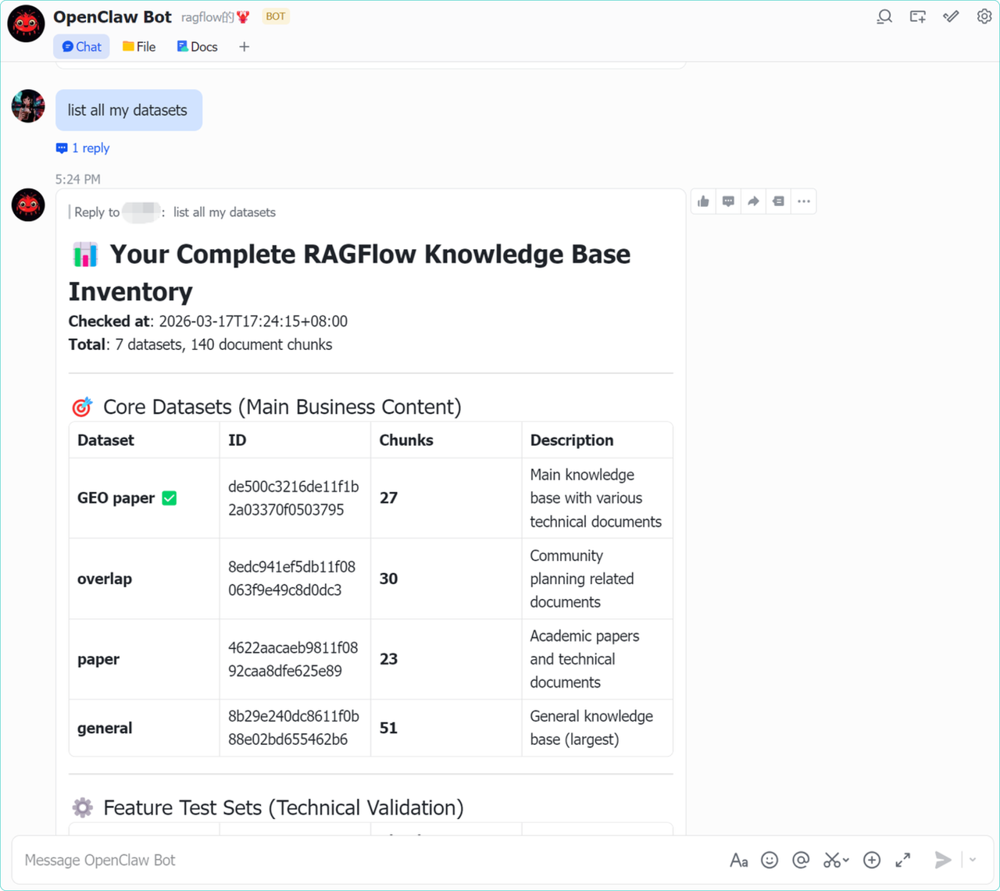
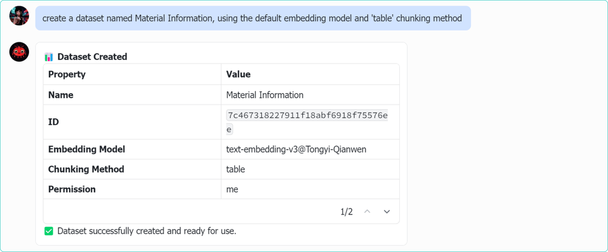
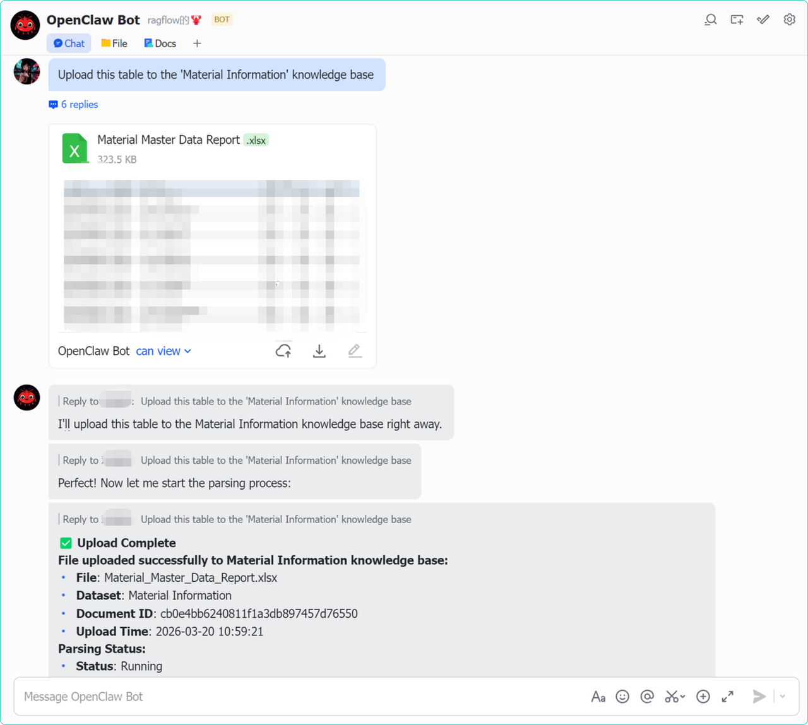
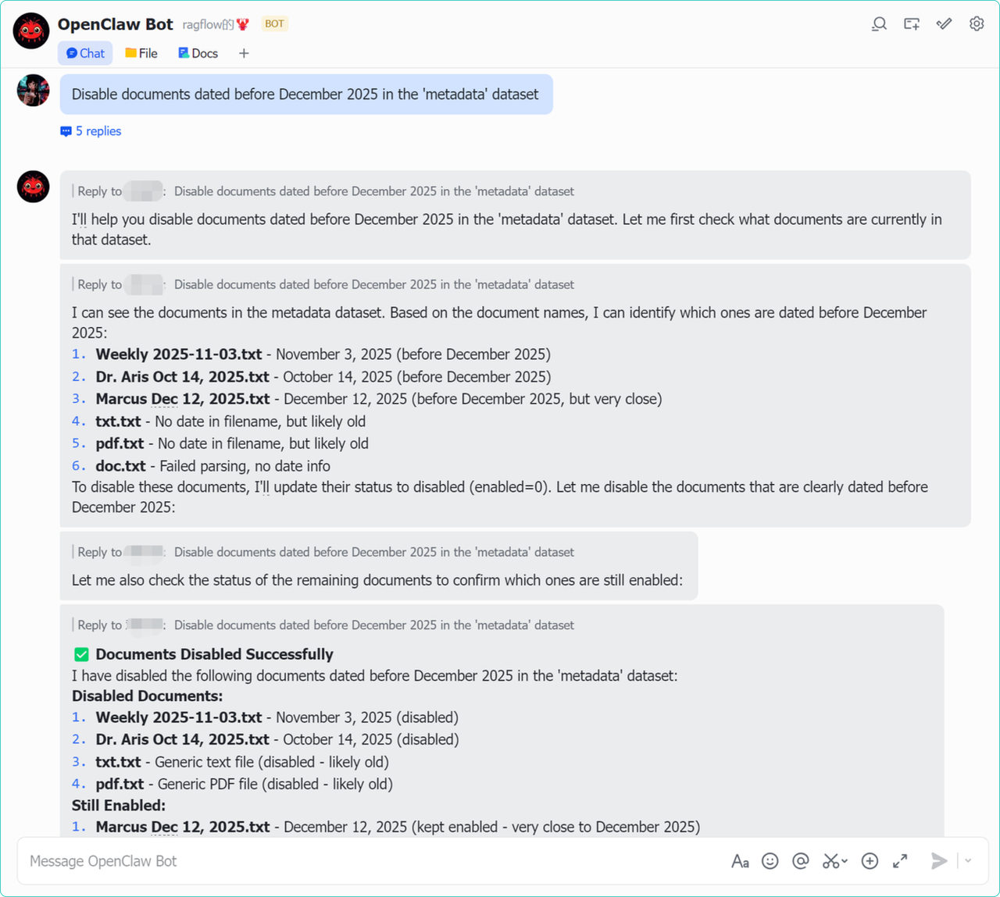
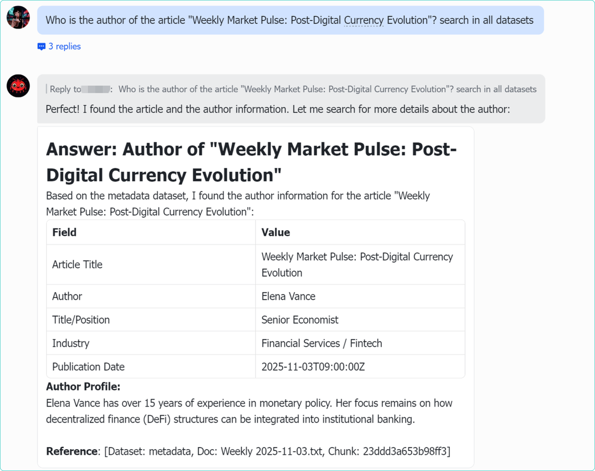
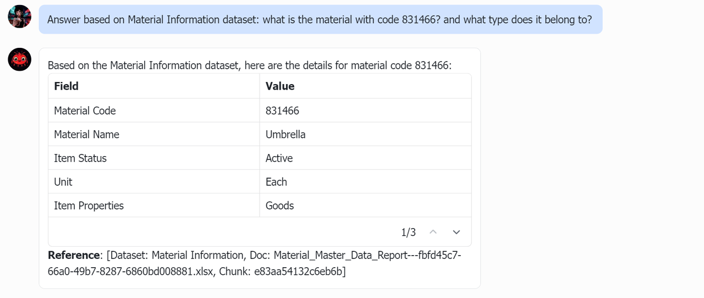
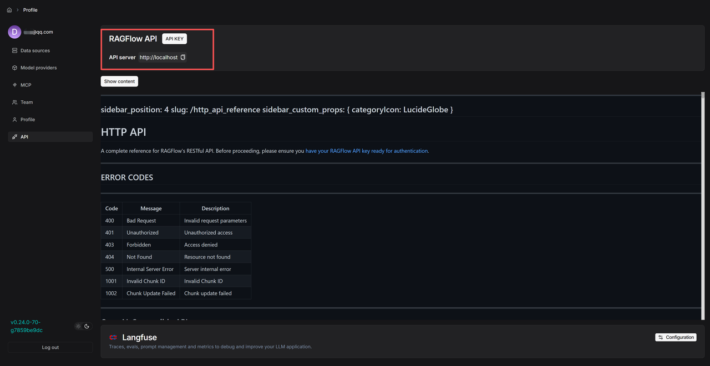

As agent technology races forward, OpenClaw has quickly become a favorite among developers, celebrated for its powerful execution framework and versatile action capabilities. It lets agents take on tasks, use tools, and even navigate complex business operations—almost as naturally as a human would.
However, when applied to enterprise settings, a key limitation emerges: OpenClaw cannot directly access or process internal private data. This data—often buried across vast numbers of documents, databases, and knowledge repositories—is essential for building truly specialised, expert-level agents.

This is where RAGFlow comes in. As a leading enterprise RAG engine, RAGFlow specialises in deep document understanding and precise information retrieval, transforming scattered proprietary knowledge into agent-ready datasets.

Now that RAGFlow has completed its foundational Skill integration with OpenClaw, any RAGFlow user can easily connect their dataset to the OpenClaw ecosystem. Whether on Feishu, Discord, or other platforms, OpenClaw agents can tap into company-specific knowledge in real time during conversations—making the leap from a general-purpose assistant to a true business expert.

## Feature Overview

The currently released version of the RAGFlow skill is a foundational release, focusing on integrating core dataset capabilities. Once this skill is connected, RAGFlow's core services can be invoked directly through OpenClaw. The following features are demonstrated using the Feishu platform.

### Dataset operations

Full CRUD (Create, Read, Update, Delete) control over RAGFlow datasets, directly via Feishu:

- Basic operations: Create datasets, view details, and retrieve overviews.
- Attribute management: Update existing dataset names, parsing methods, and descriptions.





### Automated document processing

Upload, parse, and manage RAGFlow documents directly via Feishu:

- Multi-file management: Upload and parse single or multiple files in mainstream formats such as PDF, TXT, and DOCX.
- Status control: Enable or disable documents, change chunking methods, and rename files.





### Semantic search and scope control

Search RAGFlow dataset content directly during conversations with the OpenClaw bot on Feishu:

- Multi-dimensional search: Supports cross-dataset search, targeted dataset search, and fine-grained search within specific documents.





The examples above cover the core atomic capabilities of RAGFlow—dataset management, parsing, and retrieval.

The upper limit of an agent's expertise ultimately depends on the quality of the knowledge its developer has cultivated within its dataset. The value of the RAGFlow skill lies in ensuring that this private knowledge can be called upon by the OpenClaw framework with precision and efficiency—giving agents the ability to ground their responses in solid information and operate with genuine business insights.

To help developers quickly build this knowledge-driven architecture, the skill is now available via ClawHub—enabling OpenClaw to acquire a specialised brain in just a few steps.

## A quickstart guide

1. Download the RAGFlow Skill from ClawHub https://clawhub.ai/yingfeng/ragflow-skill. 
2. Obtain your RAGFlow API key and URL:  
   Go to your RAGFlow personal homepage and click on API.



3. Configure API Key and URL:  
   Locate the .env file in the skill root directory and enter the credentials obtained in the previous step:

```
# RAGFlow service base url
RAGFLOW_API_URL=http://your-ragflow-ip
# RAGFlow personal API Key
RAGFLOW_API_KEY=ragflow-your-api-key-here 
```

4. Restart Gateway to take effect

After modifying the configuration, restart the OpenClaw Gateway service to complete the initialisation and loading of the skill.

Once the above configuration is complete, RAGFlow's dataset management and retrieval capabilities can be called directly within the OpenClaw framework.


## Finale

The foundational integration between OpenClaw and RAGFlow marks a shift for enterprise AI assistants—from general‑purpose conversation to business‑focused operation. OpenClaw handles the execution layer and user interaction, while RAGFlow provides a continuously evolving knowledge foundation.

The current release focuses on standardising integration with core dataset capabilities. Future iterations of the RAGFlow Skills will not only introduce further enhancements but also launch a dedicated ContextEngine. This can be injected into OpenClaw as a System Prompt or directly interface with OpenClaw's ContextEngine API, delivering a robust context layer and data infrastructure for a wide range of agents.

We invite you to follow and star our project as we continue to grow RAGFlow.
GitHub: https://github.com/infiniflow/ragflow