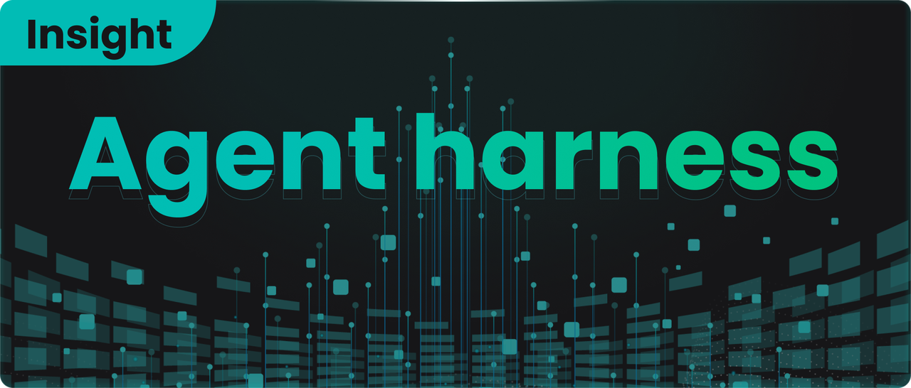
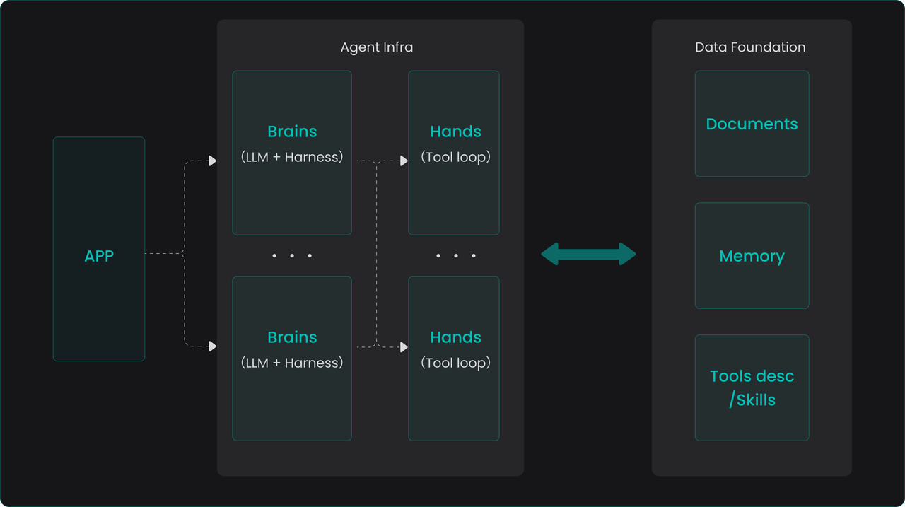
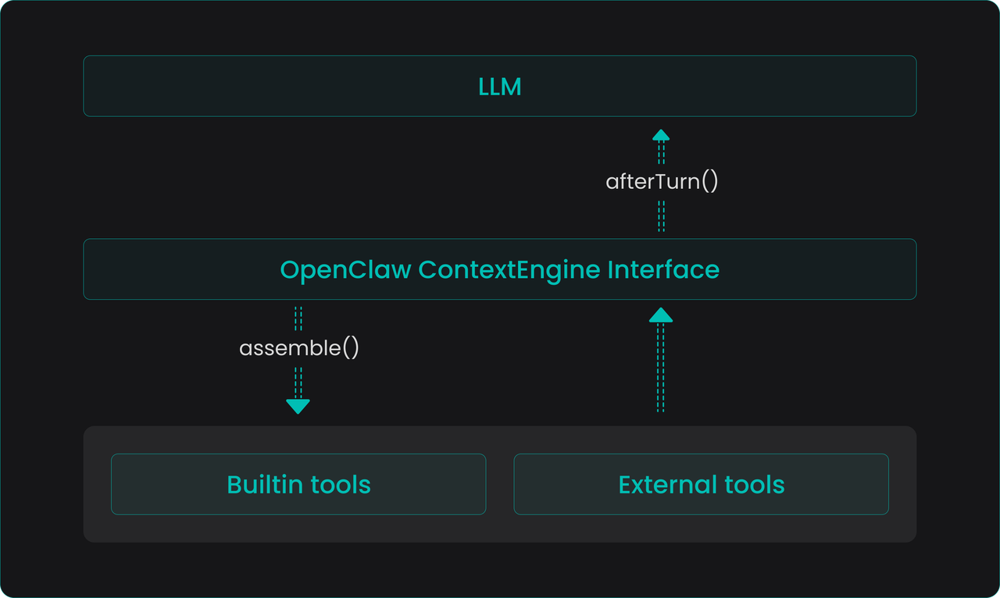
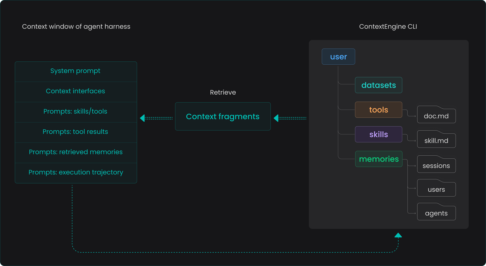

In our 2025 year-end review, we clearly defined RAGFlow’s product evolution direction as a context engine and explained the technical necessity of this path from the technical underlying layer. Several months have passed, and the evolution speed of the AI ecosystem is restructuring industry perceptions almost on a monthly basis. Whether the vision proposed at that time is still valid today? This article attempts to conduct a phased review and use it to respond to community concerns regarding RAGFlow's subsequent positioning.

Agent harness has undergone extremely dense practical iterations over the past few months. From the modular tools and large-scale application of skills in OpenClaw, to the engineering breakthroughs of Hermes Agent in context management and skills evolution, and the indirect open-sourcing of claw-code which allowed the community to truly touch the engineering core of an agent harness—answering the core proposition of "what a reliable general agent harness should actually look like"—harness design paradigms are being redefined at an unprecedented speed. These iterations together point to a clear trend: the harness is gradually converging from independent solutions into infrastructure.

Recently, with the release of Claude Managed Agents, agent harness has entered a productized and enterprise-level stage. Currently, the components included in an agent harness, such as task orchestration, context engineering, skills systems, and memory operations, are simultaneously presenting two trends. On one hand, their definitions and usage methods are accelerating towards standardization and engineering; on the other hand, some capabilities originally undertaken by the harness are being natively absorbed by LLMs. Anthropic, therefore, abstracts the LLM and harness together as a "Brain"—a stateless decision core responsible for task planning and distribution. The actual capability boundary of an agent is determined by the tools it can call, which are started and executed in code form within a sandbox. This is a crucial architectural abstraction: the Brain remains stateless and can be started or stopped at will, while all persistent states are stored externally (e.g., in session data). The entire ecosystem is thus irreversibly moving toward a clear separation between the state layer and the stateless layer.

This separation trend coincides perfectly with RAGFlow's positioning—supplying data for agents and serving as the agent's data foundation. For enterprise scenarios, an open-source data foundation located at the state layer is particularly critical. It not only provides high-quality, strong-semantic context data for various stateless Brains, but more importantly, it allows enterprises to avoid being bound to a specific vendor's Brain implementation, thereby establishing a unified and independently controllable data infrastructure.

## Why the data foundation must, and can only, be built with retrieval capability as its core

Intuitively, there are two technical paths for building an agent data foundation. One is to expand based on various existing databases—this line of thought directly inherits existing experience from big data platforms. Supplementing vector retrieval capabilities on the basis of data lakes and data warehouses seems to logically form the prototype of an "all-powerful foundation". However, this idea precisely ignores the following key facts:

- **The processing of unstructured documents goes far beyond storage and retrieval.** An agent's demand for unstructured data like documents is not just "storing it and finding it." It involves a complex pipeline centered on heterogenous data source access, governance, cleaning, and semantic enhancement. At the same time, there are diverse deep demands in the retrieval process—such as what indexing strategy to use, whether real-time completion and navigation are needed during retrieval, and expanding semantic associations. These logics are highly complex and dynamic, making them difficult to complete elegantly in a closed manner within a database.
- **The structured data system does not need to be rebuilt.** Existing enterprise data platforms and business systems already carry a large amount of structured assets; re-covering them with a new database is neither realistic nor necessary. What an agent truly needs is access interfaces to these systems, along with supporting documentation—including API reference manuals, calling examples, and related skills best practices. Providing rich search capabilities for these document-like metadata is sufficient to help agents efficiently filter out the vast majority of tool options that do not match current intentions during execution, thereby initiating calls with the correct parameters and forms.
- **The value of conversational memory data is reflected in two dimensions.** Conversation data generated during agent operation serves as the source of truth for the harness session history—a complete execution log whose primary demand is reliable storage and governance. On the other hand, it needs to provide memory supply for subsequent agent behavior, where the core demand is efficient retrieval. However, retrieval here is not a simple search of raw session content, but a whole set of control logic decided by the harness regarding "when to read, when to write, what to write, how to compress, how to replay, and how to maintain consistency across sessions." This layer of memory harness orchestration and control, along with the data management pipeline supporting it—processing, abstracting, and indexing raw session data—is essentially no different from the cleaning and semantic enhancement pipeline experienced by document-type data.

In summary, retrieval capability constitutes the capability core of the agent data foundation, but it is not a simple "database with search functions." Instead, it is a whole set of data control planes built around retrieval. From the perspective of harness usage, a simple `search` command-line interface seems to meet most needs, but supporting this interface is a whole set of data engineering systems far beyond the scope of vector retrieval—from the access and understanding of multimodal data to the selection and tuning of indexing strategies, to intention perception and context enhancement during the retrieval process.

## What kind of retrieval does agent harness actually need?

If the original design point of RAG was to provide precise answers for human users, then the agentic era requires the retrieval system to redesign its service paradigm for intelligent agents.

In a sense, RAG itself can be understood as a built-in, simplified version of an agent: humans propose query intentions, the system goes through built-in decision logic—such as deep research, intention recognition, content navigation, etc.—assembles the complete context, and finally hands it over to the LLM to generate an answer. In a typical daily knowledge base task, this type of behavioral interaction usually converges and completes within ten-odd times. However, as RAG technology further sinks, its role is shifting from a human-oriented "Q&A engine" to a "context supply layer" serving the agent framework. Humans no longer directly initiate queries to the knowledge base but entrust the requirement as a whole to the intelligent agent, which independently completes the acquisition and assembly of answers. Under this shift, retrieval behavior will present characteristics completely different from information retrieval research over the past few decades:

- **Fundamental migration of behavioral patterns:**
  - The volume of search requests initiated by agents will far exceed that of human users, possibly even spanning two orders of magnitude. Simultaneously, the agent's query trajectory will significantly lengthen, forming continuous, exploratory retrieval sequences.
  - Therefore, the focus of system optimization should shift from traditional "query expansion and rewriting" to "execution efficiency optimization" and "diversity assurance with session awareness."
- **Re-examination of retrieval infrastructure:**
  - Probability ranking principles, user models, benchmark testing systems, and even the concept of "relevance" itself may need to be redefined and calibrated in agentic scenarios.
  - How to robustly deal with the impact of mixed distributions of organic and synthetic queries will become a key technical challenge in the next stage.

|                    | Traditional IR (human user)                     | Intelligent agent IR (AI user)                               |
| :----------------- | :---------------------------------------------- | :----------------------------------------------------------- |
| **User profile**   | Unskilled searcher, needs help                  | Skilled researcher, but might "get stuck in a rut"           |
| **Core challenge** | User intention is unclear → system must "guess" | User can search too much → system must "block"               |
| **Key capability** | Understanding vague intentions                  | Predicting behavioral patterns, preventing resource exhaustion |

- **New opportunities for semantic caching and truncation strategies:**
  - Queries within the same task trajectory are highly similar at the semantic level but have extremely low exact text matching rates, which brings huge room for semantic caching, while traditional caching strategies based on exact hits are almost completely invalid.
  - Intelligent agents will not naturally give up when encountering difficulties like humans do; therefore, new truncation and stop strategies need to be designed to prevent the infinite spread of invalid retrieval.

Facing these emerging propositions, RAGFlow's evolution direction also corresponds to them one by one:

- **Refactor the online API service layer with the Go language.** RAGFlow's early use of Python for rapid verification and iteration played an irreplaceable role in the project's success, but its performance bottlenecks have become increasingly prominent with the expansion of call scale. The core service rewritten in Go can calmly handle the two orders of magnitude increase in access for agentic retrieval and fully release the performance potential of the underlying database.
- **Provide a unified ContextEngine CLI access entry.** Intelligent agents only need to use a single `search` command to seamlessly retrieve all information across heterogenous data sources, greatly reducing the complexity of access and usage on the harness side.
- **Build-in richer data processing pipelines.** The upper limit of retrieval capability essentially depends on the depth and breadth of semantic enhancement during the data writing process. Continuous maintenance and diversified expansion of data pipelines are always the most critical and complex factors determining retrieval quality.

After completing the above evolution, RAGFlow will formally release version 1.0 in a more complete posture. But 1.0 is definitely not an end point. On the contrary, when retrieval users change from humans to intelligent agents, a whole new problem domain has just surfaced: How to define "relevance" from an agent's perspective? How to evaluate the cumulative utility of the retrieval system in hundreds of continuous calls? At what granularity and with what strategy should semantic caching be embedded into the retrieval pipeline? How should truncation and retry mechanisms be designed in coordination with the agent's task planning? These questions cannot find ready-made answers in traditional information retrieval papers; they together point to a fact—agentic retrieval will become one of the core battlefields for industry innovation in the next stage.

RAGFlow is closely monitoring and actively following this frontier. From selecting more efficient index structures to building a retrieval evaluation system oriented toward agent trajectories, to exploring deep integration with open-source harness frameworks, RAGFlow’s evolution direction is always in sync with the data demands of the agentic era. We believe that a true data foundation for intelligent agents will not be a finished product achieved in one go, but an organic system that continuously resonates with the ecosystem and constantly reshapes itself.

## Bibliography

- https://blog.langchain.com/your-harness-your-memory/
- https://x.com/sarahwooders/status/2040121230473457921