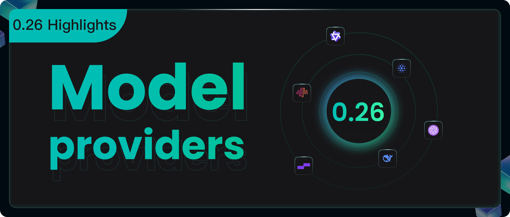
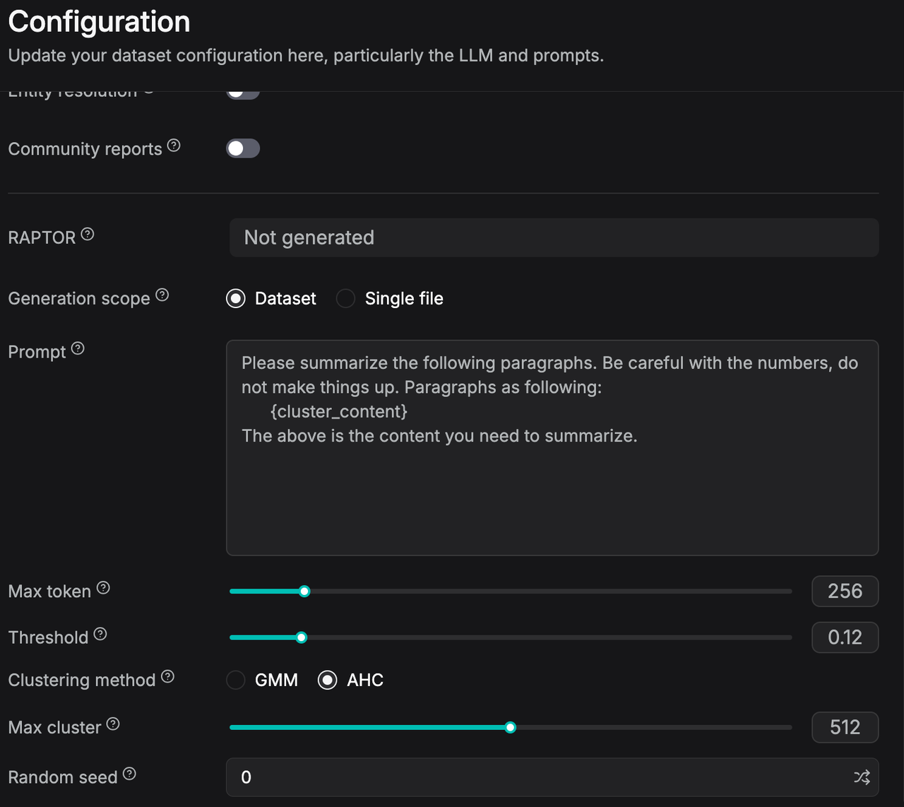

RAGFlow's development has picked up speed since version 0.25, with new updates rolling out almost weekly. Version 0.26 builds directly on this momentum, consolidating several recent micro-updates. Below are the core highlights of this version:

## API refactoring

Initially, RAGFlow maintained a single API set dedicated exclusively to its web frontend. To support SDKs (like the Python SDK) and third-party integrations, a separate HTTP API was later introduced for external developers. Consequently, a single business function—such as document uploading—was split into two independent implementations:

* **Legacy Web API:** e.g., `POST /v1/document/upload`, authenticated via session login, using `kb_id`.
* **Legacy SDK API:** e.g., `POST /api/v1/datasets/{id}/documents`, authenticated via API Key.

While both variations shared the exact same underlying logic (file validation -> permission checks -> core service invocation -> response), they were maintained in separate codebases. Across RAGFlow’s hundreds of endpoints, the vast majority suffered from this dual-implementation overhead.

This redundancy introduced severe maintenance bottlenecks:

- **Compounded Development:** Any change to core business logic required modifying at least two separate files. New developers faced a steep learning curve just deciphering which endpoint to target.
- **Duplicated Testing:** Test suites were split between `test/testcases/test_web_api/` and `test/testcases/test_http_api/`. Every feature required coverage in both suites, and logic changes necessitated synchronized test updates. Over time, maintenance costs grew exponentially.

Furthermore, the legacy Web API funneled all operations (uploading, listing, deleting, parsing, and configuring) through the `/v1/document/` path exclusively using `POST` methods:

```http
POST /v1/document/upload                  // Upload document
POST /v1/document/list                    // List documents
POST /v1/document/rm                      // Delete document
POST /v1/document/run                     // Run/Cancel parsing
POST /v1/document/update_metadata_setting // Update metadata configurations
POST /v1/document/change_parser_config    // Modify parser configurations
```

This design obscured the hierarchical relationship between documents and datasets. Under standard REST paradigms, a document is a sub-resource of a dataset; therefore, resource paths should reflect a `datasets/{id}/documents` hierarchy, utilizing distinct HTTP methods (`GET` for listing, `DELETE` for removal, `PATCH` for updates). The old design lacked standardization and muddied API semantics.

To resolve these structural flaws, RAGFlow 0.26 introduces a comprehensive overhaul of the API layer:

* **Unified Architecture:** Consolidated the two disparate API sets into a single, clean, RESTful API.
* **Hierarchical Paths:** Structured resource paths logically to reflect ownership (e.g., `POST /api/v1/datasets/{dataset_id}/documents`).
* **Standardized Semantics:** Leveraged standard HTTP verbs to explicitly convey actions.

To ensure a smooth transition for existing external clients, RAGFlow provides a robust bridging mechanism via `backward_compat.py`. Deprecated endpoints remain functional but will trigger log warnings that guide users toward the new contract:

```
WARNING: API endpoint /v1/document/upload is deprecated.
Please use POST /api/v1/datasets/{dataset_id}/documents instead.
```

This refactor delivers multi-fold benefits: a lower barrier to entry for new developers, streamlined SDK maintenance, and a hardened public contract. Ultimately, this milestone stabilizes the platform for its upcoming v1.0 release, paving the way for a high-performance, Go-based production ecosystem.

## Model provider refactoring

As the data foundation for LLMs, RAGFlow must manage a vast array of models—including Chat, Embedding, Rerank, ASR, Vision, TTS, and OCR—each backed by different providers (OpenAI, Azure, Ollama, etc.) and API keys. In the legacy architecture, model provider management was rudimentary: instead of standalone RESTful APIs, it relied on flat endpoints like `/set_api_key`, `/add_llm`, `/delete_llm`, and `/my_llms` with completely custom parameters, making it highly difficult for external SDK developers to manage model configurations via APIs. The data model was equally flat: a single `TenantLLM` table directly stored `tenant_id + llm_name + llm_factory + api_key`, which severely restricted scalability. For instance, if you wanted to configure two different regional instances (e.g., US West and Europe) under the same Azure account—each hosting its own set of models—the legacy architecture could not support it because the concept of an "instance" tier simply did not exist.

Version 0.26 introduces a brand-new, three-tier architecture: Provider -> Instance -> Specific Model, supported by five core tables. `TenantModelProvider` records the LLM providers (such as OpenAI, Azure, or Ollama) under a tenant; `TenantModelInstance` allows multiple instances (e.g., different regions or API keys) to be configured under the same provider; `TenantModel` registers multiple models (such as `gpt-4o` or `gpt-4o-mini`) under each instance along with their specific model types; finally, `TenantModelGroup` and `TenantModelGroupMapping` organize multiple model instances of the same utility into logical groups to support weighted routing. This means you can now configure two separate API keys for OpenAI to enable primary/backup switching, set up multiple Azure regional instances without interference, and leverage model groups for intelligent routing—such as directing 70% of requests to `gpt-4o` and 30% to `gpt-4o-mini`.

The new version also introduces a unified, three-part composite identifier: `modelName@instanceName@providerName` (e.g., `gpt-4o@default@OpenAI` or `deepseek-chat@cn-beijing@VolcEngine`), precisely pinpointing the complete execution path from Provider -> Instance -> Model. Concurrently, this refactor adds two standard RESTful API modules (Provider API and Models API); please refer to the official documentation for specific interface details.

Overall, the legacy version suffered from flat data models, lack of multi-instance support, inconsistent model identification, fragmented API styles, and an absence of routing strategies. In contrast, version 0.26 leverages a five-table, three-tier structure, three-part identifiers, and standard RESTful APIs to comprehensively boost scalability, laying the essential groundwork for upcoming advanced capabilities such as weighted routing and multi-model load balancing.

| Dimension | Legacy Architecture | New Architecture |
| :--- | :--- | :--- |
| **Model Identification** | `model@factory` tuple | `model@instance@provider` triplet |
| **Instance Management** | Single instance | Multi-instance + Independent API keys |
| **API Endpoints** | Scattered across various modules | Unified Provider + Models system |

## Data source incremental mechanism: eliminating "ghost" files

Beginning with version 0.22, RAGFlow introduced support for importing files directly from external data sources (such as S3 or local directories). However, earlier iterations of the synchronization pipeline only detected additions and updates, leaving deletion detection unaddressed. Consequently, if a file was deleted from the data source, RAGFlow would retain its indexed data, causing stale or invalid content to persist in retrieval and conversation results.

The underlying cause was straightforward: data source APIs rarely broadcast file deletion events proactively. Detecting deletions requires fetching a complete, real-time file list from the data source and diffing it against the local database; documents present in the database but missing from the data source list are identified as deleted. Because fetching a comprehensive snapshot can be resource-intensive across certain data sources, this check was disabled by default.

Version 0.26 resolves this limitation by introducing a two-tier mechanism driven by lean snapshots and conditional triggers:

- **Lean snapshots:** The system fetches only file IDs and filenames without pulling core content, drastically reducing transaction costs.
- **Conditional triggers:** Deletion detection executes automatically only when specific criteria are met (i.e., non-full indexing, non-initial synchronization, and the feature explicitly enabled in configurations).

Once a missing file is identified, the background worker automatically purges all associated records—including database entries, vector indices, document chunks, and knowledge graph references—permanently eliminating the issue of orphaned files.

Additionally, S3-compatible data sources (such as AWS S3, Cloudflare R2, Google Cloud Storage, Oracle OCI, and generic S3 storage solutions) previously suffered from a hidden bandwidth bottleneck: during incremental syncs, every object falling within the sync time-window had to be downloaded in full solely to compute its hash value for verification against the database's `Content Hash` field. Consequently, a simple `touch` operation—which updates the timestamp without altering the underlying bytes—would trigger a complete download and re-parsing sequence. For massive repositories, this resulted in gigabytes of unnecessary data transfers for files that remained byte-identical, wasting substantial network bandwidth.

To optimize this process, RAGFlow now leverages the S3 `ETag` fingerprint (essentially an MD5 checksum of the object content). As long as the file content remains unchanged, the `ETag` persists regardless of modification time updates. By routing validation through this `ETag` bypass, synchronization bandwidth consumption drops from mandatory full downloads to fetching only genuinely modified files—analogous to a Git incremental pull. In environments prone to frequent "pseudo-updates," this mechanism reduces daily bandwidth usage by multiple gigabytes.

## RAPTOR improvements: more stable cross-document retrieval

RAPTOR has been a highly popular, advanced RAG feature in RAGFlow since its initial rollout in 2024, specializing in resolving multi-hop queries. Version 0.26 delivers its first algorithmic upgrade, incorporating insights from recent research on Ψ-RAG (see [here](#reference)).

Traditional RAPTOR implementations utilize $k$-means or Gaussian Mixture Models (GMM) for clustering, building a fixed-depth binary tree bottom-up. This methodology inherently introduces a "uniform effect"—tending to generate evenly sized clusters regardless of the underlying data distribution. Furthermore, when clustering across multiple distinct documents, the architecture lacks explicit cross-document linkages, leading to a sharp drop in retrieval ranking F1 scores as document volume scales.

In contrast, the Ψ-RAG methodology employs a pipeline structured around similarity sorting -> iterative merging and collapsing -> abstraction generation. Starting with the most similar pairs of chunks, the algorithm dynamically decides whether to merge them (creating a new parent node), collapse them as leaf nodes (attaching them under an existing parent), or collapse them as abstract nodes (bridging disparate subtrees). A subsequent rebalancing phase regulates the maximum number of child nodes assigned to each abstract node. This allows the resulting cluster hierarchy to conform naturally to actual data density. Empirically demonstrated by the authors of the study, this approach keeps the F1 score highly stable across incremental updates and massive datasets, bypassing the architectural limitations of traditional RAPTOR.

Users looking to leverage this updated algorithm can navigate to the user interface, access the **Clustering method** configurations, and switch the selection from the legacy **GMM** option to **AHC**.



## Finale

Version 0.26 introduces extensive backend refactoring, laying a solid foundation for the upcoming 1.0 release. The subsequent version 0.27 will be the final 0.x milestone before 1.0 officially launches. In that release, RAGFlow will debut a knowledge compilation engine that will completely revolutionize RAG workflows and its broader ecosystem. To stay updated on these developments, follow our ongoing feature series, and please continue to support and star RAGFlow!

## Reference

1. Hierarchical Abstract Tree for Cross-Document Retrieval-Augmented Generation https://arxiv.org/abs/2605.00529
