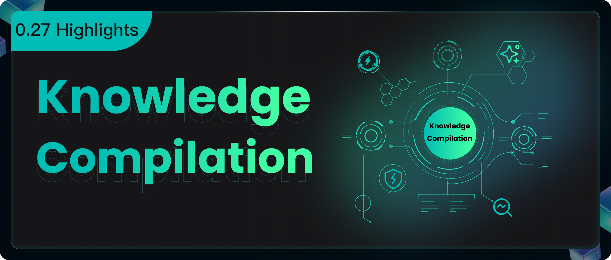

**RAGFlow v0.27.0 is officially released.** As the last major version with Python as the backend language, this release focuses on introducing a brand-new Knowledge Compilation Engine, an upgraded Agentic Retrieval framework, and a redesigned model provider configuration interface. Going forward, RAGFlow will position itself as an intelligent agent data foundation—built on knowledge compilation and serving various agent frameworks. Below is a detailed introduction to the key features in this release.

## Knowledge Compilation Engine

The term “knowledge compilation” originates from Karpathy’s concept of a “LLM Wiki,” but in RAGFlow, it means much more—it is a systematic technology that transforms unstructured data into structured, reusable knowledge assets. This engine not only parses, chunks, and indexes documents, but also identifies entities, relationships, concepts, temporal information, and hierarchical structures within them, organizing them according to different knowledge forms.

Through knowledge compilation, raw data can be compiled into various *Knowledge Artifacts*, including Wiki, Graph, Tree, Page Index, Mind Map, Timeline, and more, and can further generate Skills. These knowledge assets can be continuously used for Search, Chat, and AI Agents, providing richer and more structured contextual information for AI.

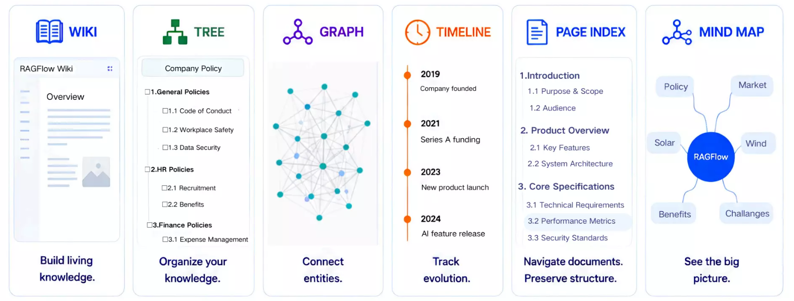

For users, knowledge compilation makes complex documents easier to browse and understand, clarifies connections among scattered information, and turns one‑time document processing results into long‑term, searchable, and reusable knowledge assets.

#### Overview of Knowledge Artifacts

- **Wiki: Organizing scattered materials into a browsable knowledge system**  
  The Wiki organizes fragmented data from datasets into interconnected knowledge pages. Users can browse by subject, entity, and concept via a navigation view, or explore associations through a graph view, with the ability to trace back to original materials at any time.

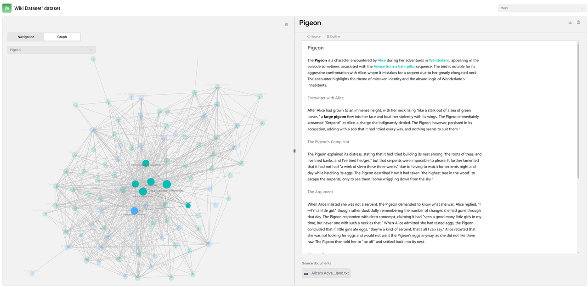

  Wiki pages also support editing, version management, version comparison, and export as Markdown files.

- **Graph: Discovering relationships among knowledge**  
  The Graph extracts entities and their relationships from documents to build an interactive knowledge graph. Users can search or click on nodes to quickly view related entities and relations, thereby uncovering cross‑document connections.

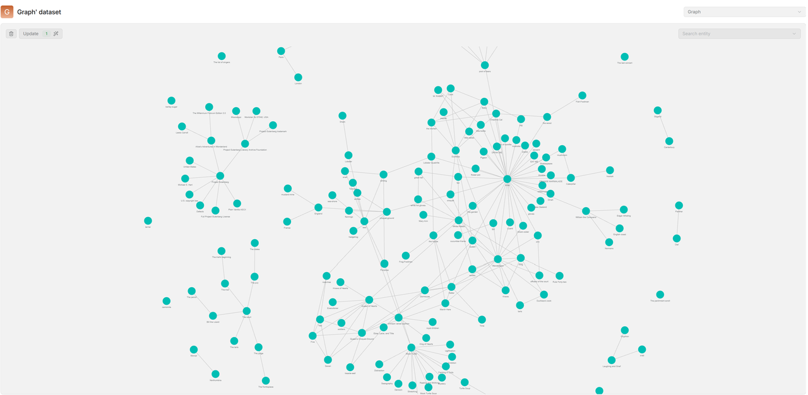

- **Tree: Organizing knowledge from topics to details**  
  The Tree arranges knowledge into a hierarchical structure based on semantic relationships, allowing users to drill down from high‑level topics to specific content. The Tree preserves the document reading order and can be generated for an entire dataset or for a single document, making it suitable for layered exploration of large knowledge bases and complex long documents.

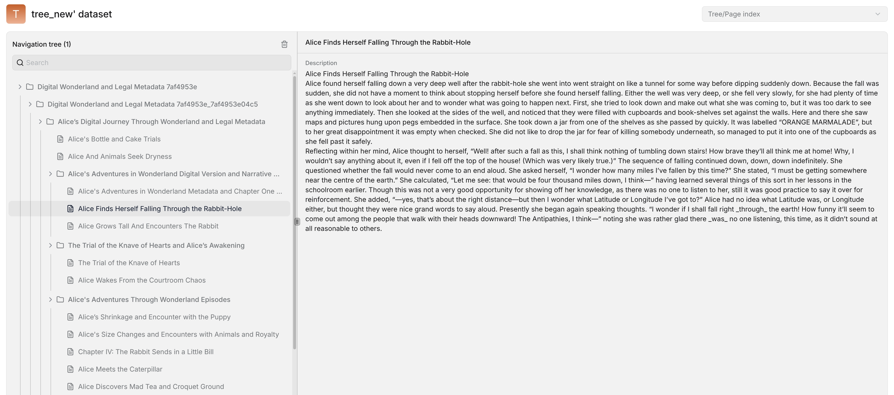
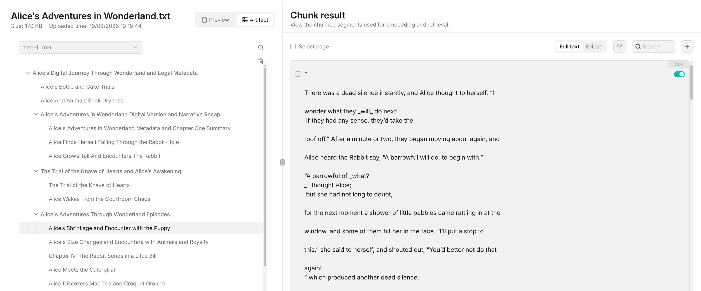

- **Page Index: Preserving and presenting document chapter structures**  
  The Page Index generates a hierarchical index from document headings, sections, subsections, key facts, and conclusions, while retaining the original logical structure. It is especially useful for navigating and locating information in long documents such as technical manuals, research reports, and legal files.

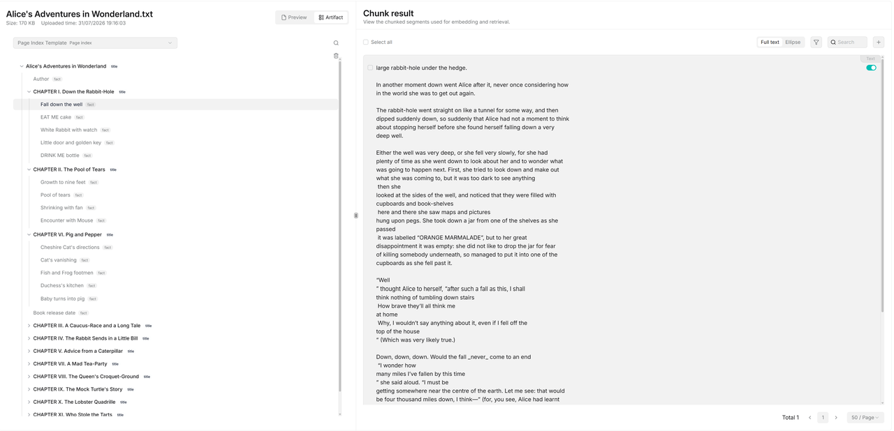

- **Mind Map: Quickly grasping the overall knowledge landscape**  
  The Mind Map organizes related concepts around a central topic into different themes and subtopics, enabling users to quickly understand the main content and connections within a document.

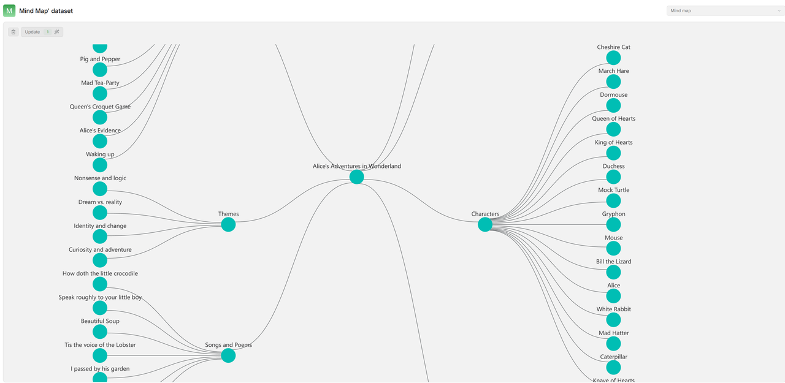

- **Timeline: Organizing events chronologically**  
  The Timeline identifies times and events in documents and arranges them in chronological order, helping users intuitively understand the progression of events—ideal for corporate development, project milestones, policy evolution, historical records, and similar scenarios.

- **To Skills: Further compiling knowledge into Skills**  
  Through To Skills, RAGFlow can further organize knowledge from a Dataset into a series of Skill files. Each Skill includes a name, description, hierarchy, knowledge overview, and relevant source documents, providing reusable knowledge navigation files for subsequent retrieval and AI applications.

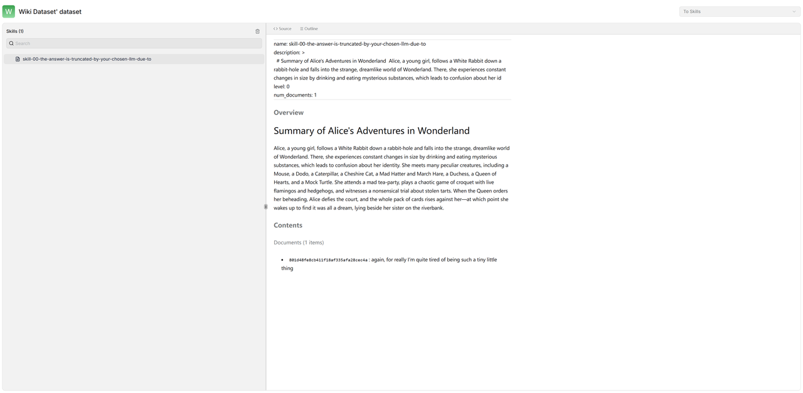

### How to Use Knowledge Compilation?

In RAGFlow v0.27.0, using knowledge compilation mainly involves the following steps:

**Step 1: Create a knowledge compilation template**  
Go to the Agent module, create a Compilation Operator, and select the LLM for knowledge extraction and the type of Artifact you wish to generate (Wiki, Graph, Tree, Page Index, Mind Map, Timeline, etc.). You can also configure global rules and specify which entities, relationships, statements, and concepts to extract, thereby defining how RAGFlow understands and organizes knowledge.

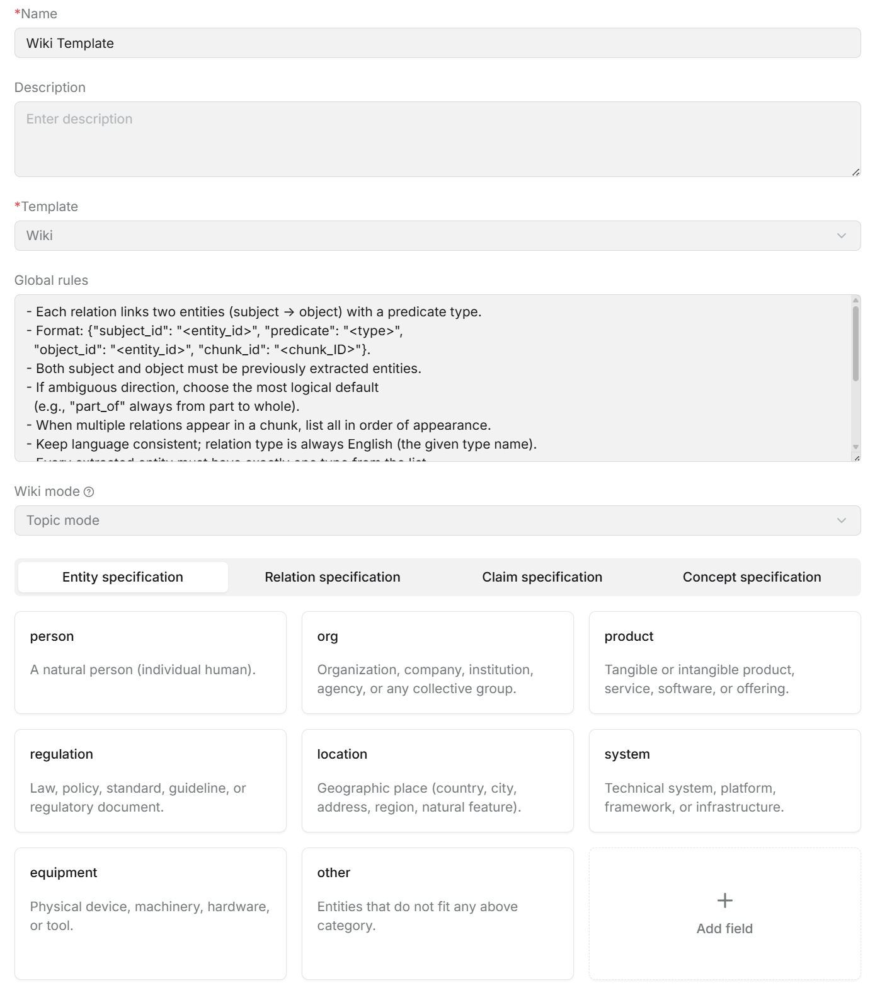

**Step 2: Configure an Ingestion Pipeline**  
Create an Ingestion Pipeline and add the knowledge compilation template to a Compiler Operator. A typical pipeline can include Parser, Chunker, Compiler, and Indexer operators to sequentially handle document parsing, chunking, knowledge compilation, and indexing.

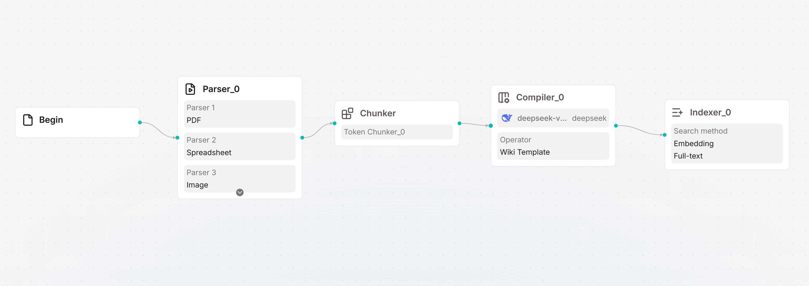

**Step 3: Apply the Pipeline to a Dataset or document**  
Create or open a Dataset, upload documents, and select the Ingestion Pipeline that includes knowledge compilation. You can apply a unified pipeline to the entire dataset or choose different pipelines for individual documents to generate different types of knowledge assets.

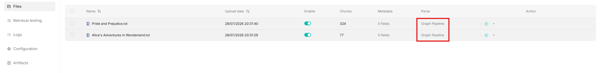

**Step 4: Generate and view Knowledge Artifacts**  
Once the Pipeline runs, RAGFlow performs knowledge compilation and generates the corresponding Artifacts. You can view dataset‑level Wiki, Tree/Page Index, Graph, Mind Map, Timeline, and To Skills under **Dataset → Artifacts**, or check per‑document artifacts on the Artifact page of that document.

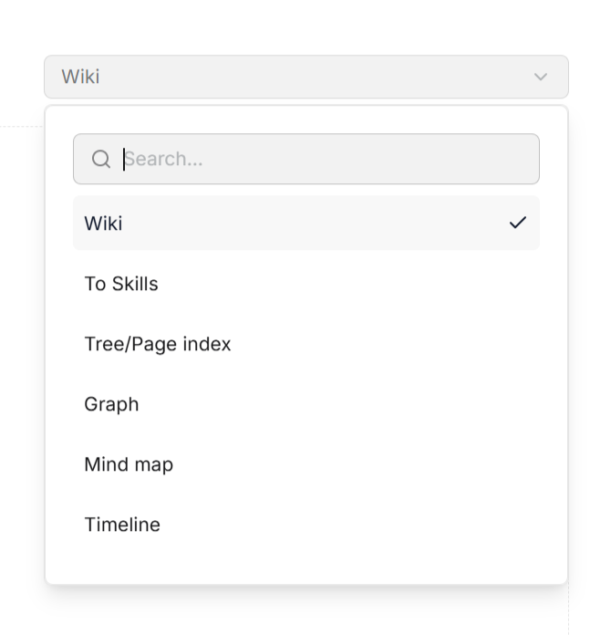

**Step 5: Use compiled knowledge in AI applications**  
The generated Knowledge Artifacts can be used in Search, Chat, and Agent, providing more structured and reusable knowledge support for retrieval, Q&A, and intelligent agents.

Through knowledge compilation, RAGFlow transforms unstructured documents into multiple forms of structured knowledge assets—read knowledge with Wiki, discover relationships with Graph, understand structure with Tree and Page Index, explore topics with Mind Map, view event evolution with Timeline, and reuse knowledge with To Skills. From documents to Knowledge Artifacts, v0.27 makes knowledge easier to organize, understand, retrieve, and reuse.

---

## Agentic Retrieval

Traditional RAG retrieval flows are typically fixed: user asks a question → system retrieves from the knowledge base once → finds relevant chunks → LLM generates an answer based on those chunks. This model is efficient for simple Q&A, but shows clear limitations in complex questions. For example, if a user asks: *“What are the changes in knowledge compilation in RAGFlow v0.27.0 compared to previous versions?”* A conventional retrieval might directly send the whole query once and pass the recall results to the LLM. However, the question actually contains multiple information needs: locating the knowledge compilation feature in v0.27.0, understanding the capabilities of the previous version, and comparing the differences. If the initial recall is incomplete, the answer may easily miss key points.

Agentic Retrieval introduced in v0.27.0 aims to make the retrieval process no longer limited to “execute a single search,” but to incorporate the agent’s judgment and planning capabilities—that is, before retrieving, the system thinks about *how to search, what to search for, whether the current results are sufficient, and whether further retrieval is needed.*

The traditional RAG flow is more like:  
*User asks → Retrieve once → Find relevant chunks → LLM answers*

In contrast, Agentic Retrieval follows a flow closer to:  
*User asks → Analyze the question → Formulate a retrieval strategy → Execute retrieval → Judge if results are sufficient → Adjust query or retrieve again if needed → Synthesize information → Answer*

This means RAGFlow no longer relies solely on the original question for a single recall; instead, it can break down sub‑requirements, rewrite or split queries to separately find different pieces of evidence, supplement retrieval when current results are insufficient, and ultimately integrate multi‑round information to produce an answer.

At the user level, RAGFlow packages this capability into five Thinking modes: **Naive, Low, Medium, High, and Ultra**.

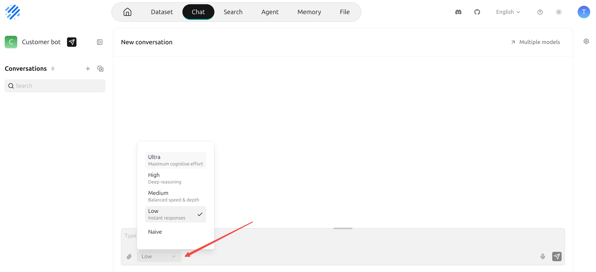

- **Naive**: Still follows the traditional RAG process, suitable for factual questions and fast‑response scenarios.
- **Low**: Enters the new retrieval pipeline but still performs a single direct retrieval without complex decomposition, suitable for scenarios requiring basic enhancement with relatively fast response.
- **From Medium upward**: The Agentic Retrieval characteristics become more apparent—the system first decomposes complex questions into multiple verifiable *claims* (i.e., key information points that must be verified before answering), finds evidence for each, and determines whether the available material is sufficient to support an answer. If not, it continues to generate new retrieval questions for supplementation.
- **High and Ultra**: Closer to a full Agentic Retrieval. The system first analyzes the question’s intent and information needs (whether it’s fact‑checking, comparison, process, exploratory analysis, verification, or summarization), and then decides whether to decompose the question and formulates subsequent retrieval plans. It then searches for evidence around different retrieval tasks and continuously checks evidence sufficiency across multiple rounds. The Ultra mode also supports discovering new directions and re‑planning retrieval paths, making it suitable for in‑depth research scenarios like version‑difference analysis, cross‑document comparisons, and complex attribution.

---

## Model Provider

Previously, RAGFlow had upgraded the underlying architecture of model providers—from a flat model configuration to a three‑layer structure of **Provider → Instance → Model**, enabling more complex deployment relationships: multiple instances under the same provider, each with different API keys, regions, and base URLs, and each instance can have multiple models.

In v0.27.0, the focus shifts to **whether users can manage efficiently**. The model provider page has been further refactored: the interface now features a left‑hand provider list and right‑hand instance cards. Users can select a provider like OpenAI and then centrally manage all instances under that provider on the right. If a provider has no instances yet, the page automatically shows a new instance draft, where users simply fill in the instance name, API key, Base URL, and other required information to start configuration.

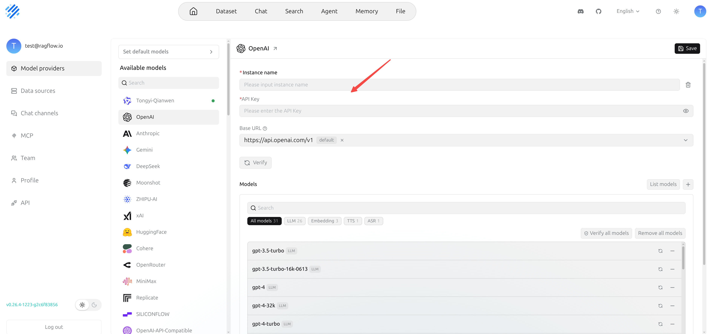

Model management also better reflects real deployment scenarios. After completing the basic instance configuration, RAGFlow automatically pulls the available model list from the corresponding provider and populates it into that instance’s model list, so users do not need to manually enter each model one by one. On the auto‑generated list, users can further adjust: remove models not needed for that instance, or manually add custom models that the provider supports but were not automatically populated.

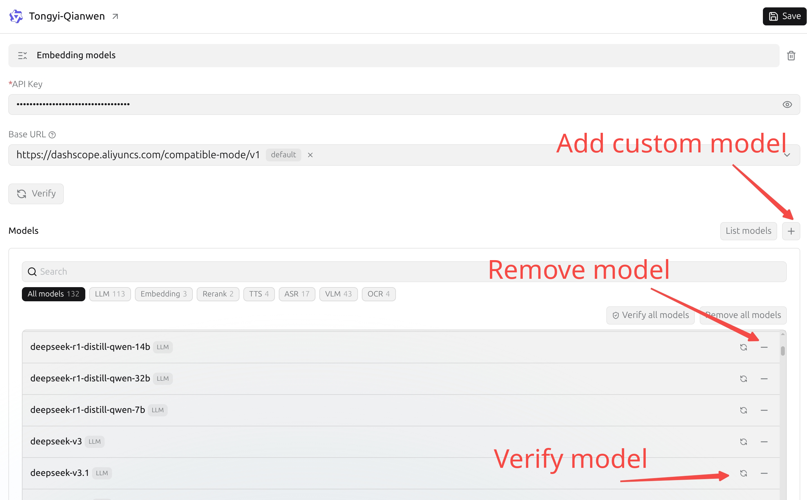

This means that different instances under the same provider can have different model configurations. For example, one OpenAI instance is used only for Chat, another specifically for Embedding; one SILICONFLOW instance mounts production models, while another regional instance is for testing. Models are no longer just a unified list at the provider level—they can be managed independently per instance.

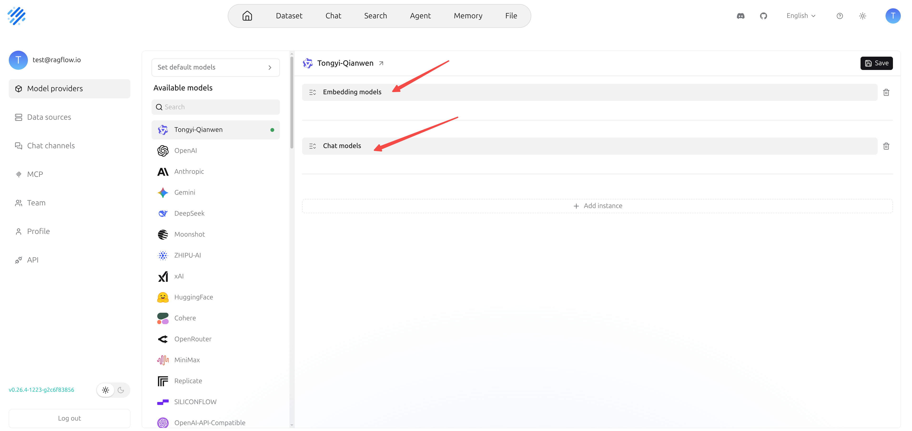

After configuration, users can verify whether models are available—they can test a single model individually, select multiple models for batch verification, or check all models under an instance by selecting them all. For providers that support multiple model types (Chat, Embedding, Rerank, OCR, TTS, etc.), this instance‑level configuration and batch verification capability significantly reduces integration and operational costs.

The save logic has also been made clearer: instance‑level settings (name, API key, etc.) are validated and saved via the top “Save” button. For saved instances, the model list is maintained directly in the model list area—adding or removing a model immediately updates that instance’s configuration, without needing to click the top Save button again.

In real‑world scenarios, model access methods vary widely: some users combine cloud and local services, some configure different API keys under the same provider, and others split Chat, Embedding, Rerank, OCR, etc., into different instances. v0.27.0 addresses these usage scenarios, improving the multi‑instance, multi‑model, and multi‑capability configuration experience.

Additionally, this release continues to expand supported model providers, adding AIMLAPI, GreenPT, and others, completing Hugging Face’s model listing capabilities, and optimizing field configurations and validation logic for providers like Bedrock, SoMark, VolcEngine, and VLLM.

Overall, the model provider upgrade in v0.27.0 is a leap in user experience—the underlying three‑layer structure is already in place, and it is now truly built as a viewable, editable, verifiable, and maintainable model management system.

---

## Finale

v0.27.0 is the last RAGFlow version based on Python. Starting from the next version, RAGFlow will officially migrate to the Go language. This migration not only leverages the advantages of a statically typed language to catch errors at compile time, but also reflects the fact that as agent technology evolves, retrieval capabilities are becoming an increasingly critical underlying infrastructure. The information retrieval technology developed over decades is now serving not only human users but increasingly agents, with a consequent dramatic rise in call frequency and performance requirements. Therefore, migrating to Go is a necessary step to meet this trend, and it represents a key leap for RAGFlow from an open‑source project to a production‑grade data foundation. The Go version will mark RAGFlow’s official entry into the 1.0 era after two and a half years of evolution. We welcome you to continue following and starring RAGFlow!
